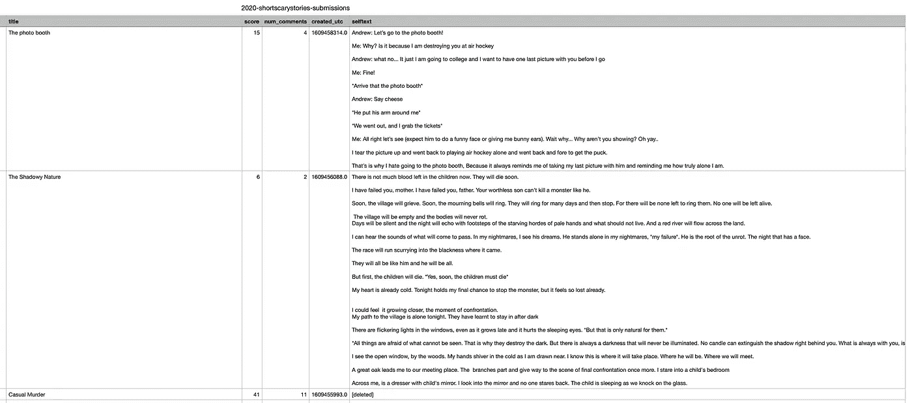

# 如何收集 Reddit 数据集

> 原文：<https://towardsdatascience.com/how-to-collect-a-reddit-dataset-c369de539114?source=collection_archive---------4----------------------->

## 在 Python 中使用 PSAW 和 PRAW

Reddit 是一个社交媒体平台，由子论坛或子编辑组成，每个子论坛专注于一个给定的主题。一些公共子数据可能是有趣数据的深井，随时可供探索！然而，即使想到如何收集这些数据，尤其是大量的数据，也是令人望而生畏的。

在这篇文章中，我们将使用 Python 开发一个工具，从任何(公共)子编辑中收集公共可用的 Reddit 帖子，包括他们的评论帖子，按发布年份组织。

我们将详细介绍必要的**设置**和**记录功能**，完整的**主算法**和逐块的**，最后是**收集数据的示例**和**收集和探索的想法**。**

# 设置

我们的工具将基于 [PSAW](https://pypi.org/project/psaw/) 和 [PRAW](https://praw.readthedocs.io/en/stable/) 。PSAW 的用法相当简单。然而，为了使用 PRAW (Reddit 的 API)，您需要设置您的授权令牌，以便 Reddit 知道您的应用程序。您可以按照[这个指南](https://github.com/reddit-archive/reddit/wiki/OAuth2)快速获得您的令牌，并**替换**下面代码中的相关信息，具体来说，就是您的客户端 ID 和密码，以及您的 reddit 用户名和密码。

```
import praw
from psaw import PushshiftAPI# to use PSAW
api = PushshiftAPI()# to use PRAW
reddit = praw.Reddit(
    client_id = "YOUR_CLIENT_ID_HERE",
    client_secret = "YOUR_CLIENT_SECRET_HERE",
    username = "YOUR_USERNAME_HERE",
    password = "YOUR_PASSWORD_HERE",
    user_agent = "my agent"
)
```

我们还必须定义子编辑列表(可以只有一个！)和年份范围，即从哪一年开始和哪一年结束将检索帖子。在这种情况下，我们将从 2020 年初到 2021 年底(到今天为止)发布的[r/shortscarystorys subreddit](https://www.reddit.com/r/shortscarystories/)中提取帖子。最后，我们必须设置存储数据的目录。

```
subreddits = ['shortscarystories']
start_year = 2020
end_year = 2021# directory on which to store the data
basecorpus = './my-dataset/'
```

# 日志记录功能

日志功能让您深入了解正在运行的进程。当这个过程很长，你想知道它是如何进行的时候，这些尤其重要。在我们的例子中，我们将简单地编写一个函数，将算法刚刚采取的动作，以及采取该动作需要多长时间打印到屏幕上。如果我们最终提取了很多很多的数据，并希望确保程序不只是停留在某个地方，这将是非常有见地的。这个函数可以很容易地修改为记录到一个文件，而不是打印到屏幕上:这就是为什么我把它封装到一个函数中，而不是把打印直接内置到算法中。

```
import timedef log_action(action):
    print(action)
    return
```

# 主算法

主要思想非常简单:在<start_year>和<end_year>之间的每一年，创建一个目录，并且为<subreddits>中的每个子编辑创建一个目录来存储该子编辑在这一年中的帖子。</subreddits></end_year></start_year>

这是完整的代码，然后我们将一次一个块地检查它。

# 详述算法

## ***###第 1 块# #*# **

简单地说，对于从<start_year>到<end_year>之间的每一年，创建一个目录并定义开始和结束时间戳(从当年开始直到下一年开始)。这些时间戳作为输入提供给 PSAW 请求，指定从中检索数据的时间窗口。</end_year></start_year>

## ***###第二块# #*# #第十四块】**

对于<subreddits>中的每一个子编辑，开始为日志记录计算提取时间，在当年的目录中创建相应的目录，并定义 CSV 文件的路径，在该文件中存储相应的要提取的帖子。</subreddits>

## ***###第 3 块# #*# #第 19 块】**

定义存储每个帖子的 Python 字典(存储在内存中，稍后写入之前定义的 CSV 文件路径)。我们对存储帖子的 ID、URL、标题、分数、评论数、创建时间戳和帖子的实际正文(selftext)感兴趣。可以提取其他指标——使用本指南找出您确切需要的指标。

## ***###块 4 # #*# # **

PSAW 允许我们创建一个迭代器来遍历一组特定的文章(也称为提交)。我们用之前设置的参数来指定这个集合:开始和结束时间戳、特定的子编辑以及要检索的帖子数量。在这个例子中，我将其限制在 100 篇帖子，但是 Python 关键字 **None** 可以用于**在指定的时间框架**内浏览所有帖子。此外，PSAW 没有给我们每篇文章想要的所有信息，所以**我们只使用它来检索文章的 ID** ，然后**在 PRAW 使用该 ID 来获取剩余的信息**。

## ***# # # 5 # # #*# **

对于我们在前面的块中定义的迭代器中的每个 post(或 submission ),获取它的 ID 并使用它从 PRAW 获取完整的 post 数据，并将它附加到我们在块 3 中定义的 Python 字典中。

## ***###块 6 ###***

每个帖子都有一个相关的评论线程，我们也希望收集这些评论线程，以便将来进行可能的分析。我们希望将这篇文章的整个评论存储在一个单独的 CSV 文件中，我们现在为该文件定义适当的文件路径。我们还定义了 Python 字典来存储这篇文章的评论线程，特别是每个评论的 ID、父 ID、链接 ID，最重要的是它的正文。

## ***###块 7 # #*# #块 19】**

现在，对于当前帖子的扁平化评论线程中的每个评论(它最初是一个树结构，我们显式地将其扁平化，但总是可以基于评论父 ID 检索原始树结构)，我们检索适当的数据并存储在我们在前面的块中定义的 Python 字典中。一旦我们检查了当前帖子的所有评论并存储在字典中，我们就可以将它保存到 CSV 文件中(该路径是我们在前面的块中定义的)。我们使用 Pandas 轻松地转换成正确的格式并写入文件。

## ***# # # 8 # # #*# # 23】**

最后，一旦我们遍历了迭代器中的所有 post(即，在块 4 中定义的指定时间范围内)并存储在字典中，我们可以将它保存到 CSV 文件中(我们在块 2 中定义了该路径)。同样，我们使用 Pandas 轻松地转换成正确的格式并写入文件。

## 记录输出

这是上面代码中示例的日志记录输出:

```
[Year] 2020
	[Subreddit] shortscarystories
		[Info] Found submissions: 100
		[Info] Elapsed time:  26.14s
[Year] 2021
	[Subreddit] shortscarystories
		[Info] Found submissions: 100
		[Info] Elapsed time:  27.96s
```

# **收集的数据示例**



前 3 篇收集自 2020 年 r/shortscarystories 的帖子(2020-shortscarystories-submissions . CSV)。图片作者。

需要注意的一个重要方面是，Reddit 的原始数据并不完美。有些帖子的内容可能已经被删除，但帖子仍然存在，在“随意杀人”条目中可以看到，帖子的正文是“[已删除]”。不是盲目地收集所有数据，而是可以改变块 5 以忽略文本主体为“[已删除]”、“[已移除]”或空的所有帖子。这也可以在稍后的数据预处理阶段执行。

# **收集和探索的想法**

最后，我在这里留下我写这篇文章时的一些想法，这些想法可以产生有趣的挑战和结果。

1.  利用最近来自 https://www.reddit.com/r/recipes/[的帖子，人们可以收集一个食谱图片、配料和说明的数据集。有了这些数据，人们可以开发出这样的系统:基于成分列表的配方建议器、基于成分列表的配方创建器、基于配方图像的配方指令合成器等等。](https://www.reddit.com/r/recipes/)
2.  利用来自[https://www.reddit.com/r/shortscarystories/](https://www.reddit.com/r/shortscarystories/)帖子的数据，开发如下系统:给定标题作为提示的恐怖短篇故事生成器，基于故事标题和文本的评分/评论预测，用于观众统计预测，等等。
3.  使用来自[https://www.reddit.com/r/AskReddit/](https://www.reddit.com/r/AskReddit/)帖子的数据(帖子是一个问题，评论是可能的答案)，开发一个 oracle 系统，它对每一个可以想象到的问题都有一个答案。