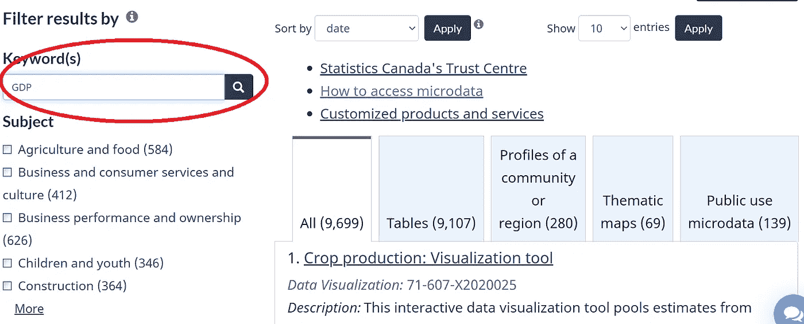
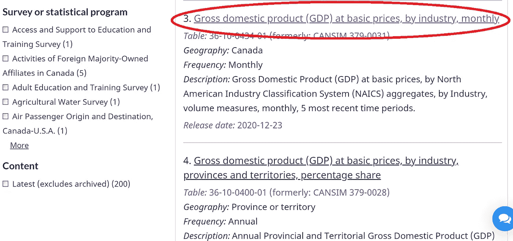
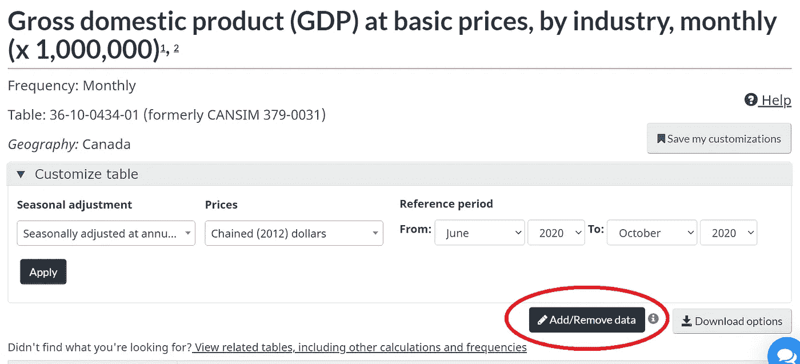
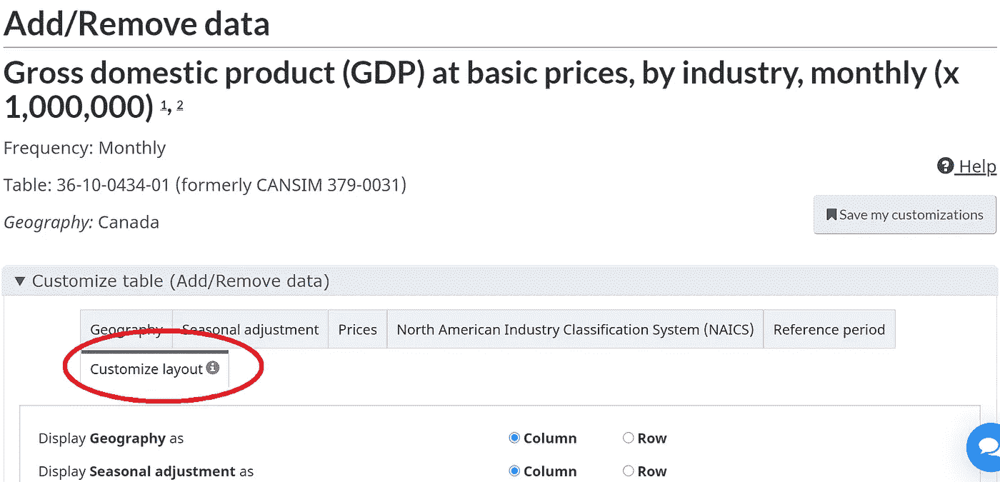
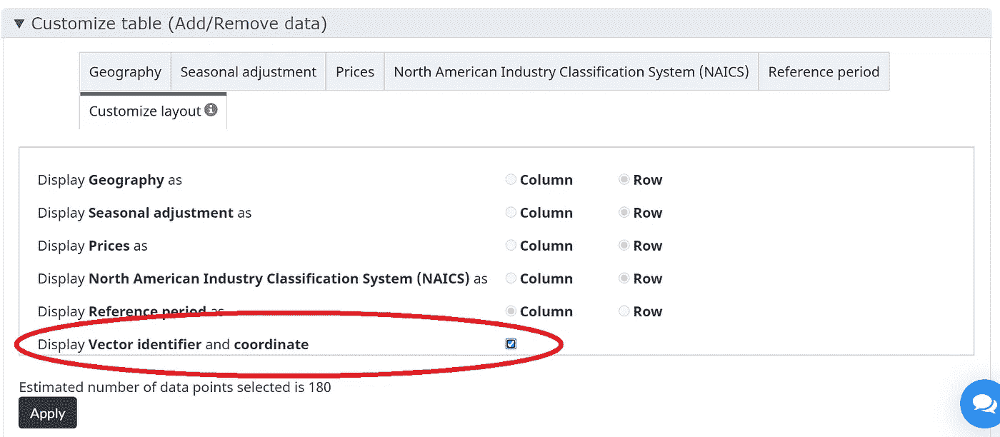
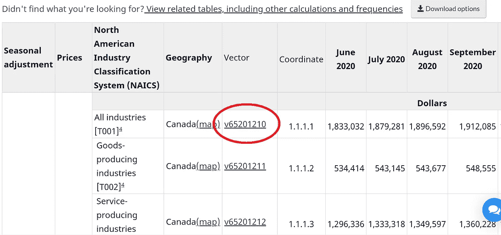
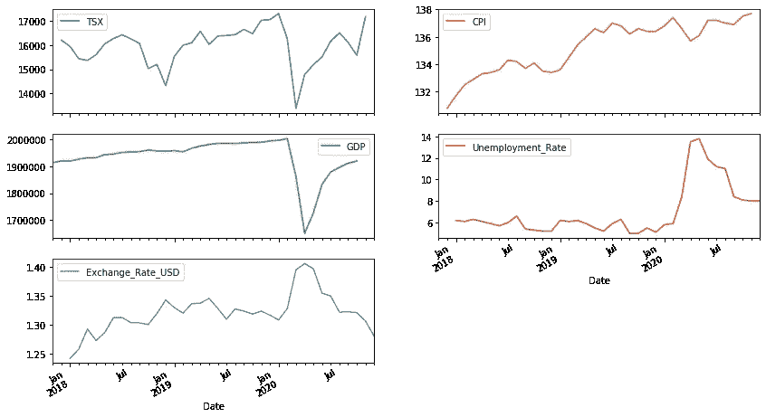

# 如何使用 Python 从加拿大统计局收集数据

> 原文：<https://towardsdatascience.com/how-to-collect-data-from-statistics-canada-using-python-db8a81ce6475?source=collection_archive---------16----------------------->

## [实践教程](https://towardsdatascience.com/tagged/hands-on-tutorials)

## 加拿大统计局 API 和 python 库的分步教程


[Alex Shutin](https://unsplash.com/@fiveamstories) 在 [Unsplash](https://unsplash.com/) 上拍摄的照片

[加拿大统计局](https://www.statcan.gc.ca/eng/start)提供广泛的数据供公众使用，包括加拿大经济、社会和环境的数据。除了手动浏览网页访问数据，加拿大统计局还提供 [Web 数据服务](https://www.statcan.gc.ca/eng/developers/wds/user-guide#a12-3)，即 API 访问他们的数据库。更好的是，有一个 python 库 [stats_can](https://stats-can.readthedocs.io/en/latest/) 包装了 API 命令，允许用户编写简单的代码来自动读取数据。本文将提供如何实现这一点的一步一步的教程。

# 识别所需数据项及其`vectorID`

进入加拿大统计局子页面[数据](https://www150.statcan.gc.ca/n1/en/type/data?MM=1)，输入关键词，例如 GDP，点击搜索图标。



在返回的结果中找到所需的项目。



在 [GDP](https://www150.statcan.gc.ca/t1/tbl1/en/tv.action?pid=3610043401) 页面上，点击`Add/Remove data`。



点击标签页`Customize layout`。



向下滚动并勾选选项`Display Vector identifier and coordinate`，然后点击按钮`Apply`。



现在，该表将被重组，您会发现一个新列`Vector`，这里我们将选择所有行业的 GDP，因此目标`vectorID`是`v65201210`。这将在稍后的 Python 代码中使用。



# 在 Python 中安装 stats_can

该库可以与 conda 或 pip 一起安装:

```
conda install -c conda-forge stats_can
```

或者:

```
pip install stats-can
```

# 收集数据

我们将使用函数`[stats_can.sc.vector_to_df](https://stats-can.readthedocs.io/en/latest/stats_can.html#stats_can.sc.vectors_to_df)`从加拿大统计局读取数据。该函数的语法如下:

```
df = stats_can.sc.vectors_to_df(vectors, periods = n, start_release_date = None, end_release_date = None)
```

它返回具有 n 个周期数据或发布日期范围的向量的数据框架。该函数包装了两个 API 命令，分别是`get_bulk_vector_data_by_range`和`get_data_from_vectors_and_latest_n_periods` ，用于将 JSONs 的结果列表转换为数据帧。

例如，对于 GDP 的矢量数据`v65201210`,您可以运行以下代码来收集过去 6 个月的 GDP:

```
import stats_candf = stats_can.sc.vectors_to_df('v65201210', periods = 6)
```

您可以重命名索引和列，使表格看起来更漂亮:

```
df.columns = ['GDP']
df.index.names = ['Date']
```

返回的表如下所示:

```
Date        GDP        
2020-05-01  1726385.0
2020-06-01  1833032.0
2020-07-01  1879281.0
2020-08-01  1896592.0
2020-09-01  1912085.0
2020-10-01  1920056.0
```

# 收集和可视化多个经济指数的示例

在最近的[项目](/a-deep-learning-based-method-for-synthesizing-data-with-an-application-in-financial-transactions-9c3936423d9a)中，我收集了多个生态指数，如 GDP、CPI、失业率等。建立多变量回归模型，用于预测金融交易数量。

首先，我计算出我计划使用的所有 eco 指数的向量，包括 GDP、CPI、TSX、失业率和汇率(美元兑加元)，并将它们放入字典中:

```
eco_vec_map = {'CPI':'v41690973',
               'Exchange_Rate_USD':'v111666275',
               'GDP':'v65201210',
               'Unemployment_Rate':'v91506256',
               'TSX':'v122620'}
```

其次，我将字典中的值转换为一个列表并运行函数，输入 periods = 36(即最近 3 年)，函数自动识别向量列表并返回多列表:

```
vectors = list(eco_vec_map.values())
df = stats_can.sc.vectors_to_df(vectors, periods = 36)
```

然后，我用它们的 eco 索引名重命名了这些列，注意这里使用了一个映射技巧，这样您就不必担心列的顺序了:

```
inv_map = {v: k for k, v in eco_vec_map.items()}
df.columns = df.columns.to_series().map(inv_map)
df.index.names = ['Date']
```

返回的表如下所示:

```
Date        TSX       CPI    GDP       Unemployment_Rate  Exchange_Rate_USD
2017-09-01  NaN       NaN    1905358.0 NaN                NaN
2017-10-01  16025.59  130.9  1907384.0 NaN                NaN
2017-11-01  16067.48  131.3  1917258.0 5.4                1.2769
2017-12-01  16209.13  130.8  1922552.0 5.3                1.2771
...
2020-08-01  16514.44  137.0  1904249.0 11.0               1.3222
2020-09-01  16121.38  136.9  NaN       8.4                1.3228
2020-10-01  NaN       NaN    NaN       8.1                1.3215
```

最后，我可视化了表中的所有列:

```
df.plot(subplots = True, figsize = (14,8), layout = (3,2));
```



结果显示，除 CPI 外，其他生态指数在 2020 年 3-4 月间经历了大幅下降或上升，这很可能是受疫情的影响。

# 摘要

本文详细介绍了如何使用加拿大统计局的 Python 库收集数据。主要步骤是:

*   识别目标数据项的`vectorIDs`。
*   安装`stats_can`库，调用函数`stats_can.sc.vectors_to_df`采集数据并保存为 DataFrame 表。

我很难在网上找到好的教程，所以我写了这篇文章，希望能帮助别人。如有任何问题或建议，请随时通过 [Linkedin](https://www.linkedin.com/in/rui-zhang-ocean/) 联系我。我很乐意连接:)

# 参考资料:

[1]网络数据服务用户指南，加拿大统计局。[https://www . stat can . GC . ca/eng/developers/WDS/user-guide # a12-3](https://www.statcan.gc.ca/eng/developers/wds/user-guide#a12-3)

[2]用于读取加拿大统计局数据的 python 库。
[https://stats-can.readthedocs.io/en/latest/index.html#](https://stats-can.readthedocs.io/en/latest/index.html#)