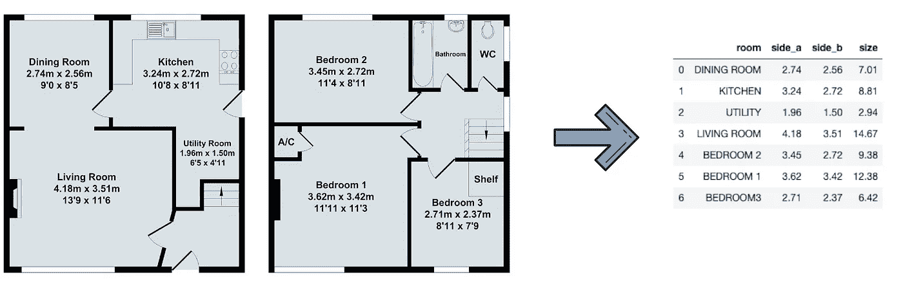
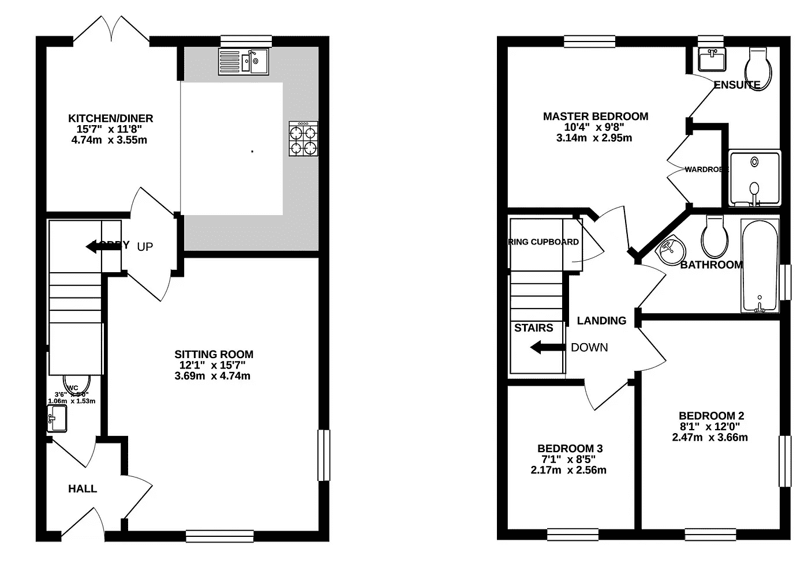
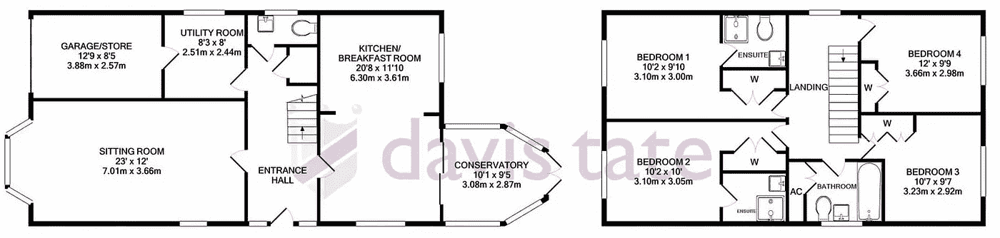
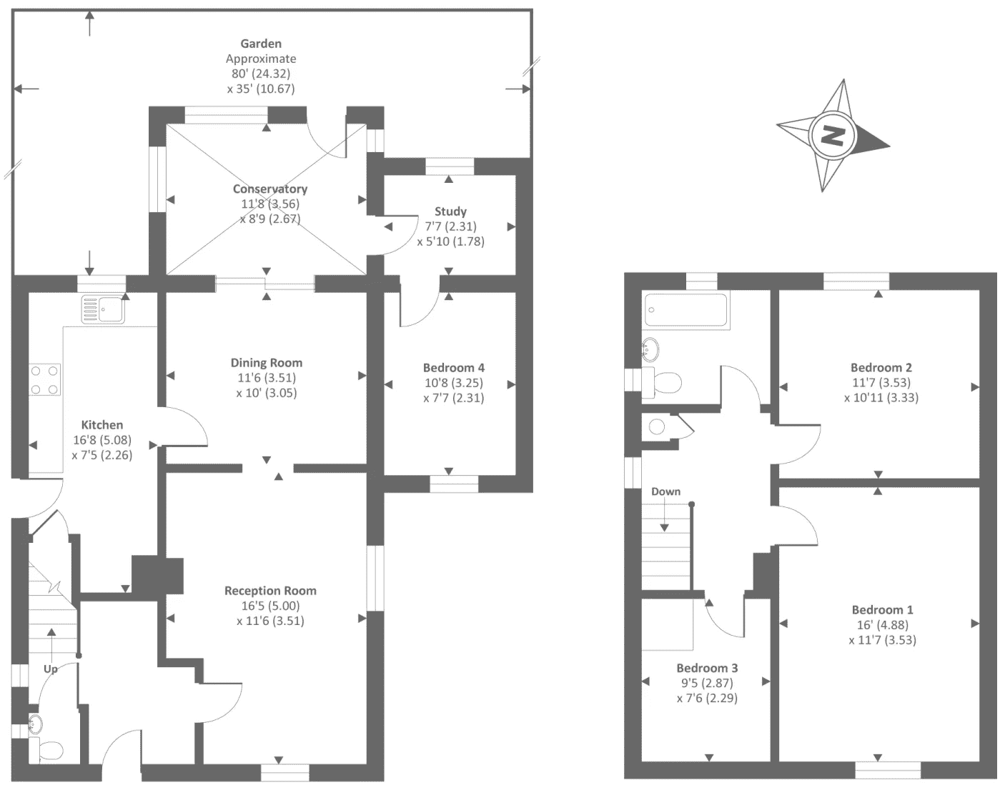
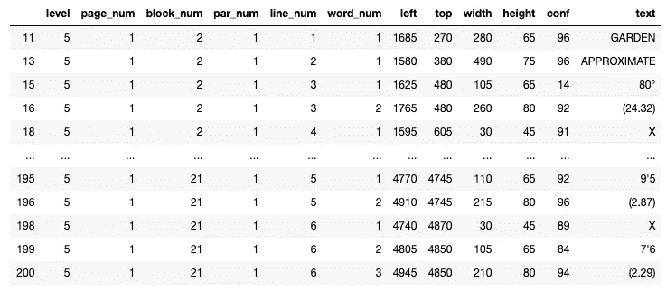
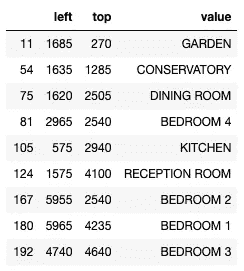
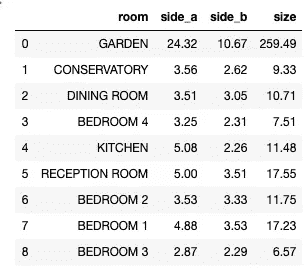

# 如何使用 Python & Tesseract 从图像中收集文本信息

> 原文：<https://towardsdatascience.com/how-to-collect-text-information-from-images-with-python-tesseract-7073785b1d77?source=collection_archive---------5----------------------->

## 一个从公寓平面图中自动收集房间尺寸的脚本…或者至少它尝试了



作者图片

如果你有分析思维，并且曾经进行过虚拟找房之旅，你可能会遇到我个人一直觉得令人恼火的问题:你几乎永远无法通过房产大小进行搜索，更不用说通过单个房间的大小了。然而，这种信息经常以平面布置图的形式出现。只是大量的缩放和手动输入来收集数据…

嗯，我认为这将是一个练习图像识别技能和创建一个脚本的绝佳机会，该脚本可以将图像转换成一个漂亮而干净的数据表。毕竟，随着每个过于雄心勃勃的项目开始:

> 能有多难？

事实证明，相当困难。我其实并不确定这是一个可以 100%准确解决的问题。我认为我充分探索了各种可能性，并取得了良好的进展，但请注意**这个项目不会完全成功**。即使经过重大的调整和微调，一个特别棘手或质量差的图像可能会使算法出错。

然而，我认为对于像我一样抱着天真的期望开始类似项目的人来说，这是一个宝贵的教训。

# 摘要

最后，我们希望将平面图转换成显示房间和房间大小的表格。我们正在使用米，但调整代码应该很简单，这样它也可以识别英尺的度量。

我们将使用[的 pytesseract](https://pypi.org/project/pytesseract/) ，它是[谷歌的 Tesseract OCR](https://opensource.google/projects/tesseract) 的 Python 包装器。

该项目的代码在我的 [GitHub](https://github.com/MatePocs/floorplan_reader) 上。

*   如果你只是想自己尝试一下，你将需要[*floor plan _ reader*](https://github.com/MatePocs/floorplan_reader/blob/main/floorplan_reader.py)脚本。您将需要安装软件包和 Tesseract，另外您可能需要调整它在脚本中的位置。 [*主*](https://github.com/MatePocs/floorplan_reader/blob/main/main.ipynb) Jupyter 笔记本显示了如何使用代码。祝你好运！
*   如果您想继续学习，请继续下一节，在这里我们将设置环境。

# 环境

## 宇宙魔方

首先，我们需要宇宙魔方包本身，即使我们不直接使用它。安装过程并不简单，你也可以在官方的 [GitHub 页面](https://github.com/tesseract-ocr/tessdoc/blob/master/Installation.md)找到更多信息，但是我发现[这个摘要](https://guides.library.illinois.edu/c.php?g=347520&p=4121425)更有用。

在 Mac 上，安装自制软件非常简单:

```
brew install tesseract
```

您还需要 Tesseract 的位置，我跟踪了这个[堆栈溢出线程](https://stackoverflow.com/questions/55235369/where-is-the-tesseract-executable-file-located-on-macos-and-how-to-define-it-in)，我的安装位置是:

```
/usr/local/bin/tesseract
```

(当然，不同系统的位置不同。)

## Python 包

我们需要两个“非标准”包:[枕头](https://pypi.org/project/Pillow/)和[宇宙魔方](https://pypi.org/project/pytesseract/):

```
pip install Pillowpip install pytesseract
```

Pillow 是一个处理图像的包，是一个名为 PIL 的旧包的分支，我们将使用它的图像对象:

```
from PIL import Image
```

(是的，这个库在项目内部仍然被称为 PIL，这并不意味着我们使用了过时的 PIL 包。)

对于宇宙魔方，我们需要连接到它的位置:

```
import pytesseract
pytesseract.pytesseract.tesseract_cmd = r'/usr/local/bin/tesseract'
```

# 从错误中学习

我将向你介绍我在开始使用 pytesseract 时犯的四个业余错误。如果你更喜欢"*这是目的地，而不是旅程。*“种人，跳过这一点，我们在下一节开始看实际代码。

## 文件路径与图像

如果您从 pytesseract 开始，您尝试的第一件事可能是`image_to_string`函数。顾名思义，它确实如此。

您可以将图像或文件路径作为参数传递。然而，根据我的经验，首先处理图像总是更好。用枕头，用它打开图片，传递图像对象。考虑这个平面布置图示例:



如果我们直接用 pytesseract 打开:

```
pytesseract.image_to_string(‘plans/floorplan_02.png’)
```

这是我们得到的结果:

```
'KITCHENIDINER — MASTER BEDROOM\ngo" xis" Tatra hou" xara\nPi\n\n3.14m x 2.95m\n\nSITTING ROOM\n12\'1" x 15\'7"\n3.69m x 4.74m\n\nBEDROOM 2\n8\'1" x 12\'0"\n2.47m x 3.66m\nBEDROOM 3\n71" x 85"\n2.17m x 2.56m\n\n \n\x0c'
```

而如果我们先用枕头打开:

```
pytesseract.image_to_string(Image.open('plans/floorplan_02.png'))
```

这是我们得到的结果:

```
'KITCHEN/DINER\n15°7" x 11\'8"\n4.74m x 3.55m\n\nSITTING ROOM\n12\'1" x 15\'7"\n3.69m x 4.74m\n\n \n\n \n\n \n\n \n\n \n\n \n\nMASTER BEDROOM\n10\'4" x 9\'8"\n3.14m x 2.95m\n\nBEDROOM 2\n8\'1" x 12\'0"\n2.47m x 3.66m\n\nBEDROOM 3\n71" x 85"\n2.17m x 2.56m\n\n \n\x0c'
```

是的，你的眼睛没有欺骗你，那是一个完整的额外线！那以后会派上用场的。

> ***第一课*** *。:在将任何东西传递给 pytesseract 之前，始终使用 Pillow 之类的图像处理包。将图像对象作为参数传递，而不是文件路径。*

## 调整大小很重要

下一个令人惊讶的是关于调整大小。考虑下面的图像(模糊，是的，这将是重点。):



如果您只是将它作为一个枕头图像读入，并将其传递给 image_to_string，您会得到以下结果:

```
' \n    \n   \n\nUTILITY ROOM\n\n  \n  \n  \n\n  \n \n\n  \n\n       \n   \n    \n\n  
...
```

但是，如果您首先调整图像的大小，比如说将其宽度和高度调整为原来的 5 倍:

```
image = image.resize((image.size[0] * 5, image.size[1] * 5))
```

结果是:

```
'UTILITY ROOM\nR\' i\nSe 2.51m x 2.44m\n3.88m x ?2.57m\nSITTING ROOM
...
```

我没有复制整个结果，重点是，如果没有重新缩放，杂物间下的较小文本不会被读入。

你可以在这里了解更多关于枕头[的图像处理。我个人没有调整图像亮度或对比度的运气。只有重新调整似乎工作得很好。我不知道为什么会这样。](https://auth0.com/blog/image-processing-in-python-with-pillow/)

> ***第二课*** *。:利用 Pillow 的图像处理功能。如果您调整图像的大小，调整亮度或对比度，Tesseract 会以不同的方式读入您的图像。然而，变化并不总是积极的！例如，您可能会注意到，缩放超过某个阈值会降低精度。*

## 裁剪也很重要…

…当我们这样做的时候，你对图像所做的任何其他事情都很重要！

我实际上对你耍了点小花招，如果你真的读了上面的图片，杂物间的第一面`2.51`，将被读为`2.91`。原因？我从原始图片中截取了主要信息。没有缩放，或以任何方式调整，只是排除了一些空白区域。没有裁剪，数字可以正确读取。

正是在这个时候，我第一次开始考虑接受失败…

> ***第三课*** *。:实际上任何事情都可以改变结果。您永远无法确定字符是否被正确地读入，即使它们是用漂亮、一致的字体书写的，并且在您的人眼看来似乎没问题。宇宙魔方的算法并不适用于所有情况。*

## 一张整洁有序的表格胜过一大堆杂乱的文字

在很长一段时间里，我试图用`image_to_string`方法来强迫项目工作。如果你看一下上面的一些例子，你可能会发现我没有发现的问题。

问题是`image_to_string`将逐行从左到右、从上到下扫描文档。(它如何确定 *\n* 的位置，谁也说不准。)我非常确定我可以让下面的逻辑工作:

```
loop over the string
search for matches of pre-defined room names from a set
if there is a match: 
    put the room name in a dictionary
    delete the corresponding room from the set and the string
    look for the next bit that looks like the two sides
    when found, save the sides in the dictionary
    delete the sides from the stringrepeat the process with the shortened room name set and main string, until there is no new room found
```

这个想法是，房间可以彼此靠近，但第一个房间名称后从左到右和从上到下的第一个数字必须是与所讨论的房间相对应的数字...是的，我知道，但我要说的是，这招出奇的有效。

然后我终于遇到了我的克星:



我不知道为什么我以前没有想到这种可能性，但是把米放在两条不同的线上完全打乱了我以前的方法。更不用说我还没有遇到过的任何其他平面图结构。

我认为仅仅通过阅读`image_to_string`产生的连续文本是无法确定哪个尺寸属于哪个房间的。然而，通过使用`image_to_data`方法(加上一些额外的调整，我们将在下一节中看到)，我们得到了一个漂亮且有组织的表:



> ***第四课*** *。:除非你有一个微不足道的问题，否则你会想用* `*image_to_data*` *而不是* `*image_to_string*` *。只要确保将* `*output_type*` *参数设置为“* data.frame *”就可以得到熊猫数据帧，而不是更乱更大的文本块。*

# 浏览代码

在这一部分，我将带大家浏览代码。请注意，我不会完全照搬脚本，我们只讨论要点。

## 打开图像

首先，我们需要一个方法来打开图像本身，这是我最终使用的方法:

```
def **process_image**(filepath, resize_factor = 1):   image = Image.open(filepath)
  image = image.resize(
    (image.size[0] * resize_factor, image.size[1] * resize_factor))   return image
```

我花了很多时间试图找出一个最佳的`resize_factor`。有人会认为这与图片的像素大小有关，但显然，事实并非如此。我最终把责任抽离出来，变成了一场争论。我猜你可以对不同的`resize_factors`重复这个过程，看看你是否得到相同的结果。

## 用宇宙魔方读入图像

这在技术上是整个代码的图像识别部分。如前所述，我们希望使用`image_to_data`。这就是如何将它转换成一个美观易读的表格:

```
def **convert_floorplan_pic_to_df**(filepath, resize_factor = 1): image = process_image(filepath, resize_factor) df = pytesseract.image_to_data(image, output_type='data.frame')
  df = df[df['conf'] != -1] 
  df['text'] = df['text'].apply(lambda x: x.strip())
  df = df[df['text']!=""]
  df['text'] = df['text'].apply(lambda x: x.upper()) return df
```

向上滚动一点，看看这个数据帧应该是什么样子。

我们将使用其中大约一半的列。列`conf`显示了模型在其解决方案中的确定性，-1 是这些奇怪的额外行，不知道它们为什么在那里，但我们肯定不需要它们。还有很多读入的空白，我们也不需要。

## 识别文本部分

我们已经有了一个图像上带有文本的数据框架，但是我们还远远没有完成，在它可用之前还有大量的处理工作。

我们利用另外两个函数，将图像转换成包含文本信息的数据帧:

```
def **process_floorplan**(
    filepath, rooms_set = default_rooms_set, resize_factor = 1): df = convert_floorplan_pic_to_df(filepath, resize_factor)
```

我们想一行一行地检查这个数据帧，并决定这个字符串是房间名称、大小还是其他什么。

房间将从一组房间名称字符串中识别出来，默认情况下看起来像这样:

```
default_rooms_set = {"DINING ROOM", "KITCHEN", "LIVING ROOM",
   ...
}
```

另一方面，使用正则表达式来识别大小。我们基本上要考虑每个浮点数，这很容易做到:

```
room_side_regex = r'[0-9]+[.][0-9]+'
```

如果我们看一下`df`对象，我们会立即发现一个问题:一些房间名可能会被分成多行。(从今以后，我们假设我们从不希望搜索由两个以上部分组成的房间名。)

我解决这个问题的方法是创建另一个名为`text_2row`的文本列，它是两行文本的串联。

```
shifted_text_col = list(df['text'].iloc[1:])
shifted_text_col.append("")
df['text_2row'] = df['text'] + " " + shifted_text_col
```

现在我们可以循环了。这里不打算复制代码，再次请参考我的 [GitHub](https://github.com/MatePocs/floorplan_reader/blob/main/floorplan_reader.py) 。逻辑如下:

```
for each row in the DataFrame: 
  if the text_2rows matches one of the rooms
    the current row gets a room id
    go to next in loop, skip an extra line
  if not match so far
    if text column matches one of the rooms
      current row gets a room id
      go to next in loop
  if no match so far
    if text column matches the size regex
      current row gets a room_side id
      go to next in loop
  if still no match
    current row gets no id
    go to next in loop
```

在大小匹配中有一个假设:如果行中有多个浮点数，我们总是取第一个浮点数。所以如果这个列表的长度大于 0:

```
regex_list = re.findall(room_side_regex,df[‘text’].iloc[i])
```

我们取第一个元素:

```
df['side_number'].iloc[i] = float(regex_list[0])
```

经过一些清理后，我将数据帧分成两个较小的数据帧。两者都包含被确定为`room`或`room_side`的行的`left`、`top`和`value`列。这是我们的房间:



我们有一个类似的边表，数字在`value`列。

## 搭配带侧边的房间

我们已经从文本中获得了所有需要的信息，我们现在只需要匹配它们。

有许多不同的方法可以解决这个问题。注意，当我们用`image_to_data`创建原始 DataFrame 时，pytesseract 会放入一些有用的信息。例如，我们有一个`block`列，它将文本排列成簇。

我最终使用了`left`和`top`列，它们应该是包含文本的框的位置，从图像的左上角开始计算。我们将计算这些左上角的欧几里德距离，并为每个房间选择两个最接近的数字。这种方法有一些缺点，我们将很快回到它。

我们将使用`scipy`中的`distance_matrix`方法:

```
from scipy.spatial import distance_matrixdist = distance_matrix(
  df_rooms[['left', 'top']], 
  df_sides[['left', 'top']])
```

然后这只是一个为每个房间选择两个最近点的练习。我们依赖于`numpy`的`argpartition`方法，同样，代码在我的 [GitHub](https://github.com/MatePocs/floorplan_reader/blob/main/floorplan_reader.py) 中。

## 最终确定

经过一些格式化之后，我们终于得到了我们的最终产品:



# 成功了吗？

我想，算是吧。如果你看一下上面的表格，我认为只有一个小小的错误。加上学习没有找到…

当然，这只是一个例子。最大的挑战是读取以前看不到的格式的平面图。我相信，如果你关注某个机构的平面图，并对图像处理进行微调，它可以在更大范围内变得可靠。

我确实学到了很多关于图像文本处理的知识。大部分是关于它的局限性，但是嘿，那仍然算数！我希望你通过阅读这篇文章也学到了一些新的东西。

# 可能的改进

我有一些想法可以让这个过程变得更好:

*   专注于某些房间类型，不要像我一样试图处理所有房间。问题是很难确定一个房间在平面图上是否有尺寸。我想象一个杂物间会在没有精确尺寸的情况下被展示。
*   我放弃了调整贴图的对比度和亮度的想法，结果似乎不可靠，但也许值得花时间来研究这如何改变 pytesseract 的结果。
*   房间到侧面的匹配有点简单。这里可以有额外的检查，例如，我们可以检查某些元素是否大致在彼此之下，这将表明更密切的关系。

[](https://matepocs.medium.com/membership) [## 加入我的推荐链接-伴侣概念

### 作为一个媒体会员，你的会员费的一部分会给你阅读的作家，你可以完全接触到每一个故事…

matepocs.medium.com](https://matepocs.medium.com/membership)