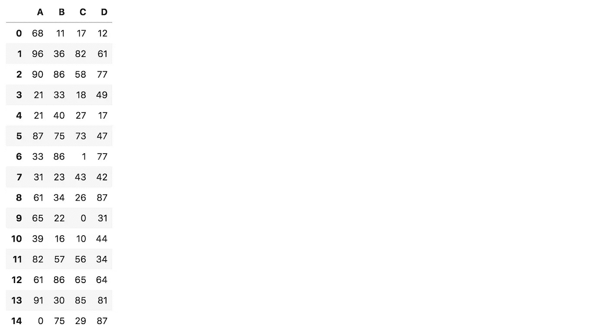
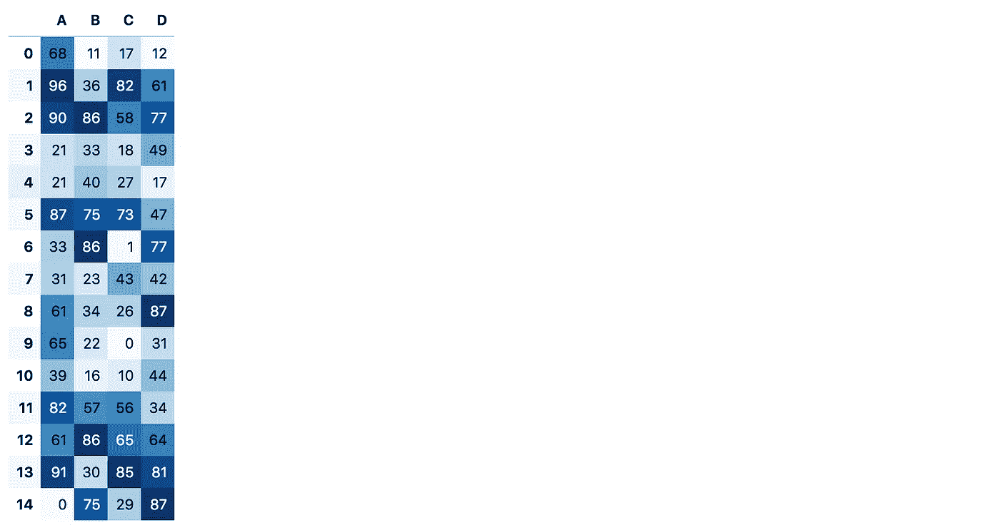
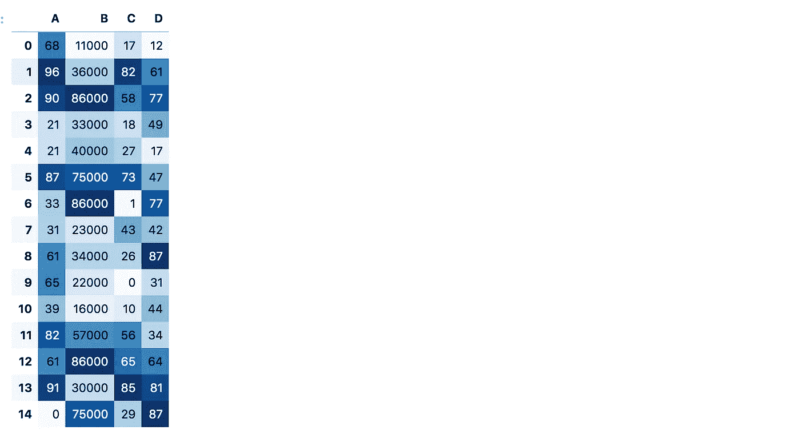
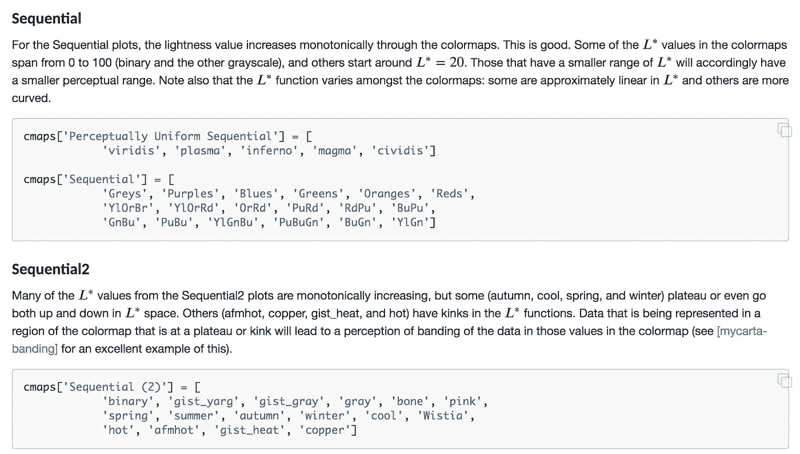
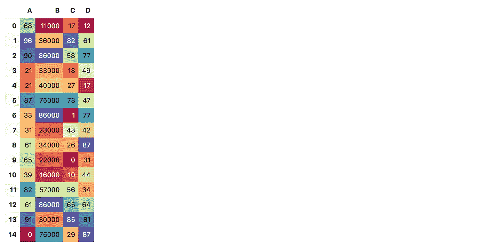

# 如何给熊猫数据框上色

> 原文：<https://towardsdatascience.com/how-to-color-a-pandas-dataframe-41ee45db04f6?source=collection_archive---------12----------------------->

## 一个关于如何在熊猫数据帧上设置颜色的简短教程。


罗伯特·卡茨基在 [Unsplash](https://unsplash.com?utm_source=medium&utm_medium=referral) 上的照片

andas 无需介绍，因为它已经成为 Python 中事实上的数据分析工具。作为一名数据科学家，我每天都使用熊猫，它总能以更好的方式实现我的目标，让我感到惊讶。

我最近学到的另一个有用的特性是如何给熊猫的数据帧上色。

**这里有几个你可能会感兴趣的链接:**

```
- [Complete your Python analyses 10x faster with Mito](https://trymito.io/) [Product]- [Free skill tests for Data Scientists & ML Engineers](https://aigents.co/skills) [Test]- [All New Self-Driving Car Engineer Nanodegree](https://imp.i115008.net/c/2402645/1116216/11298)[Course]
```

你愿意阅读更多这样的文章吗？如果是这样，你可以点击上面的任何链接来支持我。其中一些是附属链接，但你不需要购买任何东西。

# 让我们添加颜色

让我们用随机数创建一个熊猫数据帧:

```
import numpy as np
import pandas as pddf = pd.DataFrame(np.random.randint(0, 100, size=(15, 4)), columns=list("ABCD"))
```



带有随机数的熊猫数据框(图片由作者制作)

给单元格着色(按频率)非常简单:

```
df.style.background_gradient(cmap="Blues")
```



带有随机数的彩色熊猫数据框(图片由作者制作)

# 颜色是基于列的

如果我们把 B 列增加 1000，就不会干扰其他列的颜色。

```
df["B"] *= 1000
```

如下图所示，A、C、D 列的最大值保留了它们的颜色。



带有随机数的彩色熊猫数据框(图片由作者制作)

# 更改颜色映射

您可以设置 [matplotlib](https://matplotlib.org/stable/tutorials/colors/colormaps.html) 中支持的任何色彩映射表。如果您的目标是可视化频率，请小心选择顺序色图。



来自 [matplotlib](https://matplotlib.org/stable/tutorials/colors/colormaps.html) 的连续颜色图(图片由作者制作)

非顺序色彩映射表是可视化频率的一个不好的例子(所以请确保使用顺序色彩映射表):

```
df.style.background_gradient(cmap="Spectral")
```



可视化频率的一个不好的例子是用一个无序的颜色图(作者制作的图像)

# 在你走之前

在 [Twitter](https://twitter.com/romanorac) 上关注我，在那里我定期[发布关于数据科学和机器学习的](https://twitter.com/romanorac/status/1328952374447267843)消息。


照片由[Courtney hedge](https://unsplash.com/@cmhedger?utm_source=medium&utm_medium=referral)在 [Unsplash](https://unsplash.com/?utm_source=medium&utm_medium=referral) 拍摄