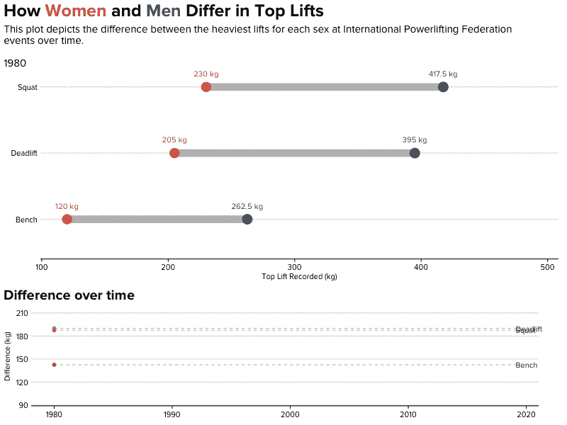
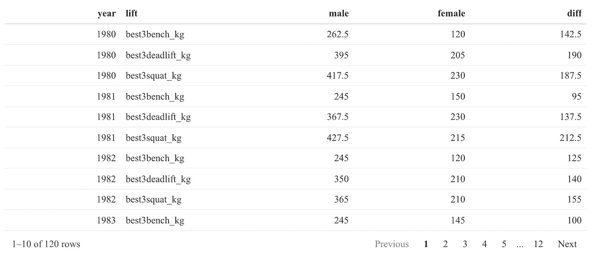
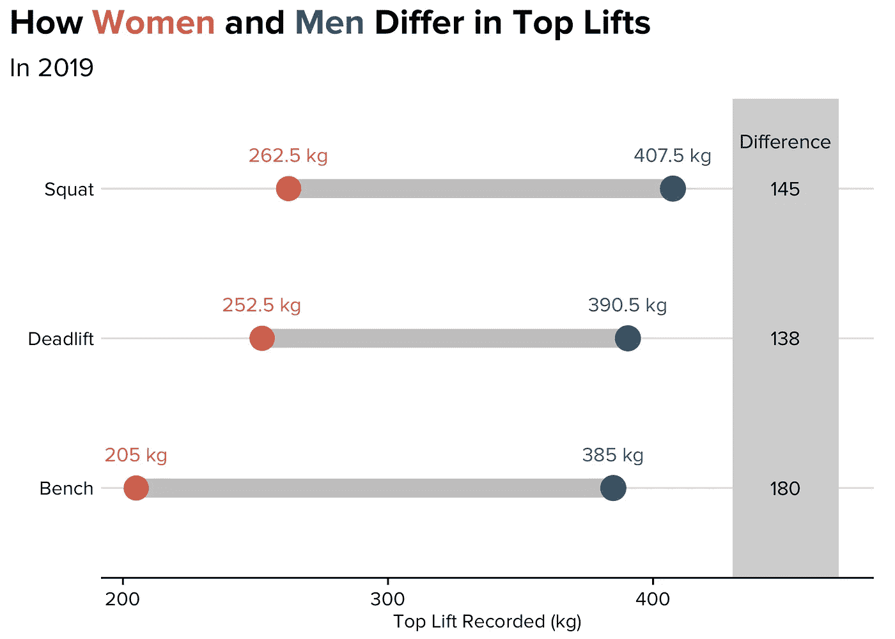
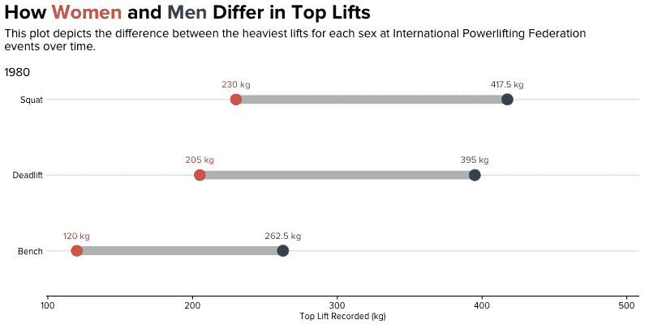
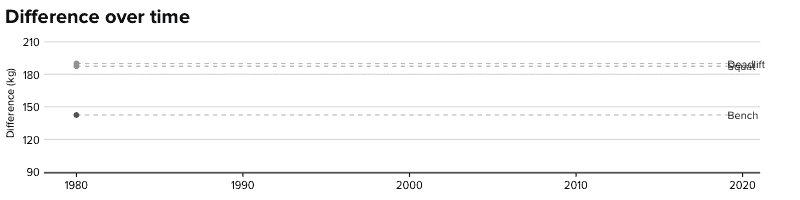

# 如何在 R 中组合动画剧情

> 原文：<https://towardsdatascience.com/how-to-combine-animated-plots-in-r-734c6c952315?source=collection_archive---------22----------------------->

## 利用 gganimate 和 magick 的强大功能为您的观众组合动画情节

在本教程中，我将概述在 r 中创建动画多面图的必要步骤。虽然很少，但组合动画图可以是展示相同数据的不同元素的强大方法(如下所示)。

在这个例子中，我使用了来自国际举重联合会的举重数据。出于本教程的目的，我们将看看*不同性别*托举的差异。一个多面的动画情节是一个很好的选择，因为我们想观察这些差异的大小以及这些差异是如何随着时间的推移而演变的。

我们将创建这个 GIF:

# 环境设置

这些是我们开始工作所需的包。在我的例子中，我使用了一个为风格目的而开发的自定义主题。请随意运行`theme_set(theme_minimal())`而不是使用我的主题！

# 加载和清理数据

我已经帮你清理了很多数据。如果你想跟着做，这是过程(或者，直接跳过！).

在这里，我们将做一些小清洁，然后将三个电梯改造成一列:

就我的想象而言，我只关心每年最重的*举升次数:*

我们将为最终输出创建的第一个可视化图形是一个**哑铃图**。好奇那是什么，或者如何在 R 中制作？[看看我关于这个话题的另一篇文章](https://www.connorrothschild.com/post/dumbbell-plots/)。

为了构造一个哑铃图，我们需要在同一行中同时进行雄性和雌性观察。为此，我们使用了`spread`函数。

现在，让我们为每种性别构建一个数据框架:

加入他们:

不跟随，或者想检查你的进展？以下是我们的数据最终的样子:

# 视觉化！

最后，我们可以构建可视化。

首先，我们可以使用`ggalt`创建一个静态可视化(同样，我的[博客文章](https://www.connorrothschild.com/post/dumbbell-plots/)涵盖了这个步骤的细节)。

如果你只对两者的组合感兴趣，你可以快进到单个情节的创作。你会在这篇文章的结尾发现这一点！

最后，我们使用 Thomas Pedersen 精彩的 [gganimate 软件包](https://github.com/thomasp85/gganimate)制作动画。这是一个相对容易的步骤，因为`gganimate`只需要两行额外的代码:`transition_states`和`ease_aes`。然后，我们把它传入`animate`函数！

但是在我们的例子中，我们希望包含另一个 GIF:一个随时间变化的差异折线图。

最后，我们将使用`magick`来组合它们(感谢[这篇文章](https://github.com/thomasp85/gganimate/wiki/Animation-Composition))。在这里你可以找到进行组合所必需的代码(不管你的动画情节是什么样的，这应该是可行的！).

这里发生了什么事？本质上，我们利用`magick`的力量来:

1.  **(第 2-3 行)**从每个 GIF 中读入所有的*单个图像* ( `image_read`)(毕竟，GIF 只是一系列图像！).
2.  **(第 5 行)**对于第一帧，将两幅图像堆叠在彼此之上(`image_append`)，因此图 1 在图 2 之上。
3.  **(第 6–9 行)**对于其余的帧(在我的例子中，是下一个 249 帧，因为我的 GIF 有 250 帧)，复制这个并将其与第一帧合并(这是`for`循环)。

这里，我们指定`stack = TRUE`以便一个图在另一个图的之上**。如果您想将它们并排放置，请指定`stack = FALSE`。**

总的来说，该流程会产生我们的最终结果:

在此视图中，我们可以看到相对和绝对差异的大小(上图)，*和*我们可以看到这些差异如何随时间变化(下图)。动画组合图表的力量！

感谢阅读。有问题吗？给 me@connorrothschild.com 发电子邮件或者在推特上给我发信息。