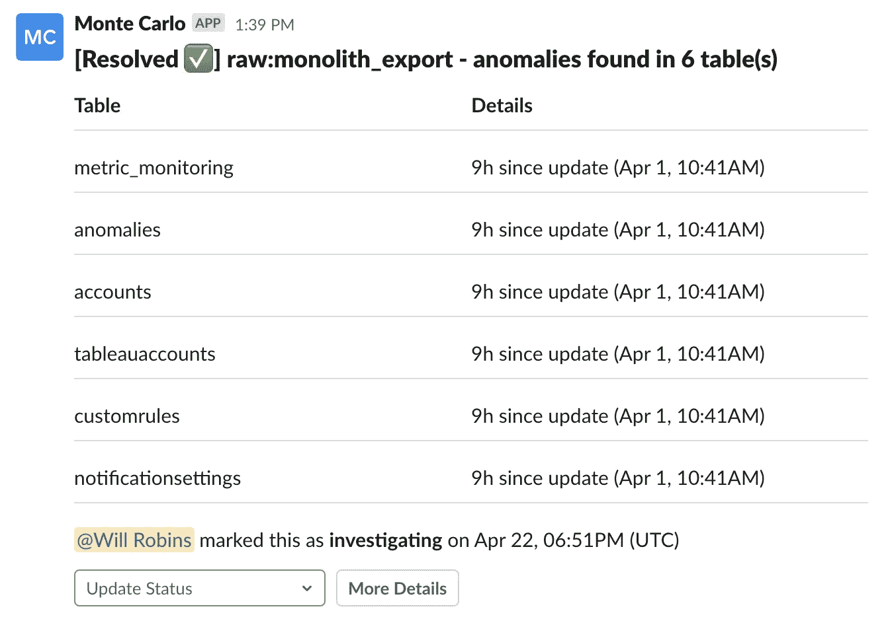
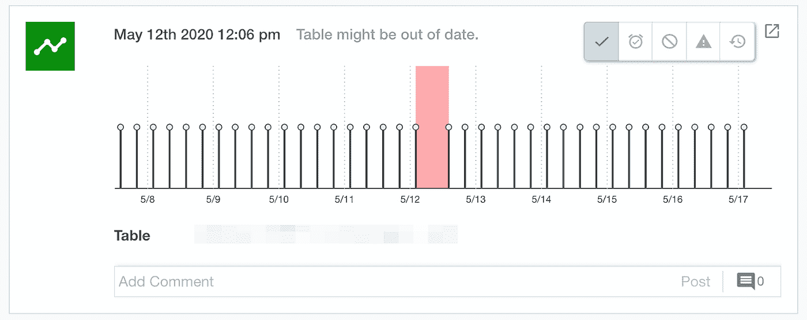
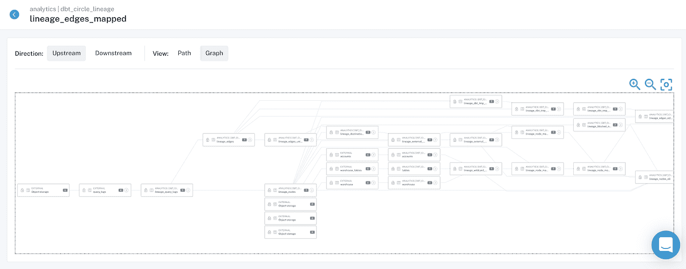
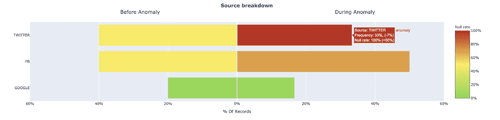
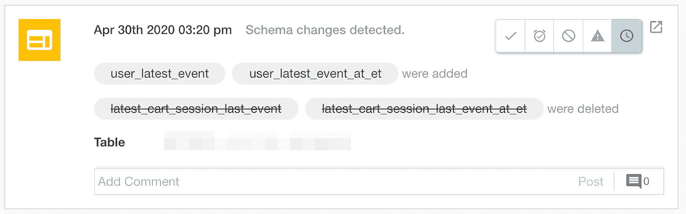

# 数据团队的事件管理

> 原文：<https://towardsdatascience.com/how-to-conduct-incident-management-on-your-data-pipelines-2dfc20b1b0b7?source=collection_archive---------20----------------------->

## 大规模识别、找出根本原因并解决数据质量问题的 4 个步骤

图片由巴尔·摩西提供。

随着数据系统变得越来越分散，公司接收越来越多的数据，出错(和事故)的机会只会增加。几十年来，软件工程团队一直依靠[多步骤流程](https://en.wikipedia.org/wiki/Incident_management)来识别、筛选、解决和防止问题影响他们的应用程序。

随着数据操作的成熟，是时候我们以同样的勤奋对待 [**数据停机**](https://www.montecarlodata.com/the-rise-of-data-downtime/) 了，换句话说，就是数据丢失、不准确或其他错误的时间段，特别是在构建更可靠、更有弹性的数据管道时。

虽然关于数据团队如何处理其数据的事件管理的文献并不多，但我们已经从软件开发的朋友那里获得了大量资源。经过一些调整，这些技巧已经成为一些最好的数据工程团队的无价工具。

当涉及到为您的管道构建数据事件管理工作流时，4 个关键步骤包括:**事件检测**、**响应**、[、**根本原因分析(RCA)** 、**、&解决方案**，以及**无可指责的事后分析**。](/root-cause-analysis-for-data-engineers-782c02351697)

在本文中，我们将介绍这些步骤，并分享数据团队在制定自己的事故管理策略时可以使用的相关资源。

# 事件检测

*将自动数据质量监控集成到您的关键工作流中是您的事件管理流程成功的基础，并允许您的团队指定谁在调查问题及其状态(即待定、调查、已解决)。图片由巴尔·摩西提供。*

不言而喻，在数据进入生产之前，您首先应该 [**测试数据**](https://www.montecarlodata.com/what-is-data-testing/) 。尽管如此，即使有了最强大的测试和检查，在您说“数据管道损坏”之前，坏数据还是会从裂缝中掉出来，并被推到戳中。

当数据宕机发生时，第一步是事件检测。可以通过 [**数据监控和警报**](https://www.montecarlodata.com/automated-data-quality-testing-at-scale-with-sql-and-machine-learning-2/) 来检测事件，这既可以在您的数据管道上手动实施，也可以基于特定阈值触发，或者作为 [**数据可观察性**](https://www.montecarlodata.com/data-observability-the-next-frontier-of-data-engineering/) 解决方案的一部分分层实施，并基于历史数据模式和自定义规则定期自动触发。

数据监控的一个关键组件是 [**异常检测**](https://www.coursera.org/lecture/ai/how-to-deploy-a-real-time-anomaly-detector-IKRtr) ，即识别数据健康支柱(即，容量、新鲜度、模式和分布)何时偏离正常的能力。异常检测在端到端(跨您的仓库、湖泊、ETL 和 BI 工具)实施时最有价值，而不是仅在您的数据生态系统的特定孤岛中实施。良好的异常检测还将调整算法以减少白噪声和误报。

事件检测可以集成到数据工程和分析工作流中，确保在通过适当的通信渠道(Slack、电子邮件、SMS、信鸽等)出现问题时，所有数据利益相关方和最终用户都能收到通知

**建议的资源:**

*   [**devo PS 时代的事件管理& SRE**](https://www.infoq.com/presentations/incident-management-devops-sre/) (达蒙·爱德华兹，InfoQ)
*   [**管理突发事件**](https://sre.google/sre-book/managing-incidents/) (《谷歌 SRE 手册》Andrew Stribblehill)
*   <https://tech.affirm.com/metrics-monitoring-and-alerting-90c9e8b60956>**(Elaine Arbaugh，Affirm Tech Blog)**

# **反应**

****

***作为一名事故指挥官，能够专注于数据质量问题可以更容易地了解数据管道中的问题。图片由巴尔·摩西提供。***

**良好的事件响应始于——也止于——有效的沟通，幸运的是，大部分事件响应可以提前准备好，并在适当的时候通过 PagerDuty 和 Slack 通过适当的工作流程自动完成。**

**数据团队应该花时间创建运行手册和行动手册，以完成标准事件响应。操作手册为您提供了如何使用不同服务以及遇到的常见问题的说明，而行动手册则提供了处理事件的分步流程。两者都应该提供代码、文档和其他材料的链接，这些链接可以帮助团队理解当关键管道破裂时该做什么。**

**一本好的操作手册的一个重要部分？发生停机或故障时委派角色。**

**在传统的现场可靠性工程项目中，一种随叫随到的过程，根据服务委派特定的角色，通常按小时、天或周进行分段。除了“事件响应者”，通常还有一名“ [**”事件指挥官**](https://en.wikipedia.org/wiki/Incident_commander) ”，负责在响应者和其他利益相关者解决问题时分配任务和综合信息。**

**事故指挥官还负责与可能受影响的上游和下游消费者进行沟通，即那些使用由破裂管道提供动力的数据产品的消费者。**

****

***端到端沿袭是一种有价值的工具，用于在数据管道中断时了解上游和下游的依赖性，以便在坏数据影响业务之前通知相关方。图片由巴尔·摩西提供。***

**对于业务上下文， [**元数据是一个强大的工具**](https://www.montecarlodata.com/data-teams-your-metadata-is-useless/) ，用于了解哪些团队受到给定数据停机事件的影响；再加上自动化的、端到端的沿袭，沟通这些受影响的资产之间的上游和下游关系可以是一个无痛且快速的过程，节省了团队手工绘图的时间。**

**一旦发生数据宕机，就必须将其影响传达给上游和下游用户，包括处理数据的用户和使用数据的用户。通过正确的方法，可以使用 PagerDuty、Slack 和其他通信工具将其中的大部分内容融入到自动化工作流中。**

****建议的资源:****

*   **[**如何用 Gitlab**](https://docs.gitlab.com/ee/user/project/clusters/runbooks/) (GitLab 文档)创建 Runbooks**
*   **[**比较 IT 流程文档的操作手册和行动手册**](https://searchitoperations.techtarget.com/tip/Compare-runbooks-vs-playbooks-for-IT-process-documentation)**(Stephen j . Bigelow， *TechTarget*****
*   ****[**使开发人员能够进行操作**](https://blog.buildo.io/enable-your-devs-to-do-ops-9a0a870baa1) (Francesco Negri，Buildo)****

# ****根本原因分析和解决方案****

********

*****了解哪些数据源会导致数据管道中断，这对根本原因分析至关重要。图片由巴尔·摩西提供。*****

****理论上，根本原因听起来就像运行几个 SQL 查询来分割数据一样简单，但在实践中，这个过程可能相当具有挑战性。事件可能以不明显的方式出现在整个管道中，并影响多个(有时是数百个)表。****

****例如，数据质量差的一个常见原因是新鲜度，即当数据异常过时时。这种事件可能是由多种原因造成的，包括作业卡在队列中、超时、合作伙伴未及时提供其数据集、错误或意外的计划更改从 DAG 中删除了作业。****

****根据我们的经验，我们发现大多数数据问题都可以归因于以下一个或多个事件:****

*   ******输入作业、管道或系统的数据发生意外变化******
*   ******逻辑的变化** (ETL、SQL、Spark 作业等。)转换数据****
*   ******运营问题**，如运行时错误、许可问题、基础设施故障、日程变更等。****

****快速确定手头的问题不仅需要适当的工具，还需要考虑这三个来源如何以及为什么会中断的整体方法。****

********

****随着软件(和数据)系统变得越来越复杂，查明停机或事故的确切原因(或根源)变得越来越困难。亚马逊的“五个为什么”方法提供了一个有用的框架，通过这个框架，我们可以了解 RCA:****

*   ****找出问题所在****
*   ****询问问题发生的原因，并记录原因****
*   ****确定原因是否是根本原因****
*   ****原因是否可以避免？****
*   ****原因有没有可能在事情发生之前就被检测出来？****
*   ****如果原因是人为失误，为什么可能呢？****
*   ****将原因作为问题，重复该过程。当你确信你已经找到了根本原因时，就停下来。****

****你的系统崩溃的原因很少是单一的。随着数据工程师努力通过更智能的流程、测试、数据新鲜度检查和其他解决方案来减少人工劳动，他们应该能够在问题浮出水面之前发现问题。当他们不这样做时，这是一个强烈的迹象，表明这些故障保险是不够的。正如在软件工程领域一样，自动化解决方案，如数据可观察性和端到端监控，通常是对抗数据宕机的最佳选择。****

****首先，我们确定了数据团队在对其数据管道进行 RCA 时必须采取的四个步骤:****

1.  ******看看你的血统:**要了解什么出了问题，你需要找到系统中出现问题的最上游节点——那是事情开始的地方，也是答案所在。如果你幸运的话，万恶之源出现在有问题的仪表板上，你会很快发现问题。****
2.  ******查看代码:**查看创建该表的逻辑，甚至是影响事件的特定字段，将有助于您对问题所在提出合理的假设。****
3.  ******查看您的数据:**在第 1 步和第 2 步之后，是时候更仔细地查看表格中的数据，寻找可能出错的地方。这里有一种很有前途的方法，那就是研究表中有异常记录的其他字段如何提供线索，说明数据异常发生在哪里。****
4.  ******看看您的操作环境:**许多数据问题是运行您的 ETL/ELT 作业的操作环境的直接结果。查看 ETL 引擎的日志和错误跟踪可以找到一些答案。****

****(如果你还没有读过，可以看看 Francisco Alberini 的文章[关于数据工程师如何进行根本原因分析，非常值得一读)。](https://www.montecarlodata.com/the-data-engineers-guide-to-root-cause-analysis/)****

****一旦您发现出了问题，了解了其影响，确定了根本原因，并与适当的利益相关者沟通了后续步骤，就该解决问题了。这可能与暂停数据管道或模型并重新运行它们一样简单，但是由于数据可能由于数百万种原因而中断，这通常涉及大量的故障排除。****

******建议的资源:******

*   ****[**根本原因分析，用例子和方法解释**](https://www.tableau.com/learn/articles/root-cause-analysis) (Tableau)****
*   ****[**工业 4.0 时代的根本原因分析**](https://medium.datadriveninvestor.com/root-cause-analysis-in-the-age-of-industry-4-0-9516af5fb1d0) (Lior Kitain，*数据驱动投资人*)****
*   ****<https://thenewstack.io/field-guide-for-production-readiness/>****(伊恩·史密斯，*新栈*)********

# ******无可指责的验尸******

************

*******无可指责的事后分析通常以对问题的深入分析和明确的后续步骤结束，以防止类似事件影响未来的管道。图片来自* [*万花筒*](https://unsplash.com/@kaleidico) *上*[*un splash*](http://www.unsplash.com)*。*******

******我的一个朋友是一名现场可靠性工程师，在 Box、Slack 和其他硅谷公司有十多年的灭火经验，他告诉我，如果不把这一点说得非常清楚，我就不能写一篇关于事故管理的文章:******

> ******“对于每一个事件，都是系统出了问题，而不是编写代码的人。好的系统是为容错和人类宽容而构建的。允许你犯错是系统的职责。”******

******当谈到数据可靠性和数据运营时，同样的精神听起来是真实的。管道应该是容错的，有适当的流程和框架来考虑数据管道中的 [**已知未知和**](https://www.montecarlodata.com/the-new-rules-of-data-quality/) 未知。******

****无论发生了何种类型的事故或事故原因是什么，数据工程团队都应该在解决问题并进行根本原因分析后，进行全面的跨职能事后分析。****

****以下是一些最佳实践:****

*   ******把一切都框定为一次学习经历**:为了有建设性，验尸报告必须是无可指责的(如果不是，那么[知道指责](https://techbeacon.com/app-dev-testing/blameless-postmortems-dont-work-heres-what-does))。试图对事件进行“指责”是很自然的，但在向你的同事灌输信任或培养合作文化时，这很少有帮助。通过围绕“学习和改进”的目标重新构建这种体验，更容易主动采取解决数据质量所必需的组织(创建更好的工作流和流程)和技术步骤(为投资新工具提供理由)。****
*   ******以此为契机，评估您对未来事件的准备情况:**更新操作手册，调整您的监控、警报和工作流管理工具。随着您的数据生态系统的发展(添加新的第三方数据源、API，甚至消费者)，这一步在事件预防方面将变得至关重要。****
*   ******记录每一次事后分析，并与更广泛的数据团队分享:**就像在软件工程中一样，记录哪里出错了，系统是如何受到影响的，以及根本原因是什么，这些通常是事后才想到的。但是，文档记录与事件管理流程中的任何其他步骤一样重要，因为它可以防止在拥有部落知识的工程师离开团队或无法提供帮助时出现知识缺口。****
*   ******重温 SLA:**在[之前的一篇文章](https://www.montecarlodata.com/how-to-make-your-data-pipelines-more-reliable-with-slas/)中，我讲述了为什么数据团队需要为他们的数据管道设置 SLA。简而言之，服务水平协议(SLA)是许多公司用来定义和衡量给定供应商、产品或内部团队将提供的服务水平的一种方法，以及在失败时的潜在补救措施。随着数据系统的成熟或随着时间的推移而变化，不断地重新审视您的**SLA**、服务级别指标( **SLIs** )和服务级别目标( **SLOs** )非常重要。六个月前有意义的 SLA 可能不再有意义；你的团队应该是第一个知道这些变化并与下游消费者沟通的人。****

****说到底，事后检讨对于数据团队和软件工程师一样重要。随着我们领域的不断发展(毕竟，我们正处于数据时代)，了解数据停机是如何发生的以及为什么会发生是我们不断提高系统和流程弹性的唯一途径。****

******建议的资源******

*   ****[**在谷歌**](https://sre.google/sre-book/postmortem-culture/) 进行无可指责的剖验(约翰·伦尼&苏·吕德，谷歌 SRE 手册)****
*   ****[**无可指责的殉教者和一个正义的文化**](https://codeascraft.com/2012/05/22/blameless-postmortems/) (约翰·奥尔斯伯，代号为手艺)****
*   ****[**死后模板**](https://github.com/dastergon/postmortem-templates) (Pavlos Ratis，GitHub)****

****引用我们 SRE 前辈的话: [**希望不是战略**](https://sre.google/sre-book/introduction/#:~:text=Hope%20is%20not%20a%20strategy.&text=It%20is%20a%20truth%20universally%20acknowledged%20that%20systems%20do%20not%20run%20themselves.) 。****

****但是，有了这些最佳实践，您就可以将事件管理从“四处探索并希望有最好的结果”变成一台运转良好、高度可靠的机器。****

*****有兴趣了解更多关于* ***Vimeo*** *，****Eventbrite****，* ***Compass 以及其他领先公司*** *如何利用数据可观察性大规模防止管道破裂？*****

*****伸出手去* [***巴尔摩西***](https://www.linkedin.com/in/barrmoses)*[***蒙特卡洛团队的其他人。*T38**](https://www.montecarlodata.com/request-a-demo/)*****