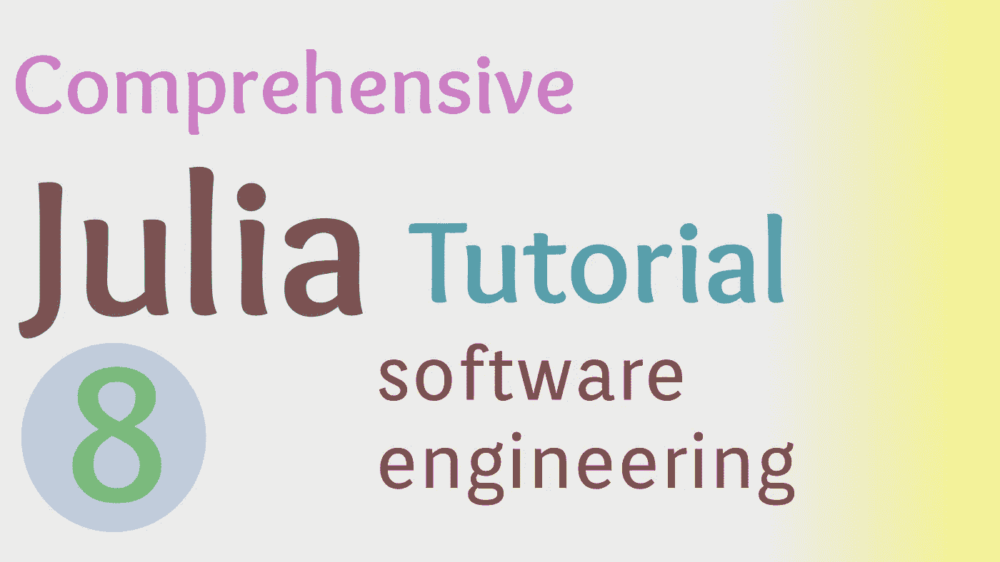

# 如何配置 Julia 包

> 原文：<https://towardsdatascience.com/how-to-configure-julia-packages-93a26e28ea76?source=collection_archive---------56----------------------->

## 朱莉娅综合教程

## 深入了解 Julia 中的配置和类型



(图片由作者提供)

> 本文视频:

> 我们项目的存储库:

<https://github.com/ChifiSource/SuperFrames.jl>  

# 介绍

在之前的“Julia 综合教程”中，我们介绍了在 Julia 编程语言中使用 Project.toml 文件和虚拟环境的基础知识。如果您还没有阅读或观看这个系列教程的迭代，如果您感兴趣，可以在这里查看:

</intro-to-software-engineering-in-the-julia-programming-language-3c32411c5683>  

Project.toml 文件是描述任何 Julia 项目的宝贵资产。这个文件不仅包括项目需要的所有依赖项，还包括那些包的兼容版本，以及关于包的元信息。虽然 Project.toml 的大部分可以通过创建新的虚拟环境来机械地生成，但是配置的某些部分必须手动完成。

# 配置我们项目文件的其余部分

完成这个项目设置的第一步是完成我们的 Project.toml 文件的配置。首先，我们应该看看我们的武器库中的一些配置选项，比如“名称”、“版本”和“UUID”这是我们完成的 Project.toml 文件，它将使解释其中每个资产为 Julia 的包管理器做什么变得容易得多。

```
authors = ["emmett [emmett@emmettboudreau.com](mailto:emmett@emmettboudreau.com)"]
name = "SuperFrames"
uuid = "19a2823e-5050-11eb-208c-916d674a0ad5"
[deps]
DataFrames = "a93c6f00-e57d-5684-b7b6-d8193f3e46c0"
[compat]
julia = "1.5"
DataFrames = "0.22.1"
```

## 作者

“作者”是一个不言自明的领域；这些是参与这个项目的人。当然，在这里我们看到我和我的电子邮件在一个字符串中，这个字符串是用 Lisp 风格的列表编写的。也就是说，应该在包含 Lisp 风格列表字符串的 Julia 风格数组中提供额外的条目。

## 名字

名称是我们包装最重要的属性之一。这将是最终用户调用和使用软件包的方式，因此这当然非常重要。虽然“using”调用可能会使用模块名，但是您的模块名使用与您的 Pkg 名相同的名称可能是明智的，因为否则人们甚至会很难弄清楚如何导入您的包！也就是说，这个文件中描述的名字将被 Julia 注册中心用来识别你的包的名字。

## uuid

UUID (Universal Unique Identifier，通用唯一标识符)是字母和数字的组合，用于抽象地表示任何东西，但在涉及到包时有明确的用途。UUIDs 允许包管理器 Pkg 跟踪几个包，可能有相同的名字，有时来自完全不同的注册中心，并允许它们一起工作。

我们需要的 Julian 包的 UUID 类型可以使用 UUIDs.jl 包获得。我们可以通过以下方式导入模块

```
using UUIDs
```

既然模块已经导入，现在有一个名为

```
uuid1()
```

这需要一个位置参数。一个随机数发生器。通常在这些情况下，随机数生成器是一种接受种子并基于该种子返回随机数的类型。默认情况下，该参数使用全局随机数生成器，该生成器将使用编译器在编译时提供的种子。

考虑到这一点，我们真的不需要种子，所以我只是像这样传递方法:

```
uuid = uuid1()
```

然后将生成的 UUID 记录到我们的 Project.toml 文件中。

## [deps]

DataFrames 是我们在[deps]部分中唯一的依赖项。该键的对应值是 DataFrames.jl 包的 UUID。这当然会在我们创建虚拟环境时自动添加到我们的 Project.toml 文件中。

## [兼容]

compat 部分用来告诉 Julia 的包管理器这个项目要处理哪些版本的依赖项。对于一般的 Julia 应用程序，让 Julia 兼容性至少为 1.0 或更高可能是个好主意。对于今天的产品包，我将把 Julia 的兼容性设置为 1.5，因为我使用的是 1.5.2，我将把 DataFrames 的兼容性设置为 DataFrames 的最新版本:

```
[compat]
julia = "1.5"
DataFrames = "0.22.1"
```

# 基本模块扩展

正如我们在讨论显式导入时所讨论的，我们将需要显式导入任何我们想要从中扩展方法或类型的包。虽然我们可能不会扩展 DataFrame 类型的功能，但是只要我们利用了 DataFrames.jl 包的类型层次结构，我们就可以在 DataFrame 上使用 DataFrames.jl 提供的方法。

类型层次结构只是一种类型在一系列类别上的分类。当某些类型可以用某些方式处理时，这就很方便了，因为它们有共同的属性，但有时它们没有。对于本例，由于 DataFrames.jl 包中的大多数方法都使用“AbstractDataFrame”类型，我们将直接导入它并创建一个新类型，它将继承它的所有方法。首先，让我们导入构建我们自己的相似类型 AbstractDataFrame 和 Index 所需的两种类型。

```
import DataFrames: AbstractDataFrame
import DataFrames: Index
```

我们今天要做的最后一件事是创建一个新类型，它将继承已经赋予抽象类型 AbstractDataFrame 的所有属性。我们使用<:/>

</overview-abstract-super-type-heirarchies-in-julia-26b7e64c9d10>  

# 结论

虽然 Julia 的 Pkg 包管理器在开发包时可能需要做一些工作来启动和运行，但一旦包发布并感受到好处，这肯定是值得的。虽然在这一版的 Julia 教程中没有太多的编程，但将来肯定会有更多的计划深入算法和 Julian 编程。我期待着展示这种语言在类型和方法方面的更多功能！感谢您的阅读！