# 如何从 Mac 将本地 R 项目连接到 GitHub

> 原文：<https://towardsdatascience.com/how-to-connect-a-local-r-project-to-github-from-a-mac-4f183d57477e?source=collection_archive---------37----------------------->

## 带截图的逐步指南

照片由来自[佩克斯](https://www.pexels.com/photo/eyeglasses-in-front-of-laptop-computer-1181253/?utm_content=attributionCopyText&utm_medium=referral&utm_source=pexels)的[克里斯蒂娜·莫里洛](https://www.pexels.com/@divinetechygirl?utm_content=attributionCopyText&utm_medium=referral&utm_source=pexels)拍摄

在创建一个新的 R 项目时，设置一个 GitHub 连接是相当简单的。然而，有时您最终会得到一个只存储在本地的回购协议。也许你从一个不使用 GitHub 的人那里接受了一个项目，或者也许你今天不在状态，只是忘了从 GitHub 连接开始。

无论哪种方式，您都可以轻松地将这个 repo 复制到 GitHub 中并建立连接。这个循序渐进的指南会告诉你怎么做。

# 1.下载 GitHub for Mac 应用程序

首先，前往 GitHub for Mac 的网页:【http://mac.github.com/ 

您应该会看到以下屏幕:

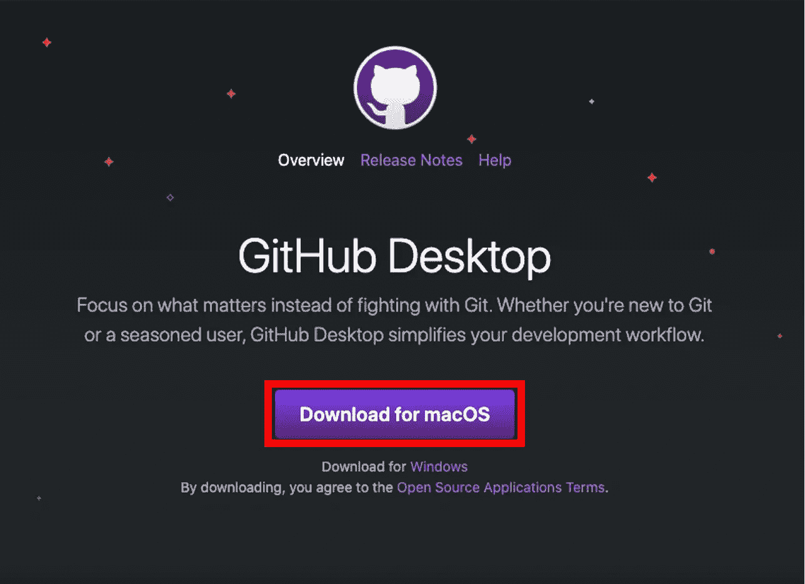

点按屏幕中间的紫色“macOS 下载”按钮。zip 文件应该立即开始下载。下载完成后，双击 zip 文件。GitHub 桌面应该出现在您的下载文件夹中，如下所示:

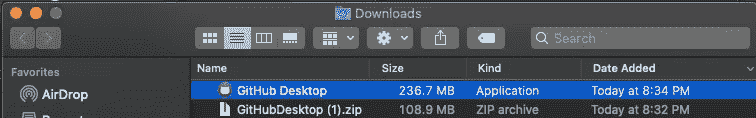

将 GitHub Desktop 从下载文件夹拖到“应用程序”中，该文件夹在下方左侧突出显示。您应该会看到一个紫色的 GitHub 桌面图标出现(见右下角):

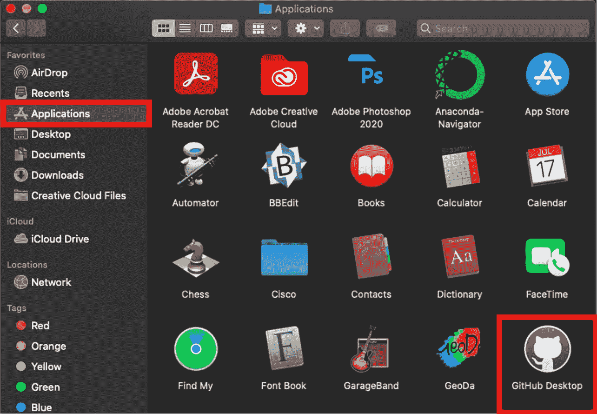

# 2.打开 GitHub 桌面并建立连接

双击 GitHub 桌面图标。您可能会收到一条警告，指出“GitHub Desktop”是一个从互联网下载的应用程序，并询问您是否要打开它。如果您看到此警告，请选择“打开”:

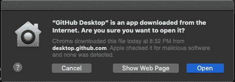

GitHub 桌面打开后，选择“添加现有存储库”如果这是你第一次打开 GitHub 桌面，你的屏幕看起来可能会有些不同，但是仍然应该有一个“添加现有库”选项。

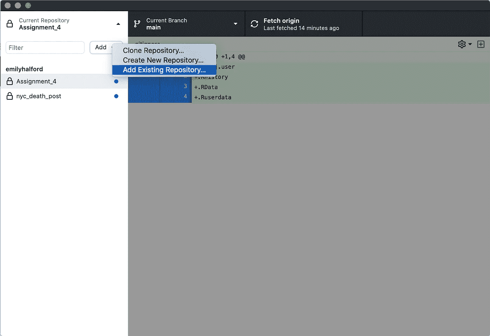

应该会出现以下窗口。单击“选择…”按钮并导航到包含您的 R 项目的文件夹。

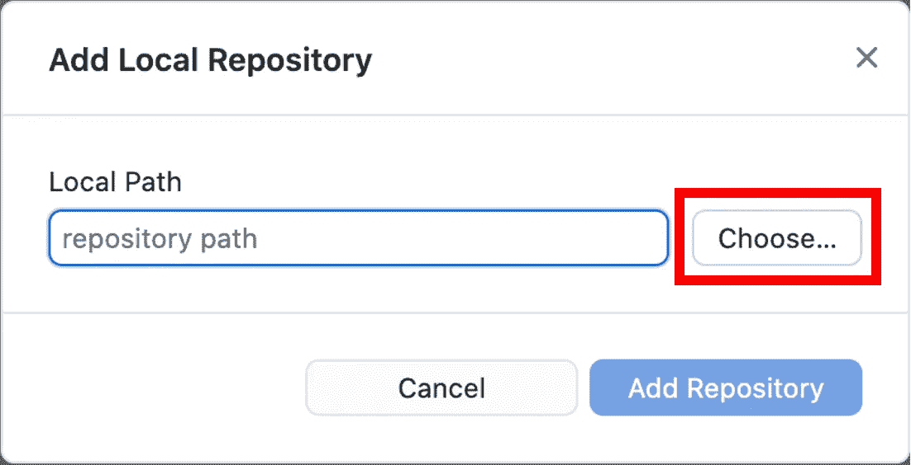

一旦您选择了包含您的本地项目的文件，您将会得到下面的通知:“这个目录似乎不是一个 Git 存储库。是否要在这里创建一个存储库？”单击蓝色的“创建存储库”文本。

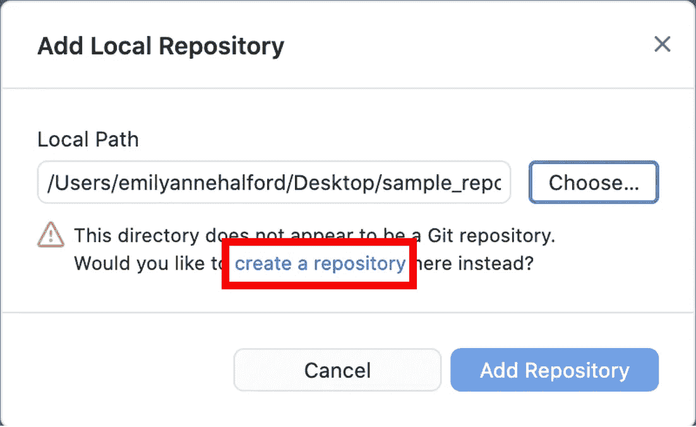

应该会出现以下窗口。只需点击右下角的“创建存储库”按钮。

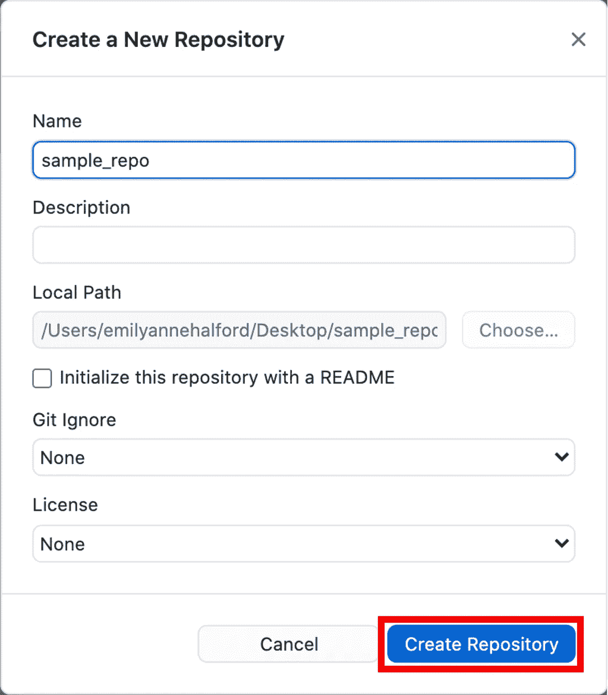

出现以下屏幕时，单击“发布存储库”

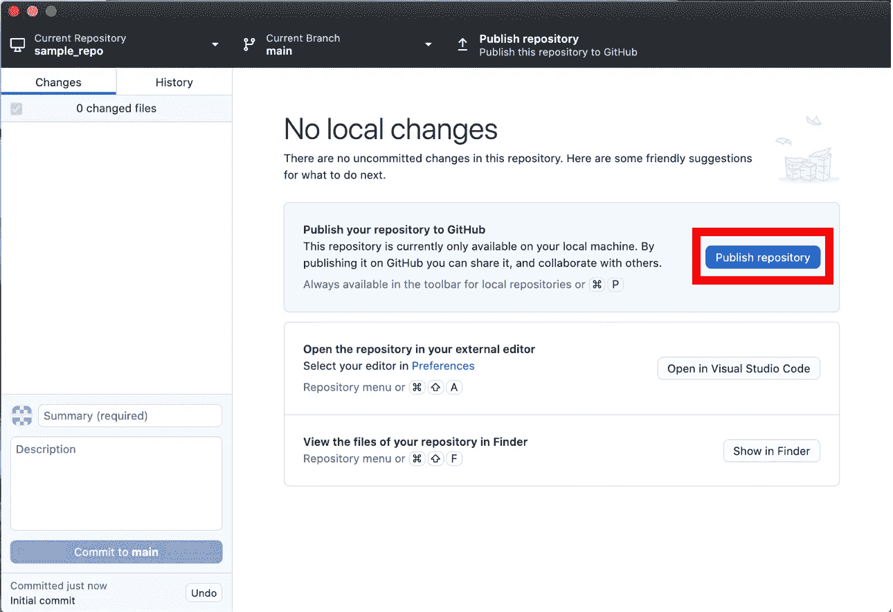

将弹出以下窗口，您可以简单地单击“发布存储库”如果您希望公开您的回购协议，您可以取消选中“将此代码保密”复选框

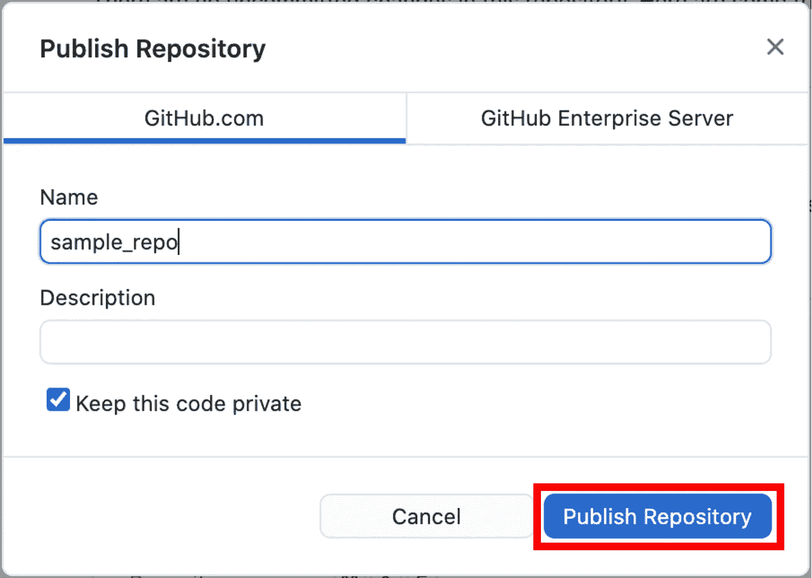

根据项目的大小，发布可能需要几分钟时间。一旦项目被推送到 GitHub，你就应该一切就绪了！

# 3.验证连接是否成功

您可以通过登录 GitHub 帐户并验证您是否在“Repositories”下看到新的 repo 来确保连接成功建立。

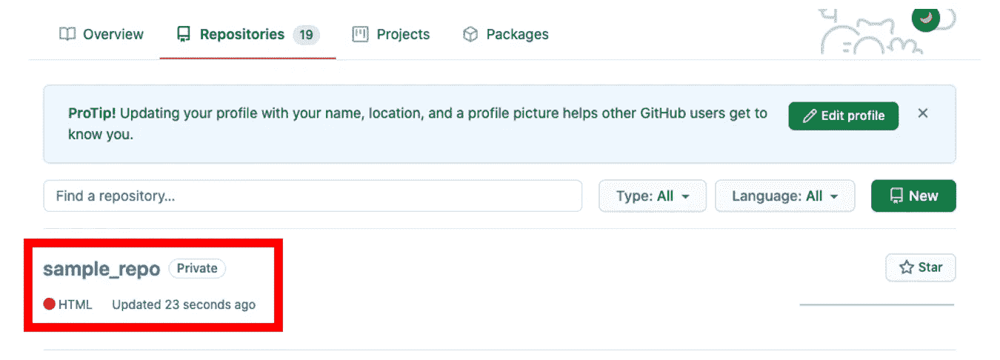

此外，当您的项目在 RStudio 中打开时，您现在应该会看到“Git”选项卡，您可以在其中推送和获取任何更新。

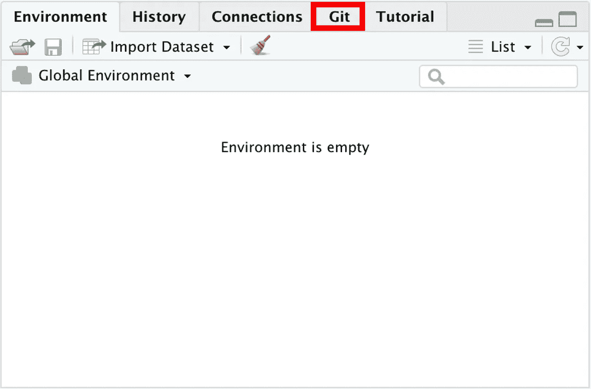

就是这样！通常，在创建 R 项目时，您会希望坚持使用创建 GitHub repo 的标准工作流程。这样，您将能够充分利用 GitHub 的版本控制功能。您的代码将始终被备份，并且您可以在以后访问您的工作的早期版本。然而，当无法遵循此工作流程时，GitHub Desktop 提供了一种便捷的方式将现有的本地项目连接到 GitHub repo。