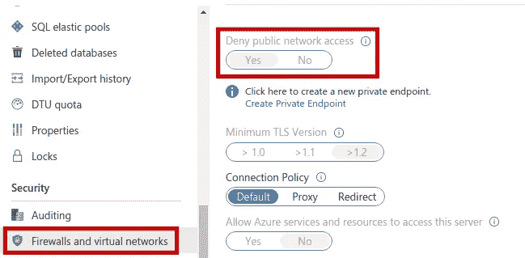
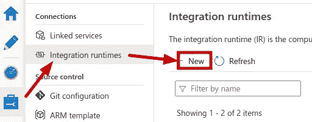
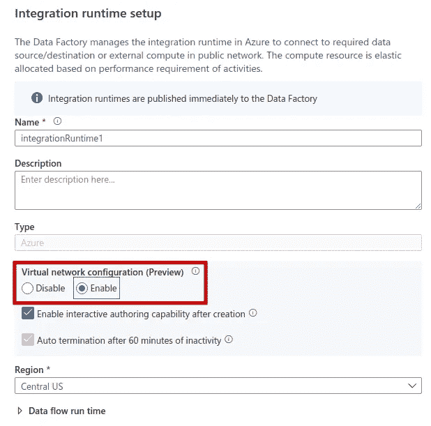
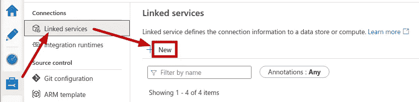
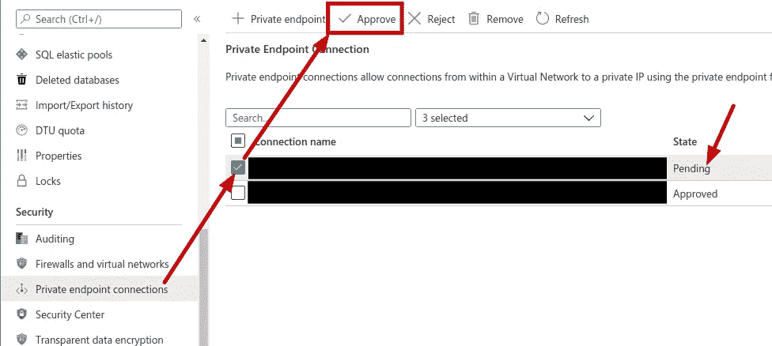
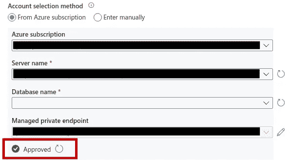

# 如何使用私有端点将 Azure 数据工厂连接到 Azure SQL 数据库

> 原文：<https://towardsdatascience.com/how-to-connect-azure-data-factory-to-an-azure-sql-database-using-a-private-endpoint-3e46984bec5e?source=collection_archive---------10----------------------->

## 循序渐进的教程

在 [Unsplash](https://unsplash.com/s/photos/connectors?utm_source=unsplash&utm_medium=referral&utm_content=creditCopyText) 上由 [Hafidh Satyanto](https://unsplash.com/@satyanto?utm_source=unsplash&utm_medium=referral&utm_content=creditCopyText) 拍摄的照片

Azure Data Factory (ADF)非常适合从多个来源提取数据，其中最明显的可能是 Azure SQL。然而，Azure SQL 有一个拒绝公共网络访问的安全选项，如果启用，将阻止 ADF 在没有额外步骤的情况下进行连接。

在本文中，我们将了解设置私有端点并使用它从 Azure Data Factory 连接到 Azure SQL 数据库所需的步骤。

# Azure SQL 中的“拒绝公共网络访问”设置

在我们开始之前，让我们回顾一下我在 Azure SQL 中所指的设置。这是一个名为**拒绝公共网络访问**的开关，位于 Azure 门户网站的*安全>防火墙和虚拟网络*下。

来源:作者

启用此设置时，如果没有私有端点，Azure Data Factory 将不会连接。你可以看到在 toggle 控件下面甚至有一个创建私有端点的链接，但是现在不要使用它——我们马上会从 Azure Data Factory 创建请求。

# ADF 集成运行时

要在 Azure Data Factory 中使用私有端点，必须使用启用了虚拟网络配置的集成运行时。该设置不能更改，所以如果您还没有启用它的运行时，您需要创建一个新的运行时。

来源:作者

来源:作者

现在您已经有了一个启用了虚拟网络配置的集成运行时，您已经准备好创建一个新的链接服务了。

# ADF 链接服务

仍在 Azure Data Factory 中时，单击以创建新的链接服务。

来源:作者

当您选择启用虚拟网络配置的集成运行时，一个**受管理私有端点**设置将出现在*帐户选择方法*部分。该设置是只读的，将在您输入订阅和服务器详细信息时填充。如果受管私有端点已经可用，您就可以开始了！

如果受管理的私有端点不可用，请单击**创建新的**链接按钮开始该过程。

来源:作者

当您在 Azure Data Factory 中保存新的托管私有端点时，它将在 Azure 中被提供，但在获得批准之前将保持在*挂起*状态。

# Azure 私有端点

我们跳回 Azure 来批准新的私有端点。在 Azure 门户中找到你的 Azure SQL 数据库，并浏览到*安全>私有端点连接*。

您应该会看到由 Azure Data Factory 创建的连接，状态为 *Pending* 。选中其复选框，点击**批准**按钮。

来源:作者

在 Azure 门户中，状态将变为*已批准*。状态到达 Azure 数据工厂需要一两分钟，但是过一会儿它也会显示为*已批准*。

来源:作者

一旦显示为批准，您就可以开始了。您可以输入其余的连接信息并连接！

# 概述

我展示的大多数设置都可以通过几种不同的方式访问，并以不同的顺序执行。例如，您可以从 Azure 门户创建私有端点，而不是通过 Azure 数据工厂。很明显，你可以尝试并找到适合你的方法。

重要的部分如下:

1.  Azure Data Factory 有一个支持虚拟网络配置的集成运行时
2.  Azure SQL 具有批准的私有端点连接。
3.  Azure Data Factory 有一个使用集成运行时和私有端点连接的链接服务。

就这样，现在去享受你的新连接吧！