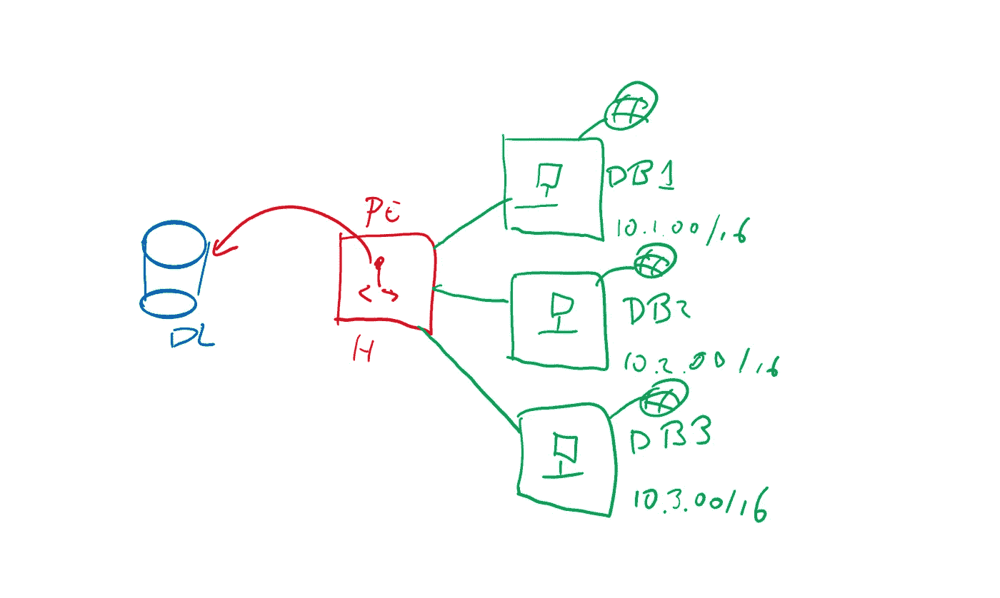
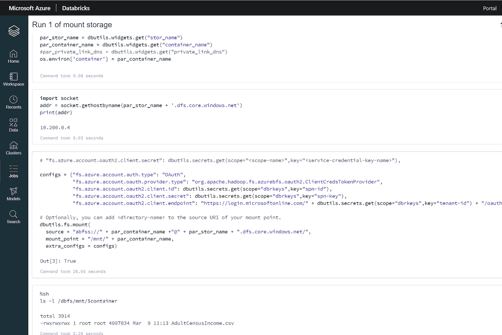

# 如何将数据块连接到 Azure 数据湖

> 原文：<https://towardsdatascience.com/how-to-connect-databricks-to-your-azure-data-lake-ff499f4ca1c?source=collection_archive---------6----------------------->

## 了解如何将多个 Databricks 工作区连接到 1 个中央 ADLSgen2 客户

# 1.介绍

*TLTR:克隆这个* [*git 项目*](https://github.com/rebremer/blog-databrickshubspoke-git) *，设置 params 并运行 0_script.sh 部署 1 个 ALDSgen2 hub 和 N 个 Databricks 辐条*

一个[数据湖](https://en.wikipedia.org/wiki/Data_lake)是一个集中的数据存储库，允许企业从数据中创造商业价值。Azure Databricks 是一个分析数据和构建数据管道的流行工具。在这篇博客中，讨论了 Azure Databricks 如何以一种安全和可扩展的方式连接到 ADLSgen2 存储帐户。在这方面，以下是关键:

*   深度防御:ADLSgen2 包含敏感数据，应该使用私有端点和 Azure AD ( [禁用访问密钥](https://docs.microsoft.com/en-us/azure/storage/common/shared-key-authorization-prevent?tabs=portal))来保护。Databricks 只能使用专用链接和 Azure AD 访问 ADLSgen2
*   访问控制:业务单元通常有他们自己的数据块工作区。应使用基于角色的访问控制(RBAC)授予多个工作区对 ADLSgen2 文件系统的访问权限
*   中心/分支架构:只有一个中心网络可以使用专用链路访问 ADLSgen2 帐户。数据块辐条网络与集线器网络对等，以简化联网

另请参见下图:



1.使用集线器(H)和私有端点(PE)连接到多个数据块(DB)分支的数据湖(DL)——图片来自 [Marc de Droog](https://www.linkedin.com/in/marc-de-droog-776a94/)

在这篇博文的剩余部分，将会更详细地解释这个项目。在下一章中，项目将被部署。

# 2.用 N 个数据块工作空间设置 ADLSgen2

在本博客的剩余部分，使用以下步骤部署项目:

*   2.1 先决条件
*   2.2 通过 hub network 创建 1 个 ADLSgen2 帐户
*   2.3 使用分支网络创建 N 个数据块工作区
*   2.4 使用专用链路连接数据块和 ADLSgen2 帐户
*   2.5 使用数据块装载存储帐户

## 2.1 先决条件

本教程需要以下资源:

*   [Azure 账户](https://azure.microsoft.com/en-us/free/)
*   运行 shell 脚本的 Azure DevOps 或 Ubuntu 终端
*   [蔚蓝 CLI](https://docs.microsoft.com/en-us/cli/azure/install-azure-cli?view=azure-cli-latest)

最后，克隆下面的项目或在您的 Azure DevOps 项目中添加存储库。

```
git clone [https://github.com/rebremer/blog-databrickshubspoke-git](https://github.com/rebremer/blog-databrickshubspoke-git)
```

该存储库包含 5 个脚本，其中 0_script.sh 触发了完成部署的其他 4 个脚本。它还包含一个 params_template.sh 文件。这个文件中的变量值需要用您的变量替换，并重命名为 params.sh。然后您就可以运行脚本了。这 4 个脚本将在本博客的剩余部分讨论。

## 2.2 通过 hub network 创建 1 个 ADLSgen2 帐户

在脚本 1_deploy_resources_1_hub.sh 中，将执行以下步骤:

*   创建启用了分层命名空间的 ADLSgen2 帐户。这允许创建文件夹和进行细粒度的访问控制
*   创建一个 VNET，并向存储帐户添加一个专用端点
*   使用专用端点作为区域创建专用 dns 区域

## 2.3 使用分支网络创建 N 个数据块工作区

在脚本 2_deploy_resources_N_spokes.sh 中，执行以下步骤:

*   创建 N 个数据块工作空间。工作区部署在它们自己的 VNET 中，并且可能部署在不同的订阅中。Databricks 部署的集群只有一个[私有 IP](https://docs.microsoft.com/en-us/azure/databricks/security/secure-cluster-connectivity) 。
*   对于每个数据块工作区，创建一个服务主体。授予服务主体在存储帐户中对其自己的文件系统的访问权限

## 2.4 使用专用链路连接数据块和 ADLSgen2 帐户

在脚本 3 _ configure _ network _ N _ spokes . sh 中，执行以下步骤:

*   为从 VNET 分支到存储帐户的 VNET 中心的每个数据块创建一个对等关系
*   反之亦然，创建从集线器 VNET 到每个数据块分支 VNET 的对等关系
*   将所有数据块虚拟网络添加到专用 dns 区域，以便存储帐户的专用端点可以在数据块笔记本中使用

## 2.5 使用数据块装载存储帐户

在脚本 4_mount_storage_N_spokes.sh 中，将执行以下步骤:

*   对于每个 Databricks 工作区，使用 Databricks REST API 将安装笔记本添加到工作区
*   对于每个数据块工作区，将服务主体的凭证存储在数据块支持的机密范围中
*   创建一个集群，并在集群上运行笔记本。Notebook 将从存储帐户获取服务主体凭据，并使用存储的私有端点将其安装到存储帐户中自己的文件系统，另请参见下面的屏幕截图



2.使用专用链接将数据块工作区 I 成功装载到 ADLSgen2 文件系统

# 3.结论

一个[数据湖](https://en.wikipedia.org/wiki/Data_lake)是一个集中的数据存储库，允许企业从数据中创造商业价值。Azure Databricks 是一个分析数据和构建数据管道的流行工具。在这篇博客中，讨论了如何使用深度防御、Azure AD 访问控制和中心/分支架构将 Azure Databricks 连接到 ADLSgen2 存储帐户，另请参见下图。


3.使用集线器(H)和私有端点(PE)连接到多个数据块(DB)分支的数据湖(DL)——图片由[马克·德·德鲁戈](https://www.linkedin.com/in/marc-de-droog-776a94/)提供