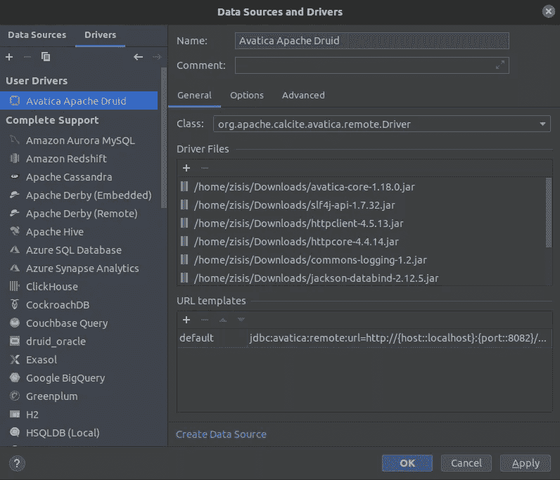
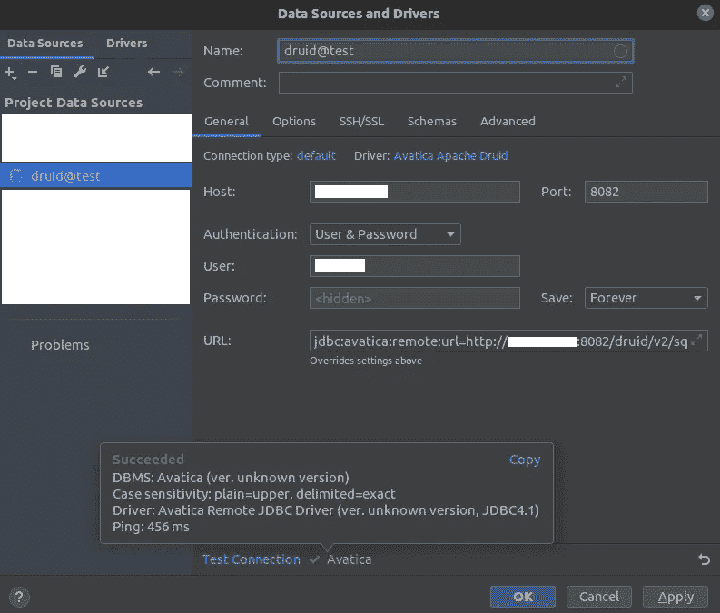

# 如何将 DataGrip 连接到 Apache Druid

> 原文：<https://towardsdatascience.com/how-to-connect-datagrip-to-apache-druid-1a9d502144e9?source=collection_archive---------34----------------------->

## 使用传统的 SQL 编辑器查询 Apache Druid 的一种简单方法


照片由[萨贾德·诺里](https://unsplash.com/@sajad_sqs9966b?utm_source=medium&utm_medium=referral)在 [Unsplash](https://unsplash.com/?utm_source=medium&utm_medium=referral) 上拍摄

> 这篇文章最初发表在[天秤座人工智能技术博客](https://www.libramli.ai/blog)上。

# 需要第三方 SQL 客户端编辑器

在过去的几个月里，我第一次在生产环境中部署了一个 Apache Druid 集群。这一过程的经验将有望在未来的故事中被涵盖。在这个故事中，我想分享一种创建能够连接到 Druid 集群并执行 SQL 查询的 DataGrip 驱动程序的方法。

随着越来越多的同事需要在开发阶段访问我们的 Druid 数据源，使用第三方客户端应用程序查询 Druid 成为一种必要。而为了管理用户并最终将非管理员从 Druid 路由器的 UI 中移除，转移到生产环境会使事情变得更糟。

在网上搜索解决方案时，我找不到方便的方法。起初，我认为使用由 [pydruid Python 库](https://github.com/druid-io/pydruid)支持的 [Apache Superset](https://superset.apache.org/) 的 SQL lab 可以为我完成这项工作，但这显然是一种过度的做法，因为我不想使用 Superset 的任何其他特性。

我的团队已经使用 [Apache 方解石 Avatica](https://calcite.apache.org/avatica/) 的 JDBC 驱动程序成功地将 Tableau 连接到 Apache Druid。我经常使用 DataGrip 来查询不同的数据库系统，因为它支持大量的数据库系统。因此，我研究了 DataGrip 提供的自定义驱动程序，通过添加 Avatica connector jar 和其他一些驱动程序，我得到了一个可用的驱动程序。这是最好的解决方案，因为它很容易与其他团队成员交流，而且不会让我们使用新工具，花更多的时间来熟悉它。

背景故事讲完了，让我们打开 DataGrip 来创建一个驱动程序和一个数据源，以便查询 Druid。

## 创建自定义驱动程序

*   导航到文件>新建>驱动程序，打开数据源和驱动程序窗口
*   在新窗口中，将驱动程序的**名称**字段更改为 Avatica Apache Druid(或任何您想识别的名称)
*   进入**驱动文件**点击 **+** 按钮，上传我的 [Github repo](https://github.com/ZisisFl/apache-druid-datagrip-driver) 的 jars 文件夹中可以找到的所有 jar 文件
*   在**类**下拉菜单中选择 org.apache .方解石. avatica.remote.Driver
*   添加一个 **URL 模板**，将其命名为 **default** ，并将值设置为:

```
jdbc:avatica:remote:url=http://{host::localhost}:{port::8082}/druid/v2/sql/avatica/
```

*   转到选项卡**选项**，在**其他**部分从下拉菜单中选择通用 SQL
*   申请保存驱动程序



驱动程序配置

## 使用自定义驱动程序创建新数据源

*   导航到文件>新建>数据源> {Druid 驱动程序名称}
*   如果需要，更改主机和端口(默认端口设置为 8082，因为它是代理节点的默认纯文本端口)
*   测试电路
*   应用于保存数据源



数据源创建

我还没有尝试使用 TLS 连接到代理节点，但我认为这不会是一个问题，因为在 Tableau 中使用 Avatica 驱动程序是可能的。

## 限制

*   这种变通方法的主要缺点是，通过使用通用 SQL 方言，自动完成功能不可用，并且关键字突出显示仅限于经典函数，如 count。目前有一个[未解决的问题](https://youtrack.jetbrains.com/issue/DBE-3142?_ga=2.123899022.56697963.1633791448-2097587877.1633075564)是关于在 DataGrip 中添加自定义方言的能力。
*   缺少自动限制选项可能会导致查询大量数据，甚至导致历史节点不可用。

# 结论

在本教程中，我们经历了一个简单的变通方法，使 Apache Druid 集群的数据消费者能够使用 [Druid 的 SQL 查询语言](https://druid.apache.org/docs/latest/querying/sql.html)执行查询。所有这些都在一个熟悉的工具中进行，这个工具可以作为许多不同数据源类型的客户端， [Datagrip](https://www.jetbrains.com/datagrip/) 。在这里的评论区或者在[项目](https://github.com/ZisisFl/apache-druid-datagrip-driver)的 Github 问题中，你可以随意发表你在设置驱动时遇到的任何问题。