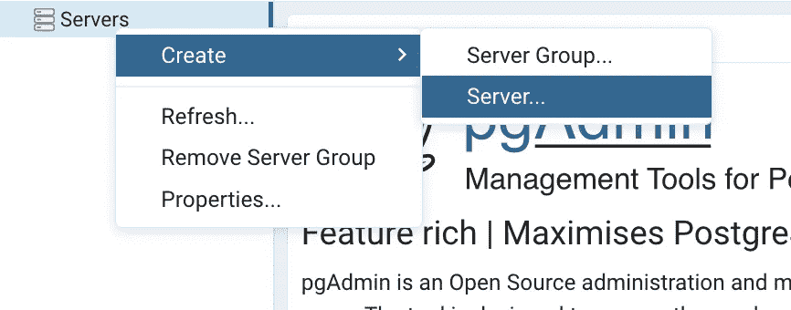

# 如何使用 Docker 通过 pgAdmin 连接到 Heroku Postgres 数据库

> 原文：<https://towardsdatascience.com/how-to-connect-to-a-heroku-postgres-database-with-pgadmin4-using-docker-6ac1e423ae66?source=collection_archive---------24----------------------->

## 了解世界上最先进的开源关系数据库


由 [Marco Pregnolato](https://unsplash.com/@marco_pregnolato?utm_source=medium&utm_medium=referral) 在 [Unsplash](https://unsplash.com?utm_source=medium&utm_medium=referral) 拍摄的照片

H [eroku](https://www.heroku.com/home) 是一个构建、部署、监控和扩展应用的云平台。它支持广泛的编程语言，包括 Ruby、Java、Python 等等。最重要的是，你可以给你的应用添加许多[插件](https://elements.heroku.com/addons)。 [Heroku Postgres](https://elements.heroku.com/addons/heroku-postgresql) 就是其中一个支持 PostgreSQL 的。

您可以使用命令行或图形界面连接到 PostgreSQL 数据库。对于后一个目的，我们可以使用 [pgadmin4](https://www.pgadmin.org/) 。它是 PostgreSQL 的开源管理和开发工具。

这篇文章教你如何用 Heroku Postgres 插件创建一个 Heroku 应用程序。之后，我们将使用 Docker 在本地机器上运行 pgadmin4。最后，我们将把 pgadmin4 连接到 PostgreSQL 数据库。

# 设置

我们将使用云平台 Heroku、Docker desktop for mac 和 Docker compose 文件进行设置。

## 1.创建 Heroku 应用程序

这一步你需要一个 Heroku 账号。现在，转到 [Heroku 仪表盘](https://dashboard.heroku.com/apps)。从那里，点击**新建**下拉菜单并选择**创建新应用**。


创建一个 Heroku app。

输入应用程序名称并点击**创建应用程序**按钮。

## 2.添加 Heroku Postgres 附加组件

导航到您的应用程序的概述选项卡，然后单击**配置-附加组件**链接。当你在搜索栏中输入时，你应该会看到 Heroku Postgres。


添加 Heroku Postgres 附加组件。

选择**业余爱好开发-自由**。它可以存储 10000 行数据，最多 20 个连接。点击了解更多关于计划&定价[的信息。](https://elements.heroku.com/addons/heroku-postgresql)

## 3.使用 Docker 在本地设置 pgadmin4

首先，你需要安装 [Docker](https://docs.docker.com/engine/install/) 。现在从[这里](https://github.com/lifeparticle/Heroku-Postgres-and-pgadmin4-with-docker/blob/main/docker-compose.yml)下载 docker-compose 文件，或者你可以复制粘贴到一个名为`docker-compose.yml`的文件中。

```
version: '3.8'
services:
pgadmin:
    container_name: pgadmin4_container
    image: dpage/pgadmin4
    restart: always
    environment:
      PGADMIN_DEFAULT_EMAIL: admin@admin.com
      PGADMIN_DEFAULT_PASSWORD: root
    ports:
      - "5050:80"
```

我已经讨论了 docker-compose 文件的各个元素。有兴趣就看看吧。

</how-to-run-postgresql-using-docker-15bf87b452d4>  

对于**环境**标签，需要的变量是 **PGADMIN_DEFAULT_EMAIL** 和**pg admin _ DEFAULT _ PASSWORD**。点击阅读更多相关信息[。](https://www.pgadmin.org/docs/pgadmin4/development/container_deployment.html)

让我们从`docker-compose.yml`文件所在的同一个目录运行下面的命令。

```
docker compose up
```

现在，您可以通过访问 URL[http://localhost:5050/](http://localhost:5050/)通过您最喜欢的 web 浏览器访问 pgadmin4。使用[**admin@admin.com**](mailto:admin@admin.com)作为邮件地址，使用 **root** 作为密码登录。

## 4.使用 pgadmin4 连接到 Heroku postgres 数据库

恭喜你！您已经成功地部署了一个 PostgreSQL 数据库，并使用 Docker 在您的机器上运行了 pgadmin4。现在我们需要将它们连接起来，这样我们就可以从本地机器上进行数据库管理。


访问数据库凭据。

点击 **Heroku Postgres** 链接并导航至设置选项卡。现在点击**查看凭证**。如你所见，有多个值，但我们只对**主机**、**数据库**、**用户**、**、**和**密码**感兴趣。



创建一个服务器。

从 pgadmin4 中，单击服务器>创建>服务器以创建服务器。


填写名称、主机名/地址、维护数据库、用户名和密码的数据。

对于名称，使用任何名称。现在移动到**连接**选项卡。将**主机**的值用于**主机名/地址**。将**数据库**的值用于**维护数据库**。将**用户**的值用于**用户名**。将**密码**的值用于**密码**，同时勾选**保存密码？**如果您不想在每次登录 pgadmin4 时都键入密码，请选择此框。


选择 SSL 模式选项，并填写主机地址数据。

现在对于 **SSL** 选项卡，选择**要求**为 **SSL 模式**。最后，移动到**高级**选项卡，使用**数据库** ( **维护数据库** ) 的值用于****DB 限制。**点击**保存**，大功告成！**

## **5.额外的**

**如果你想导入一些测试数据进行测试，这部分是可选的。单击服务器> testdb >数据库>数据库名称>模式>表。右击表格并选择**查询工具**。将 SQL 查询从[这里](https://raw.githubusercontent.com/lifeparticle/PostgreSql-Snippets/main/infile)复制粘贴到查询编辑器，点击**播放**按钮。现在你应该有两个叫做**学生**和**分数**的表格，里面有一些测试数据。**

# **包裹**

**现在您知道了如何使用 Docker 通过 pgadmin4 连接到 Heroku Postgres 数据库。如果你觉得这篇文章很有帮助，可以看看下面的文章，我在那里谈了更多关于 Docker 的内容。**

**</how-to-run-mysql-using-docker-ed4cebcd90e4>  </how-to-run-mysql-and-phpmyadmin-using-docker-17dfe107eab7>  </how-to-mount-a-directory-inside-a-docker-container-4cee379c298b>  

# 资源

*   [Heroku、Postgres 和 PgAdmin 入门—第 2 部分 RUN _ _](https://medium.com/@vapurrmaid/getting-started-with-heroku-postgres-and-pgadmin-run-on-part-2-90d9499ed8fb)**