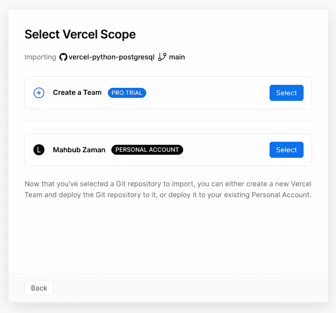

# 如何使用 Python 无服务器函数连接到 PostgreSQL 数据库

> 原文：<https://towardsdatascience.com/how-to-connect-to-a-postgresql-database-with-a-python-serverless-function-f5f3b244475?source=collection_archive---------55----------------------->

## 使用 Heroku 和 Vercel


照片由 [Pexels](https://www.pexels.com/photo/black-coffee-book-caffeine-close-up-1684149/?utm_content=attributionCopyText&utm_medium=referral&utm_source=pexels) 的[达里亚·奥拜马哈](https://www.pexels.com/@dariaobymaha?utm_content=attributionCopyText&utm_medium=referral&utm_source=pexels)拍摄

与传统系统不同，无服务器计算可以缩减到零。这意味着您只需为您使用的计算资源付费。Vercel 是许多提供无服务器运行时的平台之一，也称为功能即服务(FaaS)。您可以使用这些函数为整个应用程序构建一个无服务器的后端。

我们经常需要数据来驱动我们的应用程序，而数据库可以解决这个问题。PostgreSQL 是一个开源的对象关系数据库，因其可靠性和性能而广受欢迎。这篇文章将教你如何用 Vercel python 无服务器函数连接到 Heroku PostgreSQL 数据库。

# 设置

对于我们的设置，我们将使用 [GitHub](https://github.com/) 、 [Heroku](https://www.heroku.com/home) 和 [Vercel](https://vercel.com/) 。首先，我们将在 Heroku 中创建数据库。之后，我们将创建一个 git 存储库来将我们的无服务器功能部署到 Vercel。

## 1.在 Heroku 中创建 PostgreSQL 数据库

如果您在 Heroku 中没有现成的数据库，请阅读下面的帖子，其中我介绍了在 Heroku 中创建 PostgreSQL 数据库的所有步骤。

</how-to-connect-to-a-heroku-postgres-database-with-pgadmin4-using-docker-6ac1e423ae66>  

## 2.使用 Python 无服务器函数连接到数据库

首先，从 [GitHub](https://github.com/lifeparticle/vercel-python-postgresql) 下载资源库。现在我们将关注位于 **api** 文件夹中名为`index.py`的文件。此外，我们需要在 **api/requirements.txt** 文件中指定这个项目的所有依赖项。这里我们有一个，`psycopg2-binary`。

让我们来分解一下`index.py`文件的各个组成部分。

索引. py

对于数据库连接，我们将创建一个新的数据库会话。**连接**方法返回一个新的连接对象。连接参数是一个**主机**(未提供默认为 UNIX socket)**dbname**、**用户**、**密码**、**端口**(未提供默认为 5432)。你可以从 psycopg2 [文档](https://www.psycopg.org/docs/module.html#psycopg2.connect)中了解更多。现在我们将使用连接创建一个新的光标对象。

之后，为了方便起见，我解析了查询字符串并将其转换为字典。我已经将 HTTP 状态代码设置为 200，并将内容类型设置为 JSON。

下面一行在字典中查找名为`student_id`的键。if 块执行一个 SQL 查询，其中我们传递一个学生 id。您可以从 psycopg2 [文档](https://www.psycopg.org/docs/cursor.html#cursor.execute)中阅读更多关于 execute 方法的信息，以及从 psycopg2 [文档](https://www.psycopg.org/docs/usage.html#passing-parameters-to-sql-queries)中阅读更多关于 SQL 查询的信息。获取方法返回查询结果集的下一行。如果没有更多的可用数据，它或者返回一个**元组**或者 **None** 。此外，我们将元组转换为数组。现在让我们获取表 **students** 的列名，并将它们放入一个数组中。之后，我们使用 **zip** 方法来合并我们的列和值数组。从 python [文档](https://docs.python.org/3.3/library/functions.html#zip)中阅读更多关于 **zip** 方法的信息。else 块创建一个字典。

最后，我将返回`message`的编码内容，默认为的 UTF-8。

我们都为下一步做好了准备。访问 [Vercel](https://vercel.com/dashboard) 上的仪表板，然后[从 GitHub 导入](https://vercel.com/import)git 库。


单击新建项目。

搜索 git 存储库。如果找不到，点击配置 GitHub App，通过 GitHub 添加。


导入 git 存储库。

导入存储库后，单击继续按钮。


导入并继续。

现在，我将选择个人账户选项。然后，添加所有五个环境变量，**主机**，**数据库**，**用户**，**密码**，以及**端口**。我们可以从 Heroku 那里得到这些值。如果您找不到这些值，请返回此设置的第一步。



选择适当的选项并配置环境变量。

单击“部署”并通过单击“访问”按钮访问无服务器功能。这里的地址是由 Vercel 生成的[https://vercel-python-postgresql.vercel.app/](https://vercel-python-postgresql.vercel.app/)。我们需要在基本 URL 的末尾添加 **api/file_name** 来访问该函数。添加之后，我们有了一个看起来像 https://vercel-python-postgresql.vercel.app/api/index 的 URL。


你完了。

下面的链接将从我们的 Postgres 数据库返回学生 id 为 1 的学生数据。

```
https://vercel-python-postgresql.vercel.app/api/index?student_id=1
```

我们应该会看到下面的输出。

```
{
  "id": 1,
  "first_name": "Ailn",
  "last_name": "Rathmouth",
  "city": "Rathmouth",
  "phone": "05144461974",
  "gender": "Female",
  "email": "mailn0@bravesites.com",
  "address": "97228 Emmalee Harbors Suite 421 South Emmet, TX 54950",
  "postcode": 23031,
  "date_of_birth": "2001-12-16"
}
```

没有任何查询字符串。

```
https://vercel-python-postgresql.vercel.app/api/index
```

对于这个调用，我们应该看到下面的输出。

```
{
  "error": "Please provide student_id"
}
```

干得好！现在您知道了如何使用 Vercel python 无服务器函数连接到 Heroku PostgreSQL 数据库。我希望你能从这篇文章中学到一些新的东西，如果你觉得这篇文章有帮助的话，看看下面的文章，我在那里谈了更多关于 Vercel 的内容。

</how-to-deploy-a-python-serverless-function-to-vercel-f43c8ca393a0>  </how-to-deploy-a-ruby-serverless-function-to-vercel-da8c3581f7c2> 