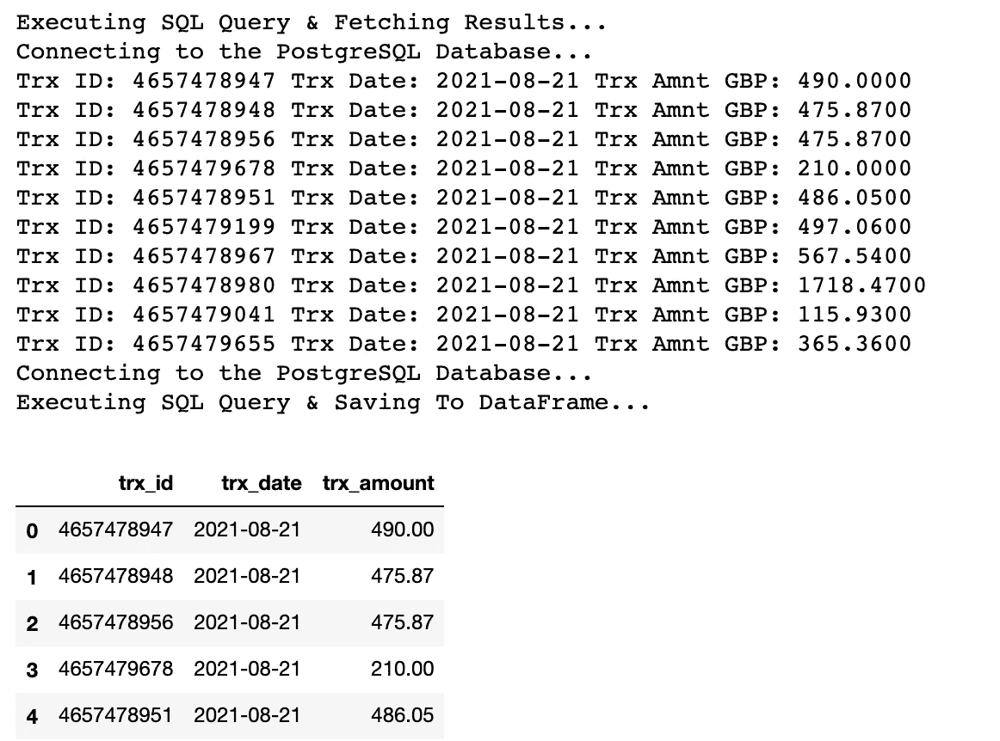

# 如何使用 SSH 隧道通过 Python 连接到 PostgreSQL 数据库

> 原文：<https://towardsdatascience.com/how-to-connect-to-a-postgresql-database-with-python-using-ssh-tunnelling-d803282f71e7?source=collection_archive---------3----------------------->

## 了解当需要 SSH 加密时，如何使用 Psycopg2 或 SQLAlchemy 查询 PostgreSQL 数据库。


约翰·施诺布里奇在 [Unsplash](https://unsplash.com?utm_source=medium&utm_medium=referral) 上的照片

你希望在 2022 年成为一名数据工程师并推进你的职业发展吗？看看 [*Udacity 的点播* ***数据工程纳米学位***](https://imp.i115008.net/jWWEGv) *并利用以下 2022 年 2 月特别折扣代码:*

[*** 在 2022 年 2 月**使用代码促销 25** **](https://imp.i115008.net/zaX10r) 在 UDACITY 球场享受高达 **25%的折扣**

# 介绍

Python 至少提供了两种与 PostgreSQL 数据库交互的简单方法:

*   使用`pycopg2`包创建连接
*   通过`sqlalchemy`包发电和发动机。

只要您有有效的凭证，就可以用几行代码建立连接。但是如果你的公司已经实现了 SSH 隧道作为一个额外的加密层呢？

> “这很烦人…现在我需要编写另一个防弹脚本来替换我使用多年的脚本…”

这是我第一次发现 SSH 存在时的想法，我花了一段时间来消化每次我希望查询 PostGreSQL 数据库时必须通过隧道连接的想法，无论是通过 DMBS 还是通过 Python 脚本。

在本文中，我将与您分享我为解决该问题而创建的两个代码片段(一个用于`psycopg2`，另一个用于`sqlalchemy`)。我相信您将能够根据您的具体使用情况修改它们，并在几分钟内连接起来。

但是在开始之前，为什么首先需要 SSH 隧道呢？如何创建 SSH 公钥和私钥？

# **SSH 加密背后的要旨**

创建 SSH 隧道是在客户端和服务器之间建立加密连接的一种方式，可用于转发任何 TCP ( *传输控制协议*)端口。

这意味着使用 SSH 隧道，您可以将本地机器上的端口链接到远程主机上的端口。一旦端口被链接，就可以通过安全的 SSH 连接在本地和远程端口之间交换通信。

例如，SSH 加密经常用于从本地机器访问数据库。这是通过使用 SSH 私有和公共密钥的组合通过 SSH 隧道连接到数据库主机来实现的。

您可以通过在终端中运行以下命令来创建 SSH 密钥对:

```
$ ssh-keygen -t rsa -b 4096 -C “your_name@example.com”
```

这将创建 4096 位长的密钥，使用 RSA 算法来加密和解密消息(或者，您可以使用更高级的`ed25519`算法，如 [Risan Bagja Pradana](https://medium.com/u/2e461f0600bb?source=post_page-----d803282f71e7--------------------------------) 在[本文](https://medium.com/risan/upgrade-your-ssh-key-to-ed25519-c6e8d60d3c54)中所述)。

然后会提示您输入保存密钥的文件(按 enter 键接受默认值)和密钥的密码。

然后，确保您的代理正在运行，并将您的密钥添加到代理中。如果提示输入密码，请输入您刚刚创建的密码:

```
$ eval “$(ssh-agent -s)”$ ssh-add ~/.ssh/id_rsa
```

您应该能够使用`cat`命令在隐藏的`.ssh`文件夹中的两个文件上显示您的私钥和公钥(记住您可以使用`ls -a`命令显示隐藏的文件夹):

```
$ cat ~/.ssh/id_rsa.pub $ cat ~/.ssh/id_rsa
```

现在已经生成了一对密钥，是时候使用它们连接到 PostgreSQL 数据库了。

# 访问数据库凭据

为简单起见，您可以决定将数据库凭证保存在一个 JSON 文件中，如下所示:

```
{“PG_UN” : “your_db_user_name”,
"PG_DB_NAME": "db_name",
“PG_DB_PW” : “your_pw”,
“SSH_PKEY” : “your_ssh_pkey”,
"SSH_HOST" : "111.11.0.111",
"DB_HOST" : "222.22.0.202",
"LOCALHOST" : "333.0.0.3",
"PORT" : "5432"}
```

你可以通过阅读获得它们:

```
creds = json.load(open(“/Users/{USER}/path/db_cred.json”, ‘r’))
```

无论多么方便，将凭证隐藏在本地文件中并不是最佳实践。我建议将它们存储为环境变量，如下文所述:

[](/connect-to-databases-using-python-and-hide-secret-keys-with-env-variables-a-brief-tutorial-4f68e33a6dc6) [## 使用环境变量隐藏您的密码

### 关于如何在使用 Python 连接到数据库时使用环境变量隐藏密钥的教程

towardsdatascience.com](/connect-to-databases-using-python-and-hide-secret-keys-with-env-variables-a-brief-tutorial-4f68e33a6dc6) 

# **使用 Psycopg2 连接到 PostgreSQL】**

现在您可以访问凭证了，是时候尝试用`psycopg2`建立到 PostgresSQL 的连接了。

当涉及到 SSH 隧道时，您需要导入这两个包:

```
import psycopg2 as pg
from sshtunnel import SSHTunnelForwarder
```

然后您可以使用`SSHTunnelForwarder`生成一个隧道并初始化它:

```
ssh_tunnel = SSHTunnelForwarder(
 creds[“SSH_HOST”],
 ssh_username=creds[“PG_UN”],
 ssh_private_key= ‘/Users/Antonello.Benedetto/.ssh/id_rsa’,
 ssh_private_key_password= creds[“SSH_PKEY”],
 remote_bind_address=(creds[“DB_HOST”], 5432)
 )ssh_tunnel.start()
```

最后一步，通过`psycopg2`创建一个标准连接:

```
 conn = pg.connect(
        host=creds[“LOCALHOST”],
        port=ssh_tunnel.local_bind_port,
        user=creds[“PG_UN”],
        password= creds[“PG_DB_PW”],
        database=creds[“PG_DB_NAME”]) 
```

将所有这些放在一起，您最终应该得到一个类似如下的脚本:

要测试您的连接，您可以使用我在下面创建的一个或多个实用函数。特别是:

*   使用`execute_sql_ppg2`，您可以通过传递首选的`query`来执行 SQL 语句；
*   通过`query`和连接对象，你可以用`create_df_from_ppg2`创建一个熊猫数据框架；
*   使用`create_table_ppg2`，你可以通过传递`df`、`conn`、`table_name`和`schema_name`作为参数，在 PostgresSQL 中非常灵活地从熊猫数据帧创建一个表。

例如，通过将下面的`query`传递给前两个函数:

[https://gist . github . com/an bento 0490/21328 DD 7 FD 93 EC 20 c 714 a2 ed 1 df 2 b5 da](https://gist.github.com/anbento0490/21328dd7fd93ec20c714a2ed1df2b5da)

我获得了以下输出:



# 使用 SqlAlchemy 连接到 PostgreSQL

通过`sqlalchemy`访问 PosgreSQL 包含与`psycopg2`完全相同的步骤。唯一的区别是，您现在需要导入:

```
from sqlalchemy import create_engine
from sshtunnel import SSHTunnelForwarder
```

您需要创建引擎对象，而不是创建连接对象:

```
engine = create_engine(‘postgresql://{user}:{password}@{host}:{port}/{db}’.format(
                host=creds[“LOCALHOST”],
                port=ssh_tunnel.local_bind_port,
                user=creds[“PG_UN”],
                password=creds[“PG_DB_PW”],
                db=creds[“PG_DB_NAME”]
                   ))
```

同样，将所有这些放在一起，您会得到:

# **结论**

在本文中，我向您展示了当需要通过 SSH 隧道建立安全连接时，如何通过`psycopg2`或`sqlalchemy`连接到 PostgreSQL 数据库。

如果这是您第一次被要求在工作场所使用这种方法，我希望这篇文章提供了足够的上下文，以及打破最初的技术障碍所必需的代码。

相反，如果你熟悉 SSH 转发，我希望你会尝试使用我的代码作为模板，以刷新你的记忆，并完成工作:D

# 给我的读者一个提示

*这篇文章包括附属链接，如果你购买的话，我可以免费给你一点佣金。*