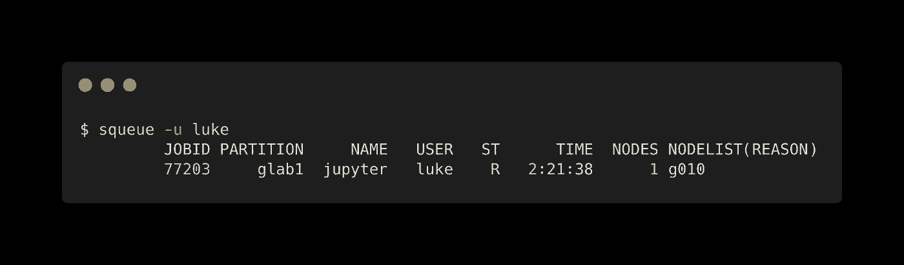
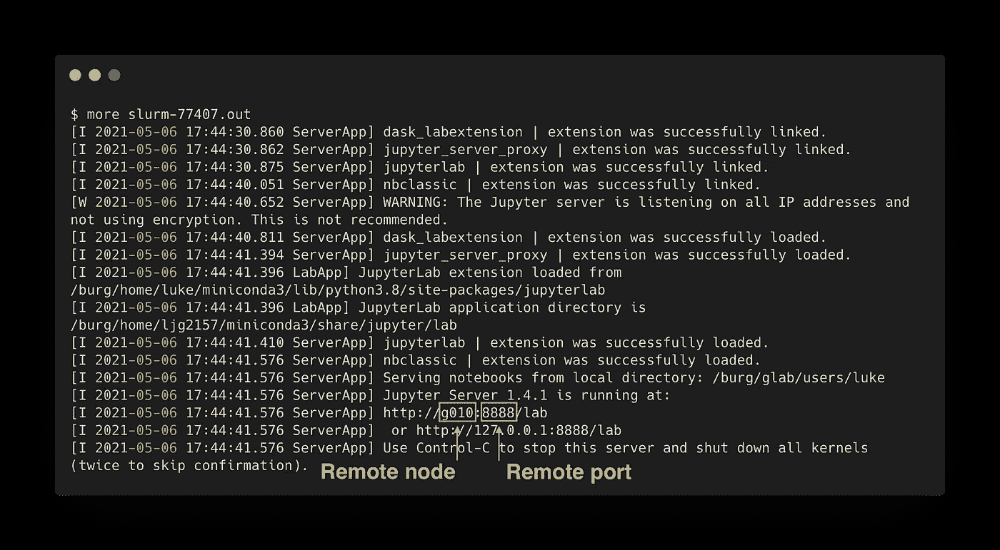
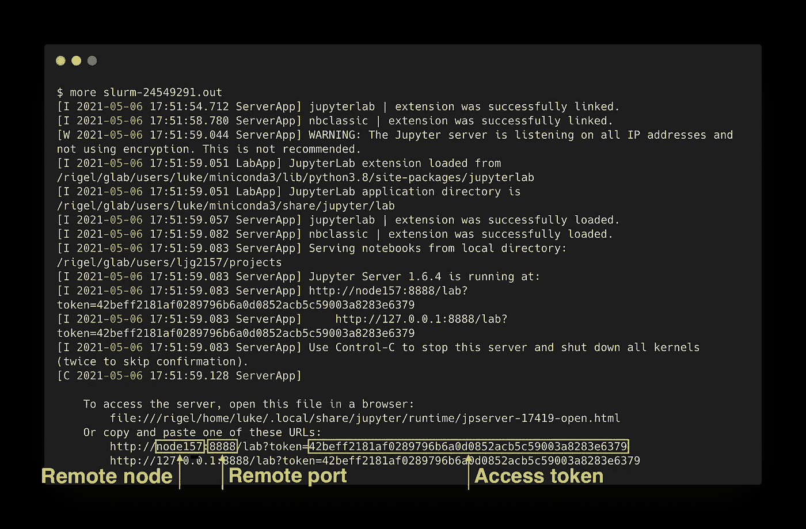

# 如何远程连接到 JupyterLab

> 原文：<https://towardsdatascience.com/how-to-connect-to-jupyterlab-remotely-9180b57c45bb?source=collection_archive---------1----------------------->

## 如何在远程计算机上运行 JupyterLab


由[粘土银行](https://unsplash.com/@claybanks?utm_source=medium&utm_medium=referral)在 [Unsplash](https://unsplash.com?utm_source=medium&utm_medium=referral) 上拍摄

Jupyterlab 是一个基于 web 的交互式开发环境(IDE ),用于 Jupyter 笔记本、代码和数据。从笔记本电脑上连接和运行 Jupyterlab 非常简单。您只需在您的终端中键入`jupyter lab`，Jupyterlab 将在您的浏览器中打开，笔记本服务器在您的终端中运行。

如果您想从远程计算机上运行它呢？如果 Jupyterlab 运行在远程计算机上，如何连接到它？这篇文章将带您了解如何在一个 [SLURM](https://slurm.schedmd.com/documentation.html) 集群上启动 Jupyterlab，然后从本地机器上运行的浏览器进行连接。

## **目录**

*   [安装](#0825)
*   [JupyterLab 安全](#bb1c)
*   [在远程计算机上启动 JupyterLab](#0f9c)
*   [端口转发 JupyterLab](#0f3f)
*   在浏览器中打开 JupyterLab
*   [最终想法](#9822)

# 装置

您可以使用 conda、mamba、pip、pipenv 或 docker 安装 JupyterLab。以下命令用于通过 conda 安装。

```
conda install -c conda-forge jupyterlab
```

如果你没有使用 conda，我推荐最小和轻量级的 Miniconda 安装程序。以下是开始使用 conda 和 Miniconda 的说明。

[](https://betterprogramming.pub/how-to-use-miniconda-with-python-and-jupyterlab-5ce07845e818) [## 如何将 Miniconda 与 Python 和 JupyterLab 结合使用

### 从头开始设置极简 Python 环境

better 编程. pub](https://betterprogramming.pub/how-to-use-miniconda-with-python-and-jupyterlab-5ce07845e818) 

# JupyterLab 安全

为了确保其他用户无法访问您的笔记本，Jupyter 笔记本服务器可以包含一个安全密码，

要创建密码，首先需要生成一个配置文件:

```
jupyter server --generate-config
```

运行此命令会在以下位置创建一个配置文件:

```
~/.jupyter/jupyter_server_config.py
```

然后输入以下命令创建服务器密码。

```
jupyter server password
```

输入密码后，散列版本将被写入`~/.jupyter/jupyter_server_config.json`。如果散列版本是公共的，这是可以的。

现在 JupyterLab 是安全的，您将能够使用密码登录。

# 在远程计算机上启动 JupyterLab

既然 JupyterLab 已经安装并安全，让我们使用下面的脚本在集群的计算节点上启动它。我使用的是 SLURM 调度程序，但这可以很容易地适用于其他调度程序，如 [PBS](https://www.openpbs.org/) 。只需将 sbatch 指令(`#SBATCH`)更改为 PBS 指令(`#PBS`)。

良好的做法是将脚本存储在高性能计算机(HPC)的主目录中。我更喜欢把它们留在`~/scripts/`。因为这是一个 sbatch 脚本，所以我们不需要像使用 shell 脚本那样使它可执行。

您可以向集群提交作业，如下所示:

```
sbatch ~/scripts/launch_jupyter.sh
```

SBATCH 指令定义要收费的帐户、作业名称、运行作业的时间以及请求的内存。解释 SBATCH 指令超出了本教程的范围。你可以在这里了解更多。

行`source activate base`激活我想使用的 conda 环境。这可以在 JupyterLab 中更改为不同的内核。如何把 conda 环境做成内核在[这篇文章](https://betterprogramming.pub/how-to-use-miniconda-with-python-and-jupyterlab-5ce07845e818)中讨论。

`jupyter lab`命令有几个重要的标志:

*   `--no-browser` →告诉服务器不要打开浏览器。
*   `--ip “*”` →配置笔记本电脑服务器监听所有网络接口，而不仅仅是默认接口`localhost/127.0.0.1`
*   `--notebook-dir /burg/glab/users/luke` →告诉 JupyterLab 打开这个目录。

最后，一旦您的作业开始，服务器输出将流到`SLURM-<JOBID>.out`，其中 JOBID 是这个作业的惟一编号。作业 ID 显示在作业状态中。

## 工作状态

您可以使用以下命令在 SLURM 集群上检查您的`launch_jupyter.sh`作业的状态:

```
squeue -u <username>
```

下面是运行此命令后的输出示例。



以下是`squeue`输出中每一列所代表的内容:

*   **作业 ID:** 这是作业
    的 ID【如果你想取消作业，你需要这个:`scancel JOBID`
*   **分区:**这是哪个用户账户被收费
    【由`#SBATCH --account=ACCOUNT`定义】
*   **名称:**这是队列
    [定义者:`#SBATCH -J NAME` ]中的作业名称
*   **用户:**这是拥有该作业的用户
*   T21:这就是这份工作的现状。r 表示跑步
*   **时间:**这是 long 已经运行了多长时间
    【最大运行时间由:`#SBATCH --time=01:00:00`定义】
*   **节点:**这是您正在为此作业使用的节点数量
    [可以用指令定义:`#SBATCH -n NODES` ]
*   **节点列表:**这是作业正在哪个节点上运行。这一会儿会有用的。

## 状态代码

`squeue`可以列出几个[状态代码](https://slurm.schedmd.com/squeue.html#lbAG)。运行 JupyterLab 时，您只需要注意几个方面:

*   待定(`PD` ) →作业正在等待资源分配。它最终会运行。
*   正在运行(`R` ) →作业当前被分配到一个节点并正在运行
*   失败(`F` ) →作业因非零退出代码而终止，无法执行。
*   暂停(`S` ) →正在运行的作业已经停止，其核心被释放给其他作业
*   已停止(`ST` ) →正在运行的作业已停止，但其核心仍保留。

## 关键错误:"运行时目录"

此错误曾是在群集上运行 JupyterLab 时出现的问题，但现在已得到解决。但是，如果您遇到这个错误，修复它的方法是将下面一行添加到您的`launch_jupyter.sh`脚本中:

```
export XDG_RUNTIME_DIR=""
```

# 端口转发联合实验室

首先，我们需要知道 Jupyterlab 运行在哪个端口上。这很可能是端口 8888。如果想确定，就看`slurm_<JOBID>.out`吧。下面是`more slurm-77407.out`的输出，我用黄色突出显示了远程节点和端口。您也可以对“http”使用`grep`来提取这一行



现在，您可以像这样连接到此端口:

```
ssh -L 8888:g026:8888 luke@burg.rcs.columbia.edu
```

前半部分指定端口转发，后半部分指定远程主机上的用户。

```
ssh -L local_port:remote_node:remote_port user@remote_host
```

你必须让它在你的终端上运行。你可以在`screen`或`tmux`运行这个，只是不要忘记它。

# 在浏览器中打开 JupyterLab

输入您的密码后，您将能够从本地网络浏览器打开 Jupyterlab。在本例中，我们在本地端口 8888 上打开它，因此我们在 web 浏览器中键入以下内容:

```
https://localhost:8888
```

这将在您的浏览器中打开 Jupyterlab，但是命令将执行您的远程 HPC。

## 密码不起作用？

我强烈推荐用密码保护你的服务器，在[**JupyterLab security**](#bb1c)一节中有描述。如果您的密码不起作用，或者您选择不设置密码，那么您可以输入一个访问令牌。这个令牌显示在`SLURM-<JOBID>.out`中。见下面截图。



通过查找包含“token”的行，您可以使用 grep 访问该行。

```
grep token slurm-<JOBID>.out
```

# 最后的想法

我喜欢在 JupyterLab 工作，尤其是当我制作数字和做一些探索性分析的时候。我也喜欢在 HPC 上工作，它提供了比我的笔记本电脑更大的存储空间，并且可以访问计算节点来处理大数据。我希望这篇文章能帮助你远程连接 JupyterLab。

随着 [JupyterHub](https://jupyterhub.readthedocs.io/en/stable/index.html) 获得更广泛的采用，这个繁琐的过程有望被淘汰。JupyterHub 提供了一种为多个用户提供 Jupyter 笔记本的方式，这在 HPC 上尤其有用。然而，它还没有被广泛采用。所以在那之前，我们必须保持端口转发。

如果您在连接远程计算机时遇到问题，请告诉我，我很乐意帮助您解决问题。

*感谢阅读和支持媒体作者*

[](https://lukegloege.medium.com/membership) [## 通过我的推荐链接加入 Medium—Luke Gloege 博士

### 作为一个媒体会员，你的会员费的一部分会给你阅读的作家，你可以完全接触到每一个故事…

lukegloege.medium.com](https://lukegloege.medium.com/membership)