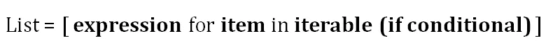
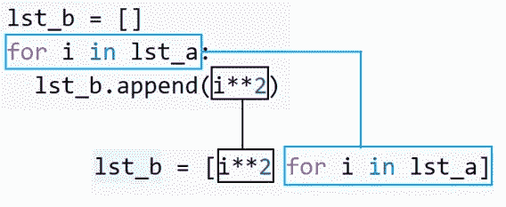
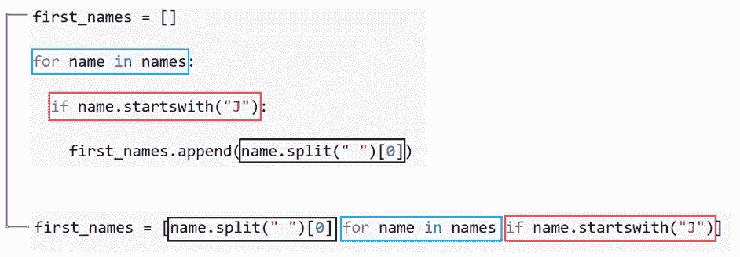

# 如何在 Python 中将循环转换成列表理解

> 原文：<https://towardsdatascience.com/how-to-convert-loops-to-list-comprehension-in-python-15efcc696759?source=collection_archive---------10----------------------->

## 做同样的事，但要更快


照片由[阿齐兹·阿查基](https://unsplash.com/@acharki95?utm_source=unsplash&utm_medium=referral&utm_content=creditCopyText)在 [Unsplash](https://unsplash.com/s/photos/change?utm_source=unsplash&utm_medium=referral&utm_content=creditCopyText) 上拍摄

列表理解用于创建基于可重复项的列表。它还可以被描述为用更简单、更吸引人的语法来表示 for 和 if 循环。列表理解相对来说比循环要快。

列表理解的语法其实很容易理解。然而，当涉及到复杂和嵌套的操作时，弄清楚如何构造一个列表理解可能会有点棘手。

在这种情况下，首先编写循环版本可以更容易地编写理解列表的代码。我们将通过几个例子来演示如何将循环语法转换成列表理解。



列表理解的基本结构(图片由作者提供)

让我们从一个简单的例子开始。我们有一个 5 个整数的列表，想要创建一个包含每一项的平方的列表。下面是执行此操作的 for 循环。

```
lst_a = [1, 2, 3, 4, 5]lst_b = []
for i in lst_a:
   lst_b.append(i**2)print(lst_b)
[1, 4, 9, 16, 25]
```

同一任务的列表理解版本:

```
lst_b = [i**2 for i in lst_a]print(lst_b)
[1, 4, 9, 16, 25]
```

我们已经注意到列表理解是如何简化语法的。它是一个强大的一行程序。下图说明了这种转换。



(图片由作者提供)

列表理解从最后一个操作开始。然后，我们放置定义 for 循环的线。

列表理解中的运算可能比单一的数学运算更复杂。考虑下面的名字列表。

```
names = ["John Doe", "Jane Doe", "Mike Fence"]
```

我们希望创建一个只包含名字的列表。下面是完成此任务的循环:

```
first_names = []
for name in names:
   first_names.append(name.split(" ")[0])print(first_names)
['John', 'Jane', 'Mike']
```

我们首先在空格字符处拆分名称字符串，然后取第一个单词。将这个循环转换为列表理解与前面的例子非常相似。

```
first_names = [name.split(" ")[0] for name in names]print(first_names)
['John', 'Jane', 'Mike']
```

我们也可以在列表理解中放置条件语句。让我们重复前面的例子，但有一个条件。名字列表将只包含以字母 j 开头的名字。

```
first_names = []
for name in names:
   if name.startswith("J"):
      first_names.append(name.split(" ")[0])print(first_names)
['John', 'Jane']
```

我们使用`startswith`方法来应用期望的条件。相同的条件被添加到如下的列表理解中。

```
first_names = [name.split(" ")[0] for name in names if name.startswith("J")]print(first_names)
['John', 'Jane']
```

下图演示了这种转换。



(图片由作者提供)

我们把最后的操作放在列表理解的开头。然后，我们按照彩色框的指示，从上到下进行操作。

如果你遵循这个逻辑，你可以很容易地将复杂的循环转换成列表理解。让我们以一个稍微复杂一点的例子来结束。考虑下面的 3 个列表。

```
lst_a = [[4,3,5], [1,5,3,8], [1,6,2,4]]
```

我们希望创建一个新列表，包含嵌套列表中所有大于 3 的数字。

```
mylist = []for lst in lst_a:
   for item in lst:
      if item > 3:
         mylist.append(item)print(mylist)
[4, 5, 5, 8, 6, 4]
```

执行此任务的列表理解是:

```
mylist = [item for lst in lst_a for item in lst if item > 3]
```

虽然这个循环比前几个循环更复杂，但将其转换为列表理解的逻辑是相同的。

它从循环中的最后一个操作开始。然后，我们沿着从上到下的循环。循环中的每一行在理解中都是连续的。

## 结论

一般来说，列表理解比循环更快。它通过将整个列表加载到内存中来提高速度。

当处理大型列表(例如 10 亿个元素)时，这种方法有一个缺点。这可能会导致您的计算机崩溃，由于内存需求的极端数额。

对于这种大型列表，更好的替代方法是使用一个生成器，它不会在内存中创建大型数据结构。生成器在项目被调用时创建它们。

感谢您的阅读。如果您有任何反馈，请告诉我。