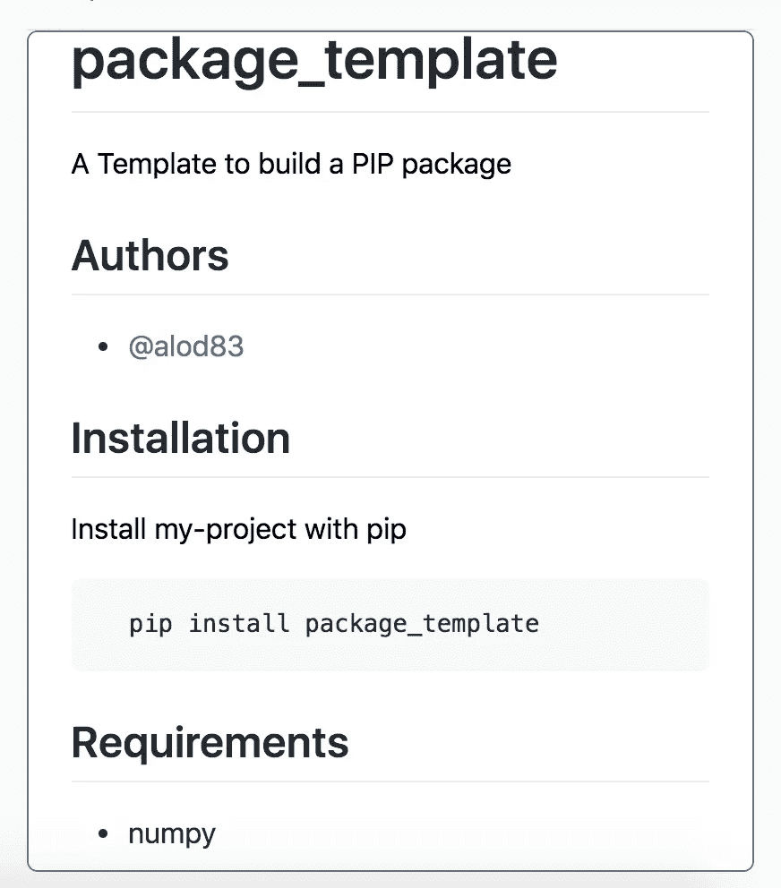

# 如何将您的 Python 项目转换成可通过 pip 安装的包

> 原文：<https://towardsdatascience.com/how-to-convert-your-python-project-into-a-package-installable-through-pip-a2b36e8ace10?source=collection_archive---------5----------------------->

## 编码教程，Python 基础

## 包含现成模板的教程，描述了如何将 Python 项目转换为 Python 包索引中可用的包。


克劳迪奥·施瓦茨在 [Unsplash](https://unsplash.com?utm_source=medium&utm_medium=referral) 上拍摄的照片

当你创建一个新的 Python 项目时，你可能不得不重用一些以前的代码，这些代码已经被很好地组织了。因此，您可以将之前组织良好的代码转换成一个包。

> Python 包是一个实现某些东西的库，它不仅可以被你在下一个项目中利用，也可以被整个社区利用。

一个包应该被**很好地记录**，以便其他人可以利用它。出于这个原因，每个类或方法都应该通过 docstrings 进行文档化，正如这篇非常有趣的文章中所解释的那样。

在本教程中，我描述了如何将一个简单的 Python 项目转换成一个包，可以在 Python 包索引中找到。

项目的模板可以从这个库下载。

# 组织源文件

从代表包名的根目录(`package_template`)开始，源文件应该位于名为`src`的目录中:

```
package_template/
└── src/
    └── package1/
    |   ├── __init__.py
    |   └── p1.py
    └── package1/
        ├── __init__.py
        └── p2.py
```

`src`文件夹可能包含一个或多个子文件夹，每个子文件夹代表一个包。在上面的模板中，有两个包，`package1`和`package2`。每个包必须包含一个名为`__init__.py`的空文件，它只是告诉 Python 该文件夹包含可以包含到其他脚本中的脚本。此外，每个文件夹必须包含所有需要的 Python 文件。

在所考虑的示例中，`package1`包含一个名为`p1.py`的文件，该文件实现了一个虚拟函数，该函数计算作为参数传递的一个数字和该函数生成的一个随机数之间的和:

```
from numpy.random import seed
from numpy.random import randdef p1_sum(a, s = 1):
   seed(s)
   b = rand(1)
   return a + b
```

`p1_sum()`功能接收以下参数作为输入:

*   `a : float or int` —要求和的第一个数字
*   `s : int` —用于生成随机数的种子

第二个包，即`package2`包含一个名为`p2.py`的文件，它实现了一个类似的名为`p2_diff()`的函数，该函数返回作为参数传递的两个数字之间的差:

```
def p2_diff(a,b):
   return a-b
```

当您将安装整个软件包时，您将能够将`p1_sum()`函数包含到如下脚本中:

```
from package1.p1 import p1_sum
```

# 创建打包文件

现在，我可以向我的项目添加将它转换成库所需的文件。在根目录中，我应该至少添加以下文件:

*   README.md —文档的基本文件。该文件的内容将显示在 Python 包索引网站下的包主页中。
*   许可证—发布软件包所依据的许可证。
*   `pyproject.toml` —包含指令的配置文件，告诉 build 和 pip 构建项目需要什么。
*   `setup.cfg`—[setup tools](https://packaging.python.org/key_projects/#setuptools)用来构建包的配置文件。该文件包含关于作者、包版本以及其他被利用的包依赖项的信息。

## README.md

README.md 文件包含使用标记语言编写的软件包的基本文档。通过这个非常有用的[在线工具](https://readme.so/)可以快速构建。

下面是一个非常基本的 README.md 文件:

```
# package_template
A Template to build a PIP package## Authors- [[@alod83](http://twitter.com/alod83)]([https://www.github.com/alod83](https://www.github.com/alod83))## InstallationInstall my-project with pip```bash
  pip install package_template
```## Requirements* numpy
```

其呈现如下:



自述示例(图片由作者提供)

## 许可证

[许多许可证](https://en.wikipedia.org/wiki/Software_license)是为了发布软件而存在的。最常见的**自由**和**开放**许可类型包括:

*   **公共领域许可证**，授予所有权利
*   许可许可证，授予使用权，包括重新许可的权利。这一类别包括麻省理工学院和阿帕奇许可证
*   保护性许可证，如 GPL，授予使用权，但禁止所有权。

## pyproject.toml

如前所述，该文件包含构建包的指令。以下代码片段显示了 pyproject.toml 文件的一个非常基本的示例:

```
[build-system]requires = [
   "setuptools",
   "wheel"
]build-backend = "setuptools.build_meta"
```

`require`变量指定了构建包所需的库。这不包括包所利用的库(即在单个脚本中导入的库)。

前面的例子指定了用于构建包的机制是`setuptools`。

## setup.cfg

以下代码片段显示了`setup.cfg`文件的一个基本示例:

```
[metadata]name = package_template_YOUR-USERNAME-HERE
version = 0.0.1
author = Name Surname
author_email = author@example.com
description = A package template
long_description = file: README.md
long_description_content_type = text/markdown
url = [https://github.com/alod83/package_template](https://github.com/alod83/package_template)
project_urls =
Bug Tracker = https://github.com/alod83/package_template/issuesclassifiers =
Programming Language :: Python :: 3
License :: OSI Approved :: MIT License
Operating System :: OS Independent[options]
package_dir =
= srcpackages = find:
python_requires = >=3.6
install_requires =
   numpy
```

`metadata`部分包含一些基本信息，关于包的名称、作者、版本和其他类似的东西。为了发布软件包的新版本，可以更改本节中的版本号。

选项部分包含关于 Python 版本(在上面的例子中是 3.6 以上)和依赖项(由关键字`install_requires`标识)的信息。

更多详情，关于`setup.cfg`文件，可以查看[本页](https://setuptools.readthedocs.io/en/latest/userguide/declarative_config.html)。

# 生成分布

现在我可以生成分布了。我必须安装`build`软件包，如果我还没有安装的话:

```
pip install build
```

安装完成后，我进入包的根目录，并运行以下命令:

```
python -m build
```

此操作可能需要一些时间。完成后，一个新目录出现在我的本地根目录中，名为`dist`，包含两个主要文件:

```
package_template-YOUR-USERNAME-HERE-0.0.1.tar.gzpackage_template_YOUR_USERNAME_HERE-0.0.1-py3-none-any.whl
```

# 将包上传到测试 PIP 存储库中

这个包已经准备好部署在官方的 PIP 存储库中了！然而，在部署它之前，我强烈建议在测试 PIP 存储库中测试它，它不是官方的存储库，而只是一个测试库。

首先，我必须在测试存储库中创建一个新帐户，遵循[这个链接](https://test.pypi.org/account/register/)。创建并激活新帐户后，我可以登录您的个人资料并生成令牌。我必须把这个令牌保存在别处，因为你再也看不到它了。

现在，我已经准备好上传测试存储库中的包了。我安装了`twine`包，它将用于上传:

```
pip install twine
```

然后，我输入我的包目录的根目录，并运行以下命令:

```
python -m twine upload --repository testpypi dist/*
```

该命令将提示输入用户名和密码。使用`__token__` 作为用户名和您的令牌作为密码。

该过程完成后，会出现一个 URL，指定软件包的安装位置。

# 安装已部署的包

在安装新部署的包之前，我强烈建议您创建一个虚拟 env。您可以按照这个[快速教程](/have-you-ever-thought-about-using-python-virtualenv-fc419d8b0785)来构建一个新的虚拟 env。

可以通过以下命令安装部署的软件包:

```
python3 -m pip install --index-url https://test.pypi.org/simple/ --no-deps package_template
```

现在，您可以创建一个新的 Python 脚本来利用新部署的包:

```
from package1.p1 import p1_summy_sum = p1_sum(3)
print(my_sum)
```

# 最终部署

一旦测试了包的正确性，我就可以把它上传到 Python 包索引库中。

> 我必须选择一个原始名称，这将是我的包的正式名称！

我必须注册官方 [Python 包索引网站](https://pypi.org/)。然后，我从我的包的根目录运行以下命令:

```
python3 -m twine upload dist/*
```

我输入**我的凭证**并按回车键。一旦这个过程完成，这个包就可以被世界上的每个人安装了:)

# 摘要

在本教程中，我在 Python 包索引中演示了如何将 Python 项目转换成可供所有 Python 社区使用的 Python 包。

过程非常简单:将项目文件夹组织成给定的结构并运行一些简单的 Python 命令来构建发行版就足够了。

你可以关注我的新网站:[提示&数据科学技巧](https://alod83.altervista.org/)。

# 相关文章

</how-to-quickly-build-a-readme-file-in-github-8886b98ef95a>  </have-you-ever-thought-about-using-python-virtualenv-fc419d8b0785>  <https://medium.com/geekculture/the-top-25-python-libraries-for-data-science-71c0eb58723d>  

# 参考

 