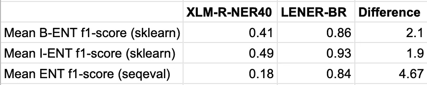

# 如何用多种语言掩饰

> 原文：<https://towardsdatascience.com/how-to-cover-up-in-multiple-languages-fe9cb4e9e39a?source=collection_archive---------25----------------------->

## [思想和理论](https://towardsdatascience.com/tagged/thoughts-and-theory)

## **应用多语言命名实体识别模型进行匿名化**


照片由来自[像素](https://www.pexels.com/photo/globes-arranged-in-a-shelf-8926539/?utm_content=attributionCopyText&utm_medium=referral&utm_source=pexels)的[第三人](https://www.pexels.com/@thirdman?utm_content=attributionCopyText&utm_medium=referral&utm_source=pexels)拍摄

在我之前的[帖子](/unlocking-inclusivity-possibilities-with-polyglot-ner-9990baf03561)“用 Polyglot-NER 开启包容性的可能性”中，我介绍了 Polyglot 命名实体识别(NER)及其在文档匿名化中的应用。在本系列的第二部分中，我将:

*   概述匿名化问题
*   讨论我在上一篇文章中介绍的两个模型
*   展示 NER 评估的不同方法及其缺点
*   介绍应用多语言 NER 模型对巴西葡萄牙语法律文本进行匿名化的实验结果

在线提供的预先训练的多语言模型的进步是令人兴奋的。这可能会让人认为，对于任何任务和任何语言，都很容易找到适合您需求的模型。但事实并非总是如此！我们将在这篇博文中检验这一点:我们将采用一个预先训练的多语言模型，并将其与法律领域中预先训练的单语模型进行比较。

**问题**

像大多数 NLP 应用程序一样，NER 模型主要是在英语语言上训练的。另一方面，多语言模型是适用于多种语言的模型。这些模型有时被称为*跨域*模型，其中*域指的是*语言域。但是单词“域”在 NLP 中也可以有不同的含义，它可以指一种类型的文本。在 NLP 中，我们不仅有许多语言，而且还有许多领域。

这篇博文中的实验测量了一个多语言模型切换到这些其他类型的域的能力。我们采用一种在一般领域训练的多语言模型，并将其应用于法律领域。

**型号:单语和多语言**

在我之前的文章中，我介绍了两个模型:

*   单语模型:LENER-BR [1]
*   一个多语言模型:XLM-R-NER40 [2]

选择单语模型是因为它带有巴西葡萄牙语数据集，这是 NLP 研究中不常见的语言。正是我们要找的！选择这种多语言模式是因为:

*   它可以处理葡萄牙语(和 39 种其他语言)
*   实现在 Huggingface [3]上
*   就性能而言，它是最好的多语言机型之一

因为这个模型是贴在 Huggingface 上的，所以很容易应用。原则上，这很简单:

```
from transformers import pipeline

nlp_ner = pipeline(
    "ner",
    model="jplu/tf-xlm-r-ner-40-lang",
    tokenizer=(
        'jplu/tf-xlm-r-ner-40-lang',  
        {"use_fast": True}),
    framework="tf"
)
```

现在你已经准备好用 40 种语言表演 NER 了！

XLM-R-NER-40 已经在葡萄牙语的通用领域进行了测试。所以，我们不想再这样做了！相反，我们正在法律领域进行测试。Plu 报告了以下分数[3]:


Plu 报告的葡萄牙语分数[3]

我们将多语言模型应用到单语模型的数据集。这是一个不同的数据集，而不是计算 Plu 提供的分数的数据集。[3]

**评估**

NER 模型用于预测文本中的实体，实体可能是隐私敏感的。如果我们想编辑这些敏感的实体，我们可以使用 NER 模型。

匿名化文档时，不管实体类型如何，都有三种可能的结果:

*   模型编辑过度，意味着我们编辑了太多的令牌
*   模型编辑不足，意味着我们编辑的令牌太少
*   这个模型编辑得很完美😊

一个好的评估方法可以量化一个模型在这三种结果中的表现。在我们进一步讨论之前，我们需要谈谈 IOB (Inside-Outside-Beginning)格式，这是注释命名实体最常用的格式。

通常，实体分布在多个令牌上。记号表示一个单词，或者在标点符号的情况下表示一个字符。让我们看看数据集中的一个实体:“高级军事法庭”。


IOB 格式的示例，图片由作者提供

在上图中，我们看到了第一个示例实体的原始标签和转换标签。顶部标签是原始标签，对于第二个实体，除了起始标签不同之外，转换是相同的。

在这个例子中有两种不同的实体类型:一个组织和一个人。然而，在我们的实验中，我们使用的是二元方法，我们对实体类型不感兴趣，只对实体是否存在感兴趣。我们决定采用这种方法，因为原始数据集的类比 XLM-R-NER40 模型的训练类多。

当我们想要分类单个 NE 时，有三种可能的结果:

*   该模型没有预测任何令牌是实体
*   该模型正确地预测了实体的开始和结束
*   模型正确预测了部分标记，但开头和/或结尾不匹配

让我们看一个虚构的句子，这样我们可以考虑使用 NER 匿名的一些复杂性。

考虑一下这个虚构的句子:

"联邦调查局发现比尔·克林顿在芝加哥的万豪酒店偷了一个公文包。"

当我们使用我们的模型来匿名化这个句子时，结果可能看起来像:

“在 **X** 的 **X** 处， **X** 发现 **X** 克林顿偷了一个公文包。”

好吧，我们正确地预测了 5 个实体标记中的 4 个，但是我们的系统有多大用处呢？我们完全匿名了这个文档吗？我们的模型有 80%的效率吗？这是一个很难回答的问题。

并非每个实体都具有相同的权重，这在上面的例子中显而易见。如果单词“芝加哥”而不是“克林顿”被错误归类，我认为这个句子最好匿名。某些实体比其他实体更敏感的事实在任何当前的 NER 评估中都没有得到体现。可以考虑的是一个模型完全预测的实体数量，我们将在本文后面看到。

我们实验使用的数据来自 LENER-BR 数据集，可以在他们的[报告](https://github.com/peluz/lener-br)中找到。我使用了他们测试集中的三个文档。

首先让我们看看不考虑 IOB 的模型的准确性。

假设我们的文档包含 1000 个令牌。每个令牌都有自己的标签，这样我们总共有 1000 个标签。可能的标签是“ENT”和“O”。我们通过将每个预测与其对应的标签进行比较来评估模型，以查看它们是否相同。这叫精准。

当在其中一个测试文档(ACORDAOTCU11602016)上评估两个 NER 模型时，我们得到以下准确度分数:

*   LENER-BR: 0.991
*   XLM-NER 比率:0.866

乍一看，我们发现 LENER-BR 的表现比 XLM-R 好得多。但这是否意味着 LENER-BR 在匿名化文档方面有 99%的成功率，而 XLM-R 只有 87%的成功率？

为了回答这个问题，我们首先来看一个基线模型。假设我们有一个总是预测“O”作为标签的模型。承认这是一个愚蠢的模型，我强烈建议不要使用它。然而，它确实让我们洞察到训练模型的附加值是什么。对于这个模型和测试文档，准确性分数是:

*   多数基线:0.857

这些结果并不令人惊讶，因为文本中的大多数单词都不是新词。在一些文档中，只有 1%的标记是 ne，所以在这样的文档中获得 99%的准确率是非常容易的，但是没有用。在我们的实验中，准确性不是评价 NER 的有用指标。我们需要看看通常的嫌疑人，精度，召回，和 F1。因为这些指标提供了更多关于我们绩效的信息。例如，可能有很高的准确率，但在召回率和精确度上得分很低。

我们可以使用 Sklearn[4]中的分类报告函数来获得精确度、召回率和 F1 分数。我们来看文档 ACORDAOTCU11602016 的报告:


两个模型的分类报告，按作者分类的图像

精度告诉我们当模型说它是 X 时，它实际上是 X 的频率。召回告诉我们系统“捕获”了多少 X。虽然这份报告对于评估 NER 来说并不完美，但它比使用准确度得分提供了更多信息。例如，XLM-R-NER40 在 B-ENT 和 I-ENT 上的性能差异告诉我们，与属于一个实体的其他令牌相比，该模型在识别一个实体的开头时有更多的困难。它告诉我们，XLM-R-NER40 只在 34%的时间里捕捉到实体的开始。

到目前为止讨论的所有指标都适用于单个令牌，而不是多令牌实体。对于正确的匿名化，识别完整的多令牌实体(例如“Bill Clinton”)的能力是最重要的，幸运的是，seqeval [5]包可以为我们测量这一点。它产生一个分类报告，就像 sklearn 一样，但是要严格得多。这也有它的缺点。让我们看看下面这个由两个短句组成的例子:

```
gold_label = [
[‘B-ENT’, ‘O’, ‘O’, ‘O’, ‘O’], 
[‘O’, ‘O’, ‘B-ENT’, ‘I-ENT’, ‘I-ENT’, ‘O’, ‘O’]
]predictions = [
[‘B-ENT’, ‘I-ENT’, ‘O’, ‘O’, ‘O’],
[‘O’, ‘O’, ‘B-ENT’, ‘I-ENT’, ‘O’, ‘O’, ‘O’]
]
```

我们有两个句子，两个句子中都有一个实体。在示例(1)中，第一个实体是“预测过度”，而在示例(2)中，该实体是“预测不足”。当我们将 seqeval 应用于这些示例时，我们得到:


两个示例的 seqeval 评分，图片由作者提供

哎唷，根据报告，我们做的和只预测‘O’一样糟糕。如前所述，seqeval 测量我们正确预测整个多令牌实体的次数。我们已经可以看到在我们的实验中使用它的一些缺点，因为说只预测“O”和上面的预测一样好是不完全公平的。

**结果**

鉴于每种方法的缺点，我将展示 seqeval 和 sklearn 报告。为了得到要点，你可以直接跳到*结果表 4* 。在表 2 中，我们不需要显示宏观/加权平均值，因为它相当于单个类的精度、召回率和 f1 值。


结果表 1:XLM-R-ner 40 的 sklearn 报告，图片由作者提供


结果表 2:LENER-BR 的 sklearn 报告，图片由作者提供


结果表 3:两种模型的 seqeval 报告，图片由作者提供



结果表 4:两种模型的平均 f1 分数，按作者分类的图像

两种类型的分类报告都清楚地表明，单语模型表现得更好。这并不奇怪，因为它是专门为此任务开发的。如果我们查看*结果表 4* ，我们会发现使用 sklearn 评估方法，单语模型的性能是多语言模型的两倍。但是，使用 seqeval 方法，单语模型的性能是 seqeval 方法的 4.5 倍。结果显示了 XLM-R-NER40 模型在法律文本上的局限性。这并不意味着这是一个糟糕的模型，但重要的是要认识到我们可以用开箱即用的模型做的事情是有限的。

**总结&结论**

总而言之，在这篇文章中，我们看到了:

*   域切换的影响
*   我们如何相对容易地在网上找到多语言和单语模型
*   如何通过二值化将通用模型应用于具有更多类别的更具体的领域
*   评估 NER 的困难，尤其是在匿名化的背景下

我们已经看到了域名转换的影响，因为原始域名的原始分数远远高于合法域名的分数。这个实验中使用的两个模型很容易应用并在网上找到，因为其中一个在 Huggingface 上，另一个可以在 GitHub 上找到。我们必须得出结论，把一个多语言模型从盒子里拿出来并应用于任何任务都是有限制的。这说明了两件事，我们仍然需要 ML 工程专业知识，我们需要做更多的工作来创建可以在任何领域、任何语言上工作的模型。这样，任何人都可以用最少的 ML 工程知识来利用这些模型。

对于未来的工作，以特定于匿名化的方式重写评估方法将是有趣的。这将不得不考虑召回比精确更重要，同时仍然考虑过度匿名仍然是不可取的。如果有人真的对将 XLM-R-NER40 用于法律领域感兴趣，那么看看如果该模型针对法律领域进行微调，结果会如何将是很有趣的。

如果你想从我们的人工智能创新团队伙伴关系中了解更多关于更苗条的人工智能和最新研究，请访问我们的[网站](https://www.slimmer.ai/innovation)或我们在 Medium 上的[人工智能创新页面。](https://medium.com/slimmerai/innovation/home)

**参考文献**

[1] Luz de Araujo，P. H .，de Campos，T. E .，de Oliveira，R. R. R .，Stauffer，m .，Couto，s .，& Bermejo，P. (2018)。LeNER-Br:巴西法律文本中命名实体识别的数据集。葡萄牙语的计算处理。斯普林格。doi:10.1007/978–3–319–99722–3 _ 32

[2] Conneau，a .，Khandelwal，k .，Goyal，n .，Chaudhary，v .，Wenzek，g .，Guzmán，f .，…Stoyanov，V. (2019)。大规模无监督跨语言表征学习。arXiv，1911.02116。从 https://arxiv.org/abs/1911.02116v2[取回](https://arxiv.org/abs/1911.02116v2)

[3]jplu/TF-xlm-r-ner-40-郎抱脸。(2021 年 6 月 22 日)。从 https://huggingface.co/jplu/tf-xlm-r-ner-40-lang[取回](https://huggingface.co/jplu/tf-xlm-r-ner-40-lang)

[4]中山博树。(2018).seqeval:一个用于序列标记评估的 Python 框架。

[5]sk learn . metrics . classification _ report。(2021 年 10 月 21 日)。检索自[https://sci kit-learn . org/stable/modules/generated/sk learn . metrics . classification _ report . html](https://scikit-learn.org/stable/modules/generated/sklearn.metrics.classification_report.html)