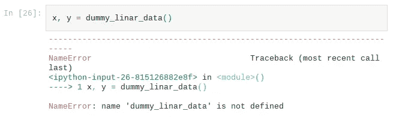

# 如何像专业人士一样破解 Python 错误

> 原文：<https://towardsdatascience.com/how-to-crack-python-errors-like-a-pro-221ac76409af?source=collection_archive---------16----------------------->

## 当您手动破解一个异常时，您成为的开发人员比您修复的更重要。

照片由[克里斯里德](https://unsplash.com/@cdr6934?utm_source=medium&utm_medium=referral)在 [Unsplash](https://unsplash.com?utm_source=medium&utm_medium=referral) 拍摄

Python 是**一种更接近自然人类语言的高级编程语言**。这样做的好处是 Python 代码很容易理解，实现起来也很简单。根据 [2021 堆栈溢出调查](https://insights.stackoverflow.com/survey/2021#section-most-popular-technologies-programming-scripting-and-markup-languages)，48%的开发人员使用它。在未来几年，这一比例肯定会继续增长。

事实上，Python 最初吸引了学者和专业人士，他们使用编码作为一种方法来原型化他们的想法、演示概念和实现概念验证。如今，Python 已经征服了包括 [Devops 脚本](https://engineerbabu.com/blog/what-is-scripting-in-devops/)，机器学习( [NumPy](https://numpy.org/) ， [pandas](https://pandas.pydata.org/) ， [sklearn](https://scikit-learn.org/) ， [Tensorflow](https://www.tensorflow.org/) 和 Web 后端( [Django](https://www.djangoproject.com/) 和 [Flask](https://flask.palletsprojects.com/en/2.0.x/) )在内的众多软件应用领域。

在这篇文章中，我为初学者介绍了一个破解 Python 错误的实用策略，首先展示了这个众所周知的异常`ZeroDivision`的基本策略步骤，这个异常在下面的代码示例中出现。

Python 错误破解步骤举例说明

我们提出的错误破解策略包括三个步骤:(1)滚动直到你到达底部找到错误类型；(2)仔细检查出现在错误类型旁边的内嵌消息，以便理解它是如何发生的；(3)仔细查看函数调用的痕迹，并跟随水平箭头，直到您确定哪一行代码有问题。

[ZeroDivisionError](https://docs.python.org/3/library/exceptions.html?highlight=ZeroDivisionError#ZeroDivisionError) 是一个普遍的异常，它直接指出了根本原因。我们可以把它们看作是特定的异常，比如 [FileNotFoundError](https://docs.python.org/3/library/exceptions.html?highlight=FileNotFoundError#FileNotFoundError) 和 [UnicodeError](https://docs.python.org/3/library/exceptions.html?highlight=UnicodeError#UnicodeError) 。即使是初学者也可以在 StackOverflow(SO)上找到修复它们的代码配方。然而，也有一般的例外，大部分是由于打字错误和赶时间时的粗心大意造成的。尤其是当错误消息中的许多细节与您的应用程序代码有关时，由于可能原因的广泛可变性，googling 这些错误可能会产生误导。

其余段落将为您提供一些常见错误类型的概述和解释。上述破解方法可以更好地解决这些类型的错误。这样，你就可以节省大量阅读其他 SO 用户错误的时间和精力。此外，通过这个过程，您还将更加熟练地调试自己，这将教会您更多关于 Python 语言的知识。

# 语法错误

> 当分析器遇到语法错误时引发。— [Python 官方文档](https://docs.python.org/3/library/exceptions.html?highlight=syntaxerror#SyntaxError)

Python 解析器无法识别正在运行的程序中的标记结构或序列，这将导致语法错误。通常，这是由于缺少或不必要的字符，包括逗号、括号等。

引发的语法错误异常的 Python 代码段

在这个`SyntaxError`的例子中，发生的错误的类型和消息清楚地表明代码语句在语法上是无效的。然而，故障定位的难度在它们之间是不同的。

*   ***第一个单元格:*** 我们看追溯来确定原因(这里，只有一行代码 1)。一个小的垂直箭头指出了这个错误行中语法错误的确切位置。所以，你已经发现了。去掉 for 循环之间的逗号。
*   ***第二个单元格:*** 原来代码行(11)不是出错的那一行，`SyntaxError`是因为第(9)行少了括号。然而，解析器错误地标识了这个位置，因为它期望在那里有一个右括号(而不是一个新的代码语句)，但是它没有找到它。

因此，我们应该从`SyntaxError`的指定位置开始逆向分析代码。如果不遵循这种自底向上的调试技术，您可能会发现自己正在搜索 StackOverflow，寻找与自己的上下文具有相似的关键字、名称和库的语法错误。

# 名称错误

> 找不到本地或全局名称时引发。— [Python 官方文档](https://docs.python.org/3/library/exceptions.html?highlight=nameerror#NameError)

基本上，当开发人员试图使用一个不存在的变量或函数时，就会出现这个错误。

这通常是由于名称拼写错误造成的，例如在上面的例子中，我们将前面代码片段中的函数名称拼写错误。当开发人员忘记首先导入或声明变量/函数时，以及当他未能运行包含底层声明的单元格时，就会发生这种情况。

# 索引错误

> 当序列下标超出范围时引发。— [Python 官方文档](https://docs.python.org/3/library/exceptions.html?highlight=indexerror#IndexError)

简单地说，当开发人员试图访问序列中不存在的单元格(如 list、array 或 dataframe)时，就会遇到这种错误。

正如在所提供的代码示例中可以看到的，与`IndexError`相关联的消息将包含有用的详细信息来排除故障。通常，该消息报告所请求的索引和单元格所属轴的大小。

# 键盘错误

> 在现有键集中找不到映射键时引发。— [Python 官方文档](https://docs.python.org/3/library/exceptions.html?highlight=keyerror#KeyError)

首先，开发人员在试图访问字典或数据帧中不存在的键时会遇到此错误。

看似简单，但我们有时会自动生成这些密钥，密钥的名称对我们来说意义不大。你可以在上面看到这个错误的例子，我在 while 循环中放了错误的条件`i <= n`，而不是`i < n`。

# 属性错误

> 当属性引用或赋值失败时引发。— [Python 官方文档](https://docs.python.org/3/library/exceptions.html?highlight=attributeerror#AttributeError)

每当开发人员试图从导入的对象或模块中访问不存在的变量/函数时，就会出现此错误。

上面的`AttributeError`的例子通过调用`accuracy`而不是`score`说明了 scikit-learn 模型对象的误用。一旦您遇到这种类型的错误，您应该通过检查代码文件或底层库的正式文档来重新验证导入的对象或模块中是否存在该属性。

# 类型错误

> 当操作或函数应用于不适当类型的对象时引发。— [Python 官方文档](https://docs.python.org/3/library/exceptions.html?highlight=typeerror#TypeError)

顾名思义，此错误主要与变量/属性/对象的类型不正确有关。尽管如此，对其进行本地化通常很棘手。

*   ***第一个单元格:*** 错误类型及其伴随的消息极其明确。当我根据 Pandas 数据框中的其他列推断出一个列时，结果回溯包括了 Pandas 库中的许多子模块。因此，明智的做法是忽略熊猫的所有内部功能，专注于我们实际编写的代码部分和代码行。例如，代码行`df['Savings']=df['Income']-df['Expenses']`，我在其中推断出‘Savings’列，在回溯中被标记。要找到根本原因，简单检查一下列的类型就足够了。

> **额外提示:**在检查回溯(步骤 3)时，主要注意你编写的模块中的函数调用。

*   ***第二个单元格:*** 不太直接的类型错误经常出现在函数或构造函数调用中。在这个例子中，我在模型构造函数的一个参数中犯了一个拼写错误。因此，追踪对我们来说用处不大。它只会帮助我们识别潜在的功能或对象。错误的参数关键字会出现在错误消息中。因此，我们需要查看文档或函数的源代码来找到错误并修复它。
*   ***第三个单元格:*** 这里我们在两个 NumPy 数组上调用 concatenate，但是 concatenate 期望一个数组列表被连接，而不是两个单独的参数。这是一个常见的错误，因为 Python 库可能会使用多个参数(即`def func(**args)`)或一个`Iterable`类型的参数(即`def func(args:Iterable)`)来声明处理相同变量类型的条目的函数。显然，错误消息没有说太多，因为解释器没有将变量转换成参数类型。因此，有必要验证官方库文档或底层函数的源代码，以找出根本原因。

# 值错误

> 当操作或函数收到类型正确但值不合适的参数时引发。— [Python 官方文档](https://docs.python.org/3/library/exceptions.html?highlight=valueerror#ValueError)

最后也是最重要的一点，`ValueError`是由一个无效的参数值引起的，它阻止了函数完成任务。

上面的代码示例显示了使用大小不匹配的输入和目标来误用 scikit-learn 模型`fit()`函数。由于模型`fit()`是为处理这种错误而设计的，开发者已经包含了这个异常来提醒用户注意这个问题。否则，一些计算会失败，出现不太明显的异常，或者程序保持沉默，结果会不正确。为了展示开发人员对`ValueError`的预期，让我们通过引发一个`ValueError`来修复本文中的第一个代码示例，当用户将参数 b 赋值为零时，该代码就会出现。下面的代码片段显示了所需的更改。

# 最后的话

我很高兴你坚持到了最后。如果我能最终说服您停止在没有任何预先调试的情况下将整个异常复制粘贴到 Google 和 Stackoverflow 搜索栏中，希望找到一个现成的修复方法，那就好了。通过练习，您将能够快速定位这些错误并在编码过程中修复它们，而不必经历其他人共有的错误。