# 如何用 Excel 制作好看的绘图

> 原文：<https://towardsdatascience.com/how-to-craft-good-looking-plots-with-excel-2f9006a28b7f?source=collection_archive---------17----------------------->

## 在 Excel 中制作好看的图表是不可能的？是的，这就是我用 Excel 创建漂亮图表的方法。

由[米卡·鲍梅斯特](https://unsplash.com/@mbaumi?utm_source=medium&utm_medium=referral)在 [Unsplash](https://unsplash.com?utm_source=medium&utm_medium=referral) 拍摄的照片

对于大多数可视化，我使用像 [Datawrapper](https://datawrapper.de) 或 [Tableau](https://tableau.com) 这样的工具。它们提供了一种或多或少简单的方式来很好地可视化数据。但有时，您不能使用外部工具，可能是因为遵从准则，或者您希望在复杂的报表中重用您的图表。Excel 是大多数公司的标准，许多财务报告都有或多或少漂亮的可视化效果。这给了我一个想法，将 Excel 中的可视化带到 Datawrapper 默认主题的设计级别。说实话，这比我想象的要简单。Excel 能够创建整洁美观的图表。

免责声明:示例图的目的是表明实际数字并不比以前高。这不是关于确切的数字，而是要快速看到进展。它应该回答的问题是:

> 与前几周相比，德国对新冠肺炎感染的实际检测更多吗？

首先，让我们看看想要的结果。这是我用 Datawrapper 创建的折线图，并保存为 PNG 格式。

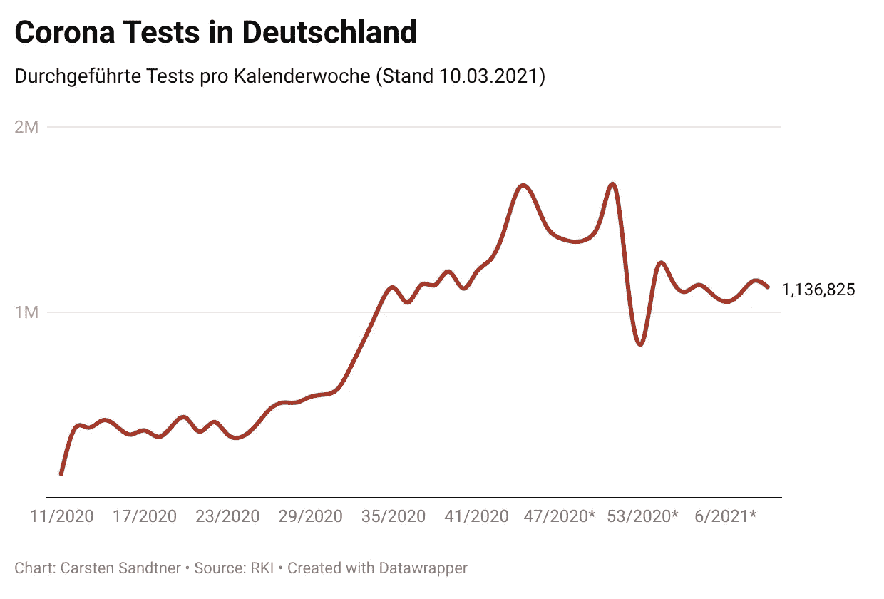

作者图片

当我在 Excel 中使用相同的数据并创建折线图时，我得到了以下默认结果:

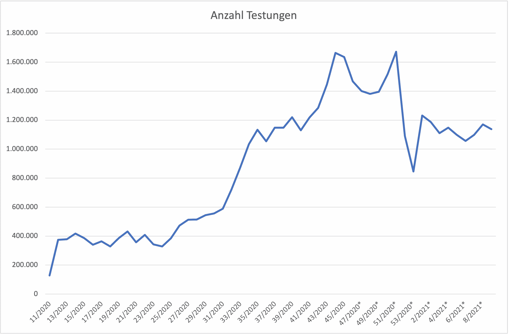

作者图片

一点也不差。然而，它缺乏优雅和清晰。轴标签不好看，标题也相当无爱。

让我们深入了解一下我将默认 Excel 图表转换成设计良好的整洁图表的步骤。

## 清理和格式化轴

第一步是清理 x 轴和 y 轴并简化标签。我已经重新设置了标签的格式，目标是以缩略形式显示大量数据。

双击 y 轴显示每个格式选项。将*边界最小值*设置为 0，将*最大值*设置为 2000000。因为我不需要任何详细的步骤，所以我将*单位主要*和*次要*配置为 1000000。现在我们的 y 轴标签只有 0，10000000 和 2000000。

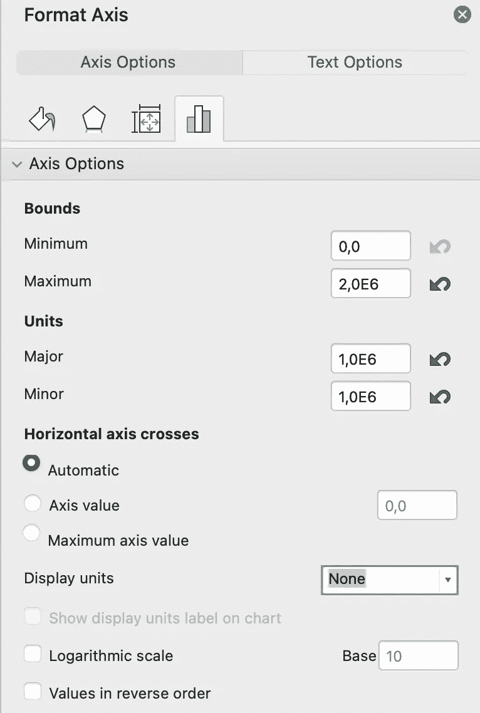

在 Excel 中设置坐标轴格式

老实说，标签太大了，我们需要重新格式化。这就有点棘手了——也许是最棘手的部分。对于缩写，数字必须格式化。转到*格式轴*中的数字部分，添加新的格式代码。我用过`[>0]#.."M";""`。

那里发生了什么？这是条件格式，由两部分组成，用`;`隔开。让我们来分解一下:

1.  `[>0]#.."M"`表示“对于每一个大于 0 的数字，用 m 缩写成百万”
2.  `""`说什么都不加。我用这个来省略基轴的 0。

如你所见，我不喜欢负数。点击“添加”添加格式，y 轴标注干净好看。

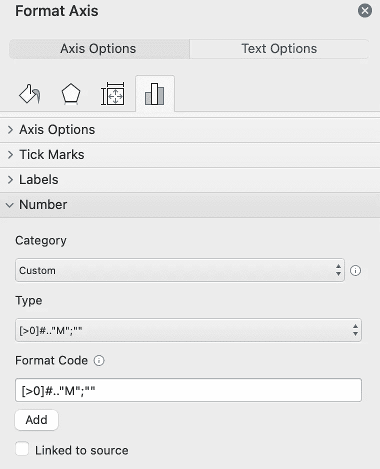

在 Excel 中添加格式代码

现在我们把手放在 x 轴上。在我们最终的剧情中，我们不需要所有的标签。像以前一样，双击 x 轴打开格式选项。要生成类似 Datawrapper 的标签，需要将标签的*特定间隔单位*设置为 6。这意味着仅使用第六个值。

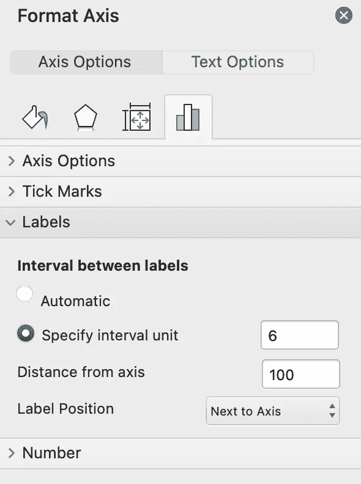

在 Excel 中设置具体的间隔单位

暂时就这样了。稍后当我们调整颜色、字体和线宽时，我们将回到这两个轴。

## 添加注释

我的可视化应该包括行尾最近的数字。选择最近的数据点，点击右键，选择*添加数据标签*。

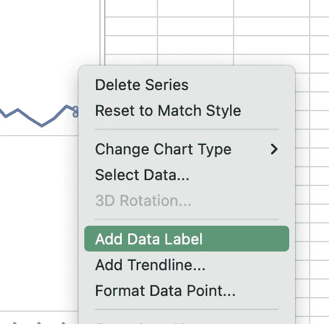

在 Excel 中添加数据标签

标签的位置并不完美。右边没有足够的空间。我们需要缩小图表的尺寸。重要的是选择绘图区，而不是图表区！

缩小尺寸，我们的标签就在数据点旁边。如果没有，就把它移到你想看的地方。我们稍后将格式化字体和颜色。

## 一个漂亮的头球

Excel 中的默认标题很难看。您无法正确格式化它们。没有机会对齐，也没有增加一个子行。这就是为什么我刚刚删除了标题，并添加了两个新的文本区域，分别是标题和副标题。为了给标题留出足够的空间，您可能需要再次调整绘图区的大小。现在只需使用*插入- >文本框*在 Excel 功能区添加一个文本框。

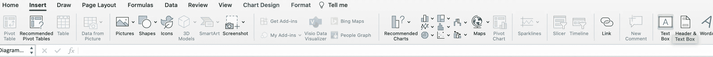

在 Excel 中插入功能区

## 添加一些漂亮的错别字

当我们添加标题时，让我们来谈谈字体大小。对于合适的字体大小，我使用 Type-Scale.com 来了解字体大小对用户的影响。我使用 Roboto 作为字体和以下尺寸。

*   标题: **22**
*   子行: **14**
*   轴标签: **12**
*   页脚: **9**

要设置和调整字体大小，只需点击标签、轴或文本框，并使用 Excel 中*开始*功能区的字体选择器设置您的值。

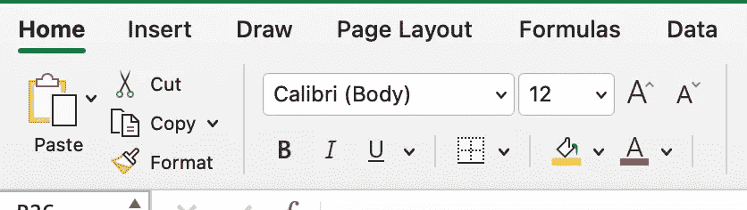

在 Excel 中设置字体、字号和颜色

这同样适用于颜色。我使用`#888888`作为轴标签，使用`#000000`作为标题和副标题。

## 微调

最后，让我们微调可视化。第一步是有一个稍微宽一点的基线。双击 x 轴，选择*填充&线条*，设置*宽度*为 1pt，颜色为`#000000`。

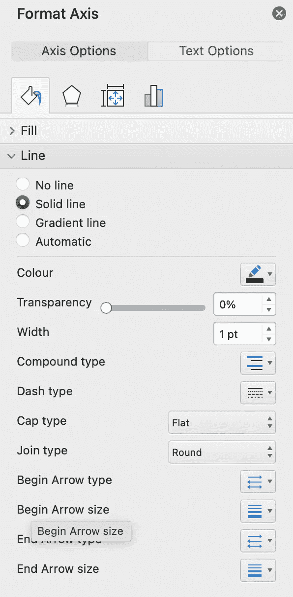

在 Excel 中格式化地块线

此后，我们将 y 标签的线条变亮。双击 *1M* 处的线，将颜色设置为`#D9D9D9`并将*宽度*设置为 0，75pt。

如果你喜欢，你可以把曲线弄圆，调整颜色。再次双击图表的线条，选择*填充&线条* → *线条*并激活*平滑线条*。我已经将线宽设置为 2 磅，颜色设置为`#B92717`

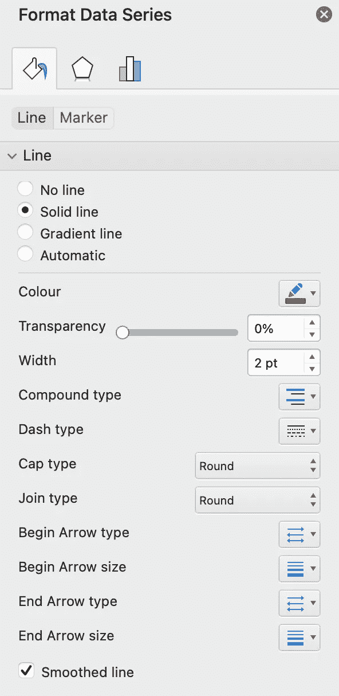

在 Excel 中设置线条颜色和平滑线条的格式

不要忘记添加页脚。您可以在此图表中插入您的姓名和来源链接。只需添加另一个文本框，并将其移动到图表的底部。您可能需要再次减小地块面积，以便能够保持合理的距离。

仅此而已。下面是用 Datawrapper 绘制的图表和我用 Excel 创建的图表的比较

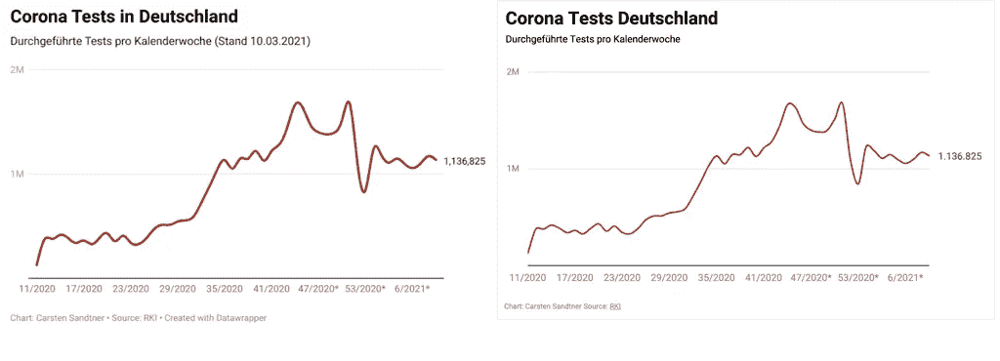

左:来自 Datawrapper 的原始数据|右:直接从 Excel 导出的绘图

## 将其保存为模板

获得好看的可视化效果有很多步骤。而且说实话，我不想一遍又一遍的走完每一步。幸运的是，Excel 允许我们保存所有设置的模板。右击图表并选择*另存为模板*。

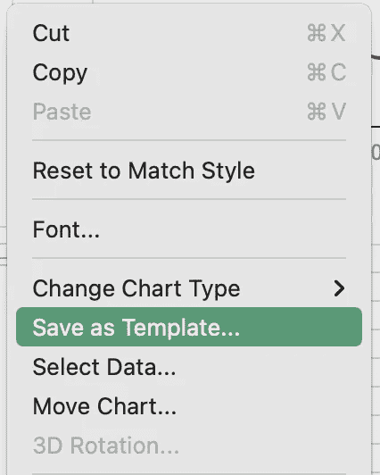

另存为模板

有了模板，我们可以在图表上应用我们的新样式。只需绘制一个默认图表，点击右键，选择*更改图表类型*并从*模板*中选择

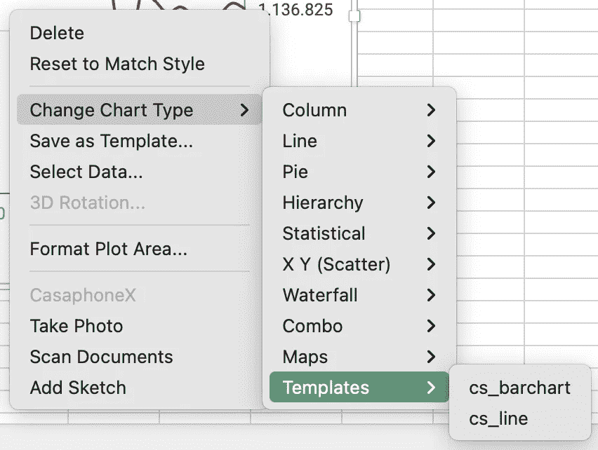

应用模板

## 结论

您可以看到，使用 Excel 创建好看的可视化效果并不困难。你不需要生活在默认的情节中。这并不意味着他们是无用的。如果您想可视化上下文以获得洞察力，缺省值就足够了。但是对于一些报告来说，不使用其他工具，花一些时间来创建整洁美观的图表是值得的。

如果您想创建好看的图表，您可以花一些时间定制并保存为模板，使用您的 CI 和好看的排版。