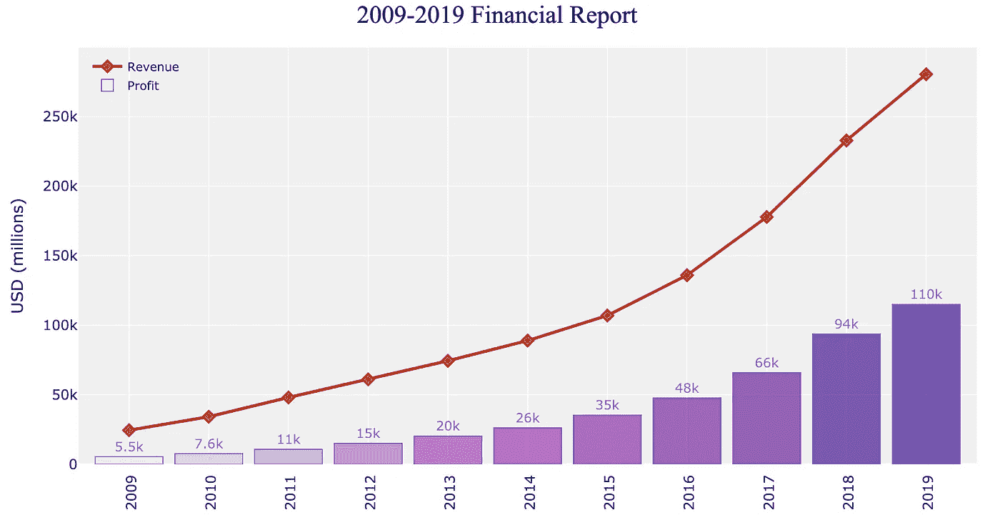
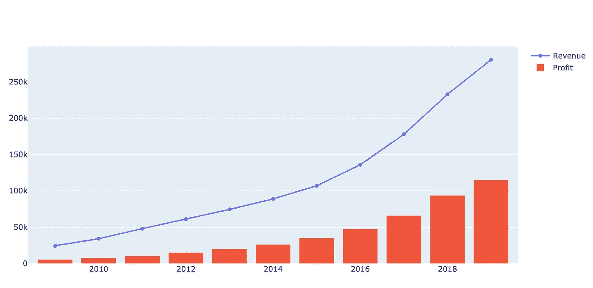
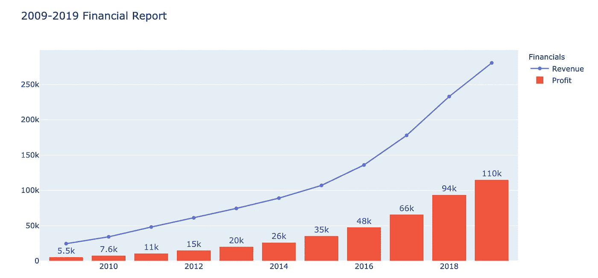
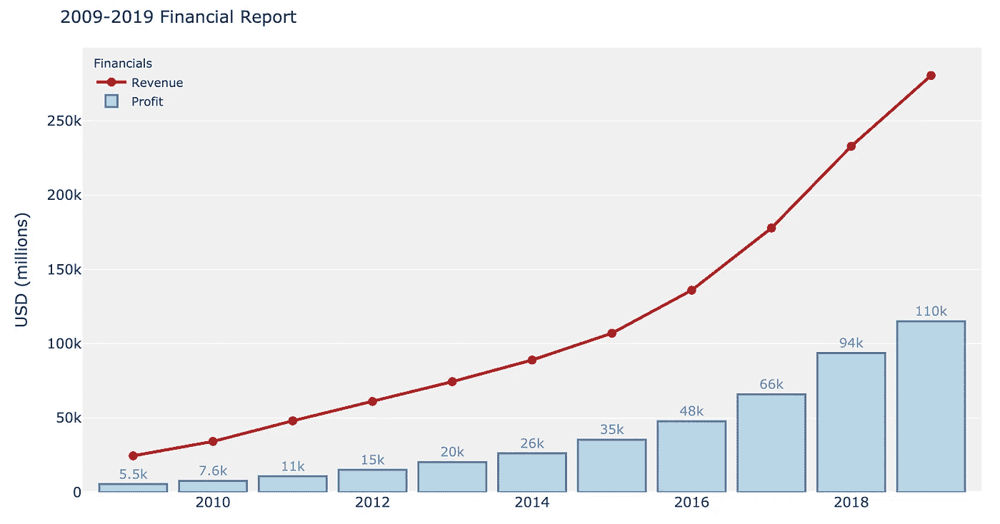
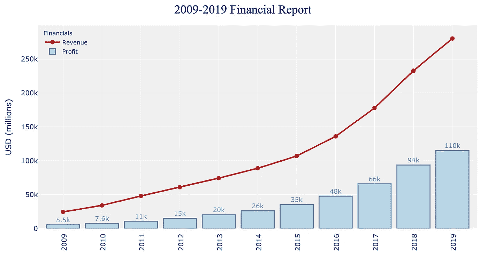
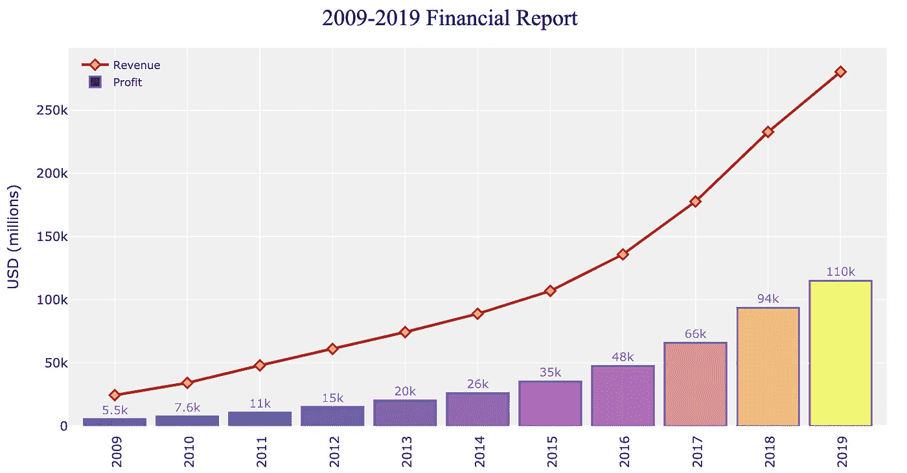
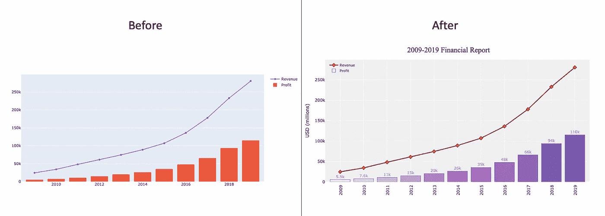

# 如何在 Python Plotly 中创建一个美化的组合图

> 原文：<https://towardsdatascience.com/how-to-create-a-beautify-combo-chart-in-python-plotly-ddbe39874002?source=collection_archive---------14----------------------->

没有人会否认线形和条形组合图是使用最广泛的组合图之一。在 Excel 中，有一个组合图的内置功能。它也是分析金融数据最流行的图表之一。

在本教程中，我们将使用 plotly 构建一个自定义的组合图。完成后的组合图将如下所示。



# 1.导入库

```
import numpy as np
import pandas as pd
import matplotlib.pyplot as plt
import plotly.graph_objects as go
%matplotlib inline
```

# 2.创建用于数据可视化的数据框架

```
Amazon_Financials ={'Year': [2009, 2010,2011,2012,2013,2014,2015,2016,2017,2018,2019], 
                    'Revenue($M)': [24509, 34204,48077,61093,74452,88988,107006,135987,177866,232887,280522],
                   'Profit($M)':[5531,7643,10789,15122,20271,26236,35355,47722,65932,93731,114986]}df = pd.DataFrame(data=Amazon_Financials)
```

数据集非常简单。它包含了 Amazon.com 公司在 2009 年到 2020 年间的收入和利润数据。


亚马逊 2009 年至 2020 年的收入和利润

# 3.画一个简短的组合图

```
fig = go.Figure()fig.add_trace(
    go.Scatter(
        x=df['Year'],
        y=df['Revenue($M)'],
        name="Revenue"
    ))fig.add_trace(
    go.Bar(
        x=df['Year'],
        y=df['Profit($M)'],
        name="Profit"
    ))fig.show()
```



可以清楚地看到，横坐标和纵坐标上的轴标签的字体有点小，很难阅读。x 轴的标签没有完全显示。并且刻度线对于确定每根棒线的真实数值没有太大帮助。第一步是放大轴标签的字体并移除刻度线。图例或图表没有标题。需要添加标题来向最终用户提供图表主题的信息。

# 4.向图表的条形图和标题添加批注

```
fig = go.Figure()fig.add_trace(
    go.Scatter(
        x=df['Year'],
        y=df['Revenue($M)'],
        name="Revenue"
    ))fig.add_trace(
    go.Bar(
        x=df['Year'],
        y=df['Profit($M)'],
        name="Profit",
        text = df['Profit($M)'],
        textposition='outside',
        textfont=dict(
        size=13,
        color='#1f77b4')
    ))
fig.update_traces(texttemplate='%{text:.2s}')
fig.update_layout(legend_title_text='Financials',
                 title_text='2009-2019 Financial Report')fig.show()
```



# 5.更改图表的颜色和字体

在本例中，线条的颜色将变成“耐火砖”。您也可以使用十六进制颜色代码或 RBG。条形将变为浅蓝色，周围有线条，以增强条形的可见性。我还把条形做得有点透明。背景颜色变为浅灰色。标注 x 轴和 y 轴是为了避免混淆。

```
import plotly.graph_objects as gofig = go.Figure()fig.add_trace(
    go.Scatter(
        x=df['Year'],
        y=df['Revenue($M)'],
        name="Revenue",
        mode='lines+markers', 
#         mode = 'lines', if you don't want the markers
        marker={'size':9},
        line = dict(color='firebrick', width=3)
    ))fig.add_trace(
    go.Bar(
        x=df['Year'],
        y=df['Profit($M)'],
        name="Profit",
        text = df['Profit($M)'],
        textposition='outside',
        textfont=dict(
        size=13,
        color='#1f77b4'),
        marker_color='rgb(158,202,225)', 
        marker_line_color='rgb(17, 69, 126)',
        marker_line_width=2, 
        opacity=0.7
    ))# strip down the rest of the plot
fig.update_layout(
    showlegend=True,
    plot_bgcolor="rgb(240,240,240)",
    margin=dict(t=50,l=10,b=10,r=10),
    title_text='2009-2019 Financial Report',
    legend_title_text='Financials',
    xaxis_tickfont_size=14,
    yaxis=dict(
        title='USD (millions)',
        titlefont_size=16,
        tickfont_size=14,
    ),
    legend=dict(
        x=0.01,
        y=0.99,
        bgcolor='rgba(255, 255, 255, 0)',
        bordercolor='rgba(255, 255, 255, 0)'
    ),
    bargap=0.15
)
fig.update_traces(texttemplate='%{text:.2s}')fig.show()
```



# 6.最后润色

仍然需要一些小的调整，以使图表更丰富，更少混乱。

x 轴没有所有年份

两个轴的字体都非常小

图表的标题应该居中

```
fig = go.Figure()fig.add_trace(
 go.Scatter(
 x=df[‘Year’],
 y=df[‘Revenue($M)’],
 name=”Revenue”,
 mode=’lines+markers’, 
# mode = ‘lines’
 marker={‘size’:9},
 line = dict(color=’firebrick’, width=3)
 ))fig.add_trace(
 go.Bar(
 x=df[‘Year’],
 y=df[‘Profit($M)’],
 name=”Profit”,
 text = df[‘Profit($M)’],
 textposition=’outside’,
 textfont=dict(
 size=13,
 color=’#1f77b4'),
 marker_color=’rgb(158,202,225)’, 
 marker_line_color=’rgb(17, 69, 126)’,
 marker_line_width=2, 
 opacity=0.7
 ))# strip down the rest of the plot
fig.update_layout(
 showlegend=True,
 plot_bgcolor=”rgb(240,240,240)”,
 margin=dict(t=50,l=10,b=10,r=10),
 title_text=’2009–2019 Financial Report’,
 title_font_family=”Times New Roman”,
 legend_title_text=’Financials’,
 title_font_size = 25,
 title_font_color=”darkblue”,
 title_x=0.5,
 xaxis=dict(
 tickfont_size=14,
 tickangle = 270,
 showgrid = True,
 zeroline = True,
 showline = True,
 showticklabels = True,
 dtick=1
 ),
 yaxis=dict(
 title=’USD (millions)’,
 titlefont_size=16,
 tickfont_size=14
 ),
 legend=dict(
 x=0.01,
 y=0.99,
 bgcolor=’rgba(255, 255, 255, 0)’,
 bordercolor=’rgba(255, 255, 255, 0)’
 ),
 bargap=0.15
)
fig.update_traces(texttemplate=’%{text:.2s}’)
fig.show()
```



现在这个图表看起来比最初的版本好多了。我们可以通过引入更多的定制来进一步美化图表。

# 6.增强的定制

我们可以改变标记的形状和颜色，也可以改变那些条形的颜色，使图表更加令人印象深刻。

```
import plotly.graph_objects as gofig = go.Figure()fig.add_trace(
    go.Scatter(
        x=df['Year'],
        y=df['Revenue($M)'],
        name="Revenue",
        mode='lines+markers', 
#         mode = 'lines'
        marker= dict(size=9,
                     symbol = 'diamond',
                     color ='RGB(251, 177, 36)',
                     line_width = 2
                   ),
        line = dict(color='firebrick', width=3)
    ))fig.add_trace(
    go.Bar(
        x=df['Year'],
        y=df['Profit($M)'],
        name="Profit",
        text = df['Profit($M)'],
        textposition='outside',
        textfont=dict(
        size=13,
        color='#1f77b4'),      
        marker_color=["#f3e5f5", '#e1bee7', '#ce93d8', '#ba68c8','#ab47bc',
                     '#9c27b0','#8e24aa','#7b1fa2','#6a1b9a','#4a148c','#3c0a99'],
        marker_line_color='rgb(17, 69, 126)',
        marker_line_width=1, 
        opacity=0.7
    ))# strip down the rest of the plot
fig.update_layout(
    showlegend=True,
    plot_bgcolor="rgb(240,240,240)",
    margin=dict(t=50,l=10,b=10,r=10),
    title_text='2009-2019 Financial Report',
    title_font_family="Times New Roman",
    title_font_size = 25,
    title_font_color="darkblue",
    title_x=0.5,
    xaxis=dict(
        tickfont_size=14,
        tickangle = 270,
        showgrid = True,
        zeroline = True,
        showline = True,
        showticklabels = True,
        dtick=1
    ),
    yaxis=dict(
        title='USD (millions)',
        titlefont_size=16,
        tickfont_size=14
    ),
    legend=dict(
        x=0.01,
        y=0.99,
        bgcolor='rgba(255, 255, 255, 0)',
        bordercolor='rgba(255, 255, 255, 0)'
    ),
    bargap=0.15
)
fig.update_traces(texttemplate='%{text:.2s}')fig.show()
```


如果你想用一个变量/特征来定义条形的颜色，简单的替换

```
fig.add_trace(
    go.Bar(
        x=df['Year'],
        y=df['Profit($M)'],
        name="Profit",
        text = df['Profit($M)'],
        textposition='outside',
        textfont=dict(
        size=13,
        color='#1f77b4'),      
        marker_color=["#f3e5f5", '#e1bee7', '#ce93d8', '#ba68c8','#ab47bc',
                     '#9c27b0','#8e24aa','#7b1fa2','#6a1b9a','#4a148c','#3c0a99'],
        marker_line_color='rgb(17, 69, 126)',
        marker_line_width=1, 
        opacity=0.7
    ))
```

随着

```
fig.add_trace(
    go.Bar(
        x=df['Year'],
        y=df['Profit($M)'],
        name="Profit",       
        text = df['Profit($M)'],
        textposition='outside',
        textfont=dict(
        size=13,
        color='#1f77b4'),
        marker_color=df['Profit($M)'],
        marker_line_color='rgb(17, 69, 126)',
        marker_line_width=2, 
        opacity=0.7
    ))
```

然后你会得到一个像这样的组合图，



最后，让我们最后看一下前后图表。



美化后的图表更加清晰，能向观众传达更多的信息。标签和标题也能提供信息。网格线有助于确定每个条形的实际数量。