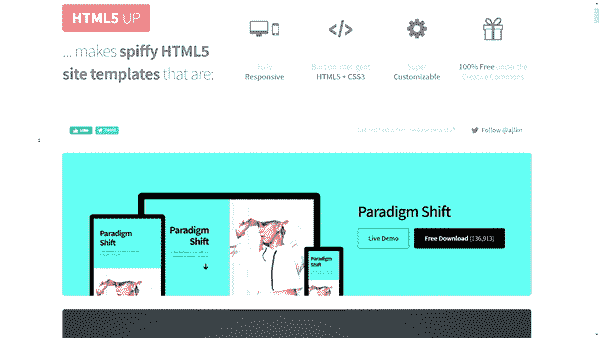
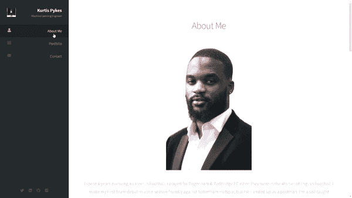
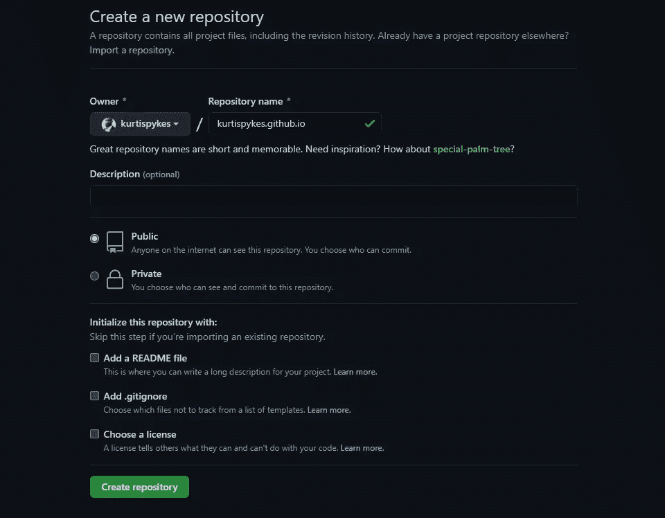

# 如何创建引人注目的 Github 产品组合

> 原文：<https://towardsdatascience.com/how-to-create-a-compelling-github-portfolio-a229e7472a92?source=collection_archive---------1----------------------->

## 用 Github 页面构建 Github 文件夹

罗曼·辛克维奇在 [Unsplash](https://unsplash.com?utm_source=medium&utm_medium=referral) 上拍摄的照片

如果你写代码，你需要一个投资组合——很简单！

作品集可以让你展示你做过的工作样本，这些样本可以作为一份数字简历，证明你拥有你在简历中所说的技能。

如果你是前端或后端开发人员，从头开始建立自己的网站是有好处的。但是如果你像我一样，是一个机器学习工程师，那么你会理想地选择最简单的选项。

在我看来，这意味着使用 Github 页面。Github Pages 是 Github 提供的免费托管服务，它可以直接从 Github repo 中获取 HTML、CSS 和 JavaScript 文件。

# 我的作品集里可以放些什么？

在某种程度上，你会想要加强你的 Github 投资组合，以确保潜在的客户/雇主不会轻易接受你的申请。然而，知道什么可以放在你的投资组合中并不是一件简单的事情。这里有一些你可能想放入你的文件夹的想法；

*   **作业&课程作业**:这可能不是你最高质量的作品，但这并不意味着它不值得成为你作品集的一部分。你在学校或通过课程收到的所有编程作业和课程作业仍然是有价值的项目，但请记住，如果 50，000 人参加了同一门课程并分享了相同的东西，那么如果你想脱颖而出，你必须做得更多。
*   独立项目:独立项目(或个人项目)对任何想要提升技能的人的发展都至关重要。将这作为你投资组合的一部分是必须的，也是最有可能抓住潜在客户/雇主注意力的。
*   **重复研究:**当我们想在更深层次上学习一些东西时，重新发明轮子总是一个好主意。对于数据科学家来说，这可能意味着使用一篇研究论文从头编码一个神经网络。
*   **比赛**:如果你曾经决定参加比赛，那么分享你是如何公平的是一个很大的进步。尽管许多人觉得竞赛并没有复制真实世界的场景，但我觉得仍然有很多价值可以从中获取，它们绝对应该作为你投资组合的一部分(如果你能在竞赛中排名靠前就更好了)。
*   **博客& Vlogs:** 如果你以博客或 vlog 的形式创建内容，那么它也应该被包括在内。我觉得这是展示软技能和技术知识的好方法。

理想情况下，任何能给你带来优势、突出你的优势、向招聘人员/潜在客户展示你有能力用你的编程能力增加价值的东西，都应该放在你的文件夹里。

创建一些解释清楚的博客帖子、内核或 markdown 来解释你正在做的事情也是一个好主意，这样你就可以迎合可能会购买你的投资组合的非技术受众。

 [## 如何让你的数据科学项目脱颖而出

### 创建有效的自述文件

towardsdatascience.com](/how-to-make-your-data-science-projects-stand-out-b91d3861a885) 

# 创建投资组合

如前所述，我是一名机器学习工程师，之前没有太多关于 web 开发的知识——尽管我曾在一家专门从事 web 开发的数字营销机构工作过，所以我有一些接触领域，并知道一些关于它的小细节。

因此，我不会强迫自己去学习如何创建一个网站，我只是要使用一个文件夹样板，重构它以适应我的需要，并使它成为我自己的；一旦我对它的外观感到满意，我会把它放在 Github 上。

## 步骤 1 —选择投资组合模板

第一步是选择你想要使用的投资组合样板。要找到一个免费的样板模板，你可以利用你的谷歌搜索技能——谷歌“免费 HTML 样板模板”或“免费 HTML 文件夹模板”和 wala！

> **注意**:对于我的作品集网站，我使用了网站 [HTML5up](https://html5up.net/) ，它是由一个叫 [Joshua Fluke](https://www.youtube.com/c/JoshuaFluke1) (这篇文章的灵感来自于他)的网站开发者在他的 youtube 频道上推荐的。

HTML5up.net 的 HTML 样板示例；作者图片

一旦您看到了想要的样板文件，您需要下载样板文件，以便我们可以应用一些修改来获得符合我们需要的样板文件。

## 步骤 2 —重构样板文件

这一步需要一点点 HTML 知识，但没有什么是几个小时内学不会的；下载完模板后，提取所有文件，并在您选择的 IDE 中打开文件夹——我使用 PyCharm。

在您的 IDE 中，导航到`index.html`模块并将其打开。接下来，您需要右键单击代码中的任意位置并选择“在浏览器中打开”,然后选择您选择的浏览器——这样您就可以看到代码和您正在构建的页面，从而了解您对代码所做的更改如何影响浏览器中的页面。

经过一些重构后，我的样板文件的预览；作者图片

## 步骤 3——在 Github 上托管

最后一步是在 Github 上创建一个新的存储库。为了利用 Github Pages 托管服务，存储库名称的格式应该如下`your_username.github.io`。对我来说，那就是“ *kurtispykes.github.io* ”。

在 Github 上创建 GithubPages 存储库

我建议在下一阶段学习 Git，但是最初，我们可以通过选择“上传现有文件”选项来上传文件，然后我们拖放单个文件并将它们提交给 Github。

亲自看看我的作品集…

 [## Kurtis Pykes 投资组合

### 我花了 6 年时间追求足球生涯；我在达格南&红桥足球俱乐部效力时，他们在第四梯队…

kurtispykes.github.io](https://kurtispykes.github.io/) 

## 最后的想法

如果你是自由职业者/承包商，或者如果你是在职员工，作品集是向潜在客户展示你能力的绝佳方式。我个人认为，每个在工作中使用代码的人都应该有一个文件夹，因为这可能是最好的证据形式，也可以作为你的电子简历。

感谢阅读！

如果你喜欢这篇文章，请通过订阅我的免费**[周刊](https://mailchi.mp/ef1f7700a873/sign-up)与我联系。不要错过我写的关于人工智能、数据科学和自由职业的帖子。**

## **相关文章**

** [## 最重要的数据科学项目

### 每个数据科学家都必须做的项目

towardsdatascience.com](/the-most-important-data-science-project-458d016ef8a6)  [## 如何获得你真正想要的数据科学职位

### 当承担与人工智能相关的角色时，必须做的事情没有被充分提及

towardsdatascience.com](/how-to-secure-a-data-science-role-you-actually-want-169afc52019b)  [## 你应该拥有数据科学博客的 3 个理由

### 我认为写博客对你有利的原因

towardsdatascience.com](/3-reasons-why-you-should-have-a-data-science-blog-cdc1d4b0e8f4)**