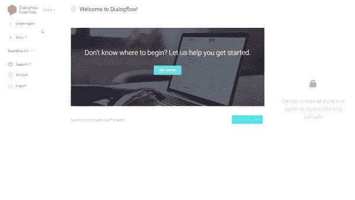
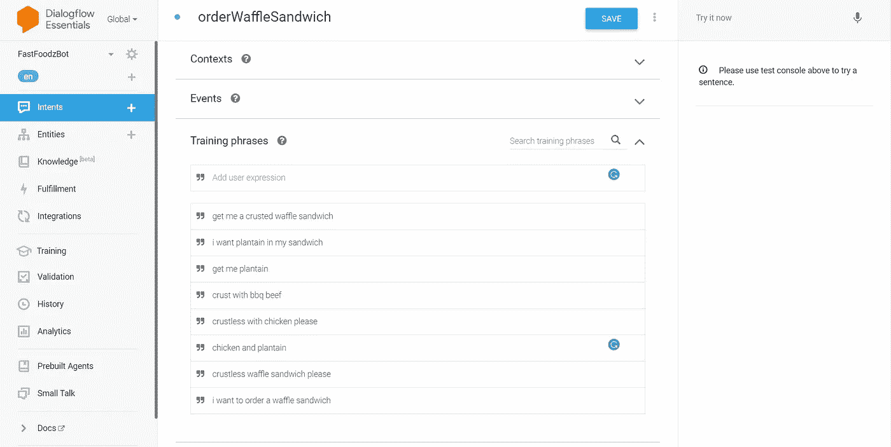
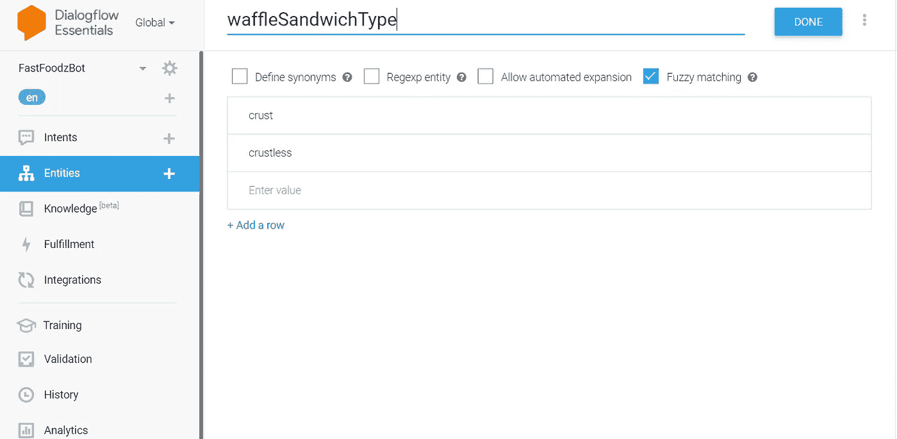
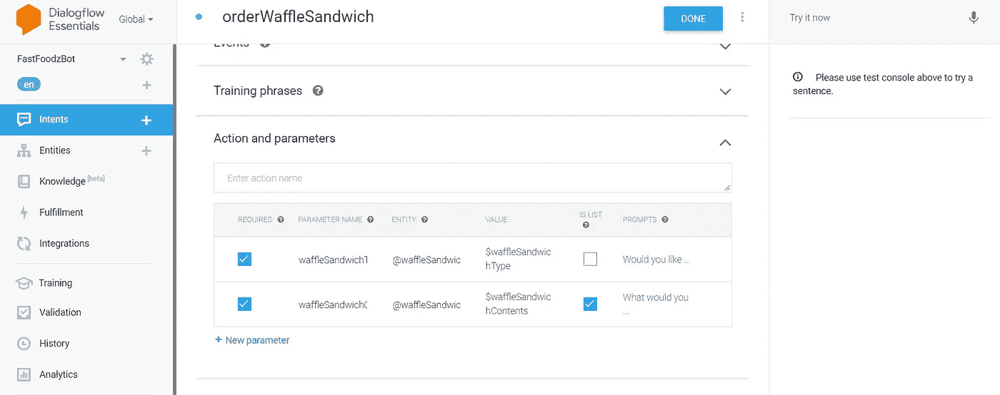
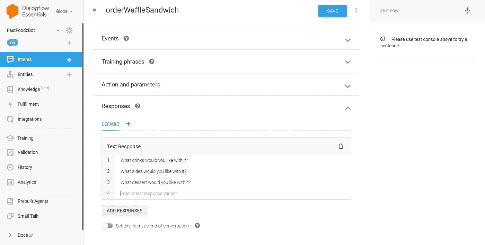
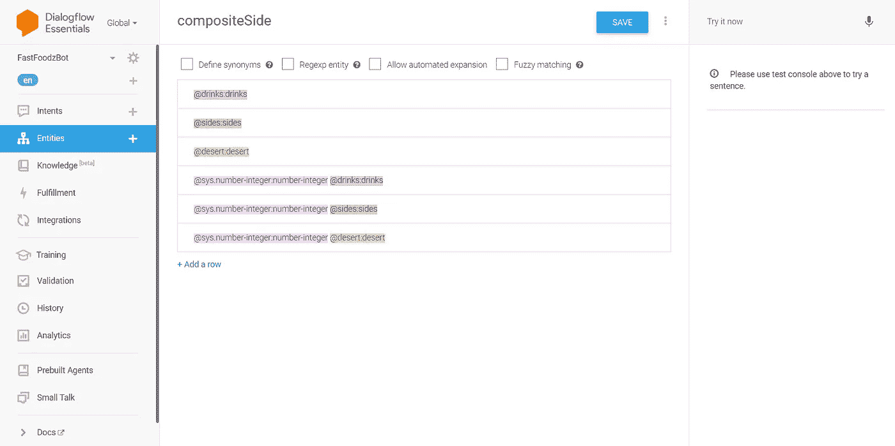
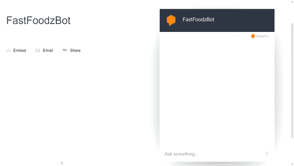

# 如何使用 Dialogflow 创建对话代理

> 原文：<https://towardsdatascience.com/how-to-create-a-conversational-agent-with-dialogflow-17bfa90aa02d?source=collection_archive---------31----------------------->

## [自然语言处理笔记](https://towardsdatascience.com/tagged/nlpnotes)

## 构建我自己的“FastFoodz”聊天机器人

由[安迪·凯利](https://unsplash.com/@askkell?utm_source=medium&utm_medium=referral)在 [Unsplash](https://unsplash.com?utm_source=medium&utm_medium=referral) 上拍摄

# 什么是 Dialogflow？

Dialogflow 是 Google 设计的云 API，用于帮助开发对话代理。Dialogflow 文档对 Dialogflow 的描述如下:

> Dialogflow 是一个自然语言理解平台，可以轻松设计对话式用户界面并将其集成到您的移动应用程序、web 应用程序、设备、机器人、交互式语音响应系统等中。使用 Dialogflow，您可以为用户提供新的、引人入胜的方式来与您的产品进行交互[ **Source** : [Dialogflow 文档](https://cloud.google.com/dialogflow/docs)。

我虚构了一家名为 FastFoodz 的餐厅；对于更多的背景，FastFoodz 餐厅将基于我最喜欢的当地快餐店之一，名为 Laaghas。

Laaghas 有一些最好的华夫饼三明治。每个华夫饼干三明治里面有不同的内容(例如，我们可以有鸡蛋、培根、鸡肉等。)并且它也可以带有外壳或去掉外壳。此外，我们可以选择添加额外的食物，如薯条、辣鸡翅、苹果酥和/或饮料。基于这些要求，我们将构建一个聊天机器人，它将能够为我们执行完整的订单流程。

# 构建我们的代理

在构建我们的代理之前，我们必须首先完成必要的设置过程——这非常简单。只需导航到 [Dialogflow 网站](https://dialogflow.cloud.google.com/)并使用您的 Google 凭据登录。为了避免被收费，请确保您选择了“免费试用”选项，这将带您到谷歌云服务进行进一步的注册过程。

## **代理创建**

这可能是最明显的一步；我们必须创造我们的代理人。在 Dialogflow 仪表板的左上角，有一个“创建代理”选项卡。我们只需选择它并为我们的代理提供一个名称。我正在创建的机器人是为我想象中的快餐店 FastFoodz 设计的。

代理命名约定的一个良好实践是为代理提供一个代表代理用途的名称。在我的例子中，我将简单地命名我的 FastFoodz 商店代理 *FastFoodzBot* 。

> **注意**:在选择“创建”按钮之前，还要确保您的代理的时区是正确的。

**图 1** :创建我们的 FastFoodBotz 代理——请忽略页面底部的错误消息；作者 GIF。

## **意图**

对话流文档描述了如下意图…

> *意图*将终端用户的意图分类为一个对话回合。对于每个代理，您定义了许多意图，其中组合的意图可以处理一个完整的对话。当最终用户写或说一些东西时，称为*最终用户表达*，Dialogflow 将最终用户表达与您的代理中的最佳意图相匹配。匹配意图也被称为*意图分类*。

默认情况下，在创建我们的第一个代理时，我们有 2 个意图；

*   **默认回退意图**适用于我们的代理无法识别我们的最终用户希望表达的确切内容的情况。谷歌为此提供了各种静态响应，比如“对不起，我没明白。能不能换个说法？”。
*   **默认欢迎意图**在最终用户开始与我们的代理对话时非常有用。欢迎意图应该返回一个响应，通知最终用户代理的功能是什么，或者用户可以做什么来开始对话。谷歌还在他们的文档中预装了意向回复，他们建议应该对其进行定制。

为了创建我们的第一个意图，我们导航到侧面板，将鼠标悬停在“意图”标题上，并选择“+”符号。

我们将创建的第一个意图将被称为“orderWaffleSandwich”

每个意图都需要训练样本——谷歌称之为“训练短语”——这样我们的机器人就能够识别出哪种反应属于特定的意图。

**图 2:** 创建我们的第一个意图，并添加一些训练短语；作者图片

> **注意**:每一节结束后一定要保存你的工作

## 实体

现在我们已经包含了一个意图，我们需要添加实体，以便我们的代理能够记住用户提供的重要信息。要实现这个功能，我们应该导航到左栏中的“实体”部分。

我们将创建的第一个实体将被命名为“ *waffleSandwichType”。*对于此实体，确保启用“模糊匹配”,因为这将允许我们的代理匹配实体，即使它们大致相同。

**图 3** :创建 waffleSandwichType 实体，该实体将确定华夫饼三明治是否有外皮；作者图片

我们将创建的第二个实体将被命名为“*wafflesandvichcontents*”。对于该实体，确保启用了“模糊匹配”和“定义同义词”——定义同义词允许我们同时定义同义词，并将定义为同义词的几个词匹配到同一个实体。

**图 3** :创建 waffleSandwichContents 实体，该实体决定将不同的内容放入我们的三明治中；作者图片

## 动作和参数

为了完成订单，我们需要华夫饼的类型和用户想要的华夫饼内容。一个华夫饼干三明治不能既有面包皮又没有面包皮，但是它可以有不同的内容。

为了确保我们得到所需的华夫饼类型和大小，我们必须返回到 intents 部分并导航到“Action and Parameters ”,然后将我们的 2 个实体添加到 actions 中，并确保选中所需的框。

记得我们说过三明治里可以有不同的内容吗？为了确保该行为被代理捕获，我们必须为 waffleSandwichContents 操作选择“isList”。

**图 4:** 添加动作和参数；作者图片

在*图 4* 中，你可能会注意到我给每个动作都加了一个提示。简而言之，提示通过向用户提出后续问题来帮助我们收集更多关于订单的信息。后续问题的一个例子是“你想要带皮的华夫饼还是不带皮的？”用于 waffleSandwichType 操作。

## 反应

我们还需要迎合用户可能想要的任何附加组件，因此我们的代理需要一些响应。有了响应，我们可以问用户他们是否想要一些饮料、配菜或甜点。

**图 5** :向我们的代理添加响应；作者图片

## 语境

到目前为止，我们构建的代理非常简单。为了增加一点复杂性，我们可以引入谷歌所说的“上下文”。

> 对话流*语境*类似于自然语言语境。如果一个人对你说“他们是橙色的”，你需要上下文来理解“他们”指的是什么。类似地，为了让 Dialogflow 处理这样的最终用户表达式，需要为它提供上下文，以便正确地匹配意图。— [对话流文档](https://cloud.google.com/dialogflow/es/docs/contexts-overview)

考虑陈述“我想要购买芬达的 1L 和 6 个烧烤鸡翅”。至关重要的是，我们的代理能够识别数量，以及用户想要订购的项目。为了将它合并到我们的代理中，我们必须创建一个自定义实体。

**图 6** :创建 compositeSide 自定义实体

compositeSide 自定义实体将允许我们标识数量以及识别用户请求的项目。例如，在“*@ sys . number-integer:number-integer @ drinks:drinks*”中，第一个值处理识别已点的饮料数量，第二个值处理饮料。

## 测试解决方案

正如在任何软件项目中一样，测试我们的代理是开发阶段的一个重要部分。为了执行测试，我们可以在“web demo”模式下打开我们的 bot，方法是导航到侧面板上的“Integrations”选项卡，并向下滚动到“Text based ”,在那里您将看到 Web Demo。

**图 7** :用一个简单的订单测试我们的代理；作者 GIF

目前，该机器人能够处理非常简单的查询，以订购华夫饼三明治。当我们希望测试代理的单个组件时，web demo 特性非常有用，这反过来允许我们在端到端测试阶段之前快速构建原型并捕捉极限情况。

## 资源

要了解更多关于使用 Dialogflow 构建聊天机器人的信息，我强烈推荐你阅读 [*实用自然语言处理:构建真实世界自然语言处理系统综合指南*](https://geni.us/Practical-NLP) *。*

> **注意**:点击上面的链接，你将通过我的会员链接被导向亚马逊。我还集成了地理链接，所以如果你不在英国，你会被自动引导到你当地的亚马逊商店。

# 包裹

本 Dialogflow 教程绝不是对该框架功能的详尽展示；为了使代理更加健壮，我们需要为当前的代理添加更多的意图和实体——这将改善顾客在 FastFoodz 餐厅购买华夫饼三明治的体验。

感谢您的阅读！

如果你喜欢这篇文章，请通过订阅我的免费**[每周简讯](https://mailchi.mp/ef1f7700a873/sign-up)与我联系。不要错过我写的关于人工智能、数据科学和自由职业的帖子。**

## **相关文章**

** [## 一个简单的深度学习的 Python 聊天机器人

### 如何建立自己的朋友

towardsdatascience.com](/a-simple-chatbot-in-python-with-deep-learning-3e8669997758)  [## 聊天机器人一瞥

towardsdatascience.com](/a-brief-look-at-chatbots-98cfc846b0f7)  [## 对话式人工智能入门

### 了解对话式人工智能及其如何帮助人类

towardsdatascience.com](/a-primer-on-conversational-ai-d20c7a4b2a87)**