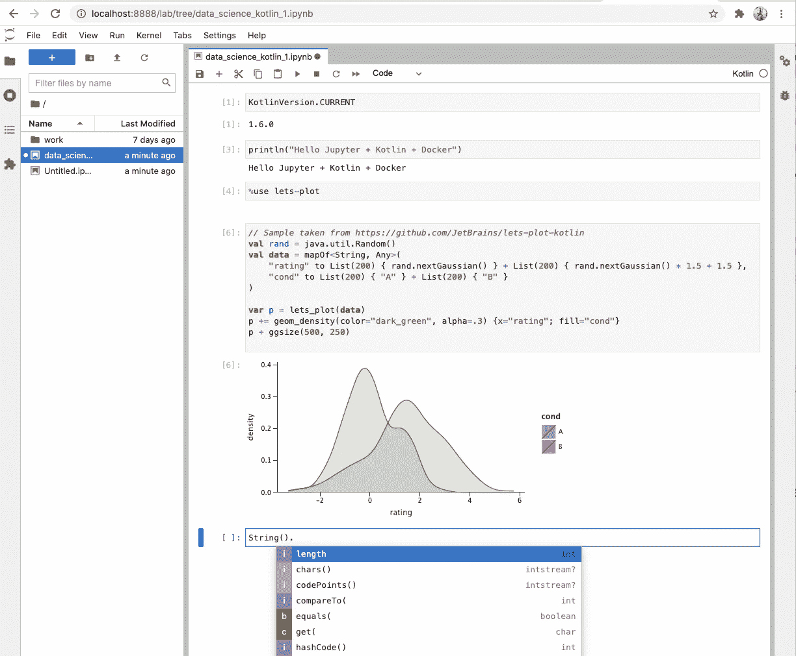
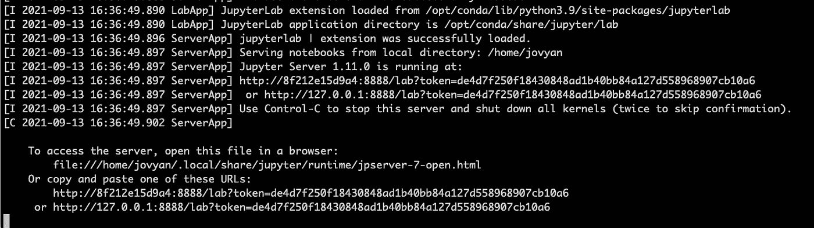
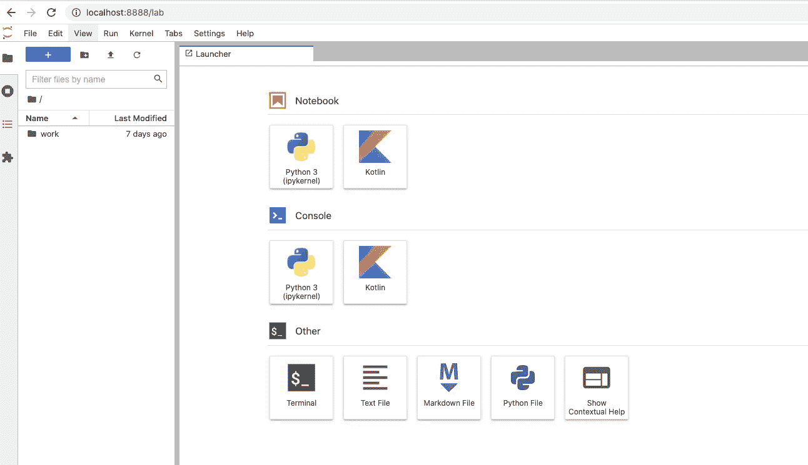

# 如何用 Jupyter 笔记本和 Kotlin 打造 Docker 形象

> 原文：<https://towardsdatascience.com/how-to-create-a-docker-image-with-jupyter-notebook-kotlin-2e8bbf212f81?source=collection_archive---------7----------------------->

## 使用 **Docker** 分 3 步设置自定义 **Jupyter** 笔记本环境兼容**Kotlin内核。**



Jupyter + kotlin 内核示例(图片由作者提供)

***计算笔记本*** 或简称 ***笔记本*** 是一种灵活的交互式工具，允许科学家在同一文档中组合软件代码、计算输出和解释性资源(如文本、图表和任何其他媒体内容)。笔记本电脑有多种用途，包括数据清理和转换、数值模拟、统计建模、数据可视化、机器学习等等。

计算笔记本并不是什么新东西，它们已经存在了很长时间。然而，基于 web 的开发环境的兴起以及对数据科学学科(如探索性数据分析、机器学习或深度学习等)日益增长的兴趣，已经指定一般的笔记本电脑以及特别是[***【Jupyter】***](https://jupyter.org/)***笔记本电脑*** 作为全世界科学家和研究人员的首选工具。有很多方法可以在您的本地环境中安装***Jupyter***([pip](https://pypi.org/project/pip/)， [Anaconda](https://www.anaconda.com/) ，…)甚至直接在云驱动的笔记本环境中工作(比如 [Google Colab)](https://colab.research.google.com/notebooks/intro.ipynb) 。然而，这些方法中的大多数都是面向 **Python** 的，这意味着如果你想将**Jupyter*Jupyter*与任何其他语言(如**KotlinScala 或 Java)一起使用，你将不得不安装额外的*内核*。在这篇文章中，我们将解释一个非常简单的方法来设置你自己的[***Jupyter***](https://jupyter.org/)*环境兼容 ***Kotlin*** 语言，不需要安装任何东西，只需要在你的笔记本电脑上安装一个工具: [Docker](https://www.docker.com/) 。*****

# *环境*

*本文是基于以下平台编写的:*

*   ***操作系统** : MacOS Catalina 10.15.7*
*   ***Docker 社区:** v.20.10.2 for Mac ( [如何安装 docker](https://docs.docker.com/docker-for-mac/install/) )*

# *目标*

*本文旨在详细说明使用以下组件创建自定义 docker 映像的步骤:***【Jupyter Notebook】***和 ***Kotlin 内核*** 。一旦环境建立起来，我们将展示如何访问它以及如何使用它。最后，在确认一切正常后，我们将把我们的图像上传到一个容器图像库，如 [Docker Hub](https://hub.docker.com/) ，这样社区就可以轻松访问它。*

*让我们简单讨论一下我们将要使用的技术和产品:*

*[**Docker**](http://www.docker.com/) 是一个软件平台，旨在通过使用容器来简化应用程序的创建、部署和运行。 ***Docker*** 允许开发者将应用程序及其所有依赖项打包到一个容器中，然后作为一个包发送出去。这项技术允许停止担心安装组件和库，只需专注于工作。*

*[***Jupyter***](https://jupyter.org/)**是一个基于 web 的交互式开发环境，允许管理 **Jupyter** **笔记本**。Jupyter Notebook 是一种基于 [**JSON**](https://www.json.org/json-en.html) 的交互式开放文档格式，用于将软件源代码、叙述性文本、媒体内容和计算输出组合在一个单独的文档中。***

***[***Kotlin***](https://kotlinlang.org/)是由 [JetBrains](https://www.jetbrains.com/) 创建的通用、免费、开源、静态类型化的“实用主义”编程语言。 ***Kotlin*** 结合了面向对象和函数式编程特性，它被设计成完全与 Java 互操作，而 Kotlin 的标准库的 JVM 版本依赖于 Java 类库。***

***讨论在您的数据科学项目中使用 ***Kotlin*** 的原因超出了本文的范围，但是如果您想了解这个主题，我建议您查看以下来自 JetBrains 的资源([此处为](https://resources.jetbrains.com/storage/products/kotlinconf2017/slides/kotlin_for_data_science.pdf))。***

# ***步骤 1:创建 Dockerfile 文件***

***一个 *Dockerfile* 是一个文本文档，包含用户可以在命令行上执行的指令，以构建和组装 docker 映像。因为我们目标是创建一个 docker 映像，所以我们的第一步是创建一个 docker 文件。因此，转到您的项目目录并创建一个名为 *Dockerfile 的新文件。*创建后，我们可以通过添加如下内容对其进行编辑:***

***[https://gist . github . com/Miguel doctor/EB 29 f 91 aae 612 c 618d 9 b 12 ff 3 b 297 E6 c](https://gist.github.com/migueldoctor/eb29f91aae612c618d9b12ff3b297e6c)***

***让我们解释一下文件的内容:***

*   ***`FROM jupyter/base-notebook:`这是我们 *Dockerfile* 的第一行。通常一个 *Dockerfile* 以`FROM`命令开始。FROM 指令接收预先存在的 docker 图像作为参数。想法是使用这个图像提供的服务，并通过在其上添加新的层来扩展它。作为参数传递的基本图像是`jupyter/base-notebook`。此映像包含已经安装的 Jupyter 的基本版本。***
*   ***`LABEL Miguel Doctor <migueldoctor@gmail.com>:`标签命令是可选的。它用于标识映像的维护者。如果包括在内，您允许对您的图像感兴趣的人联系您，以防他们需要问您一些问题或报告图像的问题。***
*   ***`ENV`定义了环境变量。在这种情况下，我们指出，我们希望使用完整的[***Jupyter Lab***](https://github.com/jupyterlab/jupyterlab)*解决方案，它允许我们处理几个笔记本电脑并使用一个漂亮的浏览器 web 界面。****

# ****步骤 2:将 openjdk-8-jre 和 Kotlin 内核添加到 docker 文件中****

****如前所述，Jupyter 的默认配置是面向 Python 的，因此为了使用不同的语言，如 ***Kotlin*** ，我们需要安装和配置特定的内核。由于 ***Kotlin*** 是一种 [JVM](https://docs.oracle.com/javase/8/docs/technotes/guides/vm/) 语言，所以首先要安装的就是 Java 运行时环境(JRE)。****

****因此，让我们更新我们的 *Dockerfile* ，在它上面包含 *openjdk-8-jre* 安装。一旦安装了 JRE，我们需要添加 ***Kotlin*** 内核，这样它就可以连接到 ***Jupyter*** 。要做到这一点，我们只需打开 *Dockerfile* 并编辑其内容，如以下脚本所示:****

****[https://gist . github . com/Miguel doctor/3344 BAF 619 AC 62 DD 773 c 0669 a4 CBA 8d 6](https://gist.github.com/migueldoctor/3344baf619ac62dd773c0669a4cba8d6)****

****如你所见，我们在文件中添加了几行，这些行使用了新的 *Dockerfile* 关键字，如 USER 和 RUN。所以让我们解释一下这些命令是用来做什么的。****

*   ****`USER`命令允许改变负责在 *Dockerfile* 中执行以下指令的用户帐号。因为在容器上安装 JDK 8 只有根用户可以使用，我们需要在文件中指明。****
*   ****关键字`RUN`负责在构建时执行动作。通过使用 RUN，您可以自定义底层映像更新软件包，向映像添加新的应用程序或安排安全规则等。在我们的例子中，我们在文件中调用 RUN 指令两次。首先运行[***apt***](https://wiki.debian.org/Apt)*包管理实用程序，这样[***open-JDK***](https://openjdk.java.net/)(版本 8)就可以安装在容器上了。第二条`RUN`指令执行 [***康达***](https://docs.conda.io/en/latest/)*命令行工具安装***kotlin-jupyter-kernel***。******

# ****步骤 3:创建一个 Makefile 来构建和运行映像****

****关于 *Dockerfile* 就这么多了！现在，我们需要使用 docker 来获取刚刚创建的 docker 文件并构建 docker 映像，以便它可以作为容器运行。为此，只需进入终端，导航到您的项目文件夹( *Dockerfile* 所在的位置)并创建一个名为 *Makefile 的新文本文件。*然后你需要添加以下内容:****

****[https://gist . github . com/Miguel doctor/5 BCE 365502 a 60 FBA 65 b 36 f 85830d 4631](https://gist.github.com/migueldoctor/5bce365502a60fba65b36f85830d4631)****

****让我们解释一下我们刚刚添加到文件中的内容:****

****`1) run`关键字定义了运行 ***Makefile 时要执行的指令段。*******

****`2) docker build -t <name of the image> <path or the dockerfile>:`它通过将图像的名称和 ***Dockerfile*** 所在的路径作为参数传递来创建 docker 图像。****

> *****重要提示:标签*“Miguel doctor/docker-jupyter-kot Lin-notebook”*是我们分配给图像的标识符。这是一个任意参数，因此您可以随意修改。*****

****`3) docker run`:这个命令实际上启动了 docker 容器。它需要一些参数，我们解释如下:****

*   ****参数- ***name*** 用于给容器指定一个特定的名称。****
*   ****选项 **- *v*** 用于在位于主机上的文件夹(**/Users/mdoctor/Documents/docker volumes/kotlin-jupyter)**和容器内的特定路径( **/home/jovyan/work)** 之间建立映射(如果该文件夹不存在，您必须创建它)。这就是 ***Docker*** 定义的**卷**，它允许在主机和容器之间共享信息。当作为参数传递给`docker run`命令时，两个路径都需要用冒号(:)分隔。如果你想了解更多关于体积的知识，你可以点击查看[的帖子。](https://medium.com/geekculture/data-persistence-on-mysql-phpmyadmin-using-docker-in-3-steps-c3760d534e41)****
*   ****选项 ***-p*** 允许我们映射主机端口和容器端口。 *-p* 参数后面是主机的端口号( **8888** )，将被重定向到容器的端口号( **8888** )。****
*   ****最后，我们需要将在之前的 docker build 命令中创建的图像*Miguel doctor/docker-jupyter-kot Lin-notebook*作为参数进行传递。****

****曾经解释过的***Makefile****，*我们只需要保存文件并在定位到项目的文件夹时键入以下命令即可。****

```
**$ make**
```

****一会儿，终端将显示正在执行的指令列表(构建映像、启动容器……)，最终您将看到类似下面的日志跟踪:****

********

****Juptyer 服务器已准备就绪(图片由 Miguel Doctor 提供)****

****这意味着 ***Jupyter*** 服务器已经启动并运行，你可以通过打开你的网络浏览器并键入日志上显示的最后一个 URL 来访问它:([http://127 . 0 . 0 . 1:8888/](http://localhost:8888/)[lab？token = de 4d 7 f 250 f 18430848 ad 1 b 40 bb 84 a 127d 558968907 CB 10a 6](http://8f212e15d9a4:8888/lab?token=de4d7f250f18430848ad1b40bb84a127d558968907cb10a6)。****

********

****安装了 Kotlin 内核的 Jupyter 实验室(图片由作者提供)****

****如果你能看到图中所示，恭喜你！这意味着容器正在运行 ***Jupyter*** 和 ***Kotlin*** 内核。现在，您只需点击笔记本部分的 ***Kotlin*** 图标，即可创建您的笔记本并开始使用。如下所示，你可以看到一个简单的笔记本应该是什么样子的，带有一些 ***科特林*** 代码。****

********

****Jupyter + kotlin 内核示例(图片由作者提供)****

*******重要:*** 注意，运行 *make* 命令会在每次执行时构建 docker 镜像，这意味着如果没有在*docker 文件*中做任何修改，会浪费时间和资源。因此，除非您编辑 *Dockerfile* ，否则您应该使用以下命令运行容器(已经包含在 makefile 中，并在上面解释过)。****

```
**$ docker run --name my-jupyter-kotlin -v /Users/mdoctor/Documents/dockerVolumes/kotlin-jupyter/:/home/jovyan/work -p 8888:8888 migueldoctor/docker-jupyter-kotlin-notebook**
```

# ****可选:将图像推送到 Docker Hub****

****在某些情况下，我们可能会对向社区发布我们的 docker 图像感兴趣，这样每个人都可以从我们的工作中受益。对于我们的特殊情况，我们已经决定使用 [Docker Hub](https://hub.docker.com/) 作为我们的中央注册中心。如下，我们描述了将刚刚创建的图像上传到 Docker Hub 的方法:****

*   ****Docker Hub 允许用户根据需要创建一个账户来上传图片，所以如果你还没有注册，你需要在网上注册。****
*   ****注册之后，您需要打开一个终端，并使用`docker login`命令连接到 Docker 注册中心。系统会提示您输入用户名和密码。****

```
**$ docker login
Login with your Docker ID to push and pull images from Docker Hub. If you don't have a Docker ID, head over to [https://hub.docker.com](https://hub.docker.com/) to create one.
Username:**
```

*   ****最后，您需要使用`docker push`后跟图片名称来上传。由于我们使用了 docker ID 用户名( *migueldoctor)* 作为构建映像的前缀，我们可以使用下面的命令直接推送映像。如果您没有使用您的 docker ID 作为前缀，您需要按照以下[帖子](https://migueldoctor.medium.com/how-to-create-a-custom-docker-image-with-jdk8-maven-and-gradle-ddc90f41cee4)的 ***步骤 5*** 中的指示对其进行标记:****

```
**$ docker push migueldoctor/docker-jupyter-kotlin-notebook**
```

****一旦图像被成功地推入 Docker Hub，就会创建一个新的 url 来提供对图像的公共访问。该 url 将包含图像的当前版本以及我们将来可能想要推送的任何新版本/标签。对于我们的示例，url 如下:****

****[https://hub . docker . com/r/Miguel doctor/docker-jupyter-kot Lin-notebook](https://hub.docker.com/r/migueldoctor/docker-jupyter-kotlin-notebook)****

# ****结论****

****在这篇文章中，我们已经描述了如何创建自己的定制 docker 映像，包括一个与***Kotlin******内核*** 兼容的全功能 ***Jupyter*** 笔记本服务器。此外，我们解释了所有参数，以便您可以通过添加/删除内核来定制映像。最后，我们解释了如何运行映像以及将 docker 映像推送到 Docker Hub registry 的步骤。****

****请随时留下您在文章中发现的任何评论、见解或错误。非常欢迎您的反馈，这将有助于提高文章的质量。一如既往的感谢您的阅读。我强烈希望本教程能帮助你使用****kot Lin***和 ***Docker*** *开始数据科学项目。******

# ****来源****

*   ****[https://docs.docker.com/engine/reference/run/](https://docs.docker.com/engine/reference/run/)****
*   ****[https://jupyter.org/documentation](https://jupyter.org/documentation)****
*   ****[https://kotlinlang.org/](https://kotlinlang.org/)****
*   ****[https://howtodoinjava . com/library/docker-hello-world-example/# create-docker-image](https://howtodoinjava.com/library/docker-hello-world-example/#create-docker-image)****
*   ****[https://www.nature.com/articles/d41586-018-07196-1](https://www.nature.com/articles/d41586-018-07196-1)****
*   ****[https://www.json.org/json-en.html](https://www.json.org/json-en.html)****
*   ****[https://Miguel doctor . medium . com/how-to-create-a-custom-docker-image-with-JDK 8-maven-and-gradle-DDC 90 f 41 CEE 4](https://migueldoctor.medium.com/how-to-create-a-custom-docker-image-with-jdk8-maven-and-gradle-ddc90f41cee4)****