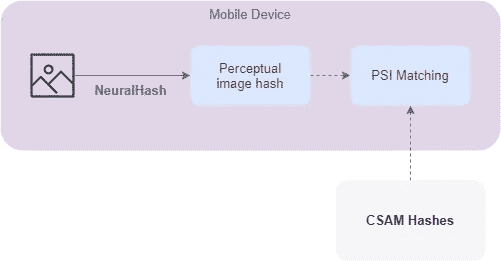
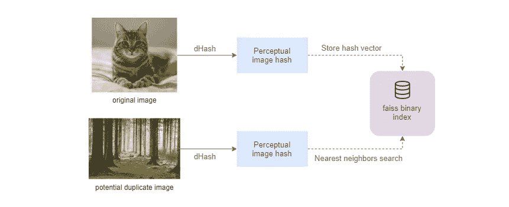
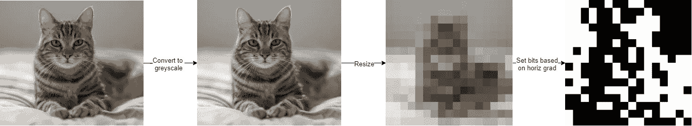
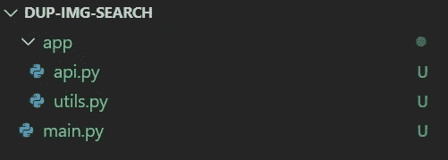
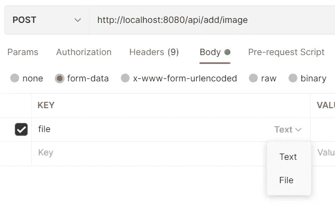

# 如何创建重复图像检测系统

> 原文：<https://towardsdatascience.com/how-to-create-a-duplicate-image-detection-system-a30f1b68a2e3?source=collection_archive---------11----------------------->

## 了解如何使用感知哈希函数和最近邻搜索来检测重复图像


美国地质勘探局在 [Unsplash](https://unsplash.com?utm_source=medium&utm_medium=referral) 上拍摄的照片

# 目录

1.  [动机](#c629)
2.  [实施细节](#833c)
3.  [构建系统](#a118)
4.  [测试](#282b)
5.  [未来改进](#1726)
6.  [参考文献](#69aa)

# 动机

你可能会想，“制作一个重复图像检测系统有什么意义？”有几个原因让你想这么做。这些原因包括防止侵犯版权，从 web 应用程序中删除非法或不需要的图像[1]。识别非法图片最近一直是一个热门话题，苹果公司宣布计划在 iOS 15 中推出一项检测 CSAM 的功能。



苹果 CSAM 检测作者，灵感来自[苹果](https://www.apple.com/child-safety/pdf/CSAM_Detection_Technical_Summary.pdf)

虽然苹果的 CSAM 检测功能现在由于隐私反弹而被推迟，但它背后的技术仍有很多值得我们学习的地方[3]。苹果开发的 CSAM 检测系统使用一种称为 **NeuralHash** 的感知哈希函数来为每张图像生成唯一的数字指纹(哈希)。一旦加密， [**私有集合交集**](https://decentralizedthoughts.github.io/2020-03-29-private-set-intersection-a-soft-introduction/)**【PSI】**用于确定图像哈希是否匹配已知 CSAM 的哈希数据库，同时保持隐私[4]。值得注意的是，这是一个过于简单的描述，如果你有兴趣深入了解细节，我建议你阅读苹果的技术总结。

# 实施细节



重复图像检测系统(*图片作者*)

我们将在本文中构建的系统将使用感知哈希函数，类似于苹果的 CSAM 检测。然而，我们将使用**差分哈希** ( **dHash)** ，而不是使用**神经哈希**来生成图像哈希，这更简单，计算量也更小，因为它不需要神经网络。由于我们没有像苹果一样的隐私限制，我们将使用**最近邻搜索**来识别重复图像。

## 差异散列

**dHash** 是一个感知散列函数，它产生的散列值对图像缩放以及颜色、亮度和纵横比的变化具有弹性[5]。为图像创建差异哈希有四个主要步骤:



dHash 程序(*作者图片*)

1.  转换为灰度*
2.  将图像大小调整为(哈希大小+1，哈希大小)
3.  计算水平梯度，将图像大小减少到(哈希大小，哈希大小)
4.  基于水平梯度值分配位

*为了获得最佳性能，我们在调整大小之前将图像转换为灰度

## 最近的邻居

我们想要检查重复的图像哈希将存储在二进制索引中，以便快速有效地进行最近邻搜索。我们将使用**汉明距离**作为度量来确定图像哈希之间的相似性，对于 **dHash** ，小于 10 的距离(96.09%相似性)可能表示相似/重复的图像[5]。

# 构建系统

在本文的其余部分，我们将使用 Python 构建一个简单的 RESTful API 服务，它允许用户向图像数据库添加图像哈希，并执行图像查找以查看它们是否重复。

如果您没有时间阅读本文的其余部分，您可以在 [GitHub](https://github.com/mattpodolak/duplicate-img-detection) 上找到一份代码副本，做了一些修改以使其更易于扩展。

## 入门指南

我们将使用`fastapi`和`uvicorn`来创建 API 服务，并接受我们需要`python-multipart`上传的图像。

从安装所需的软件包开始:`pip install fastapi python-multipart uvicorn[standard]`

安装后，使用以下文件夹结构创建项目存储库:



文件夹结构

在`app/api.py`中创建一个`FastAPI`的实例，并将其分配给`app`

在`main.py`文件中导入`app`并用`uvicorn`运行它，现在我们可以用`python main.py`运行服务并连接到 [http://localhost:8080](http://localhost:8080)

## API 路线

我们需要定义两个主要的 API 端点，一个用于向数据库添加图像，另一个用于在数据库中查找图像。

在`app/api.py`文件中，我们更新了导入并添加了两条路线:

*   两条路径都通过`file`参数接受图像，而`/api/check`路径接受一个`dist`参数，该参数将用于在搜索重复图像时指定**汉明距离**阈值

## 散列法

我们将使用来自`imagehash`库的`dHash`、`Pillow`来加载图像，以及`numpy`来将散列转换成二进制散列向量。

首先，安装散列所需的包:`pip install Pillow imagehash numpy`

在`app/utils.py`中，我们使用`dHash`和`hash_size=16`创建了一个哈希实用函数，产生的哈希有 256 位，减少了随机冲突的机会:

*   为了在我们的二进制索引中使用产生的散列，我们需要将数组转换成一个包含`uint8`值的 1x32 向量，为此我们使用`numpy`来调整数组的大小，并将二进制值打包到`uint8`

现在我们可以使用`app/api.py`中的这个实用函数来散列每个端点接收到的图像:

## 索引

索引创建和搜索将使用`faiss`完成，这是一个由脸书开发的用于高效相似性搜索的库。

安装所需的软件包:`pip install faiss-cpu pytorch`

为了开始使用`faiss`，我们将在`app/utils.py`中创建几个实用函数来加载/创建索引并保存到磁盘

*   我们使用的是`IndexBinaryFlat`索引，它可能没有其他`Binary`索引快，因为它执行穷举搜索，但是这个搜索已经针对 256 位向量进行了优化。
*   `IndexBinaryFlat`利用**汉明距离**作为向量相似性度量，因为它是`faiss`二进制索引之一。

导入新定义的实用方法，并更新`add_image`处理程序来加载索引。我们使用 index `add`方法插入散列向量，然后将更新后的索引保存到磁盘上以备将来使用:

现在我们可以更新`check_image`来使用`range_search`对我们的索引执行**最近邻搜索**。该方法搜索在`dist`的**汉明距离**内的向量，并返回一个元组

*   `lims`是开始和结束索引的数组，用于解析`D`和`I`
*   `D`是最近邻居的距离数组
*   `I`是最近邻居的整数 id 数组

# 测试

既然两个 API 端点都已完成，我们将使用 Postman 测试每个端点。

## 添加图像

*   使用以下 URL 创建新的发布请求:`[http://localhost:8080/api/add/image](http://localhost:8080/api/add/image)`
*   将车身类型更改为`form-data`



*   添加一个`file`键，并将类型更改为`File`
*   选择一个图像作为`file`的值，并发送一个请求，您应该得到以下响应:

```
{"msg": "added image"}
```

## 检查图像

*   要测试重复图像检查端点，请将 URL 更改为`[http://localhost/api/check](http://localhost/api/check)`
*   添加一个值为`10`的`dist`键，并发送请求
*   对于`file`值保持相同的图像，您应该得到以下响应:

```
{"duplicate": **true**}
```

现在尝试改变图像，看看你会得到什么样的反应！

在达到本文的这一点后，您现在应该有了一个使用**最近邻搜索**和 **dHash** 的工作的重复图像检测系统。如果你对本文中的代码有任何问题，请在 [GitHub](https://github.com/mattpodolak/duplicate-img-detection) 上发帖，否则请随意留言！要继续增加您的服务，请考虑下一节中提到的一些未来改进。

# 未来的改进

*   错误处理和输入验证
*   证明
*   前端用户界面

除了上面提到的改进，我认为使用不同的哈希函数和二进制索引来评估速度、内存使用和图像数据集的准确性也是值得的。

# 参考

[1] N. Dolhansky，C. Canton Ferrer，[对图像散列函数的对抗性碰撞攻击](https://arxiv.org/abs/2011.09473v1) (2020)，计算研究储存库

[2] Z. Whittaker，[苹果证实将开始扫描 iCloud 照片中的虐童图片](https://techcrunch.com/2021/08/05/apple-icloud-photos-scanning/) (2021)，TechCrunch

[3] Z. Whittaker，[在隐私遭到强烈反对后，苹果推迟了在 iOS 15 中推出 CSAM 检测的计划](https://techcrunch.com/2021/09/03/apple-csam-detection-delayed/) (2021)，TechCrunch

[4]苹果公司， [CSAM 检测技术总结](https://www.apple.com/child-safety/pdf/CSAM_Detection_Technical_Summary.pdf) (2021)，苹果公司

[5] N. Krawetz，[类似于](https://www.hackerfactor.com/blog/?/archives/529-Kind-of-Like-That.html) (2013)，黑客因素博客