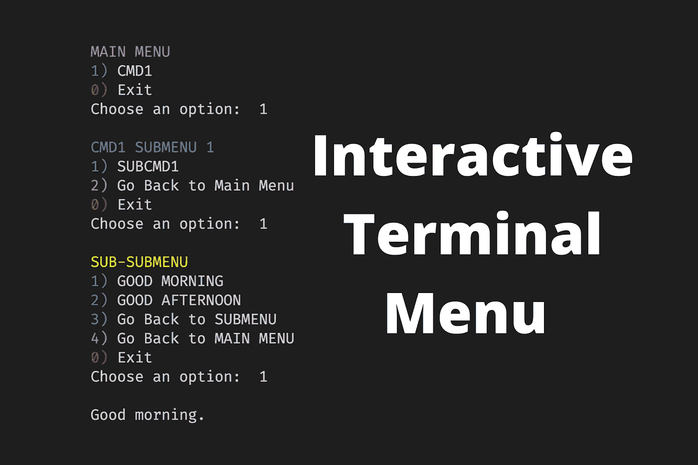
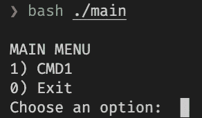
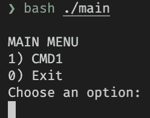
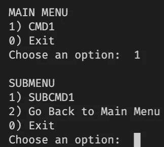
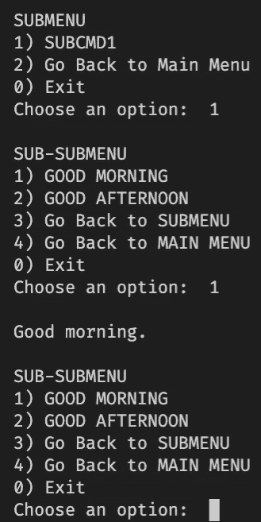
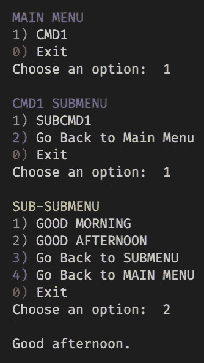

# 如何用 Bash 脚本创建一个简单的交互式终端菜单

> 原文：<https://towardsdatascience.com/how-to-create-a-foolproof-interactive-terminal-menu-with-bash-scripts-97911586d4e5?source=collection_archive---------5----------------------->

## 适用于任何面向操作的终端应用程序的颜色协调的多选菜单



交互式终端菜单。图片由作者提供。

# 介绍

如果您正在考虑为下一个 Bash 脚本项目创建一个交互式菜单，那么您就找对了地方。在本文中，我们将创建一个简单的带有颜色的菜单模板，以便于导航。

终端命令使用选项向程序传递参数。这些选项可以是破折号后跟一个字母，也可以是两个破折号带一个单词。如果选项带有一个参数，则称为开关，否则称为标志。

如果您的应用程序有多层命令，使用终端命令的菜单系统会使导航变得容易。我用这个方法创建了一个添加了颜色的[终端收音机](https://levelup.gitconnected.com/discover-rejuvenate-your-music-library-with-command-line-f3268db67bba)。

# 炙单

主菜单功能包含两个菜单项，但您可以为您的项目添加更多菜单项。

[查看运行中的代码。](https://tech.io/snippet/lfFEw6c)



带有-n 选项的 echo 命令使光标保持在作者的同一行图像中。

`echo -e`选项允许我们使用反斜杠来转义字符，例如，换行符`\n`或制表符`\t`，如果你需要的话。`echo -n`选项省略了尾随换行符。如果没有`-n`选项，光标会移动到下一行，如图所示。



不带-n 选项 echo 命令会追加一个换行符。图片由作者提供。

所有菜单都将包含`case statement`来保存不同的选项。这使得它比使用多个 if 语句更容易阅读和管理。

如果用户选择 1，它将显示子菜单。您可以将`CMD1`更改为任何菜单名称。选项 0 将退出脚本，任何其他字母`*`将显示警告，并以状态 1 退出。

# 子菜单

第一个子菜单项`SUBCMD1`包含显示子子菜单的子命令。子子菜单一旦完成动作，就会再次显示子菜单。第二个菜单项`Go Back to Main Menu`使用 case 语句中的`menu`功能返回主菜单。



子菜单包括返回主菜单。图片由作者提供。

# 子子菜单

我们为子菜单中的第一项和第二项添加了简单的功能。第三和第四项将返回到子菜单和主菜单。我们对`0`和`*`重复同样的操作，所以让我们在下一节创建公共函数。



子子菜单。图片由作者提供。

# 创建常用功能

让我们为退出和错误选项创建函数:

然后我们可以将它们应用到我们`case statements`中的`0`和`*`。

```
case $ans in
...
0)
    fn_bye
    ;;
*)
    fn_fail
    ;;
esac
...
```

到目前为止，菜单很简单。让我们在下一节中给菜单添加颜色。

# 创建颜色函数

这些颜色函数可以接受一个参数。例如:

```
$(greenprint '1)') SUBCMD1
$(magentaprint '2)') Go Back to Main Menu
$(redprint '0)') Exit
```

我们在引号内使用`$(command)`。它运行`command`并替换其输出。

对于我们的菜单，我们将使用洋红色代表返回主菜单，红色代表退出，以使整个菜单保持一致。此外，我们将添加不同的颜色菜单名称。

```
$(magentaprint 'MAIN MENU')
$(blueprint 'CMD1 SUBMENU')
$(yellowprint 'SUB-SUBMENU')
```

# 最终代码

让我们把它们放在一起。在本文的最后一节，您可以使用嵌入式交互式终端控制台测试该脚本。请尝试导航不同的菜单点。



菜单与颜色功能一起使用。图片由作者提供。

[查看运行中的最终代码。](https://tech.io/snippet/08FHqZR)图片作者。

下面是实际运行的最终代码。

# 结论

我在名为`tera`的终端无线电中使用了这种方法。请[安装它](https://github.com/shinokada/tera)，看看我是如何在实际应用中应用这些菜单系统的。

你可以发挥创意，也可以在菜单项中使用表情符号或数字字母。

如果您的应用程序有多层菜单系统，交互式菜单系统比普通的选项解析器系统更容易在复杂的菜单系统中导航。

我希望您可以将这些代码应用到下一个 Bash 脚本项目中。

**通过** [**成为**](https://blog.codewithshin.com/membership) **会员，可以完全访问媒体上的每个故事。**


[https://blog.codewithshin.com/subscribe](https://blog.codewithshin.com/subscribe)

# 参考

*   [https://dev Dojo . com/bobbyliev/how-to-create-an-interactive-menu-in-bash](https://devdojo.com/bobbyiliev/how-to-create-an-interactive-menu-in-bash)
*   [https://bit.ly/3y3imV5](https://bit.ly/3y3imV5)