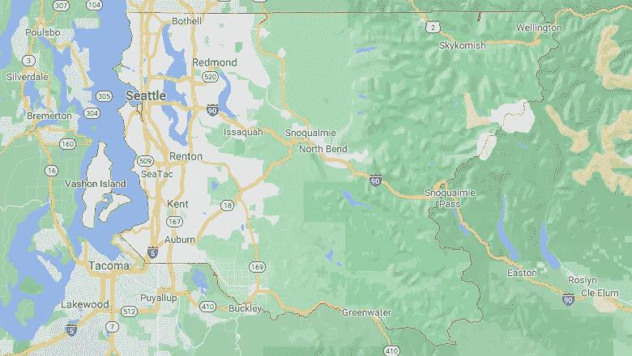
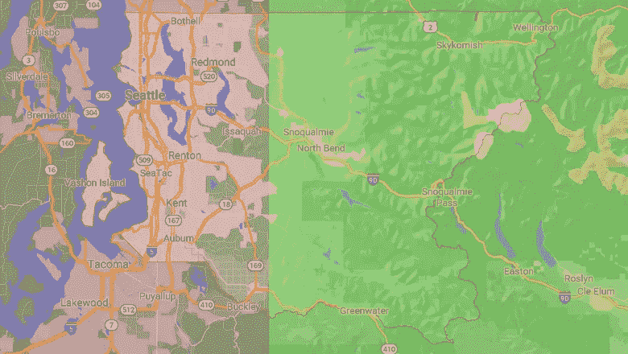
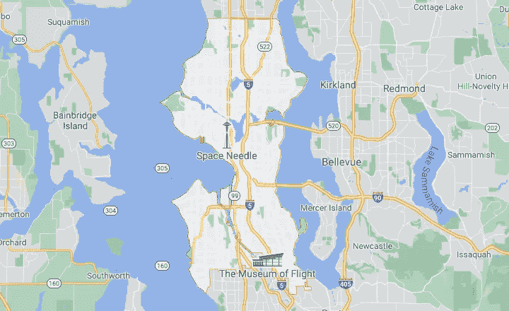
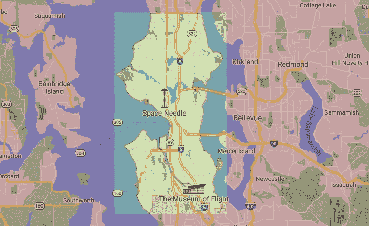

# 如何使用 Python 创建地理围栏

> 原文：<https://towardsdatascience.com/how-to-create-a-geofence-with-python-part-1-14c3864cf9cc?source=collection_archive---------26----------------------->


由[威尔·弗朗西斯](https://unsplash.com/@willfrancis?utm_source=unsplash&utm_medium=referral&utm_content=creditCopyText)在 [Unsplash](https://unsplash.com/photos/Rm3nWQiDTzg) 上拍摄的照片

无论何时处理位置数据，地理围栏都是一种具有广泛应用的有用技术。它可用于根据与个人或地标的接近程度发出通知或标记警报。在数据科学中，它通常用于特征工程和创建可视化边界。

> 地理围栏是现实世界地理区域的虚拟边界。地理围栏可以动态生成，如在点位置周围的半径内，或者地理围栏可以是一组预定义的边界(如学校区域或社区边界)。
> ——[维基百科](https://en.wikipedia.org/wiki/Geo-fence)

虽然任何应用都是显而易见的，但考虑如何构建地理围栏可能并不总是显而易见的。也有许多方法来设计地理围栏，有些情况下需要精确绘制边界，有些情况下需要移动用户手机的可变半径，这些半径在特定环境下会发生变化。在这篇博客中，让我们看看如何创建一些简单的地理围栏，以便理解它们背后的原理。

下面的例子来自我的项目:使用包含华盛顿州金县房产销售值的数据集进行探索和建模。有关项目和示例数据集的更多信息可在以下 GitHub 知识库中找到— [华盛顿州金县房产销售价格的回归分析&建模](https://github.com/mike-flanagan/king_county_property_values_analysis_predictive_model)。本文末尾的参考书目中提供了对源数据的访问。

# 按位置分类

假设我们有一个数据集，其中包含许多位置的记录，每个行项目的位置由纬度(`df[‘lat’]`)和经度(`df[‘long’]`)表示。

我们可以将某些位置分类为属于某个“区域”或界限。我们可以采用几种技术，从简单到复杂。让我们看几个基本的例子，看看如何使用这些技术。

## 简单地将一个位置分成两半



([谷歌地图，[华盛顿州金县](https://www.google.com/maps/place/King+County,+WA/@47.4282897,-121.8350851,9.15z/data=!4m5!3m4!1s0x54905c8c832d7837:0xe280ab6b8b64e03e!8m2!3d47.5480339!4d-121.9836029) ])

上图是华盛顿州金县的图像。单从谷歌地图的翻译来看，一个肤浅的解释可能是金县的大部分地区欠发达，更多的城市和郊区是灰色的，更多的农村是绿色的。

我们对这块土地所能做的最基本的划分是用一条直线把农村和更发达的地区分开，下面简单解释一下。



绿色范围内的房产将被归类为“农村”，而红色范围内的房产将被归类为“非农村”。([谷歌地图、【华盛顿州金县】](https://www.google.com/maps/place/King+County,+WA/@47.4282897,-121.8350851,9.15z/data=!4m5!3m4!1s0x54905c8c832d7837:0xe280ab6b8b64e03e!8m2!3d47.5480339!4d-121.9836029))。作者用 Adobe Photoshop 创建的覆盖图。

我们可以在 Python 中用 NumPy 和 Pandas 来实现这一点:

```
*# Creating a dummy classifier for rural or not*df['rural'] = np.where(df.long > -121.961527, 
                                      1, 
                                      0)
```

上面的代码创建了一个表示“农村”King County 的虚拟变量。通过在我们的数据框架`df`中标识为`rural`的新创建的列中为其分配 1，位于分割线以东的所有财产(即经度大于-121.96 的任何财产)将被分类为农村。任何在该栏中为 0 的地产事实上都不被视为农村地产。

虽然这不精确，但它正确地捕捉了大多数属性，并且执行起来非常简单。如果我们想增加一些考虑纬度的其他条件呢？

## 使用南北/东西约束的简单边界框



([谷歌地图【华盛顿州西雅图】](http://Seattle - Google Maps))

金县的非农村地区包括西雅图市。在这个练习中，让我们把西雅图视为“城市”，把乡村的金县视为“乡村”，把金县的非乡村地区*不包括*西雅图视为郊区。如果我们要围绕西雅图市画一个精确的方框，我们可以这样做，如下所示。



绿色范围内的房产将被归类为“城市”，而红色范围内的房产将被归类为“非城市”。([谷歌地图、【华盛顿州西雅图】](http://Seattle - Google Maps))。作者用 Adobe Photoshop 创建的覆盖图。

同样，我们可以使用`np.where()`语句为我们的数据创建一个新类。我们称之为`“within_seattle_city_limits”`,只有在西雅图售出的房产才会在这一列中被赋值为 1。

```
*# Creating a dummy classifier for if property is within Seattle city limits or not*df['within_seattle_city_limits'] = np.where(
      (df.long < -122.251569) # establishes the EAST box border
    & (df.long > -122.438230) # establishes the WEST box border
    & (df.lat < 47.734178)   # establishes the NORTH box border
    & (df.lat > 47.495479),  # establishes the SOUTH box border
    1, # assigns 1 to all properties within the bounding box
    0 # assigns 0 to all properties outside the bounding box
)
```

上图中，我们用另一个`np.where()`语句创建了包围西雅图的绿框。语句中的坐标与符号`&`一起设置盒子的角。

请注意，没有为“郊区”、“非城市”或“非农村”创建任何列在我们的数据集中，*没有*被归类为在西雅图内，也没有归类为农村(即，在`‘within_seattle_city_limits’`和`'rural’`两列中均为 0)的任何物业，默认情况下都将被视为“郊区”。

理解了这一点，意识到这又有点不精确。我们可以在东北角看到，我们的“城市”框包括一片应该被视为“郊区”的区域，西雅图东部的默瑟岛也是如此，我们甚至剪下了应该被视为西雅图东南部“城市”的很小一部分，将其归类为“郊区”

虽然这可能会导致问题，但我们可能会逐个检查被错误分类的属性，并手动更新它们。我们也可以通过添加额外的盒子来解决这个问题，但是这将在我下一篇关于这个主题的博客中讨论。

尽管如此，我必须强调在你制造潜在问题时抓住它们的重要性。虽然我确实清理了数据集并确保每个属性都被正确标记，但是如果我们添加外部数据并应用上述分类，会发生什么情况呢？我们会弄脏我们的数据，用冰袋护理我们的头痛。

如果我们想要创建一个具有复杂边界的区域呢？这可能需要一点三角学、排除条件和“或”条件的管道(`|`)的结合，或者其他 Python 库的帮助。可以使用许多工具和技术，但是适用相同的原则:基于位置环境和条件创建分类规则。

# 文献学

数据集:
[*美国金县*](https://www.kaggle.com/harlfoxem/housesalesprediction)*(2016)
由 [harlfoxem](https://www.kaggle.com/harlfoxem) 于 [Kaggle](https://www.kaggle.com/) 通过 CC0:公共领域许可提供*

*图片:
标题图片由[威尔·弗朗西斯](https://unsplash.com/@willfrancis?utm_source=unsplash&utm_medium=referral&utm_content=creditCopyText)在 [Unsplash](https://unsplash.com/photos/Rm3nWQiDTzg) 上拍摄*

*谷歌地图。【华盛顿州金县】。地图图像。2021，
[郡王—谷歌地图](https://www.google.com/maps/place/King+County,+WA/@47.4282897,-121.8350851,9.15z/data=!4m5!3m4!1s0x54905c8c832d7837:0xe280ab6b8b64e03e!8m2!3d47.5480339!4d-121.9836029)。访问时间为 2021 年 8 月 16 日。
谷歌地图数据 2021。*

*谷歌地图。【华盛顿州西雅图】。地图图像。2021 年，[西雅图—谷歌地图](https://www.google.com/maps/place/Seattle,+WA/@47.6170542,-122.3300952,10.6z/data=!4m5!3m4!1s0x5490102c93e83355:0x102565466944d59a!8m2!3d47.6062095!4d-122.3320708)。访问时间为 2021 年 8 月 16 日。地图数据 2021 谷歌。*