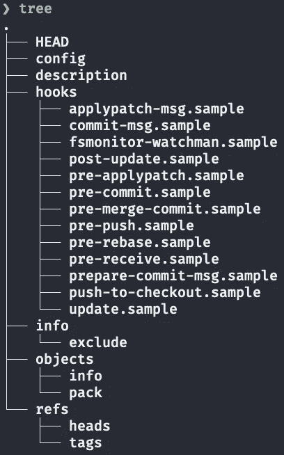
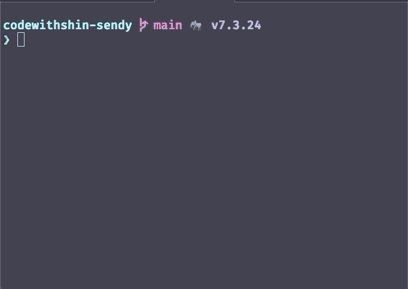

# 如何创建一个 Git 钩子来推送到你的服务器和 Github Repo

> 原文：<https://towardsdatascience.com/how-to-create-a-git-hook-to-push-to-your-server-and-github-repo-fe51f59122dd?source=collection_archive---------7----------------------->

## 对 Git 推送做出反应以更新您的远程服务器


蒂姆·莫斯霍尔德在 [Unsplash](https://unsplash.com?utm_source=medium&utm_medium=referral) 上拍摄的照片

# 介绍

Git 挂钩是 Git 在提交、推送和接收之前或之后执行的脚本。设置 Git 挂钩使您的开发和部署变得容易。

在本文中，您将学习如何创建一个在使用`git push`命令时执行的接收后 Git 挂钩。

我使用`$`作为本地终端提示，使用`#`作为远程服务器提示。同样为了简单起见，我使用**约翰**作为用户名和 Github 用户名，使用**yourdomain.com**作为我们的域名。

# 先决条件

在您的本地机器上已经有了一个工作的 Git 存储库。我们称之为`**newsletter**`。你的网站有一个 Linux 服务器(我用的是 Ubuntu 20.04)，你可以使用 ssh 从你的本地计算机连接到你的远程服务器。

# 步骤 1:在远程服务器上创建工作目录

## **/首页/约翰/简讯**

我假设你[保护了你的服务器](https://betterprogramming.pub/how-to-build-a-successful-self-hosted-email-newsletter-platform-4e2ec11eeec4#766f)并且在你的服务器上设置了[防火墙](https://betterprogramming.pub/how-to-build-a-successful-self-hosted-email-newsletter-platform-4e2ec11eeec4#94c0)。您可以使用 SSH 连接到您的服务器。

让我们连接到您的服务器:

```
$ ssh **john@yourdomain.com** // or use your IP address$ ssh john@167.99.123.45
```

一旦你在远程服务器上，创建一个新的目录，时事通讯:

```
# pwd
/home/john
# mkdir newsletter
# cd newsletter
```

在新目录中初始化一个空的 Git 存储库:

```
# git init --bare
```

这将省略工作目录，但创建我们需要的目录和文件。



git init —裸结构。图片作者。

## /var/www/时事通讯/public_html

在`/var/www`下新建一个目录。我们将把所有文件重定向到这个目录。

```
# sudo mkdir /var/www/newsletter/public_html
```

# 步骤 2:在本地 Gitrepo 上设置多个远程 URL

使用`git remote set-url`允许您设置多个 Git repo URLs。

使用`git remote -v`命令找出您当前的远程配置:

```
$ git remote -v
origin git@github.com:**john**/newsletter.git (fetch)
origin git@github.com:**john**/newsletter.git (push)
```

让我们设置远程 URL。一个用于我们的远程服务器，一个用于我们的 Github repo。

```
$ git remote set-url --add --push origin **john**[**@y**](mailto:shin@okadia.net)**ourdomain.com**:/home/**john**/newsletter
$ git remote set-url --add --push origin git@github.com:**john**/newsletter.git
```

你需要像上面一样运行两次`git remote set-url`**，因为第一次运行会覆盖当前的。**

**现在您应该有一个获取和两个推送:**

```
$ git remote -v
origin git@github.com:**john**/newsletter.git (fetch)
origin **john@yourdomain.com**:/home/**john**/newslette (push)
origin git@github.com:**john**/newsletter.git (push)
```

# **步骤 3-创建接收后文件**

**在远程服务器上，创建一个文件`~/newsletter/hooks/post-receive`。**

```
# cd ~/newsletter/hooks
# touch post-receive
```

**添加以下内容:**

**我们需要使文件可执行:**

```
# chmod +x post-receive
# $ ls -Al ~/newsletter/hooks
total 56
-rwxrwxr-x 1 shin shin  478 Apr 24 03:07 applypatch-msg.sample
-rwxrwxr-x 1 shin shin  896 Apr 24 03:07 commit-msg.sample
-rwxrwxr-x 1 shin shin 3079 Apr 24 03:07 fsmonitor-watchman.sample
**-rwxrwxr-x 1 shin shin  732 May  3 00:58 post-receive** -rwxrwxr-x 1 shin shin  189 Apr 24 03:07 post-update.sample
-rwxrwxr-x 1 shin shin  424 Apr 24 03:07 pre-applypatch.sample
...
```

**`post-receive`文件模式应该有`-rwxrwxr-x`。**

# **测试它**

**在您的本地机器上，运行`git push origin main`:**

```
$ git push origin main
Enumerating objects: 5, done.
Counting objects: 100% (5/5), done.
Delta compression using up to 4 threads
Compressing objects: 100% (3/3), done.
Writing objects: 100% (3/3), 303 bytes | 303.00 KiB/s, done.
Total 3 (delta 2), reused 0 (delta 0), pack-reused 0
remote: Push received! Deploying branch: main...
remote: Already on 'main'
To okadia.net:/home/john/newsletter
   2b35421..aa80729  main -> main
Enumerating objects: 5, done.
Counting objects: 100% (5/5), done.
Delta compression using up to 4 threads
Compressing objects: 100% (3/3), done.
Writing objects: 100% (3/3), 303 bytes | 303.00 KiB/s, done.
Total 3 (delta 2), reused 0 (delta 0), pack-reused 0
remote: Resolving deltas: 100% (2/2), completed with 2 local objects.
To github.com:john/newsletter.git
   2b35421..aa80729  main -> main
```

****

**使用我的服务器的例子。图片作者。**

# **结论**

**Git hook，`post-receive`，对于经常使用服务器的开发人员来说是一个非常好的工具。Git 有更多的客户端和服务器端挂钩工具供您使用。开始在你的项目中使用它怎么样？**

****通过** [**成为**](https://blog.codewithshin.com/membership) **会员，获得媒体上所有故事的访问权限。****

****

**[https://blog.codewithshin.com/subscribe](https://blog.codewithshin.com/subscribe)**

# **资源**

*   **[Githooks](https://www.git-scm.com/docs/githooks)**
*   **[用 Git 钩子在 DigitalOcean Droplet 上部署代码](https://macarthur.me/posts/deploying-code-with-a-git-hook)**