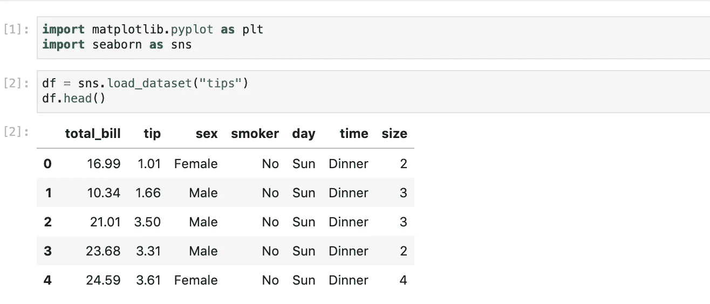
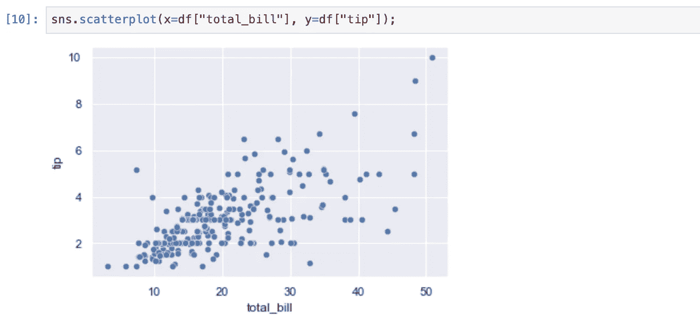
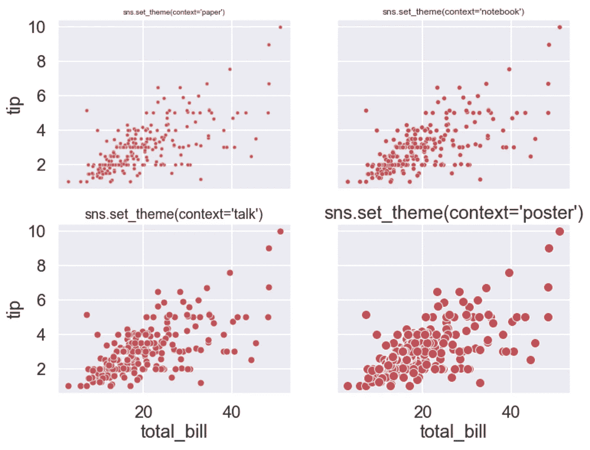
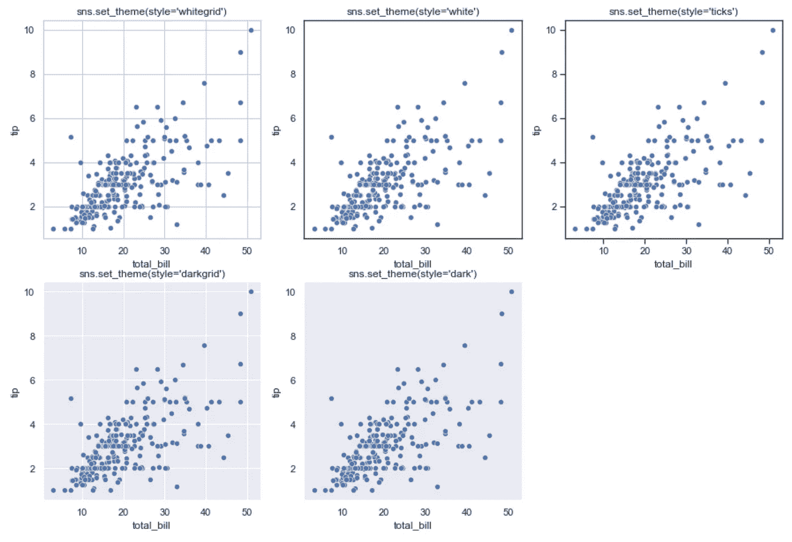
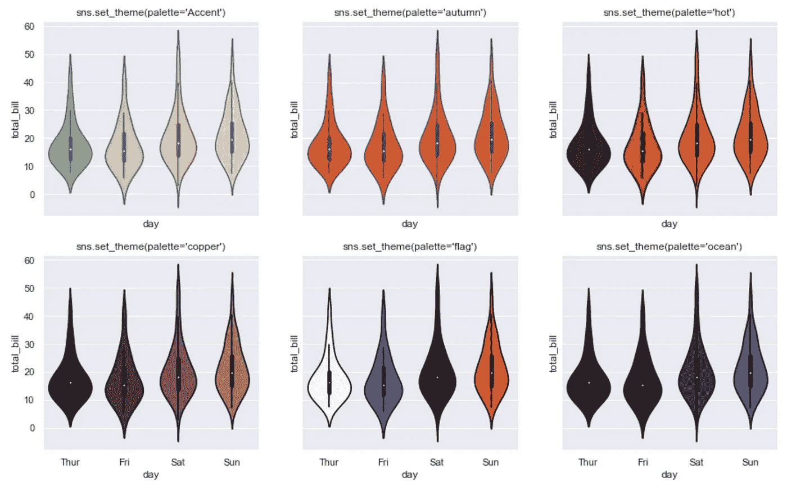
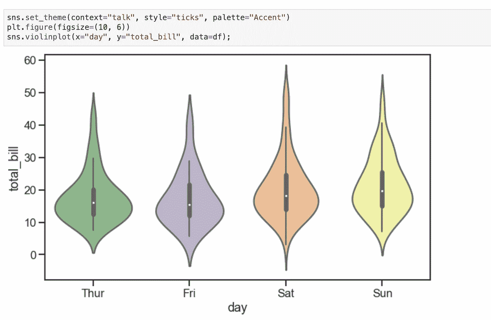
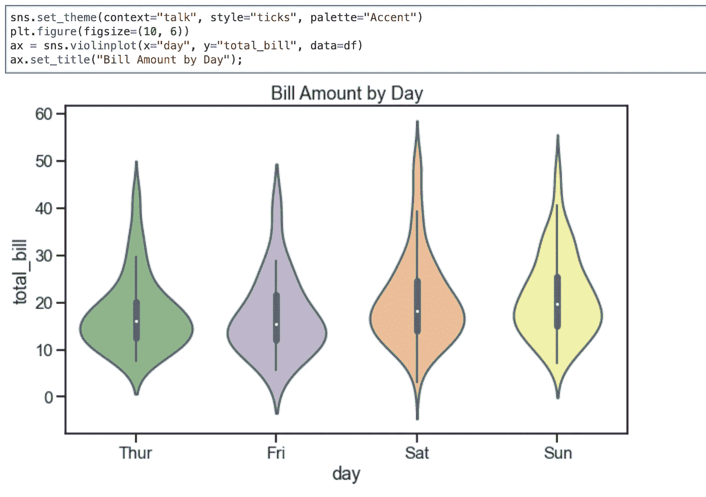
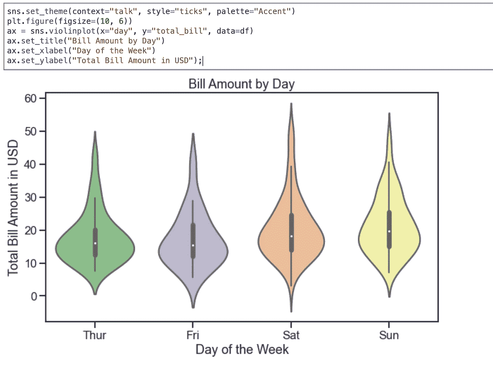

# 如何创建一个不难看的图形 Python 数据可视化的秘诀

> 原文：<https://towardsdatascience.com/how-to-create-a-non-ugly-figure-a-recipe-for-python-data-visualization-3793fde29e79?source=collection_archive---------18----------------------->

## 满足数据可视化需求的统一方法


由 [Max Duzij](https://unsplash.com/@max_duz?utm_source=medium&utm_medium=referral) 在 [Unsplash](https://unsplash.com?utm_source=medium&utm_medium=referral) 上拍摄的照片

当我们呈现数据来传达信息时，最有效的信息传递方式是使用数字，这与我们大脑的线路一致——我们获取的大部分信息都是视觉形式的。因此，数据可视化是数据科学家向外界展示他们的数据的关键技能，希望他们的项目能够被更好地理解。

作为一种开源编程语言，Python 吸引了开发人员的极大关注，由此产生了许多可供数据科学家使用的可视化工具。我并不想将他们进行正面比较。相反，我将只使用那些对我有效的方法，并且我想分享一个你可以自己尝试的常用方法。

这里没有秘密——我将使用`matplotlib`和`seaborn`重点介绍数据可视化，这可能是 Python 中最流行的可视化库。

事不宜迟，让我们开始吧。

## 配料——你所需要的

*   **您选择的 Python 编辑器。**可以是 PyCharm，VS Code，Jupyter Lab，或者你喜欢的任何东西。对于本教程，我将使用 Jupyter 实验室中运行的笔记本。你可以在我的 [GitHub](https://github.com/ycui1/Medium_Python_Tutorials/blob/master/data_visualization_sns.ipynb) 上找到笔记本。
*   **虚拟环境。**每个项目使用不同的虚拟环境是一个很好的实践，这简化了 Python 版本和第三方包的管理。虚拟环境管理，我推荐康达，你可以在这里找到说明[。](/beginner-friendly-virtual-environment-management-anaconda-pycharm-36178e20129f)
*   **Python 3.6+。它可以是 system one，或者理想情况下，是安装在您的虚拟环境中的一个版本。**
*   **安装需要的包:**`**seaborn**`**`**matplotlib**`**。**`seaborn`的安装应该会自动安装`matplotlib`，T5 是`seaborn`的依赖。**
*   ****一张草稿纸和一支铅笔。**听起来怪怪的？接下来我会告诉你怎么处理它们。**

****

**照片由 [Syd Wachs](https://unsplash.com/@videmusart?utm_source=medium&utm_medium=referral) 在 [Unsplash](https://unsplash.com?utm_source=medium&utm_medium=referral) 上拍摄**

## **一般步骤**

1.  ****在纸上画一道划痕。虽然你可以在脑海中想象这个数字，但如果你有一份草稿放在桌子上，可以直接看到，通常会更直观。****
2.  ****根据身材需要准备数据。**根据图形的性质，您需要相应地准备数据。应该注意的是，在你开始绘图之前，你的数据还没有准备好，这是可以的，而且经常发生。如果需要，您可以随时返回步骤 2。**
3.  ****设定整体主题。**有了`seaborn`就很容易设置一个整体主题，它会自动在幕后为我们应用很多默认设置，让人物好看。**
4.  **创建一个草图作为你的起点。不要担心任何事情——只需使用正确的绘图样式创建一个草图即可。**
5.  ****微调细节**:标题、x 和 y 标签等。无论你想做什么来让他们变得更好。**

****

**哈尔·盖特伍德在 [Unsplash](https://unsplash.com?utm_source=medium&utm_medium=referral) 上拍摄的照片**

## **步骤 1 和 2**

**这两步就交给你了。每个项目在数据可视化方面都有自己的需求，应该相应地准备数据。对于当前的教程，我们只使用属于`seaborn`包的 tips 数据集，如下所示。**

****

**数据一目了然(作者截图)**

## **第三步。设定整体主题**

**即使你什么都不做，`seaborn`会对我们的数据应用一些默认设置，当然它们看起来也不错。但是，要自定义人物的外观，应用一个整体主题是个好主意，它允许您以美学上一致的方式创建多个人物。下面是你如何设置默认主题。**

**设置主题**

**如您所见，所有参数都在`set_theme`方法中设置了默认值。为了向您展示每个参数的含义，让我们看看一个图形在默认主题下是什么样子的:**

****

**图使用默认主题(作者截图)**

**现在，是时候单独探究这些参数了。请注意，您可以将`set_theme`视为一种方便的方法，有单独的函数专门用于设置参数。只要适用，我都会提到这些函数。**

****设置上下文** 上下文参数有四个预先配置的选项:*纸张、笔记本、谈话、海报*。下图显示了每一个的外观。最能吸引你眼球的区别是标题和标记。
**替代功能看:**`**plotting_context**`**&**`**set_context**`**。****

****

**设置上下文(作者截图)**

****设置样式**
样式主要通过控制网格应用于图形的轴。有五种可能的预配置设置:*白色网格、白色、刻度、深色网格和深色*。下面显示了每个设置的示例。与`“white”`相比，除了`“ticks”`启用轴上的刻度标记外，一切都很简单。
**替代功能看:**`**axes_style**`**&**`**set_style**`**。****

****

**设置样式(作者截图)**

****设置调色板**
图形如果没有颜色就很无聊。如果你需要为身材的不同部分设置不同的颜色，这对我们大多数人来说都不是一件容易的事情。幸运的是，您可以选择一个调色板，自动将各种颜色应用到您的绘图中。有大量预先配置的调色板供您选择。这是部分清单。**

```
'Accent', 'Accent_r', 'Blues', 'Blues_r', 'BrBG', 'BrBG_r', 'BuGn', 'BuGn_r', 'BuPu', 'BuPu_r', 'CMRmap', 'CMRmap_r', 'Dark2', 'Dark2_r', 'GnBu', 'GnBu_r', 'Greens', 'Greens_r', 'Greys',
...
'turbo_r', 'twilight', 'twilight_r', 'twilight_shifted', 'twilight_shifted_r', 'viridis', 'viridis_r', 'vlag', 'vlag_r', 'winter', 'winter_r'
```

**如果您不知道如何找到调色板名称，一个简单的方法是从调用`sns.set_palette(“anything_you_want”)`时的错误消息中找到这个信息。
**替代功能看:**`**color_palette**`**&**`**set_palette**`**。****

****

**设置调色板(作者截图)**

**您还可以配置其他一些参数。但你可能会说，这三个对你身材的审美影响最大。请随意探索其余的参数。**

## **第四步。创建草图**

**如果你熟悉`seaborn`的可用选项，这对你来说可能不是问题。但是，如果您不是，最好找出您在支持的打印样式方面的选项。你可以在 seaborn 的网站上找到大量有用的例子，如下所示。**

**[](https://seaborn.pydata.org/examples/index.html) [## 示例库- seaborn 0.11.2 文档

### 编辑描述

seaborn.pydata.org](https://seaborn.pydata.org/examples/index.html) 

当您不确定想要选择的绘图的名称时，如果您正在使用 PyCharm，您可以简单地输入`sns.plot`并让 IDE 为您填充可用的绘图相关方法，如下所示。


seaborn 的可用地块(作者截图)

本教程不打算教你选择哪个图，因为它完全取决于数据和显示什么信息的目的。缩小选择范围的一个快速技巧是查看自动完成提示菜单右侧的绘图类型。一些重要的类别总结如下。

*   `seaborn.distributions`:一维连续数据，查看你的数据分布
*   `seaborn.categorical`:您的 x 值是不同的分类值
*   `seaborn.relational`:你的 x 值和 y 值是相关的，就像你在笛卡尔坐标系中工作一样
*   `seaborn.regression`:您想要对图形应用回归线

因此，假设您知道绘图类型，这一步只是创建一个没有任何配置的草图。为了简单起见，让我们选择 violin 图，它显示了不同类别中的值的分布。草图如下所示。



草图(作者截图)

*   如前所述，我们设置主题来应用整体样式设置。
*   然后我们使用`plt.figure(figsize=(10, 6))`启动指定尺寸的绘图。本质上，它创建了一个人物对象。
*   我们使用`violinplot`方法，指定分类变量(x 值)是一天，而连续变量(y 值，检查其分布)是总账单金额。

如你所见，草图实际上一点也不差。但是如果我们对一些细节进行额外的修正会更好。我们继续。** 

## **第五步。调整细节**

**一个常见的需求是给图形添加一个标题，如下所示。**

****

**添加标题(作者截图)**

**要添加标题，您需要理解当 seaborn 创建一个情节时，它会创建一个`matplotlib` axes 对象，通过它，您可以操纵细节。在我们的例子中，我们在 axes 对象上使用`set_title`来创建一个标题。**

**除了添加标题，我们还可以更改轴的标签。**

****

**更改标签(作者截图)**

**当然，您可以使用 axes 对象做许多其他事情。最好的学习方法是在自己身上尝试不同的设置。如果您有任何问题，您可以简单地参考轴对象的[文档](https://matplotlib.org/stable/api/axes_api.html)。**

**当您对您的数字感到满意时，您可以通过运行`plt.savefig(“the_name.png”)`来保存它以供以后参考。BTW:如果你使用`plt.show()`来显式调用图形的显示，你需要在显示之前保存图形，因为图形对象在你显示图形之后就不能保存了。**

## **结论**

**在本教程中，我们学习了创建一个在报告中使用的相当好看的图形的基本步骤。通过更好的微调和更多的耐心，一个图形可以更好——你只需要练习熟悉`matploglib`和`seaborn`的 API。**

**感谢阅读这篇文章。通过[注册我的简讯](https://medium.com/subscribe/@yong.cui01)保持联系。还不是中等会员？使用我的会员链接通过[支持我的写作(对你没有额外的费用，但你的一部分会员费作为奖励由 Medium 重新分配给我)。](https://medium.com/@yong.cui01/membership)**