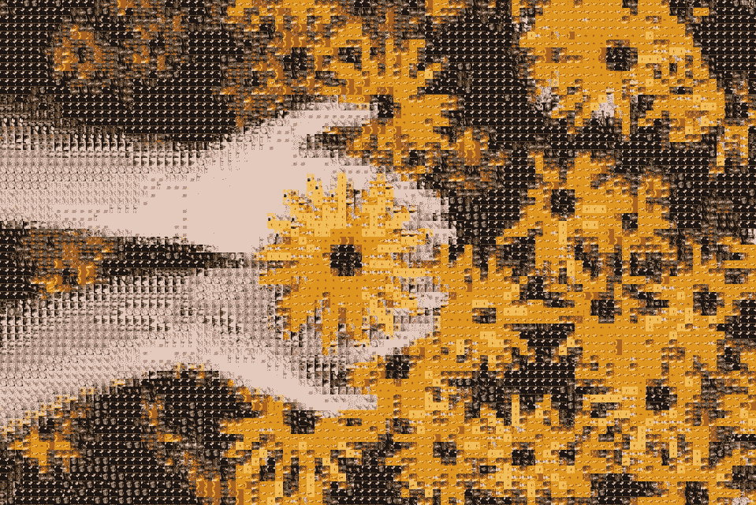
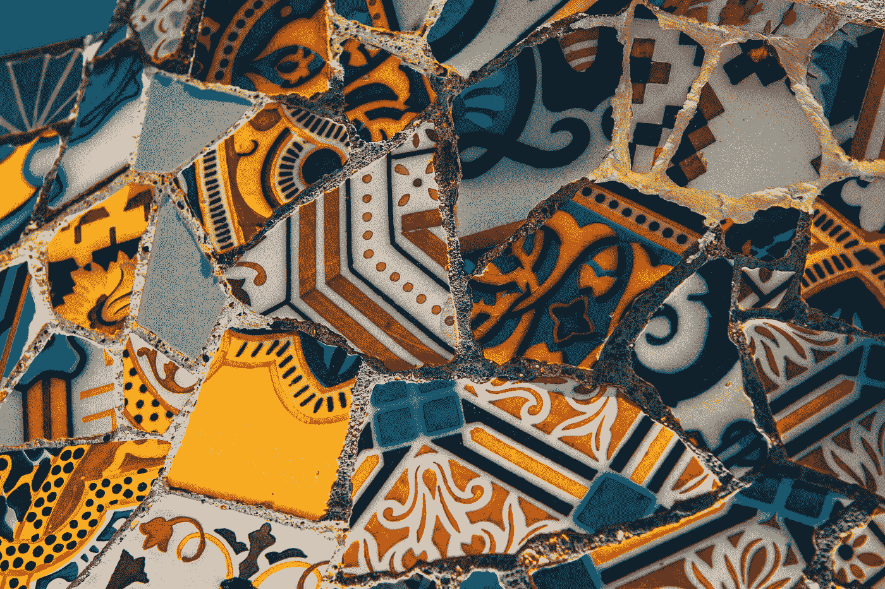
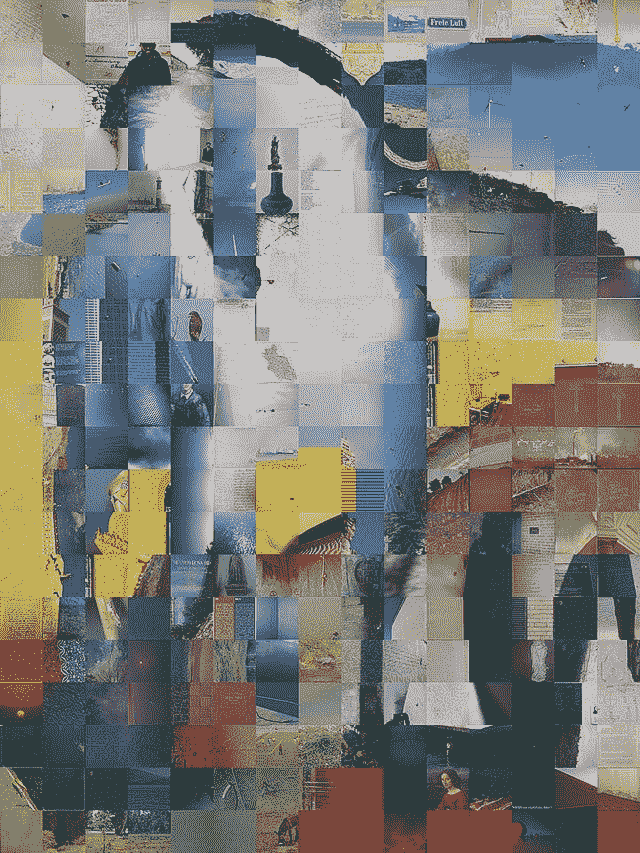
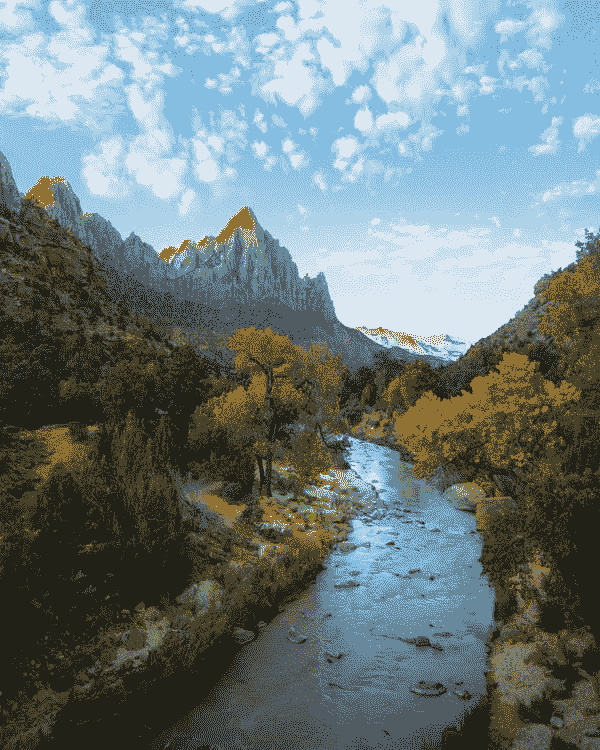
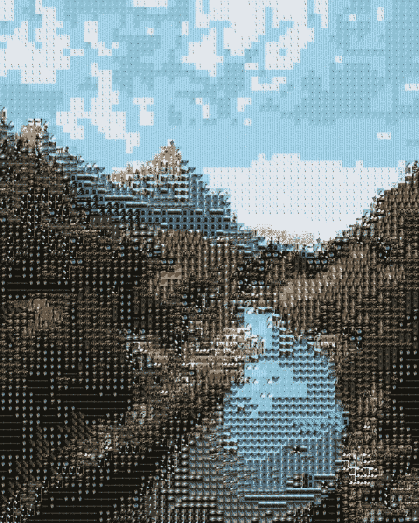
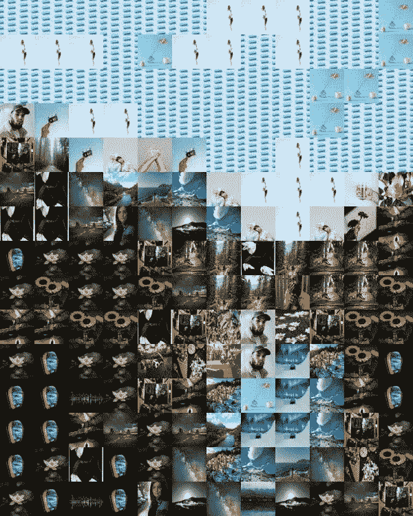

# 如何在 Python 中创建照片马赛克

> 原文：<https://towardsdatascience.com/how-to-create-a-photo-mosaic-in-python-45c94f6e8308?source=collection_archive---------3----------------------->

## Python 中照片马赛克的内幕



由来自 [Pexels](https://www.pexels.com/photo/person-holding-yellow-black-eyed-susan-flowers-in-bloom-1697912/?utm_content=attributionCopyText&utm_medium=referral&utm_source=pexels) 的 [Javon Swaby](https://www.pexels.com/@javon-swaby-197616?utm_content=attributionCopyText&utm_medium=referral&utm_source=pexels) 拍摄的照片拼接而成

虽然许多在线网站可以生成照片马赛克，但在本文中，我们将深入了解照片马赛克，并创建一个可以创建照片马赛克的 Python 脚本。

# 什么是照片马赛克？



Raimond Klavins 在 [Unsplash](https://unsplash.com?utm_source=medium&utm_medium=referral) 上拍摄的照片

马赛克是一种用灰泥固定的彩色小块组成的图案。它们通常被用作墙壁或地板上的装饰。



一张[蓝马 I](https://commons.wikimedia.org/wiki/File:Franz_Marc_Blaues_Pferd_1911.jpg) 的照片马赛克

另一方面，**照片拼接**是由较小的照片拼接而成的照片。

# 它是如何工作的？

要创建一个照片拼版，我们需要主照片和一系列平铺照片。为了获得更好的效果，拼贴照片应该具有不同的颜色和亮度级别。

然后，程序如下:

1.  像素化主照片。
2.  将每个像素替换为颜色最接近的图块照片。

听起来很简单，对吧？嗯，我们应该做更多的事情。但是我们将在下一节中讨论这个问题。

# 设置

我们将把所有磁贴照片放在一个名为`tiles`的文件夹中。

首先，我们需要导入一些模块。我们稍后会用到它们，并解释它们是做什么的。

然后，我们需要定义磁贴和主照片的路径，以及磁贴的大小。

# 导入照片

为了获取`tiles`文件夹中的所有文件，我们将使用 **glob** 。

我们将使用 **Pillow (PIL)的图像类**导入图块并调整它们的大小。

# 计算平均颜色

然后，我们计算每个瓷砖的平均颜色，并将其保存在一个数组中。

为了像素化主照片，我们将使用 **Pillow 的调整大小方法**缩小它。我们将调整它的大小，以便调整后的照片中的每个像素都与原始照片中的图块大小完全相同。

# 最接近的颜色？

现在，我们需要为调整后的照片中的每个像素找到平均颜色最接近的图块。

我们不会担心“接近”的数学定义以及什么是标准距离或 T2 距离。但是如果你感兴趣，颜色是 3D 矢量(RGB 而不是 XYZ)，所以它与 3D 空间中两点之间的距离相同。其可以被定义如下(欧几里德距离):


为了有效地做到这一点，我们将使用一个 [k-d 树](https://www.wikiwand.com/en/K-d_tree)(不需要理解它是如何工作的)，它是在 **scipy 的空间模块**中实现的。

我们必须从我们的平均颜色列表中创建一个 KDTree，然后使用**查询**方法进行搜索。

# 画瓷砖

现在，我们只需将图块绘制成输出照片。

# 结果



来自[像素](https://www.pexels.com/photo/photo-of-stream-during-daytime-3225517/?utm_content=attributionCopyText&utm_medium=referral&utm_source=pexels)的[迈克尔·布洛克](https://www.pexels.com/@michael-block-1691617?utm_content=attributionCopyText&utm_medium=referral&utm_source=pexels)的原始照片(左)，照片拼接(右)(所有照片来自[像素](http://www.pexels.com))

我们可以通过改变设置来获得不同的结果。



平铺尺寸 25×25(左)平铺尺寸 50×50(右)(所有照片来自[像素](http://www.pexels.com))

# 命令行界面

我们可以让我们的脚本直接从终端运行。我们将使用以下语法:

```
python3 mosaic.py main_photo_path tiles_path tile_width tile_height output_path
```

我们必须将源代码和设置代码部分替换为:

最终的脚本变成了:

我们已经看到了如何用 Python 创建一个简单的照片马赛克。虽然它如预期的那样完美地工作，但我们可以通过在可能的情况下支持使用不同的磁贴照片，或者通过允许亮度/饱和度调整来改进它。