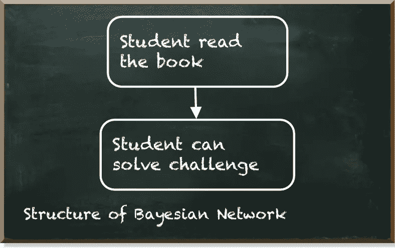

# 如何创建量子贝叶斯网络

> 原文：<https://towardsdatascience.com/how-to-create-a-quantum-bayesian-network-5b011914b03e?source=collection_archive---------28----------------------->

## 实用指南

量子机器学习要不要入门？看看 [**动手量子机器学习用 Python**](https://www.pyqml.com/page?ref=medium_qbn&dest=/) **。**

在我的[每周量子机器学习挑战](https://pyqml.substack.com/p/what-are-the-chances-youll-solve)中，我问了一个简单的问题:*“一个学生能解决挑战吗？”*

在这篇文章中，我想告诉你如何用量子贝叶斯网络(QBN)来回答这个问题。

贝叶斯网络是对不确定领域的知识进行建模的概率模型。我们可以将这些模型表示为带有节点和边的有向无环图。

[qbn 是入门量子机器学习的绝佳工具](/the-gentle-way-to-start-with-quantum-machine-learning-5e9ff61d886b)。它们直观、易于理解，然而，它们使用基本的量子计算概念。

在问题描述中，我们说学生能否解决挑战，取决于她是否看了我的书 [**用 Python**](https://www.pyqml.com/page?ref=medium_qbn&dest=/) 动手做量子机器学习。如果她做到了，她有 90%的机会解决挑战。如果她没读过这本书，她解决挑战的几率是 50%。此外，我们说 60%的学生读过这本书。

我们的问题描述包含三种不同类型的概率。

我们有两个条件概率:

*   如果学生读了这本书，她就能解决 90%的问题。
*   如果她没有，她解决了 50%的问题。

我们得到了一个边际概率:

*   60%的学生读了这本书

如果你需要刷新一下这些不同类型的概率，以及如何在量子电路中对它们建模，你可能会想要阅读这两篇帖子([量子编程——针对非数学家](/quantum-programming-for-non-mathematicians-bd6956d63b7c)和[量子计算实践](/quantum-programming-for-non-mathematicians-bd6956d63b7c))。

现在让我们来实现这些概率。我们从一点点准备开始。我们导入这些库，定义一个有用的函数`prob_to_angle`，并创建一个具有两个量子位的量子电路。

接下来，我们让第一个量子位(在位置 0)代表 60%的学生读过这本书的边际概率。因此，我们使用 RY-gate，将预期概率作为参数调用`prob_to_angle` 函数的结果。

如果学生读过这本书，我们可以直接继续对条件概率建模。如果第一个量子位是 1，就是这种情况。只有当第一个量子位为 1 时，我们才在第二个量子位上应用代表 90%的旋转。这就是受控 RY-gate 的作用。

如果学生没有阅读这本书，为了应用条件概率，我们首先必须通过应用 X 门翻转第一个量子位的振幅。随后的 X-gate 恢复了这种效果。

让我们看看完整的电路。

当我们运行这个电路时，我们看到下面的概率分布。

右上角的数字代表第一个量子位的值。它代表学生是否读过这本书。左下角的量子位代表学生是否解决了问题。为了回答解决问题的总体(边际)概率，我们必须将第二个量子位为 1 的所有状态相加。

或者，我们可以简单地测量第二个量子位。下面的清单描述了完整的源代码。

该结果与之前模拟的总和之间的微小差异是由于我们使用的`qasm_simulator`的经验性质。

# 结论

我们看了如何用 Python 实现一个简单的 QBN。我们了解到，我们可以用量子位来模拟节点，用量子门来模拟边缘。更具体地说，RY 门让我们模拟边际概率，受控 RY 门让我们模拟条件概率。

要回答学生能否解决挑战的问题，我们只需测量相应的量子位。答案是这个学生有 74%的机会解决这个问题。

量子机器学习要不要入门？看看 [**动手量子机器学习用 Python**](https://www.pyqml.com/page?ref=medium_qbn&dest=/) **。**

免费获取前三章[点击这里](https://www.pyqml.com/page?ref=medium_qbn&dest=/)。