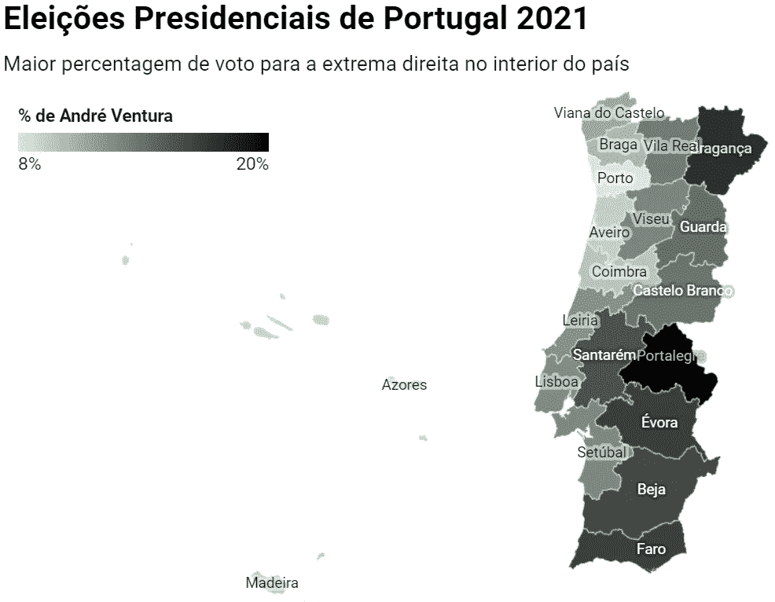

# 如何创建快速选举数据可视化:以 2021 年葡萄牙总统选举为例

> 原文：<https://towardsdatascience.com/how-to-create-a-quick-election-data-visualisation-portuguese-presidential-race-2021-as-an-example-3855a2728b1e?source=collection_archive---------39----------------------->

## **选举似乎会吐出无穷无尽的数据，但你需要找到正确的角度并快速完成，这解释了为什么在这次选举中我们选择关注排名第三的候选人**

别担心，我会翻译这个！(奥利弗·卡灵顿&若昂·席尔瓦使用数据包装器制作的图表)

2021 年的第一次欧洲选举是选举葡萄牙行政首脑。毫不奇怪，在争夺选票的七名候选人中，获胜者是现任的 72 岁的社会民主党的马塞洛·雷贝洛·德索萨。然而，这里的数据-viz 故事不是谁赢了，而是第三名的极右翼候选人令人担忧的成功。

# 找到合适的角度去追求

> 追踪极右民粹主义的崛起比以往任何时候都更加重要

在任何数据-viz 中，你都希望以一种帮助观众更好地理解主题的方式来分析和可视化数据。关注在任总统不会有太多启发性，他获得了 60.7%的选票和每个城市的大多数选票。

相反，我们关注的是来自极右翼政党 Chega 的 André Ventura，翻译过来就是“T2 够了！’。这是一个新成立的民族主义政党，与新纳粹团体有联系。他获得了 11.9%的选票，以微弱优势被社会党的安娜·戈梅斯击败，获得 13%的选票，位居第二。

这一特殊角度的有趣之处在于，葡萄牙被视为欧洲政治版图中没有极右势力的例外。47 年前，康乃馨革命将这个国家从萨拉扎主义的独裁统治中解放出来，走向民主。直到现在，它还在抵制当代政治中的民粹主义趋势。

2019 年 10 月，文图拉以微弱优势赢得议会席位，这并不被视为一件大事。但从那以后，这位极右翼政客利用这个平台来建立自己的合法性，并利用新冠肺炎造成的经济问题。

在我们的数据中，我们显示了投票给文图拉的百分比，在马德拉和亚速尔群岛的每个地区和自治区，从 8%到 20%不等。该地区的颜色越深，支持文图拉的选票就越多。你可以看到极右翼的选票更多地集中在葡萄牙更偏远的内陆地区以及南部的贝哈和法罗地区——旅游热点和历史上的共产主义据点。

我们考虑的其他选择是根据第二名候选人或第二名和第三名候选人之间的票数差异来给区域着色，但我们决定采用上述数据——即最佳故事。2021 年美国国会大厦被攻占后，追踪极右翼民粹主义的崛起比以往任何时候都更重要。

# 用不同层次的细节来测试你的地图

> 人们希望看到每个地区如何投票，并找到视觉模式

地图将是主要的数据类型——也就是说，你可以用它来将选举数据变得生动。这是因为选举结果与地区有关，如国家、地区、议会，甚至邮政编码。人们希望看到每个地区的投票情况，并找到视觉模式或全国各地不同的主流意识形态。例如，2016 年英国英国退出欧盟投票显示了城市和农村地区的明显差异。

这些葡萄牙选举结果可以分为 20 个大区或 308 个小得多的市。这给了我们一个机会来看看哪张地图最符合结果。我们选择了地区而不是市，因为这样更容易看到关键趋势。

使用地图时，一定要记住地图中的区域在人口规模上是不相等的，因为一个国家的主要城市会聚集在不同的区域。波尔图区在地图上看起来可能很小，但它拥有第二大人口——比 9 个人口最少的区加起来还多。

美国的选举地图就是一个很好的例子，无论结果如何，它都倾向于显得更红，因为南部和中西部的大州几乎总是投票给共和党。Karim Douï eb 用他们出色的动画突出了这一点，提醒我们*“英亩不投票，人们投票”*。

# 最后的润色总是很重要

> 考虑你的观众是很重要的

颜色在选举数据中极其重要。政党是与特定的色调联系在一起的，除非引起混乱，否则应该保留这些色调。例如，在英国，苏格兰民族主义党的黄黑色和自由民主党的黄色在不并排的情况下看起来非常相似。我们选择了一个类似于 Chega 的深色调色板，最深的阴影表示他获得了最高的投票率。

考虑你的受众也很重要。葡萄牙民粹主义极右势力姗姗来迟的发展可能会引起许多人的兴趣，但显然主要是葡萄牙人自己。大多数葡萄牙人说英语，然而，使用葡萄牙语单词是一种抓住葡萄牙观众眼球的方式，让他们知道这是专门为他们准备的。

## 用于创建数据的数据和工具——即

我们下载了[的官方选举结果](https://www.presidenciais2021.mai.gov.pt/resultados/territorio-nacional)，并使用[的 datawrapper.de](https://www.datawrapper.de/) 创建了我们的“choropleth 地图”，使用了他们的葡萄牙政治区域地图。

找到我们的推文(通常是英文的！)像这样在[@ olliecarrington](https://twitter.com/olliecarrington)&[@ jpvsilva 88](https://twitter.com/JPVSilva88)