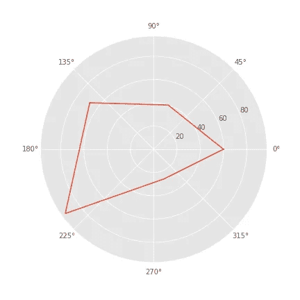
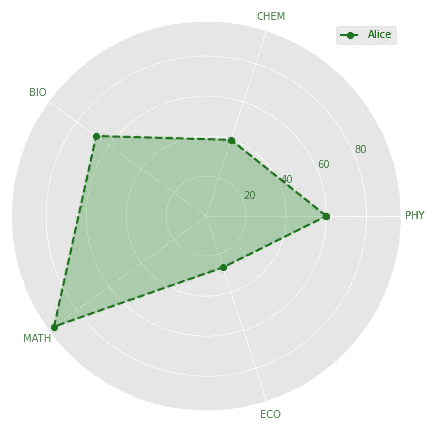
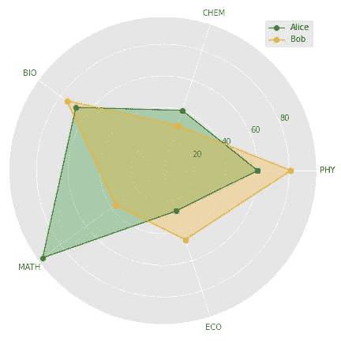
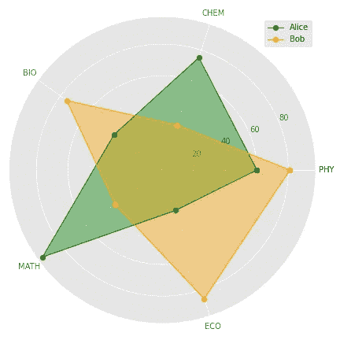

# 如何用 Python 创建雷达图

> 原文：<https://towardsdatascience.com/how-to-create-a-radar-chart-in-python-36b9ebaa7a64?source=collection_archive---------4----------------------->

## 雷达图是一种用于比较多个变量的可视化技术。这是一个关于如何用 python 创建雷达图的教程。

***雷达图*** ，又称 ***蜘蛛图*** 或 ***网络图*** 是一种用于比较多个数量变量的图形方法。这是一个二维极坐标可视化。

这是一个关于如何用 python 制作雷达图的教程。

## 导入库

我们将使用[*Matplotlib*](https://matplotlib.org/)*库进行可视化，使用 [*NumPy*](https://numpy.org/) 库进行几个数学函数。*

```
*import numpy as np
import matplotlib.pyplot as pltplt.style.use('ggplot')*
```

*注意，我已经将 *matplotlib* 的样式设置为 *ggplot* ，你可以设置自己喜欢的样式或者使用默认样式。*

## *可视化数据*

*我们将使用雷达图可视化两名学生- *爱丽丝*和*鲍勃*在五个科目中获得的分数。
科目和分数以列表形式提供。*

```
*subjects=['PHY','CHEM','BIO','MATH', 'ECO']
alice=[60,40,68,94,27]
bob=[81,30,75,37,46]*
```

## *获取角度*

*在本例中，我们使用雷达图来显示 5 个变量。因此，图表将有 5 个极轴。*

*圆内的总角度为 360 度(2π弧度)。每个轴之间角度将是 72 度(360/5)。*

**Matplotlib* 使用弧度角度准备极坐标图。我们可以使用 numpy 的*行间距*函数获得角度，如下所示。*

```
*angles=np.linspace(0,2*np.pi,len(subjects), endpoint=False)
print(angles)**Output:**[0\. 1.25663706 2.51327412 3.76991118 5.02654825]*
```

*注意*端点*参数必须设置为假。*

***完成整圈***

*我们已经获得了每个变量的角度。然而，这只能生成圆的五分之四，我们必须在数组的末尾添加第一个角度来完整地描述圆。*

```
*angles=np.concatenate((angles,[angles[0]]))
print(angles)**Output:** [0\. 1.25663706 2.51327412 3.76991118 5.02654825 0.]*
```

*类似地，必须为用于可视化的所有其他数组/列表追加第一个值，以保持长度一致性。*

```
*subjects.append(subjects[0])
alice.append(alice[0])
bob.append(bob[0])*
```

## *绘制雷达图*

*在 *add_subplot* 函数中设置 *polar=True* 可以绘制一张基本雷达图。并提供*角度*和*值*作为*绘图*函数的自变量。*

```
*fig=plt.figure(figsize=(6,6))
ax=fig.add_subplot(polar=True)
ax.plot(angles,alice)
plt.show()*
```

**

*作者图片*

## *定制雷达图*

*我们可以通过添加更多信息来定制雷达图。*

***线条和标记** 线条和标记样式可通过在*绘图*功能中提供参数来改变。
在下面的代码中，使用*位置参数*设置线条和标记样式，类似于 *matplotlib* 折线图。
使用 *plot* 函数的 *color* 参数设置线条颜色。*

***填充绘图区域**
绘图可以使用*填充*函数填充，提供*角度*和*值*作为参数。
使用*颜色*和 *alpha* 参数可以设置颜色和不透明度。在比较多个实体时，使用对比色和较低的 alpha 值是一个很好的做法。*

***添加极坐标网格和标签** 我们可以在上图中观察到，极坐标轴彼此间隔 45 度，角度作为标签提供。
使用 *set_thetagrids* 功能可以定制角度和标签的间距。*

***添加图例** 通过使用 plt.legend 函数，并在 plot 函数内设置标签，可以添加图例。*

***添加或删除网格** 网格功能可以用来显示/隐藏圆形网格。*

```
*fig=plt.figure(figsize=(6,6))
ax=fig.add_subplot(polar=True)#basic plot
ax.plot(angles,alice, 'o--', color='g', label='Alice')
#fill plot
ax.fill(angles, alice, alpha=0.25, color='g')
#Add labels
ax.set_thetagrids(angles * 180/np.pi, subjects)plt.grid(True)
plt.tight_layout()
plt.legend()
plt.show()*
```

**

*作者图片*

## *爱丽丝 vs 鲍勃*

*最后，我们到了教程中备受期待的部分，爱丽丝如何对抗鲍勃？这个问题可以通过将 Alice 和 Bob 的雷达图组合在同一个图表中来回答。*

```
*fig=plt.figure(figsize=(6,6))
ax=fig.add_subplot(111, polar=True)#Alice Plot
ax.plot(angles,alice, 'o-', color='g', linewidth=1, label='Alice')
ax.fill(angles, alice, alpha=0.25, color='g')#Bob Plot
ax.plot(angles,bob, 'o-', color='orange', linewidth=1, label='Bob')
ax.fill(angles, bob, alpha=0.25, color='orange')ax.set_thetagrids(angles * 180/np.pi, subjects)plt.grid(True)
plt.tight_layout()
plt.legend()
plt.show()*
```

**

*作者图片*

*只要浏览一下雷达图，我们就能发现爱丽丝的数学成绩比鲍勃好得多。
它们在生物学和化学方面的表现不相上下。鲍勃在物理和经济方面的表现比爱丽丝好。
这就是雷达图的优势，在比较多个变量上的几个实体时非常容易理解。*

*雷达图是比较 2-4 个实体和 3-10 个定量变量的理想工具。大量的实体或变量会使图表混乱，难以理解。*

## *资源*

*教程的全部代码可以在 GitHub 库中找到。*

## *您可以在此处访问视频格式的教程:*

*[https://www.youtube.com/watch?v=_VdOPQiaN64](https://www.youtube.com/watch?v=_VdOPQiaN64)*

## *成为会员*

*我希望你喜欢这篇文章，我强烈推荐 [**注册*中级会员***](https://abhijithchandradas.medium.com/membership) 来阅读更多我写的文章或数以千计的其他作者写的各种主题的故事。
[你的会员费直接支持我和你看的其他作家。你也可以在媒体](https://abhijithchandradas.medium.com/membership)上看到所有的故事。*

## *作者的类似文章*

*<https://medium.com/geekculture/generate-gantt-chart-in-python-9d1e1fe9103e>  <https://medium.com/geekculture/how-to-plot-a-treemap-in-python-48743061cfda>  </how-to-perform-a-quadrant-analysis-in-python-9f84d36f8a24>  

作者图片*