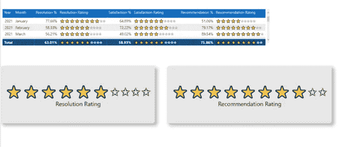
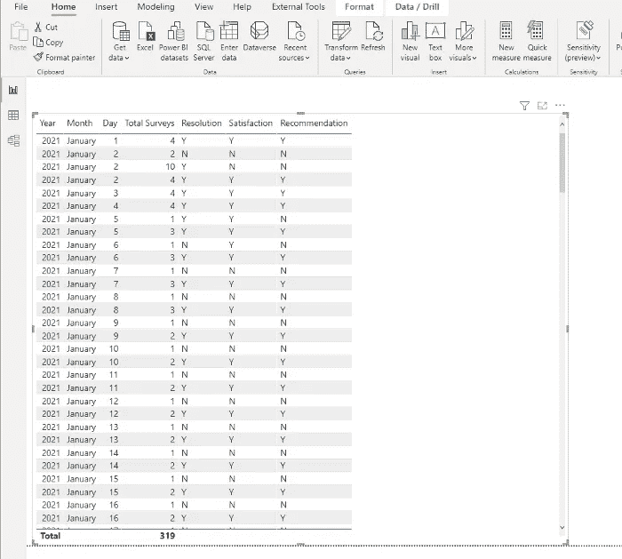
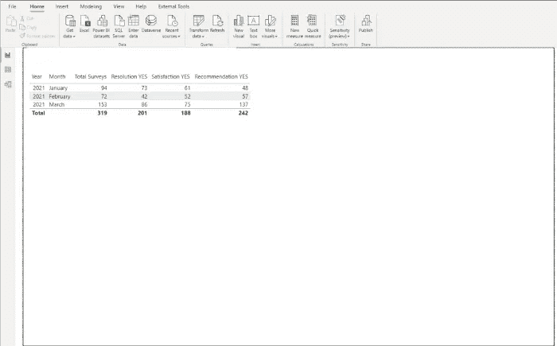
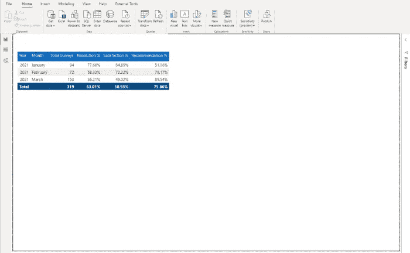
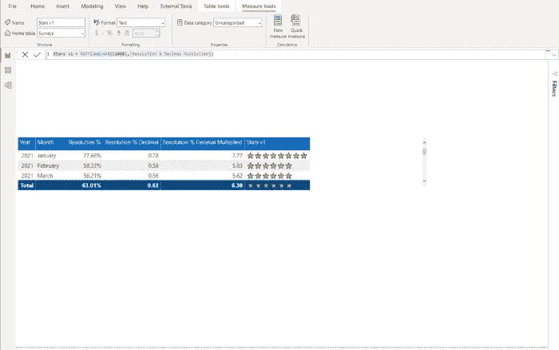

# 如何使用 DAX 在 Power BI 中创建评级可视化

> 原文：<https://towardsdatascience.com/how-to-create-a-rating-visual-in-power-bi-using-dax-859c57a96daf?source=collection_archive---------24----------------------->

## 了解如何通过编写几行 DAX 来创建自定义评级视觉效果



作者图片

在我的上一篇文章中，我解释了如何使用 *UNICHAR()* DAX 函数利用一个非常简单的技术[在轴上和切片器](/enhance-your-power-bi-report-with-images-on-axis-a4227b650e4a)中显示图像和图标。现在，我希望对此进行扩展，并展示如何使用简单的 DAX 创建评级可视化！让我不谦虚地说，使用这个技巧，你可以自由地说，你创造了自己的自定义视觉！

# 搭建舞台

正如在我之前的帖子中一样，我将使用一个与支持代理与客户互动相关的数据集—作为提醒，代理通过聊天、电子邮件和电话与客户沟通，在互动完成后，客户可以填写调查并表达她的/他的意见。要求客户回答三个问题:

*   ***解决方案*** —我的问题被支持代理解决了吗？
*   ***满意度*** —我对分辨率满意吗？
*   ***推荐*** —我会向他人推荐公司的服务吗？

我将使用与之前相同的数据集，但只关注调查结果。以下是 Power BI 中导入的原始数据:



作者图片

让我们首先试着从这个数据集中获得一些洞察力——例如，有多少客户对服务感到满意，其中有多少会推荐该公司的服务。我将创建三种方法来计算积极响应的调查:

```
Resolution YES = CALCULATE(
                        COUNT(Surveys[Interaction ID]),
                        Surveys[Resolution] = "Y"
                        )Satisfaction YES = CALCULATE(
                        COUNT(Surveys[Interaction ID]),
                        Surveys[Satisfaction] = "Y"
                        )Recommendation YES = CALCULATE(
                        COUNT(Surveys[Interaction ID]),
                        Surveys[Recommendation] = "Y"
                        )
```

如果我将这些指标拖到我的报告中，我可以获得一些，至少是基本的，关于客户满意度的见解:



作者图片

还不错，但是企业会问的第一个问题是:对我们的服务满意的客户比例是多少？那么，让我们来创建一个计算肯定答案百分比的方法:

```
Resolution % = DIVIDE([Resolution YES], [Total Surveys],0)Satisfaction % = DIVIDE([Satisfaction YES], [Total Surveys],0)Recommendation % = DIVIDE([Recommendation YES], [Total Surveys],0)
```

不要忘记将这些指标格式化为百分比:)

并且，在我格式化我的表格之后，报告看起来非常好:



作者图片

# 将用户体验推向新的高度

好了，这就达到了目的，报告消费者可以很快看到满意客户的百分比。然而，如果我想让他们“感受”评级体验——你知道亚马逊、网飞等网站上的那些好明星。向你展示产品的等级。Power BI 不提供现成的可视化评级。你可以从 App Source Marketplace 获得它(至少它以前存在过，我猜它现在仍然可用)，但是…

如果我告诉你，你可以通过写一些简单的 DAX 来创建一个评级可视化？！

让我们卷起袖子开始工作吧。我们的想法是将百分比显示为报告中的星号。上次，我们创建了一个图标的**列**，包含它们的 Unicode 值，作为占位符。这一次，我们想建立一个**衡量指标**，来表达客户满意度背后的数字。同样，我们将利用 UNICHAR()函数，但方式略有不同。

它应该是这样工作的:对于百分比值的每个十进制，我想显示一个星号—简单地说，如果百分比值是，比如说，63%，我将显示 6 个星号…如果值是 72%，我将显示 7 个星号，依此类推。让我向你展示我们如何实现这一点。

我表中的百分比不过是小数，用百分比表示。也就是说，63.01%本质上是 0.63(如果我们把它切到小数点后两位)，58.93%是 0.59，以此类推。现在，我将复制这些度量，但我会将它们格式化为十进制数:


作者图片

我的表格现在显示了客户回答的小数值和百分比。我现在将使用 UNICHAR()函数在我的表中显示星号。但是，为了显示适当数量的星星——记住，53%是 5 颗星，63%是 6 颗星，等等。—我必须对我的度量进行一些修改。

我会把结果乘以 10，所以 0.78 会变成 7.8，0.56 会变成 5.6，以此类推。然后，我可以从结果中检索整数值，并设置星形符号的外观！

```
Resolution % Decimal Multiplied = [Resolution % Decimal] * 10
```

我现在将使用 REPT() DAX 函数，它基本上重复定义的文本，重复的次数是您在该函数的第二个参数中指定的次数。在我的例子中，我是这样写的:

```
Stars v1 = REPT(UNICHAR(11088),[Resolution % Decimal Multiplied])
```

让我停下来解释一下这个度量的特别之处:它将重复第一个参数，这是 Unicode 值 11088 的 Unicode 表示，乘以我们的百分比值中的十进制数。多酷啊！



作者图片

如您所见，该函数足够“智能”,可以像您预期的那样对多个星进行四舍五入，因此，77.66%表示为 8 个星，而 58.33%和 56.21%显示为 6 个星。

太棒了！但是，如果我想让我的用户能够立即发现评级，而不需要数星星呢？换句话说，我想显示最大可用值(在我们的例子中是 10 颗星)，然后，根据百分比，一些星将保持为空。简单来说，如果百分比值是 77.66%，我想显示 8 颗黄星和 2 颗空星(和亚马逊一样，呵呵)。

让我们开始写我们的最终措施:

```
Stars v2 = [Stars v1]&(REPT(UNICHAR(10025),10-[Resolution % Decimal Multiplied]))
```

那么，我们在这里有什么:措施的第一部分是完全相同的，因为我们想要显示我们的积极的星星。但是，神奇的事情发生了:由于 REPT()函数处理文本值，我们可以简单地连接另一部分——在这一部分中，我们显示 Unicode 值 10025 的 Unicode 符号(空星号),然后我们希望重复它的次数，次数等于 10(这是星号的最大值)和我们的“正”星号的数量之间的减法值——因此剩余的次数将显示空星号。


作者图片

很棒，不是吗？

# 结论

看了上面的插图，你可能会得出结论，我们已经成功做到了！我们仅使用 DAX 创建了一个显示评级的自定义视觉效果。

我要再重复一遍:Power BI 是一个非常棒的工具，因为它为您提供了惊人的灵活性，可以用多种不同的方式讲述您的数据故事。只需很少的创意和一些简单的调整，你就可以为你的用户创造一个难忘的体验。

在本文中，我已经向您展示了如何通过编写几行 DAX 代码来实现(im)可能性并创建您自己的自定义可视化！

感谢阅读！

成为会员，阅读 Medium 上的每一个故事！