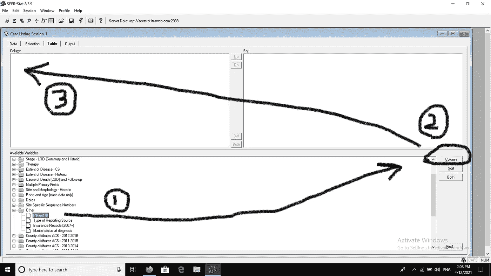
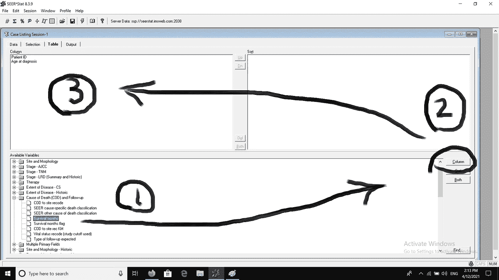

# 如何从 SEER 数据库创建一个简单的 Excel 数据集

> 原文：<https://towardsdatascience.com/how-to-create-a-simple-excel-data-set-from-the-seer-database-6f1794249fa3?source=collection_archive---------18----------------------->

## SEER*Stat 软件的一个应用

作者使用 Canva 制作的图像

在以前的文章中，我强调了监测、流行病学和最终结果(SEER)数据库的价值，它是全世界研究人员随时可获得的基于人群的癌症数据来源。

简而言之，如果您是一名对癌症流行病学充满热情的有抱负的研究人员，您可以使用 SEER 数据库来提取数据，您可以立即或稍后使用这些数据来运行统计测试并获得有价值的见解。

<https://ame48.medium.com/this-database-will-save-you-tons-of-time-and-effort-towards-publishing-your-first-cancer-research-b1e3888c3dc>  

为了更快地进入角色并开始使用 SEER 数据库，我建议您观看以下视频，其中我解释了如何访问 SEER 数据库，以及下载并安装 SEER*Stat 软件，您应该使用该程序从 SEER 数据库中提取癌症相关数据。

阅读并观看了上述资源后，您现在应该已经下载了 SEER*Stat 并安装在您的计算机上。此外，您应该已经通过电子邮件收到了您的用户名和密码，以便开始提取数据。

我打算做的是从 SEER 数据库中提取一个小数据集，并将这些数据转移到 Microsoft Excel 文件中，以便用统计软件(如 JMP、R 或 Python)打开它，并可视化数据或用它进行一些数据分析。

但是在进行任何统计测试之前，我们应该先在 Excel 中保存我们的数据，这是我想在字里行间教给你的。

# 分析样本

首先要做的是指定要提取数据的癌症病例组。出于演示的目的，为了获得一个小的数据集(大约 100 个案例)，我将向我的选择语句添加更多的条件，以便达到目标样本。

因此，登录 SEER*Stat 后，让我们单击“案例列表”会话。请参见下面上传的截图，了解在哪里可以找到“案例列表”会话。

单击“case listing”会话后，这是可用数据库的视图，您可以从中提取数据。默认情况下，突出显示的数据库将是最新的数据库，除非您另外指定。

我将忽略最近的数据库，选择标题为*“发病率— SEER 18 Reg 研究数据+卡特里娜飓风影响路易斯安那州案例，2017 年 11 月(1973–2015)”的数据库。*这个标题意味着我们提取的数据来自 18 个癌症登记处，包括 1973 年至 2015 年间诊断的病例，并于 2017 年 11 月提交到 SEER 数据库。

点击所需的数据库后，它将以蓝色突出显示，您的计算机将花费几秒钟时间链接到所需的数据库。此外，所选数据库的建议引用将被更改，以匹配您将使用的数据库。看下面截图就知道区别了。

现在，您可以点击“选择”选项卡，开始选择您的癌症病例。

点击“选择”选项卡后，您将看到下面的默认选择屏幕。这是在您指定任何选择标准之前。它将如下所示。

这是我们提取过程中最重要的一步。

分析样本。

## 我将根据以下选择标准选择一个样本:

1.  附加说明的胰腺癌病例。
2.  女性。
3.  黑人。
4.  2010 年确诊。
5.  离婚了。

> ***这产生了一个大小为 110 个案例的分析样本。完美！***

这就引出了我们如何向 SEER*Stat 提供我们的选择标准，以获得我们的目标样本。

让我们从选择胰腺癌的病例开始。

从我们最后的截图:

(1)单击“编辑”选项卡。

(2)单击“部位和形态”处的(+)号

(3)点击“现场记录 ICD-O-3/世卫组织 2008”。运算符设置为 is = to。

(4)向下滚动数值，直到到达“胰腺”。点击它。

(5)单击“确定”。

单击“确定”后，您将自动发现您选择的标准已添加到选择语句中(参见下面的屏幕截图)。

基于之前的选择标准，我们现在将选择“女性”。为此，请使用 SEER*Stat 软件遵循这些说明。

(1)单击“编辑”选项卡。

(2)单击“种族、性别、年份、注册地、县”处的(+)号

(3)点击“性”。运算符设置为 is = to。

(4)点击“女性”。

(5)单击“确定”。

然后，我们将使用与上一步中选择“女性”相同的方法和步骤来选择“黑色”。请注意，在(5)每一步单击“确定”后，选择语句的行数将增加，增加的数量是您将输入 SEER*Stat 的选择标准的数量。

然后，我们用同样的方法选择“2010 年”作为诊断年份。请看下面截图，看详细步骤。

然后，我们将使用相同的方法选择“离婚”，但这一次，我们要在一个名为“其他”的文件夹内找到它。单击该文件夹左侧的(+)号后，我们将找到多个文件。然后，我们将点击名为“诊断时的婚姻状况”的文件。从这里开始，值“离婚”将显示在运算符右侧的值中，如下所示。

然后，下面的选择语句将最终包含我们之前陈述的所有选择标准。

此时，我们应该已经完成了选择过程，我们应该转到“table”选项卡，以便开始设计数据表，我们最终会将该数据表转换为 Microsoft Excel 数据集。

那么，让我们继续，单击“表格”选项卡。这将把我们带到下面的界面。

它是这样工作的。我们从下面截图底部的“可用变量”列表中选择变量。通过单击文件夹左侧的(+)符号打开黄色文件夹，然后单击选定文件夹下的变量文件，即可选择变量。在点击(选择)变量后，我们点击截图最右边的“列”按钮，变量就会显示在截图左上角的“列”字下面。

我们来演示一下！

我们将为数据表选择 3 个列变量:

1.  患者 ID(可在“其他”文件夹中找到)。
2.  诊断时的年龄(可在“种族和年龄[仅病例数据]文件夹中找到)。
3.  存活月数(可在“死因[COD]和随访”文件夹中找到)。

下面的屏幕截图演示了选择“患者 ID”作为列变量时应该遵循的步骤。

我们使用相同的方法选择“诊断时的年龄”作为列变量。

“生存月”也是同样的方法。

在我们完成选择列变量之后，数据表的最终设计将如下所示。

然后，要获得我们的数据表，剩下的工作就是在“Title”部分为我们的表创建一个名称，然后单击黄色的螺栓形状的按钮。

SEER*Stat 将花费几秒钟时间编译数据表。

正如您在下面圈出的文字中看到的，SEER*Stat 告诉我们，总共有 110 例胰腺癌符合我们的选择标准。

我们到了。我们的数据表终于有了！

当然，我们不能直观或分析这个数据表。它必须被转移到一个 Excel 文件中，以便在 Excel 中进行分析，或者通过另一个统计软件包打开以便进行分析。

因此，要将该数据表转移到 Excel 中，只需将鼠标悬停在患者 ID 列标题上，直到鼠标指针变为向下的黑色小箭头。从那里，左击列标题，你会看到所有的列变成“黑暗模式”。按住左键向右移动以包含其他两列。

当所有三列都突出显示时(变为黑暗模式)，右键单击鼠标，在突出显示的表旁边会出现一个下拉菜单。左键点击“复制”，SEER*Stat 会复制你的数据表。

现在，您已经准备好传输数据了。你所要做的就是打开 Excel，粘贴数据，如下图截图所示。

