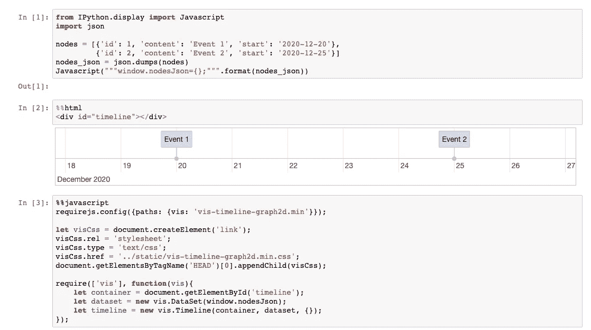

# 如何在 Jupyter 笔记本中创建时间线

> 原文：<https://towardsdatascience.com/how-to-create-a-timeline-in-jupyter-notebook-a9530a639087?source=collection_archive---------35----------------------->

## 将基于 javascript 的时间轴集成到 Jupyter 笔记本中


照片由[维达尔·诺德里-马西森](https://unsplash.com/@vidarnm?utm_source=medium&utm_medium=referral)在 [Unsplash](https://unsplash.com?utm_source=medium&utm_medium=referral) 拍摄

在处理时态数据时，为了更好地理解数据，能够在时间线上查看数据总是有用的。

有一些内置的 python 解决方案，比如[这个](https://matplotlib.org/3.1.1/gallery/lines_bars_and_markers/timeline.html)和[这个](https://plotly.com/python/gantt/)。然而，我发现它们不够灵活。我想提出另一个解决方案，它稍微复杂一点，但是给你更多的灵活性。将一个真正伟大的 javascript 库( [vis.js](https://visjs.org/) )集成到一个 Jupyter 笔记本中，该库处理通用 web 应用程序上的时间线(不要担心它没有听起来那么复杂)。

1.  安装 vis.js 时间表:

```
npm install vis-timeline
```

2.为您的 Jupyter 笔记本生成配置(如果您还没有配置):

```
jupyter notebook --generate-config
```

3.打开用于编辑配置文件，位于 *~/。jupyter/jupyter _ notebook _ config . py*(Linux 和 macOS，在 windows 上在同等位置)。取消文件中带有*c . notebook app . extra _ static _ path*的行的注释。将路径放入已安装的 vis-timeline dist 文件夹，应该是这样的:

```
c.NotebookApp.extra_static_paths = ['~/node_modules/vis-timeline/dist']
```

(注意，在 windows 上，您需要在路径中使用双反斜杠，而不是单斜杠)。

4.运行(或者重新启动，如果它之前正在运行):

```
jupyter notebook
```

现在，您的笔记本已准备好使用 vis.js 时间轴。

为此，您需要 3 个 Jupyter 笔记本电池:

1.  Python 单元格，您可以在此创建数据。对于这个简单的例子，我创建了两个事件，一个在 12 月 20 日，另一个在 12 月 25 日。这段代码将我们的事件放在浏览器的窗口上，因此以后可以在 javascript 单元格中使用它。

2.一个 Html 单元格，带有一个时间线占位符。

3.Javascript 单元格。我们导入 vis.js 本身的 js 和 css 文件，然后从窗口中获取我们的事件，并使用 vis.js 库将它们放入 timeline 对象中。

现在，您应该在 HTML 单元格中看到这个基本的时间线:



时间线在这一点上看起来并不令人印象深刻。但是，使用这里介绍的方法，您可以将 javascript 库中的所有灵活性带到您的 Jupyter 笔记本中(在单击事件时添加功能，为每个节点创建不同的样式，等等)

为了理解如何创建更复杂的时间线，你可以在这里看到所有文档[。](https://visjs.github.io/vis-timeline/docs/timeline/)