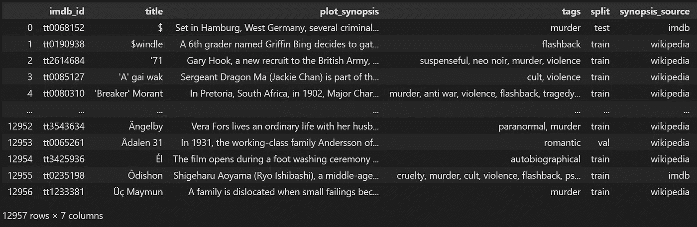
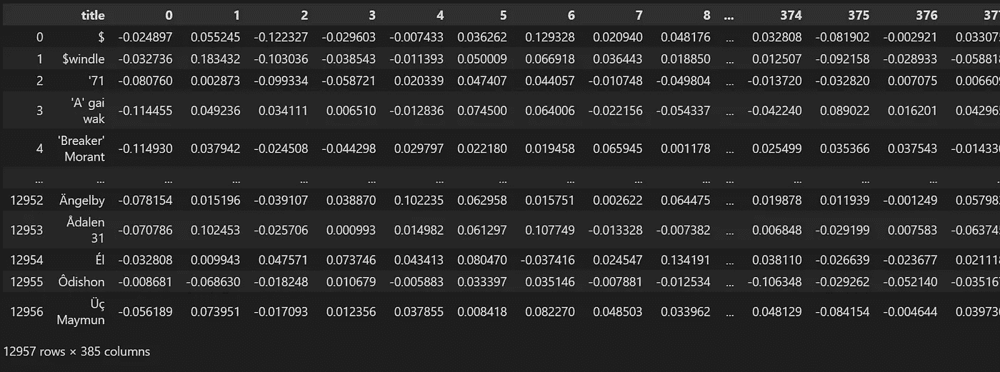

# 如何创建基于矢量的电影推荐系统

> 原文：<https://towardsdatascience.com/how-to-create-a-vector-based-movie-recommendation-system-b6d4f7582d66?source=collection_archive---------10----------------------->

## 相关事件

## 使用变形金刚和矢量技术构建电影推荐系统。

在这篇文章中，我将向你展示如何对电影数据集进行矢量化，在教程的最后，我将使用最近邻完成电影推荐系统。完整的代码可在我的回购处获得。


由[苏维克·班纳吉](https://unsplash.com/@rswebsols?utm_source=medium&utm_medium=referral)在 [Unsplash](https://unsplash.com?utm_source=medium&utm_medium=referral) 上拍摄的照片

电影推荐系统是目前最受欢迎的人工智能应用之一。建立电影推荐系统有几种方法，从基于线性代数方程的简单算法到试图预测哪个是用户最佳选择的复杂神经网络。

由于技术在过去几年里进步很大，建立电影推荐系统的新的复杂方法已经被开发出来，以增强网飞或淘宝等平台的用户体验。公司只对最新技术感兴趣，因为它会使旧型号过时。目前，基于向量的搜索主导着推荐系统市场。

在这篇文章中，我将下载一个电影数据集，清理它，编码它，最后对它进行矢量搜索:该软件将有一部电影作为输入，并将推荐 5 部电影作为输出。

# 构建软件

这个电影推荐系统将通过以下步骤来构建:

1.  安装库
2.  下载数据集
3.  预处理数据集
4.  编码数据
5.  执行矢量搜索

## 1.安装库

我将用来编码数据的主要库是 relevanceai，它为您提供了最新的转换器来编码您的数据:

```
!pip install -U relevanceai
```

我还打算安装第二个库，这样我们就可以在电脑工作时跟踪编码进度。因为这个过程可能会很长(可能需要 2 个小时),如果您不希望使用我提供给您的已经编码的数据集，最好使用一个进度条，您可以用一个名为 [tqdm](https://github.com/tqdm/tqdm) 的库来实现它:

```
!pip install tqdm>=4.62.2
```

## 2.下载电影数据集

原始数据集已经从 Kaggle 下载[(MPST:带标签的电影情节概要，由 Sudipta Kar 出版)。我将使用](https://www.kaggle.com/cryptexcode/mpst-movie-plot-synopses-with-tags)[熊猫](https://pandas.pydata.org/docs/)库来处理这个数据集。我们在这个过程中只需要两种数据(我会尽量保持简单)就是电影标题和描述。用户将使用标题来引用他们想看的电影，而电影的描述将被编码在向量空间中。对数据进行编码后，我们不再需要电影描述。

```
import pandas as pddf = pd.read_csv('mpst_full_data.csv')
```

## 3.预处理电影数据集

除了去掉我们实验中不会用到的所有其他额外特性，电影数据集还包含不完全相同的副本，因此我们不能简单地使用 drop_duplicates pandas 函数来去掉它们。举个例子，我找到过同名电影:《复仇者联盟》和《复仇者联盟》。

在预处理阶段，我需要确保从我们的数据中删除大多数重复的内容，否则，用户体验将与功能良好的推荐系统不一样。

为了避免重名，我只关注电影名。有几种方法可以解决这个问题，我已经为这个特定的目的构建了一个现成的算法:我将按字母顺序对标题进行排序，然后查看连续的标题是否相似(通过使用 Levenshtein 距离)，如果相似，我将删除连续的标题。

```
df = df.sort_values('title').reset_index(drop=True)
df['lev'] = None
dffrom Levenshtein import distancefor a in range(len(df)-1):
    if distance(df.iloc[a].title, df.iloc[a+1].title) <= 3:
        print(a, df.iloc[a].title, df.iloc[a+1].title)
        df.at[a, 'lev'] = distance(df.iloc[a].title, df.iloc[a+1].title)
df
#we filter similar movies
df = df[df['lev'].isnull()].reset_index(drop=True)
df
```

对于一些非常著名的电影，我将亲自执行手动检查以避免任何问题:我将尝试使用该软件的第一部电影显然是《复仇者联盟》:

```
#find Avengers duplicates
for a in range(len(df)):
    if df.iloc[a]['title'].find('Avengers') != -1:
        pass
        #print(a)
#drop extra
df = df.drop([9572]).reset_index(drop=True) #i can do 1, 2, 3... to drop multiple
df
df.to_csv('mpst_no_duplicates.csv')
```



电影数据集的屏幕截图，图片由作者提供

## 4.编码数据

如果您想更详细地了解什么是转换器，以及对您的数据进行编码的其他可行选择，您可以关注我的技术解释。有几种型号可以选择:最快的一种(我要用的那种)叫做**全迷你 L6 v2**。还有更复杂的模型，如 **all-mpnet-base-v2** ，它们更精确，但它们需要大量的计算能力。例如，通过使用最后一个模型，我们的计算机可能需要 10 小时，而不是 2 小时。

在这段代码中，我将使用 relevance API 将电影描述编码成向量。我习惯使用这个库，因为它是一个比它的许多替代品更灵活的包装器。因为它不直接接受 pandas DataFrame 作为输入，所以我需要将我的数据转换成一个字典列表:

```
json_files = df[['title', 'plot_synopsis']]
json_files = json_files.reset_index()
json_files.columns = ['_id', 'title', 'plot_synopsis']
json_files=json_files.to_dict(orient='records')
json_files
```

这些文件看起来是这样的:

```
{'_id': 0,
  'title': '$',
  'plot_synopsis': 'Set in Hamburg, West Germany, sev...
 {'_id': 1,
  'title': '$windle',
  'plot_synopsis': 'A 6th grader named...
 {'_id': 2,
  'title': "'71",
  'plot_synopsis': "Gary Hook, a new recruit to the British Army, takes leave of ...
```

现在，我们可以通过选择一个可用的模型来开始编码过程。

```
#encode on local
from vectorhub.encoders.text.sentence_transformers import SentenceTransformer2Vec
model = SentenceTransformer2Vec("bert-base-uncased")
df_json = model.encode_documents(documents=json_files, fields=['plot_synopsis'])
df_json
```

一旦编码完成，relevanceai 库并没有替换原来的字段 **plot_synopsis** ，而是创建了另一个带有**sentence _ transformers _ vector _**后缀的字段。

```
[{'_id': 0,
  'title': '$',
  'plot_synopsis': 'Set in Hamburg, West Germany, several criminals take...
  'plot_synopsis_sentence_transformers_vector_': [-0.25144392251968384,
   -0.03958860784769058,
   0.15455105900764465,
   -0.08302052319049835,
   0.5842940807342529,
   0.07232926040887833,
   0.28563958406448364
```

## 4.用熊猫编码数据

或者，如果你想继续学习熊猫，你仍然可以使用句子变形库。选择不同的格式取决于你希望如何使用你的数据:例如，在前一种格式中，我可以使用 relevanceAI API 来在线上传我的数据，因此它是可扩展的，可以被成千上万的用户使用。

因为这个过程可能需要一个多小时才能完成(有些编码模型可能需要 12 个小时，所以要小心选择哪一个)，所以我用一个进度条来记录进度(关于实现它的更多信息，[我写了这个有趣的指南](https://pythonkai.org/2021/12/04/schrodingers-pandas-and-how-to-open-the-box-with-python/)):

```
from tqdm import tqdm
from sentence_transformers import SentenceTransformer
import numpy as nptqdm.pandas()model = SentenceTransformer('all-MiniLM-L6-v2') #all-MiniLM-L6-v2 #all-mpnet-base-v2df_ = df.copy()
df_['plot_synopsis'] = df_['plot_synopsis'].progress_apply(lambda x : model.encode(x))
df_index = df_.pop('title')
df_ = df_[['plot_synopsis']]
df_ = pd.DataFrame(np.column_stack(list(zip(*df_.values))))
df_.index = df_index
df_
```



带有熊猫的矢量化数据的屏幕截图，图片由作者提供

完成后，不要忘记将您的数据保存到一个. csv 文件中！

```
df_.to_csv('mpst_encoded_no_duplicates.csv')
```

## 5.执行矢量搜索:测试你的电影推荐系统

通过执行矢量搜索，我将把一部电影输入到数据集中。因此，该软件将找到空间中最近的 5 个点是什么，每个点代表一部类似的电影:这就是我们所说的推荐系统。

我提供的解决方案将在您的本地机器上完美地工作。然而，部署基于向量的产品的问题是伸缩性。我发现的最好的解决方案之一是 [relevanceai API](https://relevance.ai/) ，你可以用它将你的矢量数据库转换成 API 调用。

相反，要在本地执行矢量搜索，我可以使用为我提供最近邻算法的 [sklearn API](https://scikit-learn.org/stable/) 。我要做的第一件事是再次加载数据集(您不需要这样做，但最好用同一个数据集的导入和导出来分隔每个代码段):

```
import pandas as pddf_movies_encoded = pd.read_csv('mpst_encoded_no_duplicates.csv')
df_movies_encoded.index = df_movies_encoded.pop('title')
df_movies_encoded
```

我们现在可以在最近的邻居 sklearn 类上训练该算法:我们将把训练好的模型存储在名为 nbrs 的变量中，这将允许我们在给定一个输入的情况下检索两个点(初始点的坐标加上其最近邻居的坐标)。

```
from Levenshtein import distance
from sklearn.neighbors import NearestNeighbors
import numpy as np
import pandas as pdnbrs = NearestNeighbors(n_neighbors=2, algorithm='ball_tree').fit(df_movies_encoded)#string-searching algorithm
def closest_title(title):
    m = pd.DataFrame(df_movies_encoded.index)
    m['lev'] = m['title'].apply(lambda x : distance(x, 'Prince of Egypt'))
    return m.sort_values('lev', ascending=True)['title'].iloc[0]
```

当前数据集的主要问题是在搜索不在数据集中的电影的情况下，或者如果您打错了。例如，如果你搜索“复仇者联盟”，因为数据集只有“复仇者联盟”这个词，它将无法搜索到你的关键字，并将抛出一个错误。这很不方便，尤其是因为我们假设许多用户会快速输入搜索，甚至会输入错误。这个问题的解决方案是使用一种字符串搜索算法，无论我们输入什么，都会找到最佳答案。我使用 Levenshtein 距离创建了一个自定义的:

```
def find_similar_movies(df, nbrs, title):
    #if title not in df it will choose the best search
    title = closest_title(title)distances, indices = nbrs.kneighbors([df.loc[title]])
    #print(indices)#we print df data, no longer df_
    for index in indices[0][1:]:
        print('index', index)
        print(title, '->', df.iloc[index].name)
```

该算法将接收电影的名称作为输入，并将输出最近邻的名称:

```
find_similar_movies(df_movies_encoded, nbrs, 'Prince of Egypt')index 11440
The Prince of Egypt -> The Ten Commandments: The Musical
```

精彩:似乎在起作用！

# 结论

在这篇文章中，我向你展示了如何构建一个简化的推荐系统。对于这类任务，我们是否已经达到了复杂性的顶峰？差远了。在本教程中，我们使用一个包含数据集中所有电影关系的向量空间，但我们忽略了个人用户历史。

为了给平台上的每个用户提供增强的体验，我们应该收集其选择历史，并为每个用户创建独特的推荐。能够达到这种复杂程度的模型被称为多模态嵌入，它们将在后续文章中进行分析。尽管有其局限性，像这样的向量空间电影推荐系统仍然能够很好地执行，并提供令人满意的用户体验。