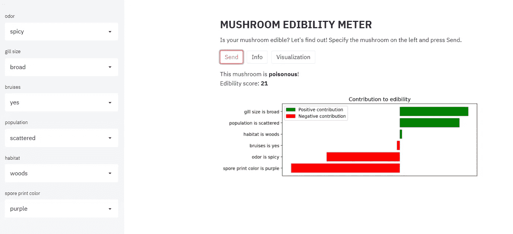
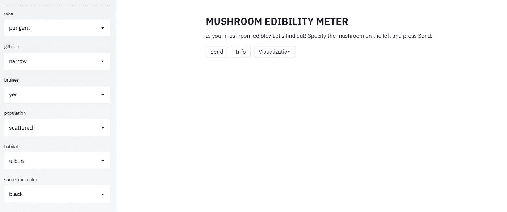
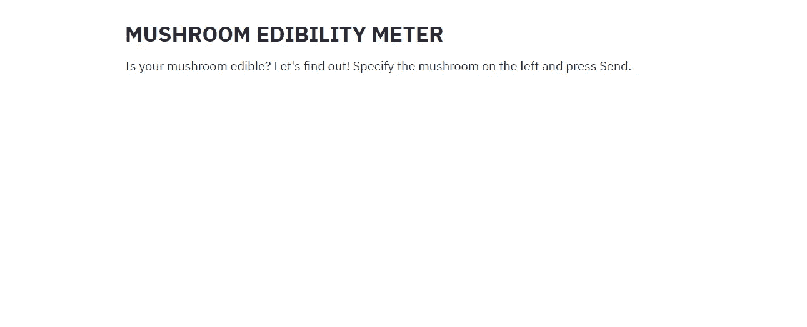
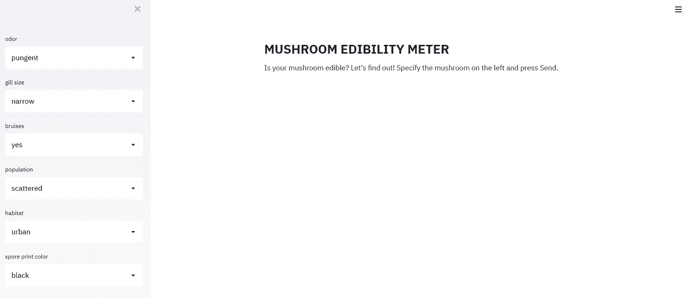
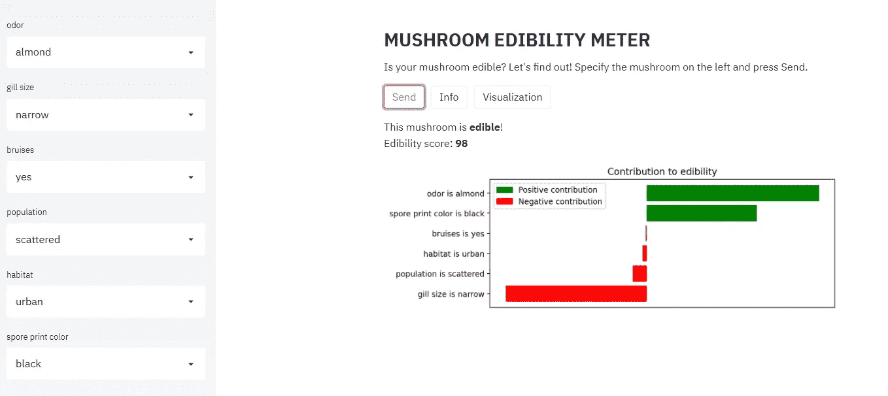
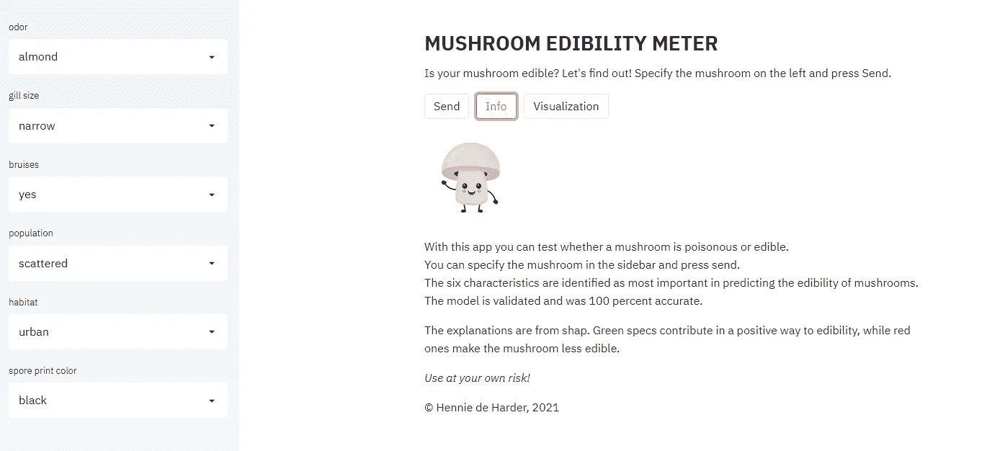
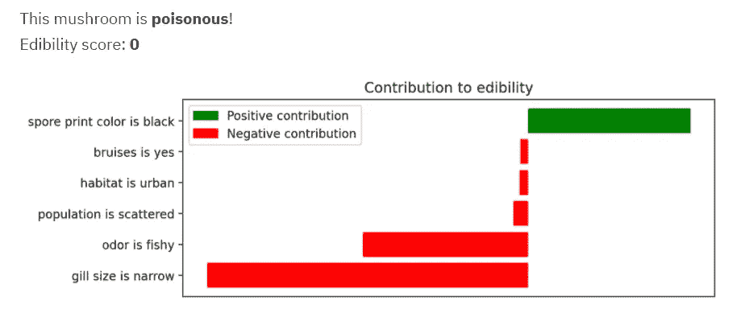
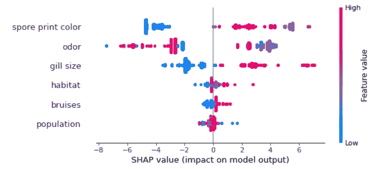
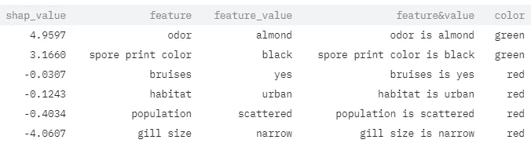

# 如何在几分钟内创建一个 Web 应用程序，进行预测并解释它们

> 原文：<https://towardsdatascience.com/how-to-create-a-web-app-in-minutes-that-makes-predictions-and-explains-them-31b7d1a54b3a?source=collection_archive---------23----------------------->



图片作者。

## 数据科学家简明指南。

本指南向你展示如何快速开发网络应用。这很容易，你很快就能准备好！额外收获是:你学会了如何用简单的英语解释你的预测。因此，即使是朋友和家人也能理解导致这一预测的因素。享受创建自己的网络应用程序！

# 创建 Web 应用程序的 4 个步骤

1.  数据预处理和模型创建
2.  安装 Streamlit 并开发 web 应用程序
3.  运行 web 应用程序
4.  部署 web 应用程序

我将在下面讨论这些步骤。作为奖励，你可以阅读如何向任何人解释这些预测。该代码可在[我的 GitHub](https://github.com/henniedeharder/mushroom_webapp) 上获得。你可以[查看和测试蘑菇网络应用](https://share.streamlit.io/henniedeharder/mushroom_webapp)，我将用它作为例子。

## 步骤 1:数据预处理和模型创建

一如既往，新的数据科学项目从处理、分析和建模数据开始。这个网络应用程序将根据蘑菇的六个特征来决定蘑菇是否可以食用。数据集包含蘑菇的 22 个特征。

在原始数据集中，数据集值是字母。例如，对于气味一栏，“p”表示刺鼻，“a”表示茴香，“n”表示没有，以此类推。不熟悉数据集的人无法理解这些字母。通过使用字典并映射这些值，很容易解决这个问题。通过这样做，字母被它们的含义所取代。我们需要这一步用于 web 应用程序侧边栏和解释预测。现在，我们可以对列进行标签编码并构建一个模型。

通过训练和评估不同的模型和预处理数据集，确定最重要的特征。这些特征是孢子印的颜色、气味、鳃的大小、栖息地、种群、茎根和瘀伤。使用标签编码的数据集很容易创建一个完美的预测模型，web 应用程序中使用的模型达到了 1 的精度，即使它只使用了 6 个特征。

我希望作为数据科学家的你熟悉这个步骤，你可以在这里找到代码。我用 pickle 保存了模型，所以我们可以在下一步中使用它。

## 步骤 2:安装 Streamlit 并开发 web 应用程序

Streamlit 是一个很棒的开源库，它可以在几分钟内构建一个 web 应用程序！安装通过`pip install streamlit`进行，如果你想看演示，你可以运行`streamlit hello`。将会打开一个浏览器，您可以选择一个演示并检查源代码。

我们继续蘑菇 app。我们要做的第一件事是编写标题、副标题、边栏和按钮:



打开浏览器后的开始屏幕:标题，带有选项和三个按钮的侧边栏。图片作者。

您可以在侧边栏中指定蘑菇，当您按下 Send 时，预测和解释会弹出。“信息”按钮提供了关于应用程序的更多信息,“可视化”按钮显示了降维后的数据集图。开始了。

我们首先创建一个新的 py 文件。首先，让我们导入必要的库来开始。对于网络应用来说，最重要的是`import streamlit as st`。我们还将使用在第一步中创建的脚本中的函数。这是预处理数据集所必需的。

我们使用在步骤 1 中创建的脚本中的函数`load_and_transform_mushroom_data()`加载和转换数据。该函数返回翻译后的数据帧`df`、我们需要进行预测的列列表`used_cols`和标签编码器`encoder`。

现在我们可以开始使用 Streamlit 构建 web 应用程序了！用 Streamlit 编码真的很简单。

```
st.write("""## **MUSHROOM EDIBILITY METER** """)
st.write("""Is your mushroom edible? Let's find out! Specify the mushroom on the left and press Send.""")
```

这些行显示屏幕上的文本:



标题和副标题。图片作者。

在那里！app 的开头！很简单，对吧？

让我们继续边栏选项。我们需要具有唯一值的六列，以使模型能够计算预测。通过下面的代码，我们可以做到这一点。

```
# create sidebar
opts = []for col in used_cols:
    option = st.sidebar.selectbox(f'{col}', df[col].unique())
    opts.append(option)
```

通过这样做，我们得到了一个列表`opts`，它存储了从那时起所有被选中的选项。仅此而已！当我们用 Streamlit 再次运行脚本时，侧栏是可见的:



侧边栏，检查！图片作者。

按钮有点难，因为我们希望它们彼此相邻。Streamlit 允许使用`beta_columns`创建列。在代码中:

```
col1, col2, col3 = st.beta_columns([0.1,0.09, 1])with col1:
    send = st.button('Send')with col2:
    info = st.button('Info')with col3:
    visual = st.button('Visualization')
```


图片作者。

如果一个人点击按钮，变量`send`、`info`和`visual`等于`True`。我们希望当有人点击发送时显示预测和解释，当有人点击信息时显示关于应用程序的一些信息。可视化按钮显示用原始数据集的 [UMAP](https://umap-learn.readthedocs.io/en/latest/) 和 [Plotly](https://plotly.com/) 制作的降维图。

让我们从预测和解释开始。我们使用存储侧边栏当前值的`opts`列表，并用一行和这些值创建一个 dataframe。然后我们加载模型，得到预测。下面几行解释了这个预测(稍后会有更多的信息)并创建了一个 matplotlib 图，这个图将用`st.pyplot(fig)`来绘制。

点击“发送”后，会检查可食用性得分是否高于 0.5。如果是这种情况，蘑菇将得到标签可食用(否则有毒)，这将被打印到屏幕上。

```
# create dataframe with selected values
new_mush = pd.DataFrame([opts], columns=used_cols)# get prediction
model = load_model(model_filename='mushroom.h5')
pred = predict(model, new_mush, encoder)# get explanation
new = encoder.transform(new_mush)
shap_df = get_explanations(new, model)
interpretation = create_interpret_df(shap_df, new, new_mush)
fig, ax = plot_interpretation(interpretation)# clicking the send button
if send:
    if pred.loc['edible','score'] > 0.5:
        result = 'edible'
    else:
        result = 'poisonous'
    prob = round(pred.loc['edible','score']*100)
    st.write(f"""This mushroom is **{result}**!  \nEdibility score: **{str(prob)}**""")
    st.pyplot(fig)
```

按发送时的结果:



图片作者。

信息按钮将显示一些关于应用程序的信息。我们将显示一个图像并键入一些文本。

```
# clicking the info button
if info:
    size = 128, 128
    mush = Image.open('img/mush.jpg')
    mush.thumbnail(size, Image.ANTIALIAS)
    st.image(mush)
    st.write('With this app you can test whether a mushroom is poisonous or edible.  \n You can specify the mushroom in the sidebar and press send.  \n The six characteristics are identified as most important in predicting the edibility of mushrooms.  \nThe model is validated and was 100 percent accurate.')
    st.write('The explanations are from shap. Green specs contribute in a positive way to edibility, while red ones make the mushroom less edible.')
    st.write('*Use at your own risk!*')    
    st.write('&#169 Hennie de Harder, 2021')
```

按下 Info 时，您会看到:



图片作者。

最后但同样重要的是，可视化按钮。这里我们想要一个交互式图表，显示可食用的(绿点)和有毒的(红点)蘑菇。你可以看到许多小集群。所有的簇只包含绿色或红色的点。不错！这表明，该模型确实很容易将蘑菇归入有毒或可食用组，并解释了为什么该模型具有完美的准确性。如果你熟悉 UMAP 和普罗特利，你会发现创造这个情节很容易。

首先，你需要使用 UMAP 包进行嵌入。这给了你两个维度。然后，您为绘图和`hover_data`的颜色添加目标标签和原始特征。

用 Plotly 绘图:

```
# use embedding and 
fig = px.scatter(df_emb, x='0', y='1', hover_data=[col for col in df_emb.columns if col not in ['0', '1', 'poisonous']], color='poisonous', color_continuous_scale=[(0.00, "green"),(0.5, "green"),(0.5, "red"),  (1.00, "red")])# change layout
fig.update_layout(coloraxis_showscale=False)
fig.update_xaxes(ticklabelposition="inside", title_text="Dimension 0")
fig.update_yaxes(ticklabelposition="inside", title_text="Dimension 1")
```


图片作者。

看起来没问题，让我们继续下面的步骤！

## 步骤 3:运行 web 应用程序

使用 pip 安装 Streamlit(步骤 2)后，您可以通过键入`streamlit run streamlit_app.py`运行您的 web 应用程序。

浏览器会自动打开，您的应用程序会变得可见。测试新代码真的很容易，当你做了一些改变，你可以保存你的文件并按下任何按钮。该应用程序将使用新的代码(每次有变化时都会重新运行文件)。

## 步骤 4:部署 web 应用程序

Streamlit 使部署变得非常简单。如果你去他们的网站，你可以在 streamlit.io/sharing T2 申请邀请。收到邀请后，就可以部署 web 应用程序了。将您的 Streamlit 应用程序放在 GitHub 上，并创建一个 requirements.txt 文件。登录 [share.streamlit.io](http://share.streamlit.io) ，用 GitHub 登录。

您可以开始部署了！按下新建应用程序，指定 repo、分支和文件路径，然后单击部署。

如果您的分支是 master，并且您的应用程序的文件名为 streamlit_app.py，您可以在以下位置找到您的应用程序

`https://share.streamlit.io/[user name]/[repo name]`

否则，链接会更长，并添加分支和文件名。

[蘑菇 app](https://share.streamlit.io/henniedeharder/mushroom_webapp) 已部署，您可以亲自试用！

## 额外收获:如何创建可理解的解释？

怎么才能得到花里胡哨的解说栏剧情？这个模型有六个特征，气味、鳃大小、瘀伤、种群、栖息地和孢子印颜色。所有特征及其特征值都易于理解，并以其自己的方式对预测做出贡献。



条形图:解释预测。红色条对可食用性有负面影响，而绿色条对可食用性有正面影响。在这种情况下，只有“孢子印颜色是黑色的”对这种蘑菇的可食用性有积极的贡献。其他特征增加了蘑菇有毒的可能性。图片作者。

shap 库是一个解释机器学习模型的好工具。它使用博弈论和局部解释来决定特征值对最终预测的贡献。有更多的可解释性技术可用，但 shap 有一些很大的优势，例如，它是模型不可知的，你可以局部和全局地解释模型。

蘑菇模型的整体解释:



蘑菇模型的 Shap 总结。高特征值为红色，低特征值为蓝色。如果 SHAP 值为正，将增加预测得分，否则将减少预测得分。该模型被训练来预测蘑菇是否有毒，因此 y 轴右侧的点将导致蘑菇有毒！图片作者。

局部解释稍微复杂一点，但是我们可以使用 shap 值来创建易于理解的条形图(带有绿色和红色条)。

从获取形状值数据帧开始。我们需要蘑菇的模型和数据来获得 shap 值。

```
explainer = shap.TreeExplainer(model)
shap_values = explainer.shap_values(new)
shap_df = pd.DataFrame(shap_values, columns=new.columns)
```

下一步是创建一个包含解释的数据框架。



您可以看到形状值、特征名称、特征值、这两者的组合以及颜色。数据帧按 shap 值降序排序。这就是我们创建条形图所需的全部内容！

在代码中:

```
# creating the interpretation DataFrame
# only using top 3 features with highest and lowest shap value
name = []
shap_values = []
feature_names = []for i in range(len(shap_df)):
    name += [new.index[i]] * 6
    shap_values += sorted(list(np.array(shap_df.iloc[i])), reverse=True)[:3] + sorted(list(np.array(shap_df.iloc[i])))[:3][::-1]
    feature_names += list(shap_df.columns[np.array(shap_df.iloc[i]).argsort()[::-1][:3]]) + list(shap_df.columns[np.array(shap_df.iloc[i]).argsort()[::][:3][::-1]])

interpret = pd.DataFrame({'idx':name, 'shap_value':shap_values, 'feature':feature_names})interpret['shap_value'] = interpret['shap_value'] * -1
interpret = interpret.sort_values(by='shap_value', ascending=False)def get_value(row):
    return new_mush[new_mush.index == row.idx] [row['feature']].values[0]interpret['feature_value'] = interpret.apply(get_value, axis=1)interpret['feature&value'] = interpret.apply(lambda row: row.feature + ' is ' + str(row.feature_value), axis=1)

interpret['color'] = np.where(interpret['shap_value'] > 0, 'green', 'red')
```

这个例子很简单，因为数据很容易解释。如果您有更复杂的特性和特性值，您可以通过使用特性和特性值列将它们的含义转换为更容易理解的含义。您可以对要素及其值应用函数来解释它们。

最难的部分已经完成，有了`interpret`数据框，就可以用 matplotlib 创建柱状图:

```
# create matplotlib figure
y_pos = np.arange(len(interpret.index))
fig, ax = plt.subplots(figsize=(8,3))# create horizontal bar plot
ax.barh(y_pos, interpret.shap_value.values, align='center', color=interpret.color.values)# change x and y axis
ax.set_yticks(y_pos)
ax.set_yticklabels(interpret['feature&value'].values)
ax.invert_yaxis()
ax.set_title('Contribution to edibility')
plt.tick_params(axis='x', which='both', bottom=False, top=False,           labelbottom=False)# add legend
green = mpatches.Patch(color='green', label='Positive contribution')
red = mpatches.Patch(color='red', label='Negative contribution')
plt.legend(handles=[green, red])
```

可以走了！应用程序已创建！

# 结论

在这个时代，开发自己的 web 应用程序真的很容易！你所需要的只是一台电脑，一个 IDE，Python，一个互联网连接和数据！这篇文章只是一个例子，我希望你的想象力能带你走得更远，让你开发更酷的应用程序！

*别忘了* [*订阅*](https://hennie-de-harder.medium.com/subscribe) *如果你想在我发表新文章时收到电子邮件。* ❤