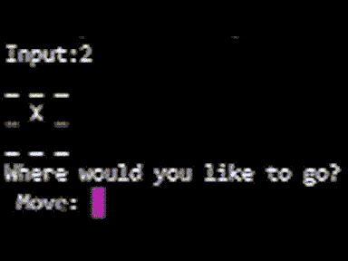
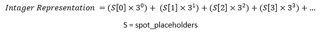

# 如何创建一个具有强化学习功能的人工智能

> 原文：<https://towardsdatascience.com/how-to-create-an-ai-that-plays-tick-tac-toe-with-reinforcement-learning-d10e8fbbaa2c?source=collection_archive---------14----------------------->

## 如果人工智能先走，它是不可战胜的

*在井字游戏中 AI 踢我屁股的短视频！AI 是 X，我是 o，看他怎么套我？*****视频作者****

在本文中，我们将创建两个代理，他们在井字游戏中互相扮演，直到其中一个达到井字游戏的熟练程度。

编写一个学习玩井字游戏的程序是学习强化学习如何工作的第一步。对于这个项目，我假设你已经了解了列表强化学习的理论(你可以在这里了解更多关于[的内容](https://doingengineering21.medium.com/what-is-tabulated-reinforcement-learning-81eb8636f478))。这包括理解一个状态的价值是什么以及如何找到它。我将深入研究在代码中实现这一理论。在你学会如何做这个项目后，你离让代理学会玩视频游戏(也许还有一些更有用的东西)只差一个神经网络了！

# 实施:

首先，我们需要一个井字游戏作为我们的环境。下面发布的实现应该足够了。

这是一个经典的井字游戏，棋盘上的点用数字表示，从上到下，从左到右，从 0 到 8。

我将首先展示如何对我们的状态进行编码，每个状态都是游戏棋盘的一个特定配置。然后有两个函数妨碍了我们的井字游戏自治，get_action 函数和 update_values 函数。一旦你完成了，你应该能够建立 2 个代理，让他们互相玩，直到至少有一个已经掌握了井字游戏。

## 用数字表示状态

正如我所说的，我们需要将代理遇到的每个状态存储在内存中。对于井字游戏，我们将游戏棋盘的当前配置定义为状态。在我的实现中，游戏板由一个名为‘spot _ placeholders’的列表来描述。问题是，如果我们把每个状态，也就是一个列表，存储在另一个列表中，我们会有一个巨大的列表。这是非常低效的。让我们的目标不是拥有一个充满列表的列表，而是拥有一个充满整数的列表，每个整数代表一个唯一的状态。

为了弄清楚如何用数字表示每个状态，让我们从手动表示状态开始，并尝试识别一种模式。请注意，在“spot_placeholders”列表中，1 表示该位置有一个 X，2 表示该位置有一个 O。

*   **状态:[0，0，0，0，0，0，0，0]** = 0
*   **状态:[1，0，0，0，0，0，0，0]** = 1
*   **状态:[2，0，0，0，0，0，0，0]** = 2
*   **状态:[0，1，0，0，0，0，0，0]** = 3
*   **状态:[1，1，0，0，0，0，0，0]** = 4
*   **状态:[2，1，0，0，0，0，0，0]** = 5
*   **状态:[0，2，0，0，0，0，0，0，0]** = 6
*   **状态:[1，2，0，0，0，0，0，0]** = 7
*   **状态:[2，2，0，0，0，0，0，0]** = 8

我们可以用来列举这些状态的一个可能函数是:

如果你习惯于使用二进制，这应该感觉很自然

或者在代码中:

如果这个功能对你来说没有意义，不要为此感到紧张。这是井字游戏特有的，在未来的项目中可能不会用到。如果你只是复制和粘贴代码而没有完全理解它是如何工作的，对你理解 RL 不会有太大的伤害。只要知道你可以通过某种方式对状态进行编码来提高效率。

## ε贪婪

ε贪婪算法是我们如何决定我们的代理将采取的行动。我们希望代理在开始时采取随机的行动，但是一旦它开始掌握事情的诀窍，我们希望它能赢。所以我们要做的是设置一个变量ε，代表代理人采取随机行动的几率，并随着时间的推移慢慢降低ε。伪代码是这样的:

1.  初始化ε = 1
2.  生成一个介于 0 和 1 之间的随机数
3.  如果这个随机数是< ε, explore the state space (take a random action).
4.  If this random number is > ε，则执行导致具有最高值的状态的动作。
5.  少量减少ε

ε继续下降，直到达到某个预定值。你可以认为ε是代理人采取随机行动的概率。

## 获取操作功能

目前，我们的 get_action 函数询问用户他们想去哪个景点。因为我们使它完全自治，所以你可以自由地清除 get_action 函数，从头开始。我们想做的是找出代理可能处于的所有可能的下一个状态，然后找出这些状态中哪一个具有最高值。我们通过循环游戏板(spot_placeholders)来实现这一点，如果一个位置是开放的，我们记录代理进入这个空闲位置时的新状态。然后我们查看代理的状态值表，找到这个状态的值。如果这个状态具有最高值，我们移动到导致这个状态的点。

我实现这个函数的伪代码如下:

1.  看看轮到谁了
2.  找出玩家下一个可能的状态。
3.  执行ε greedy 要么采取随机行动，要么贪婪(采取最佳行动)。
4.  如果是贪婪的，循环遍历下一个可能的状态，找到具有最高值的状态。
5.  尝试执行此操作，但是如果代理的表中没有这些状态，则执行随机操作。

下面是我实现这个函数的代码:

注意，我还为ε贪婪策略的 player 类添加了 epsilon 属性。

## 更新值功能

目前，我们可以让两个代理相互扮演，但是这两个代理没有任何记忆。好像他们玩的每一个游戏都是他们第一次玩井字游戏。所以，让我们解决这个问题。

我们做的是保存一集里所有去过的州的列表。在这一集的最后，我们需要调用一个函数，将值更新函数应用于每个代理的列表中的每个状态。请注意，我们只在该集的最后一个状态收到奖励。因此，我们可以将最后一个状态的值设置为奖励。我的实现的伪代码如下:

1.  将最后一个状态的值设置为 1 或-1(如果游戏赢了就奖励，如果游戏输了就惩罚)
2.  将任何新的、以前未发现的状态添加到玩家的记忆中
3.  从第二个到最后一个状态开始并向第一个状态移动，应用更新函数

我的实现代码是:

我在 play game 函数中添加了一个对 update 函数的调用。

## 把所有的放在一起

我们现在可以让两个代理互相玩游戏，并独自成为井字游戏的专业玩家。你可以在下面找到我完成的项目的代码:

我增加了一个测试功能，这样你就可以和电脑对战了。您会发现，如果您先走，代理根本不会玩得很好，这是因为井字游戏非常偏向于谁先走(这会打乱培训)。调整训练时间、奖励的大小和其他超参数可能有助于代理人在第二名时玩得更好(你可以尝试奖励在猫游戏中第二名的玩家，而不是惩罚他们)。

# 项目摘要

总之，我们正在让一个代理玩井字游戏数千次，并记录游戏的每个状态下发生的事情。然后，我们为每个状态分配一个值，并使用值更新函数来修正这个值。当代理人试图获胜时，他将总是移动到具有最高价值的状态。我们称之为列表 RL，因为我们将所有状态及其值保存在一个表中。

但是如果这是一个 4X4 或 5X5 甚至 10X10 的井字游戏呢？随着游戏板的增长，所有可能状态的数量呈指数增长。这意味着我们的价值表最终会变得太大而不实用！如果有一种方法可以近似每个状态的值就好了。

> 如果*存在一个函数，该函数在给定当前输入的情况下*近似每个可能动作的值…

有这样一个函数，我们用神经网络找到了它。这是深度强化学习的主题，我将很快就此写一篇文章，并将链接贴在这里。

> 感谢您的阅读！如果这篇文章在某种程度上帮助了你，或者你有什么意见或问题，请在下面留下回复，让我知道！此外，如果你注意到我在某个地方犯了错误，或者我可以解释得更清楚一些，那么如果你能通过回复让我知道，我会很感激。