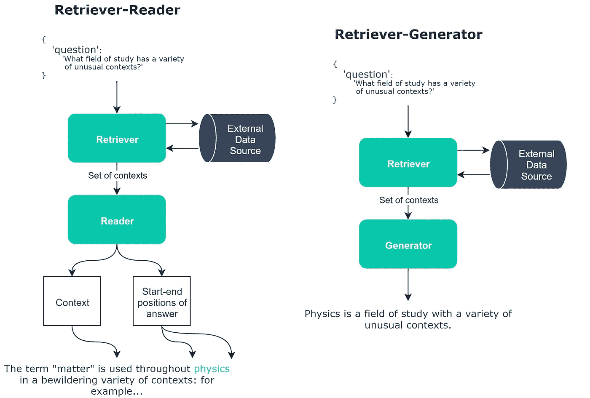
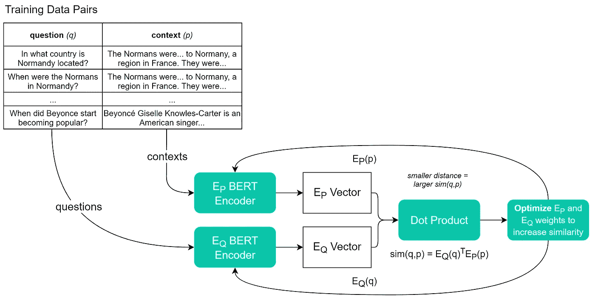

# 如何从 DPR 的问题中创造答案

> 原文：<https://towardsdatascience.com/how-to-create-an-answer-from-a-question-with-dpr-d76e29cc5d60?source=collection_archive---------9----------------------->

## 面向下一代智能解决方案的下一代问答技术

艾米丽·莫特在 [Unsplash](https://unsplash.com?utm_source=medium&utm_medium=referral) 上的照片

在开放领域问答中，我们通常设计一个包含数据源、检索器和阅读器/生成器的模型架构。

这些组件中的第一个通常是文档存储。我们在这里使用的两个最受欢迎的商店是 Elasticsearch 和 FAISS。

接下来是我们的寻回犬——本文的主题。检索器的工作是在我们的文档存储中过滤相关的信息块(文档),并将它们传递给阅读器/生成器模型。

阅读器/生成器模型是我们问答堆栈中的最终模型。我们可以有一个*阅读器*，它直接从*上下文*中提取答案。或者，生成器，它使用语言生成从上下文中生成答案。

检索器-阅读器和检索器-生成器开放域(OD) QA 栈都包括外部数据源(文档存储)、检索器和阅读器/生成器。

检索者的工作对我们的读者表现至关重要。给定一个查询，它必须找到最相关的*上下文*。

如果读者得到了*不正确的*上下文，它将输出*不正确的*答案。

如果给予读者*正确的*上下文，它*可能*输出*正确的*答案。

所以，如果我们想有机会输出好的答案，检索器必须工作得很好。

# 稀疏寻回犬

在过去，我们依赖稀疏向量检索器来完成从文档存储中查找相关信息的任务。为此，我们使用了 TF-IDF 或 BM25。

## TF-IDF

TF-IDF 算法是计算两个文本相似性的一个流行选项。

*   **TF** 指在上下文中找到查询中的多少个单词。
*   **IDF** 是包含该单词的文档分数的倒数。

然后将这两个值相乘，得到 TF-IDF 分数。

现在，我们可以发现单词*“海马”*在查询和上下文之间是共享的，这将增加 TF-IDF 分数，因为:

*   **TF** —在查询和上下文中都找到该单词(高分)。
*   **IDF**—*【海马】*这个词是*而不是其他很多文献中发现的*(所以词频的*逆*是一个高数字)。

或者，如果我们使用单词*“the”*，我们将返回一个较低的 TF-IDF 分数，因为:

*   **TF** —在查询和上下文中都找到该单词(高分)。
*   **IDF**—*这个词在其他很多文献中都有(所以词频的*逆*是一个*低*数)。*

*由于 **IDF** 因*的常见程度而较低，因此 **TF-IDF** 得分也较低。**

*因此，TF-IDF 分数对于查找包含相同不常用词的序列非常有用。*

## *BM25*

*BM25 是 TF-IDF 的变体。在这里，我们仍然计算 TF 和 IDF，但是在返回查询和上下文之间的大量匹配之后，TF 分数被降低了。*

*此外，它还考虑了文档长度。TF-IDF 分数是标准化的，因此如果短文档和长文档具有相同数量的单词匹配，则短文档比长文档的分数更高。*

*当使用稀疏检索器时，BM25 通常比 TF-IDF 更受青睐。*

# *密集段落检索*

*ODQA 的密集段落检索(DPR)于 2020 年推出，作为传统的 TF-IDF 和 BM25 段落检索技术的替代。*

## *赞成的意见*

*介绍 DPR 的论文首先指出，这种新方法比当前的 Lucene(文档存储)BM25 检索器的段落检索准确率高 9-19%。*

*DPR 能够胜过传统的稀疏检索方法有两个关键原因:*

*   *语义相似的词(*“嘿”、“你好”、“嘿”*)不会被 *TF* 视为匹配。DPR 使用密集的语义编码向量(*所以“嘿”、“你好”和“嘿”将紧密匹配*)。*
*   *稀疏猎犬**不是**可训练的。DPR 使用嵌入函数，我们可以针对特定任务对其进行训练和微调。*

## *骗局*

*尽管有这些明显的性能优势，但也不全是好消息。是的，我们可以训练我们的 DPR 模型，但这也是一个缺点——而 TF-IDF 和 BM25 是现成的——DPR 没有。*

*正如在 ML 中通常的情况一样，DPR 需要大量的训练数据——在这种情况下，这些数据是问题和上下文对的精选数据集。*

*此外，DPR 在索引和检索过程中需要更多的计算。*

## *两个床位和培训*

*DPR 使用两种独特的伯特编码器模型。其中一个模型——eᴘ——将文本段落编码成编码的段落向量(我们将上下文向量存储在我们的文档存储中)。*

*另一个模型——EQ——将一个问题映射成一个编码的*问题*向量。*

*在训练期间，我们将问题-上下文对输入到我们的 DPR 模型中，并且模型权重将被优化以最大化两个相应的 Eᴘ/EQ 模型输出之间的点积:*

**

*培训期间通过 DPR 模型的数据流的高级视图。*

*两个模型输出 *Eᴘ(p)* 和 *EQ(q)* 之间的点积值测量两个向量之间的相似性。点积越高，相似度越高，因为两个向量越接近，点积就越大。*

*通过训练两个模型输出相同的向量，我们正在训练上下文编码器和问题编码器为相关的问题-上下文对输出*非常*相似的向量。*

## *运行时*

*一旦模型(或两个模型)被训练，我们就可以开始使用它们进行问答索引和检索。*

*当我们第一次构建我们的文档存储时，我们需要使用 Eᴘ编码器对我们存储在那里的数据进行编码——因此在文档存储初始化期间(或者当添加新文档时)—我们通过 Eᴘ编码器运行每一段文本，并将输出向量存储在我们的文档存储中。*

*对于实时问答，我们只需要 e Q 编码器。当我们提出一个问题时，它将被发送到 EQ 编码器，然后输出我们的 EQ 向量 *EQ(q)* 。*

*接下来，将 *EQ(q)* 向量与我们的文档存储中已经索引的 *Eᴘ(p)* 向量进行比较，在文档存储中，我们过滤返回最高相似性得分的向量:*

> **sim(q，p) = EQ(q)ᵀ Eᴘ(p)**

*就是这样！我们的检索器已经为我们的问题确定了最相关的上下文。*

*然后，这些相关的上下文被传递到我们的读者(或生成器)模型，该模型将基于上下文创建一个答案——我们的问答过程就完成了！*

*以上是关于面向开放领域问答(ODQA)的密集段落检索(DPR)的介绍。*

*我希望你喜欢这篇文章。如果您有任何问题或建议，请通过推特[或在下面的评论中告诉我。如果你对更多类似的内容感兴趣，我也会在 YouTube 上发布。](https://twitter.com/jamescalam)*

*感谢阅读！*

# *参考*

*[1] V. Karpukin 等人艾尔。，[面向开放领域问答的密集段落检索](https://arxiv.org/pdf/2004.04906.pdf) (2020)，EMNLP 2020*

*拥抱脸， [DPR](https://huggingface.co/transformers/model_doc/dpr.html) ，变形金刚 Docs*

*[🤖带变压器的 NLP 课程](https://bit.ly/nlp-transformers)*

***所有图片均由作者提供，除非另有说明**