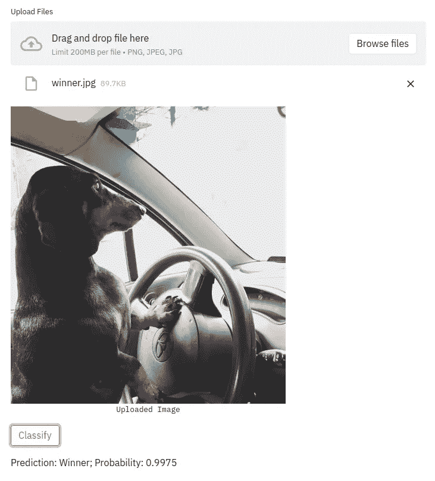
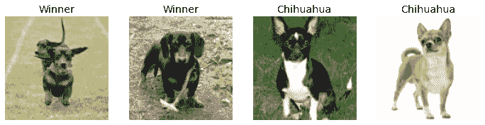
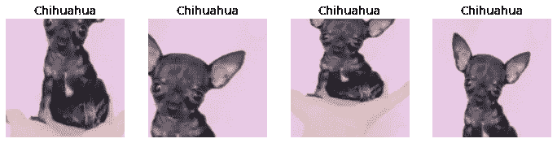
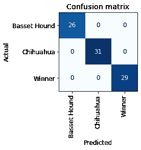
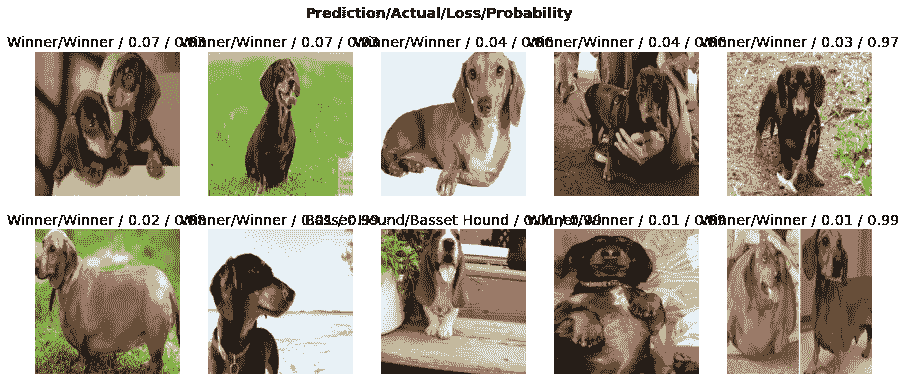
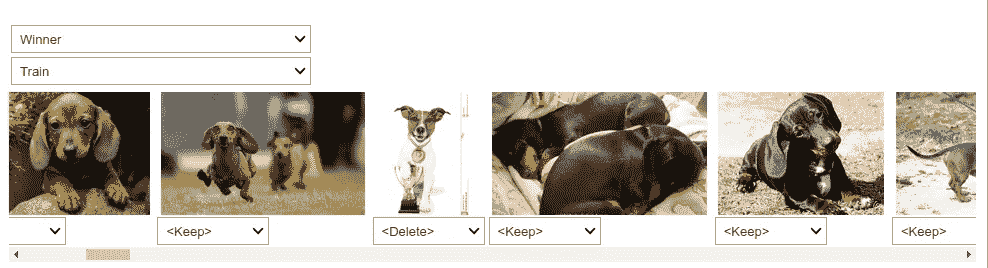
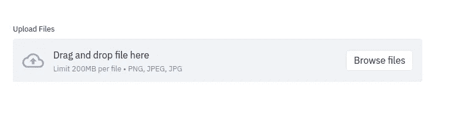
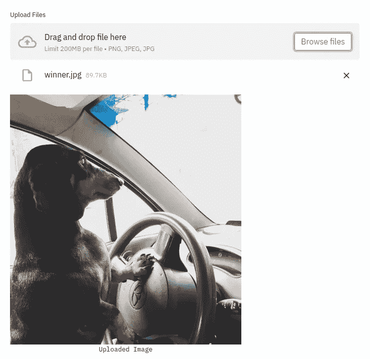
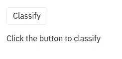

# 如何创建一个应用程序来使用 fastai 和 Streamlit 对狗进行分类

> 原文：<https://towardsdatascience.com/how-to-create-an-app-to-classify-dogs-using-fastai-and-streamlit-af3e75f0ee28?source=collection_archive---------21----------------------->

## 用几行代码创建一个深度学习应用



作者图片

# 动机

如果你想搭建一个深度学习 app，能有多难？这取决于您用来构建模型和应用程序的工具。如果你想创建一个高性能的深度学习模型，用几行代码部署，那就从 fastai 和 Streamlit 开始吧。

受到这本书第二章的启发，杰瑞米·霍华德和西尔万·古格的《fastai 和 PyTorch 程序员的深度学习》，我决定创建一个模型来对狗进行分类，并使用 Streamlit 而不是 Voila 部署它。

在本教程中，我将向你展示如何创建一个应用程序来分类狗如下。


作者 GIF

点击[此处](https://share.streamlit.io/khuyentran1401/dog_classifier/main/dog_classifier.py)查看 app。请注意，这个应用程序可以用来分类 3 种狗:赢家，吉娃娃，巴吉度猎犬。

# 什么是 fastai 和 Streamlit？

[Fastai](https://docs.fast.ai/) 是一个 Python 库，可以轻松地用几行代码构建深度学习模型。Streamlit 是一个 Python 库，[可以在几分钟内将数据脚本转换成可共享的 web 应用。](/streamlit-and-spacy-create-an-app-to-predict-sentiment-and-word-similarities-with-minimal-domain-14085085a5d4)

从安装 [fastbook](https://github.com/fastai/fastbook) 开始。这将安装 fastai，并让我们访问一些有用的函数，我们将在本教程的后面使用。

```
pip install -Uqq fastbook
```

安装细流

```
pip install streamlit
```

导入相关库

# 收集数据

我们将使用 Bing 搜索图片 API 下载狗狗图片。要从 Bing 获取图片，你需要[从 Microsoft Azure](https://www.microsoft.com/en-us/bing/apis/bing-image-search-api) 获取一个密钥，并在方法`search_images_bing`中用你的新密钥替换`"XXX"`。放心吧！它是免费的！

要使用密钥下载获胜狗的图像，只需使用

```
150
```

酷！150 张冠军狗的图片被下载。

我们将使用相同的功能来下载图像，这些图像是“Winner dog”、“Chihuahua dog”和“Basset Hound dog”的搜索结果，并将它们保存到单独的文件夹中

我们的数据目录将如下所示:

```
dogs
├── Basset Hound
├── Chihuahua
└── Winner
```

每个文件夹将有 150 张在目录名称中指定的狗的图片。

将保存到狗狗文件夹的所有图片分配给`fns`

使用`Path.unlink`删除从互联网下载时损坏的图像

# 数据加载器

在训练之前，我们想让模特知道:

*   数据的类型
*   如何获取数据
*   如何获取数据集的标签
*   如何将数据分为训练集和验证集

这时候`Dataloader`就派上用场了。从创建`DataBlock`开始，并将这个实例提供给`dataloaders`。

上述代码的详细信息

*   `blocks=(ImageBlock, CategoryBlock)`:指定用于预测的变量的数据类型和标签。在这种情况下，它是图像和类别(狗的类型)
*   `get_items`:从提供的路径中获取图像的功能
*   `splitter`:将数据分为训练集和验证集。20%的数据用于验证。`seed`用于在我们每次使用`DataBlock`时获得相同的分割
*   `get_y`:通过获取文件所在文件夹的名称来获取标签。在这种情况下，它是“赢家”，“吉娃娃”，和“巴吉度猎犬”
*   `item_tfms`:表示物品转换器，负责转换物品。这里，我们将图像调整为 128 像素的正方形。

在我们的`dataloaders`中查看 4 张随机图像



作者图片

# 随机调整大小和数据扩充

上面的图片本身就很好。但是为了让神经网络捕捉更多的图像，我们希望改进我们转换图像的方法。这可以通过使用随机调整大小和数据扩充来实现。

## 随机调整大小

对于许多类型的神经网络，输入总是需要具有相同的形状。因此，我们希望裁剪图像，使它们都具有相同的大小。

默认情况下，`Resize`裁剪图像以适合正方形。这可能会导致一些重要的图像丢失。因此，我们将使用`RandomResizedCrop`随机选择并裁剪图像的一部分，而不是裁剪相同的区域。



作者图片

`min_scale`告诉 fastai 选择至少 30%的图像进行裁剪。

## 数据扩充

为了创建更多的训练数据，我们将使用`batch_tfms`对整个数据集进行扩充。这意味着旋转、翻转、改变图像的亮度等，以从同一图像创建不同的图像。


作者图片

将两种技术结合起来，以获得两种转换的好处

# 训练我们的模型

我们使用一个卷积神经网络(CNN)来训练我们的模型。`cnn_learner`还将加载一个预训练模型，该模型已经过训练，可以识别 130 万张照片中的一千个不同类别。

`fine_tune(4)`告诉 fastai 使用 4 个历元来拟合模型(每个历元是整个训练数据集的一个周期)。

评估我们的模型



作者图片

哇！我们的模型可以正确地对验证集中的所有狗进行分类。图片被错误分类。



作者图片

因为我们没有错误的预测，所以上面显示的图像是那些预测正确的图像。然而，当有错误的预测时，`plot_top_losses`方法就会派上用场。

# 删除无关数据

在训练模型之后，我们可能想知道为什么一些图像被错误地分类。这可能是因为图像被错误地标注了，或者有一些模型难以识别的特征。



作者图片

第三张图片是**而不是**一只胜利者的狗！我们可以通过在下拉菜单中选择“删除”来删除该图像。

Fastai 还允许您重命名标签，而不是删除它们。

接下来，我们删除或编辑标记为“删除”或“重命名”的本地图像。

# 保存模型

就是这样！现在我们可以出口我们的模型投入生产

要加载模型，只需使用`load_learner`方法

# 部署我们的模型

耶！现在我们可以开始使用我们刚刚训练过的模型来部署我们的模型。下面的脚本是我们需要创建一个应用程序来分类狗。

以上代码的详细信息:

*   `get_image_from_upload`:允许我们从你的本地文件上传图片



作者图片

*   `display_output`:上传图像后显示



作者图片

*   `get_prediction`:创建一个按钮对图像进行分类



作者图片

现在，将上面的脚本保存为`dog_classifier.py`并运行:

```
streamlit run dog_classifier.py
```

我们的应用程序已经可以玩了！


作者 GIF

图像被分类为赢家，概率为 0.9991！注意，由于图片中的狗是我的狗，所以在训练过程中不使用这张图片。这里可以玩 app [。](https://share.streamlit.io/khuyentran1401/dog_classifier/main/dog_classifier.py)

# 通过简化 it 共享进行部署

现在，你有了一个可以在本地运行的应用程序，但你将无法与你的朋友分享你的应用程序的链接，除非你将应用程序托管在某个服务器上。幸运的是，这可以通过三个步骤轻松实现:

1.  使用 Github 登录
2.  选择一个回购、分支和文件
3.  点击部署！

点击查看如何使用 Streamlit 共享[的说明。](https://www.streamlit.io/sharing)

# 结论

恭喜你！您刚刚学习了如何使用 fastai 和 Streamlit 创建一个应用程序来对狗进行分类。有了 fastai 和 Streamlit 这样的工具，你可以跳过一个很大的学习曲线来部署一个具有深度学习的 web 应用。

希望这篇文章能给你创造一个动力，让你创建自己的深度学习应用。

在[这个资源库中，您可以随意使用我用来创建这个应用程序的代码。](https://github.com/khuyentran1401/dog_classifier)

我喜欢写一些基本的数据科学概念，并尝试不同的算法和数据科学工具。你可以通过 [LinkedIn](https://www.linkedin.com/in/khuyen-tran-1401/) 和 [Twitter](https://twitter.com/KhuyenTran16) 与我联系。

如果你想查看我写的所有文章的代码，请点击这里。在 Medium 上关注我，了解我的最新数据科学文章，例如:

[](/i-scraped-more-than-1k-top-machine-learning-github-profiles-and-this-is-what-i-found-1ab4fb0c0474) [## 我收集了超过 1k 的顶级机器学习 Github 配置文件，这就是我的发现

### 从 Github 上的顶级机器学习档案中获得见解

towardsdatascience.com](/i-scraped-more-than-1k-top-machine-learning-github-profiles-and-this-is-what-i-found-1ab4fb0c0474) [](/streamlit-and-spacy-create-an-app-to-predict-sentiment-and-word-similarities-with-minimal-domain-14085085a5d4) [## Streamlit 和 spaCy:创建一个应用程序来预测情绪和单词的相似性，最小域…

### 只需要 10 行代码！

towardsdatascience.com](/streamlit-and-spacy-create-an-app-to-predict-sentiment-and-word-similarities-with-minimal-domain-14085085a5d4) [](/how-to-learn-data-science-when-life-does-not-give-you-a-break-a26a6ea328fd) [## 当生活不给你喘息的机会，如何学习数据科学

### 我努力为数据科学贡献时间。但是发现新的策略使我能够提高我的学习速度和…

towardsdatascience.com](/how-to-learn-data-science-when-life-does-not-give-you-a-break-a26a6ea328fd) [](/stop-using-print-to-debug-in-python-use-icecream-instead-79e17b963fcc) [## 在 Python 中停止使用 Print 进行调试。用冰淇淋代替

### 你是使用打印还是日志来调试你的代码？用冰淇淋代替。

towardsdatascience.com](/stop-using-print-to-debug-in-python-use-icecream-instead-79e17b963fcc) 

# 参考

霍华德，杰里米，还有古格，西尔万。*用 fastai 和 PyTorch 对编码员进行深度学习。奥莱利，2020 年。*