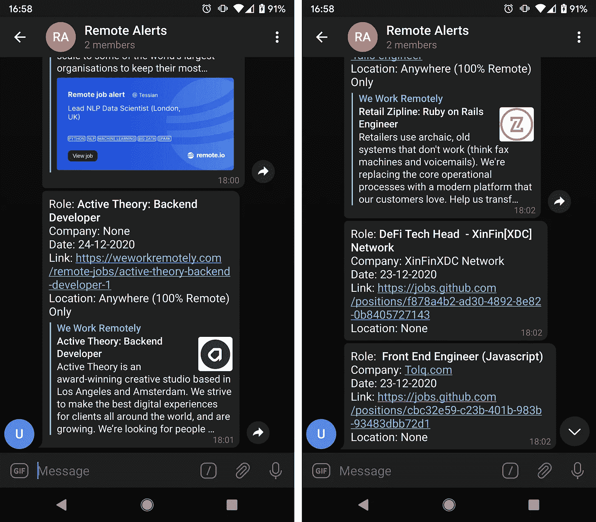

# 如何用 Python 创建自动化的远程工作查找器

> 原文：<https://towardsdatascience.com/how-to-create-an-automated-remote-job-finder-with-python-7e20ee233e2b?source=collection_archive---------34----------------------->

## 找新工作？再也不要错过潜在的机会


[安德鲁·尼尔](https://unsplash.com/@andrewtneel?utm_source=medium&utm_medium=referral)在 [Unsplash](https://unsplash.com?utm_source=medium&utm_medium=referral) 上拍照

今年是黑暗、悲伤、可怕的一年。此外，这让我坚持自己的选择:最终，我想远程工作。事实上，我对理想工作模式的愿景包括减少每个人的工作时间，自动化所有可行的事情，以及真正公平的财富再分配——但我不想在这里过于政治化，所以让我们专注于远程部分。

有几个很好的专门从事远程工作的求职网站，那里也有很多(我已经检查过:很多)列出这些网站的文章，所以不，在这篇文章中不打算这样做。另外，既然已经是 2020 年了，我想你们都知道如何在网上成功地找工作。相反，我要做的是向你们展示如何自动获取所有这些报价，根据你们的个人偏好进行筛选，并获得摘要通知。而且因为我知道我们都只是略读这些文章，请允许我给一点 TL；语音博士。

## TL；大卫:我们要做什么？

首先，我们将手动选择一些好的远程求职网站——稍后会详细介绍。然后，我们将编写一个 Python 脚本:

*   从那些网站上得到所有的报价。
*   根据我们的喜好过滤掉它们。
*   在 AWS 中部署后，会发送一个包含摘要的通知。

与我的文章一样，这是一个端到端的项目，所以仔细阅读本教程后，您将拥有一段功能完整的代码，其结果如下:



作者图片

我们走吧！

## 无聊的部分:选择网站

我们需要的第一件事是一堆网站，最好是聚合网站，这样我们就可以覆盖更多的主要来源，从而获得报价。从网站获取信息有两种主要方式:公开的 API 或 RSS 提要，以及抓取。抓取更难，需要持续监控 HTML 中最微小的变化都可能成为大问题。所以现在不刮了。让我们搜索提供一些工具的网站，无论是 API 还是 RSS。坏的方面是这是一个无聊的手动搜索——好的方面是我已经为你做了。

*   [Remoteok.io](https://remoteok.io/) :那里最大的——如果不是最大的话——只提供远程工作的论坛之一，由 [levels.io](https://medium.com/u/75452cb7f664?source=post_page-----7e20ee233e2b--------------------------------) 创建。声称覆盖了全球发布的大约 80%的远程工作机会([引用一下](https://www.producthunt.com/posts/remote-ok-jobs-api)，我不是骗子！).同时提供 API 和 RSS。
*   [Remote.io](https://www.remote.io/) :由[托尼·特里托](https://medium.com/u/f8718470cde7?source=post_page-----7e20ee233e2b--------------------------------)于 2019 年创建，是一个“为数字游牧者、远程工作者和希望在家工作的人提供的工作平台”。提供 RSS。
*   [劳动游牧者](https://www.workingnomads.co/):另一种聚集者；引用他们的话:“列出了许多职业领域中最有趣的远程工作机会”。由[彼得·马塞利](https://twitter.com/petermarcely)和[玛丽·乌赫尔科娃](https://twitter.com/Marie_Uh)创作。提供 API。
*   GitHub Jobs :我敢肯定 GitHub 有印象——Jobs 部分可能没那么有名，但是很不错。虽然它不是远程集中的，但有一个选项可以只列出远程作业——足够近。提供 API。
*   我们远程工作:2011 年推出，号称是“世界上最大的远程工作社区”。提供 RSS。

那是我的选择。显然，你可以添加更多的来源，但我相信这五个网站涵盖了绝大多数的远程报价张贴。

## 连接到工作公告板:获得聘用

我们已经选择了具有 API 和 RSS 的主板，所以让我们分别编写一个例子。对于 RSS，我们将使用`feedparser`库:

```
$ pip install feedparser
```

用法非常简单—让我们看一下 remote.io 提要:

```
rss_feed_url = 'https://s3.remote.io/feed/rss.xml'
rss = feedparser.parse(rss_feed_url)
entries = rss.entries# Let's check the first entry
for k, v in entries[0].items():
    print(f'{k}: {v}')
```

这段代码将输出如下内容:

```
title: Senior Manager
title_detail: {'type': 'text/plain', 'language': None, 'base': '[https://s3.remote.io/feed/rss.xml'](https://s3.remote.io/feed/rss.xml'), 'value': 'Senior Manager'}
links: [{'rel': 'alternate', 'type': 'text/html', 'href': '[https://www.remote.io/remote-customer-service-jobs/sr-manager'](https://www.remote.io/remote-customer-service-jobs/senior-manager-learning-development-10591?utm_source=rss&utm_medium=rss_feed&utm_campaign=jobs_rss_feed')}]
link: [https://www.remote.io/remote-customer-service-jobs/sr-manager](https://www.remote.io/remote-customer-service-jobs/senior-manager-learning-development-10591?utm_source=rss&utm_medium=rss_feed&utm_campaign=jobs_rss_feed')
id: [https://www.remote.io/remote-customer-service-jobs/sr-manager](https://www.remote.io/remote-customer-service-jobs/senior-manager-learning-development-10591?utm_source=rss&utm_medium=rss_feed&utm_campaign=jobs_rss_feed')
guidislink: False
summary: Sr Manager wanted for...
summary_detail: {'type': 'text/html', 'language': None, 'base': '[https://s3.remote.io/feed/rss.xml'](https://s3.remote.io/feed/rss.xml'), 'value': "Sr Manager wanted for..."}
content: [{'type': 'text/html', 'language': None, 'base': '[https://s3.remote.io/feed/rss.xml'](https://s3.remote.io/feed/rss.xml'), 'value': "Sr Manager wanted for..."}]
authors: [{'name': 'Remote.io'}]
author: Remote.io
author_detail: {'name': 'Remote.io'}
published: 2020-12-25 21:31:59
published_parsed: time.struct_time(tm_year=2020, tm_mon=12, tm_mday=25, tm_hour=21, tm_min=31, tm_sec=59, tm_wday=4, tm_yday=360, tm_isdst=0)
```

太好了，看起来一切都在。我们需要清理这个问题——最终会解决的。现在让我们看看如何使用`requests`库从 API 获取相同的信息:

```
$ pip install requests
```

用法稍微复杂一些:我们需要创建一个会话，向其中添加一个用户代理，最后到达端点。让我们来看看工作游牧民 API:

```
session = requests.Session()
session.headers['User-Agent'] = (
    f'Mozilla/5.0 (Macintosh; Intel Mac OS X 10_9_2) '
    f'AppleWebKit/537.36 (KHTML, like Gecko) '
    f'Chrome/34.0.1847.131 Safari/537.36'
)api_url = 'https://www.workingnomads.co/api/exposed_jobs/'
response = session.get(api_url)
entries = json.loads(response.text)# Let's check the first entry
for k, v in entries[0].items():
    print(f'{k}: {v}')
```

这段代码将输出如下内容:

```
url: [https://www.workingnomads.co/job/go/555/](https://www.workingnomads.co/job/go/32952/)
title: Backend Engineer
description: The description of the job
company_name: Cool Company
category_name: Development
tags: devops,php,java,ruby,python,scala
location: USA
pub_date: 2020-12-25T14:52:29.663723-05:00
```

同样，一切都在那里。对于其他三个来源，过程是完全相同的-让我们进行第二部分，过滤和清理一切。

## 过滤报价

对于我个人的使用案例，我需要三个过滤器:

*   日期:我只是想在最后一天的过程中公布的优惠。
*   地点:尽管它们都很偏远，但有些优惠设置了强制地点，例如欧洲或美国。这通常是由于税收问题或时区问题——无论如何，如果我的位置与他们的要求不匹配，我就不想得到报价。
*   标签:也许是最重要的过滤器。我想获得与我的技能相匹配的报价，为此我需要标签。

日期过滤器非常简单，因为所有的 API/RSS 提要都包含发布日期和时间字段。从一个源到另一个源，我们唯一需要修改的是字段的格式和名称，因为它会改变。类似这样的事情就足够了:

```
from datetime import datetime, timezone, timedelta, dateentry = << ENTRY FROM RSS/API >>
dt_format = '%a, %d %b %Y %H:%M:%S %z'
dt_field_name = 'published'now = datetime.timestamp(datetime.now(timezone.utc))
parsed_date = entry.get(dt_field_name)
entry_date = datetime.strptime(parsed_date, dt_format).timestamp()if now - entry_date > 90000: # Around 25 hours
    # Older than 25h
else:
    # Newer than 25h
```

位置过滤器是最棘手的，因为不是所有的提要都提供它。如果它在那里，像这样的东西就可以了:

```
entry = << ENTRY FROM RSS/API >>
location_field_name = 'region'invalid_regions = ['USA Only', 'North America Only']
entry_location = entry.get(location_field_name, '')if entry_location in invalid_regions:
    # Not valid
else:
    # Valid
```

最后是标签过滤器，这里有两种可能性。如果 RSS 提要或 API 友好地提供了标签，我强烈建议接受这个礼物并使用它们进行过滤:

```
entry = << ENTRY FROM RSS/API >>my_tags = ['python', 'django']
entry_tags = [t.lower() for t in entry.get('tags', [])]if not any(t in entry_tags for t in my_tags):
    # Not valid
else:
    # Valid
```

否则，恐怕你们得发挥你们的想象力了。我通常将工作的摘要/描述改为小写，以使其不区分大小写，并且我会查找关键字，如:

```
entry = << ENTRY FROM RSS/API >>my_tags = ['python', 'django']
entry_summary = entry.get('summary', '').lower()if not any(t in entry_summary for t in tags):
    # Not valid
else:
    # Valid
```

您可以在这里添加任意数量的过滤器:公司、时区、所需经验年限…请记住，过滤来自 API/RSS 的字段总是比搜索摘要或描述更容易。此外，您可能希望只提取一些字段——毕竟，您不需要要约的 id 或其元数据。

## 部署和发送通知

如果你读过我的其他故事，你可以告诉我，我是 Lambda + Telegram 组合监控机器人的粉丝。我[为那个](https://medium.com/better-programming/automate-a-telegram-bot-to-send-daily-messages-in-less-than-40-lines-of-python-code-e81858d15854)写了一个教程，那边的几个故事[有如何做的例子](/how-to-create-a-fully-automated-ai-based-trading-system-with-python-708503c1a907)，所以让我在这里长话短说。

待办事项清单上的第一件事是创建一个机器人。我建议遵循 Telegram 的官方指令:在 Telegram 中搜索用户@BotFather，使用命令`\newbot`,为你的机器人选择一个名称和用户名，最后获得令牌并将其存储在安全的地方。

下一步:部署。我们将使用一个来自[无服务器](https://serverless.com/)框架的模板，它将包含三个文件:`.gitignore`、`serverless.yml`和`handler.py`。无服务器文件定义了将要执行的内容和时间；我想在 UTC 时间下午 6 点收到我的总结，我们来定义一下:

```
org: your-organization-name
app: your-app-name
service: remote-jobs-botframeworkVersion: “>=1.2.0 <2.0.0”provider:
  name: aws
  runtime: python3.6
  # Propagating the  Telegram token from our own 
  # environment so we don’t have to deploy it.
  environment:
    TELEGRAM_TOKEN: ${env:TELEGRAM_TOKEN}functions:
  cron:
    handler: handler.send_message
    events:
      # Invoke Lambda function at 18:00 UTC every day
      - schedule: cron(00 18 * * ? *)
```

另一方面，处理程序文件将包含要运行的代码。您需要将`CHAT_ID`更改为您希望机器人与之交互的群组、频道或对话的 ID。在这里你可以找到[如何从频道](https://stackoverflow.com/questions/36099709/how-get-right-telegram-channel-id/45577616)获取 ID，这里是[如何从群组](https://stackoverflow.com/questions/32423837/telegram-bot-how-to-get-a-group-chat-id)获取 ID:

```
import telegram
import sys
import osTOKEN = os.environ[‘TELEGRAM_TOKEN’]
CHAT_ID = XXXXXXXXdef get_offers():
    # Here we get the offers and filter them as shown abovedef send_message(event, context):
    bot = telegram.Bot(token=TOKEN) offers = get_offers() 
    if len(offers) == 0:
        bot.sendMessage(chat_id=CHAT_ID, text='No new offers.')
    else:
        for offer in offers:
            bot.sendMessage(chat_id=CHAT_ID, text=offer)
            time.sleep(5)
```

剩下的唯一一件事就是在部署之前获取 AWS 凭证，并将它们与令牌和其他变量一起设置为环境变量。从您的 AWS 控制台:

*   进入*我的安全凭证* — *用户* — *添加用户。*
*   选择用户名并选择*编程访问。*
*   下一页:选择*直接附加已有策略* — *管理员访问。*
*   复制*访问密钥 ID* 和*秘密访问密钥*并保存。

就是这样。现在，让我们导出 AWS 凭证和电报令牌。打开终端，写下:

```
$ export AWS_ACCESS_KEY_ID=[your key goes here]
$ export AWS_SECRET_ACCESS_KEY=[your key goes here]
$ export TELEGRAM_TOKEN=[your token goes here]
```

在本地安装必要的包，最后，将所有东西部署到 AWS:

```
$ pip3 install -r requirements.txt -t . --system
$ serverless deploy
```

我们完了！机器人将检查报价，并在世界协调时下午 6:00 向我们发送一份摘要。我鼓励你们深入研究任何你们认为有用的东西:添加源、添加过滤器……远程部分只是我个人的偏好；你也可以使用许多非遥控板。当然，请在评论中告诉我！快乐编码:)

和往常一样，你可以在 GitHub 里查看[的代码。](https://github.com/ruromgar/remote_jobs_bot)

# 参考

[1] R. Romero，[自动化电报机器人，用不到 40 行 Python 代码](https://medium.com/better-programming/automate-a-telegram-bot-to-send-daily-messages-in-less-than-40-lines-of-python-code-e81858d15854) (2019)，Medium 发送日常消息

[2] R. Romero，[如何用 Python 创建一个全自动的基于人工智能的交易系统](/how-to-create-a-fully-automated-ai-based-trading-system-with-python-708503c1a907) (2020)，中型