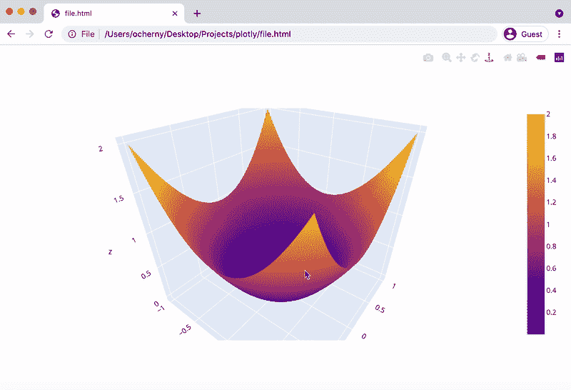
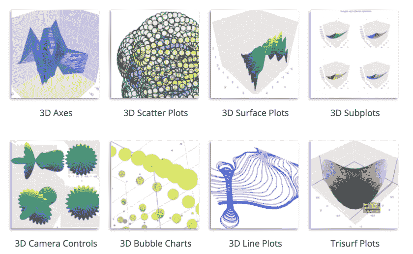

# 如何创建交互式三维图表并与任何人轻松共享

> 原文：<https://towardsdatascience.com/how-to-create-an-interactive-3d-chart-and-share-it-easily-with-anyone-d0c1c42bc394?source=collection_archive---------35----------------------->

## *一个关于伟大情节的简短教程*



作者图片

3D 图表有一个巨大的缺点。创建三维图表时，您可以从不同的角度/比例可视化数据，或者使用交互式库，这样您就能够很好地理解数据。然而，当创建时，这些图表很难共享。

人们通常将 3D 图表转换成单个静态图像或从不同角度和不同比例拍摄的一组图像。使用这种方法，一些重要的信息可能会丢失，或者难以理解，所以我们需要一个更好的选择。它确实存在。

在这个简短的教程中，我将向您展示如何创建一个交互式 3D 图表，并轻松地与任何人共享它，无论他们是数据科学家、开发人员、经理，还是您没有安装任何编码环境的非技术朋友。共享的图表也将是完全交互式的。

# 它是如何工作的

你可能听说过 [plotly](https://plotly.com/python/getting-started/) ，这是一个开源库，允许在 Jupyter 笔记本上创建交互式图表。我使用这个库已经有一段时间了，也把图表作为静态图像分享，直到我的大学向我展示了一个伟大的 plotly 特性:

您可以将交互式图表存储为 HTML 文件，当在浏览器中打开时，它们是完全交互式的。

# 演示

让我们创建一个简单的 3D 函数的可视化——抛物线。首先，我们使用 numpy.meshgrid 计算网格(x，y)上的函数值，然后使用 plotly 绘制表面，并将其保存为 HTML 文件。下面是代码(基于[文档](https://plotly.com/python/interactive-html-export/))。

```
import numpy as np
import plotly.graph_objects as godef parabola_3d(x, y):
    z = x ** 2 + y ** 2
    return zx = np.linspace(-1, 1, 50)
y = np.linspace(-1, 1, 50)
xv, yv = np.meshgrid(x, y)
z = parabola_3d(xv, yv)fig = go.Figure(data=[go.Surface(z=z, x=x, y=y)])
fig.write_html("file.html")
```

这是结果的样子。这个 HTML 文件可以在任何浏览器中打开，嵌入网站，并通过信使发送。这里最好的事情是打开这个文件——既不需要 Jupyter 笔记本也不需要 plotly 库。


图一。HTML 文件在浏览器中打开时的外观。作者图片

下载这个 HTML 文件，自己试试:
[file.html](https://notrocketscience.blog/wp-content/uploads/2021/06/file-1.html)

# 安装和更多

我记得 plotly 是一个功能非常有限的过于复杂的库，但在过去几年里，它成长为一个非常酷的东西。例如，有 13 种类型的三维图表，以及数十种地图，统计，科学和金融 2D 图表。



图二。plotly 中可用的 3D 图表示例。[来源](https://plotly.com/python/3d-charts/)

如果你感兴趣并想尝试 plotly，这里有关于如何安装它和构建你的第一个图表的文档。肯定值得一试！

*原载于 2021 年 6 月 14 日*[*https://notrocketseconomy . blog*](https://notrocketscience.blog/)*。*

*如果你想阅读更多类似的教程，请订阅我的博客“不是火箭科学”——*[*电报*](https://t.me/notrocketscienceblog) *和* [*推特*](https://twitter.com/nRocketScience) *。*