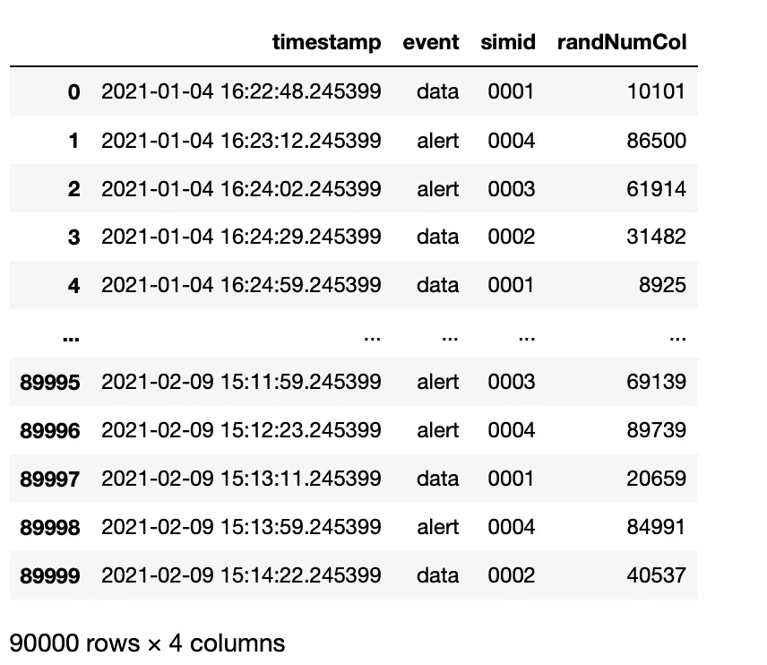

# 如何无中生有地创建物联网时间序列数据集

> 原文：<https://towardsdatascience.com/how-to-create-an-iot-time-series-dataset-out-of-nothing-74026903896d?source=collection_archive---------31----------------------->


尤利娅·卢卡希娜

## 使用 NumPy、Pandas 和 Datetime 创建一个包含时间序列数据的测试数据集的简单解决方案。物联网连接数据的例子。包括代码和逻辑解释。

# **挑战**

最近，我为一位客户工作，他需要一份涉及(不存在的)物联网公司数据的教程。我创建了一个测试数据集，因为所有可用的开源数据集并不完全匹配。这启发了我写另一个教程:你正在阅读的那个。

尽管现有的 Python Faker 包在创建假数据集方面做得很好，但它并没有涵盖像时间序列数据这样的用例。

时间序列的具体是什么？

*   时间戳是半随机的:它们构建了一个序列
*   一些预定义的事件重复但随机地发生
*   一些事件可能与其他事件绑定在一起，甚至更不随机

第一个语句意味着我们需要一行具有升序的时间戳值。这些值不是完全随机的，但是它们之间的滞后是随机的。

此外，我们需要一个第二维度，它是一个字符串或字符格式的数据集列，有一些以随机顺序出现的唯一值，但它们本身不是随机生成的。所以，问题是，如何沿着时间轴分布它们？

# **将目标分解成任务**

尽管这两个问题——随机升序日期和随机分布的已知字符值——乍一看可能令人害怕，但解决方案很简单。

我们只需要 NumPy 包和它出色的 random.randint()函数。和系统思维。

但是在开始之前，我们需要考虑最终数据集的设计以及创建它的方法。

我们需要一些物联网连接数据。数据集应该模拟安装在我们设备上的应用程序不断发送的消息。这个数据是元级别的。它不包含用户发送、接收或与之交互的任何信息。这些消息是应用程序完全在后台生成和传输的，没有用户的参与。它们经过定制，可让支持经理在设备无法正常运行之前识别出任何问题和异常。

连接数据由时间戳和与每个时间戳相关联的消息组成。前一种也称为事件，因为它们主要描述设备或 SIM 卡发生的事情，例如:

*   "创建 PDP 上下文"
*   "删除 PDP 上下文"
*   "更新 GPS 位置"
*   警报、警告和错误
*   数据使用:指的是由用户发起的在应用程序内部发送和接收数据(用户数据的实际内容从来不是该事件的一部分)

分组数据协议(PDP)上下文包含网络层地址等数据。PDP 上下文创建总是在数据使用事件之前。相反，使用“删除 PDP 上下文”事件来关闭数据传输。

或者至少，这是它在数据集中的样子。

当然，因为我们可能有不止一个设备要监控，所以我们需要一个包含 SIM 卡 ID 或设备 ID 的列。大概是字符串格式的。

因此，我们的任务是:

*   创建时间戳
*   沿着时间轴分配事件
*   确保 PDP 事件包含数据使用事件
*   创建 SIM IDs

我们的目标数据集示例:


物联网连接数据(图片由作者提供)

# **设计原型**

在我们写任何代码之前，让我们在脑海中播放一个场景。

我们从哪里开始？

带着笔记本和笔！但是我不想用我的画吓到你，所以我把它们都放进了幻灯片里。

首先，我们需要关注时间戳和数据使用事件。一旦我们有了时间轴，我们就可以开始分配任何事件。由于我们必须遵循分配上述三个事件的规则，我们将从分配“中间”事件(数据使用)开始，然后在时间轴上的核心事件旁边创建附加的“包装”事件。

我们还必须记住 SIM IDs。


事件和时间戳:时间轴上的可视化表示(图片由作者提供)

让我们去掉图表中除了时间戳和滞后之外的所有内容:


时间戳和延迟(图片由作者提供)

如您所见，我们不需要创建大量随机时间戳。我们需要创建一个开始时间戳，然后在每个现有时间戳上加上几秒钟，以生成下一个时间戳。

# **代码**

## **生成时间戳列**

我们可以手动设置第一个时间戳，或者使用 datetime 包中的 datetime.now()函数生成它。

```
from datetime import datetime, timedelta
import numpy as np
import pandas as pd
iotdf = pd.DataFrame(columns = [‘timestamp’, ‘event’, ‘simid’])
iotdf.at[0, ‘timestamp’, ] = datetime.now()
```

使用 NumPy 的 random.randint()函数将滞后作为随机数产生。对于这个用例，我将范围设置在 10 到 60 秒之间。

我们使用 datetime 包中的 timedelta()函数将随机生成的值添加到时间戳中。因为 random.randint()实际上创建了一个数组，所以我们必须访问它的第一个元素(即使在我们的例子中只有一个)，并通过使用。item()方法。

像这样:

```
iotdf.at[1, ‘timestamp’] = iotdf.at[0,’timestamp’] + timedelta(seconds=np.random.randint(10,60,1)[0].item())
```

动态地而不是手动地改变行号允许我们自动地填充数据集。然而，在进行下一步之前，我们需要决定另外一件事。

## **设置时间戳限制**

但是如何设置时间轴的终点呢？或者，更重要的是，生成它的代码应该在哪里停止？

三个可能的选项都使用了 while 循环:

*   您可以手动设置一个最终日期，然后在 while 循环中使用一个条件来保持生成过程一直进行到最终日期。在代码中，最终日期将是与数据集中最后一个当前存在的行相比较的*。如果后者仍然小于最后一个，while 循环将继续。*

```
final_date = ‘2021–01–05 14:58:32.908580’date_time_obj = datetime.strptime(final_date, ‘%Y-%m-%d %H:%M:%S.%f’)n = 0while iotdf.iloc[-1, 0] < date_time_obj:
x = n
n = n + 1
iotdf.at[n, ‘timestamp’] = iotdf.at[ x,’timestamp’] + timedelta(seconds=np.random.randint(10,60,1)[0].item())
```


时间戳列(作者图片)

*   您可以设置想要数据集覆盖的天数或小时数。和前面的例子一样，while 循环中的条件将最后一行中的值与要实现的数字进行比较，并决定是否停止。

```
number_of_hours = 48n = 0while (iotdf.iloc[-1, 0] — iotdf.iloc[0, 0]).days * 24 < number_of_hours:x = n
n = n + 1
iotdf.at[n, ‘timestamp’] = iotdf.at[ x,’timestamp’] + timedelta(seconds=np.random.randint(10,60,1)[0].item())
```

*   您可以设置所需的行数。您将计算 while 循环中已经创建的行数，并将其与目标行数进行比较，以保持其运行。

```
number_of_rows = 90000n = 0while iotdf.shape[0] < number_of_rows:x = n
n = n + 1
iotdf.at[n, ‘timestamp’] = iotdf.at[ x,’timestamp’] + timedelta(seconds=np.random.randint(10,60,1)[0].item())
```

在我们定义了数据集限制之后，我们可以让 while 循环运行并为我们完成工作。

## **生成事件列**

现在，当我们有了时间戳，我们就可以分配数据使用事件了。我们需要随机选择与特定事件相关联的时间戳。

我们再次使用随机数。我们创建一列，对于每一行，我们在至少与数据集本身一样大的范围内生成一个随机数。

```
iotdf[‘randNumCol’] = np.random.randint(1, iotdf.shape[0], iotdf.shape[0])
```

现在，我们必须做一些任意的事情。我们像这样定义一个范围(我们的数据集有 90，000 行):

1 < x < 60000

The x represents a cell in the random numbers column. We then loop over the rows using the apply() function again to assign the data usage event based on whether the random number falls into the range or not. The loop will create the events column.

We fill the empty rows in the new column — those that do not fall into the ranges — with alerts. A custom function helps to keep the whole less messy.

```
def random_event(x):if (x >= 1) & (x < 60000):
result = ‘data’
else:
result = ‘alert’
return resultiotdf[‘event’] = iotdf[‘randNumCol’].apply(random_event)
```

By selecting a range like the one above, try to consider whether you need a lot of particular events or you want them to be a rare thing. In the first case, select big ranges; for the second one, select narrow ranges. This will steer the total amount of one event type to be generated.

You can define multiple ranges to allocate multiple types of mutually excluding events.

## **生成设备/SIM ID 列**

您可以在分配 SIM 卡 id 的范围内重复这个技巧。请记住，范围的数量必须与您需要分配的 SIM IDs 的数量一致，并且范围必须覆盖我们在创建随机数列时使用的整个范围。

```
def random_simid(x):if (x >= 1) & (x < 25000):
result = ‘0001’
elif (x >= 25000) & (x < 50000):
result = ‘0002’
elif (x >= 50000) & (x < 75000):
result = ‘0003’
else:
result = ‘0004’
return resultiotdf[‘simid’] = iotdf[‘randNumCol’].apply(random_simid)
```



事件和 SIM IDs 准备就绪(图片由作者提供)

## **依赖事件**

现在，我们可以继续生成 PDP 事件。我们可以用 for 循环遍历这些行，对于每个数据使用时间戳，我们创建两个 PDP 事件，一个在前面，一个在后面，每个都有一秒钟的延迟。我们从父数据使用事件中复制 SIM ID 号。

我们首先将新行“附加”到数据框，以避免创建重复的行号。最后，我们简单地按照时间戳列对数据进行排序，并去掉我们不再需要的随机数列。

```
n = iotdf.shape[0]for i in range(0,iotdf.shape[0]):if iotdf.at[i, ‘event’] == ‘data’:
n = n + 1
iotdf.at[n, ‘event’] = ‘Create PDP context’
iotdf.at[n, ‘timestamp’] = iotdf.at[i, ‘timestamp’] — timedelta(seconds = 1)
iotdf.at[n, ‘simid’] = iotdf.at[i, ‘simid’]
n = n + 1
iotdf.at[n, ‘event’] = ‘Delete PDP context’
iotdf.at[n, ‘timestamp’] = iotdf.at[i, ‘timestamp’] + timedelta(seconds = 1)
iotdf.at[n, ‘simid’] = iotdf.at[i, ‘simid’]
iotdf = iotdf.sort_values(by=’timestamp’)
iotdf = iotdf.drop(columns = [‘randNumCol’])
iotdf.head(n = 10)
```


最终结果(图片由作者提供)

看起来我们真的完了！

# **一会儿之后**

在现实世界中，物联网设备可能会生成各种各样的消息，如 GPS 坐标、切换到新的移动运营商、发送的数据量等。

因此，我试图将重点放在可用于创建基本列的底层逻辑上:时间戳和事件。

# **手稿**

完整的代码可以在 Google Colab 中找到:

<https://colab.research.google.com/drive/1A0LGkQxUs9rG8BTS1J5_lg8ZNbBjZXRK?usp=sharing> [## 谷歌联合实验室

物联网数据](https://colab.research.google.com/drive/1A0LGkQxUs9rG8BTS1J5_lg8ZNbBjZXRK?usp=sharing) 

确保仅运行设置数据集限制的三个建议选项之一。