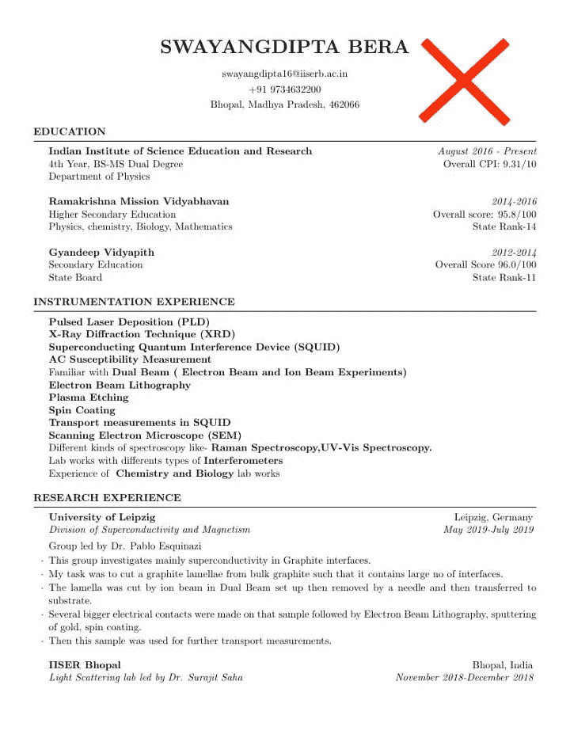
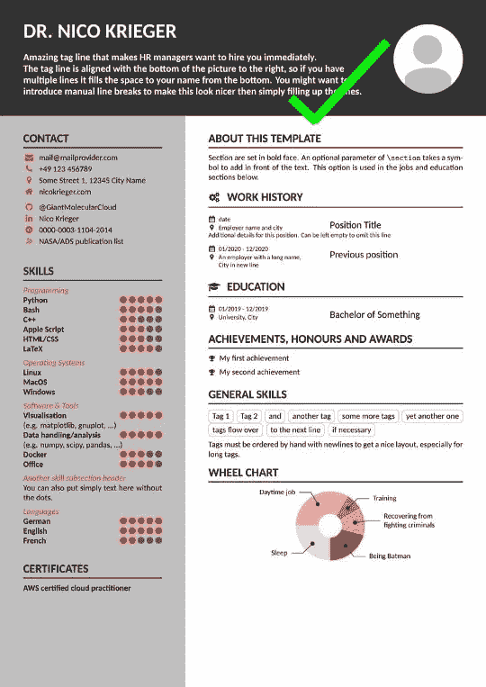
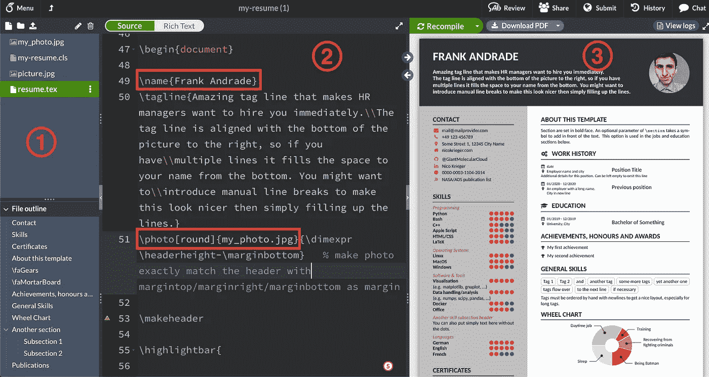
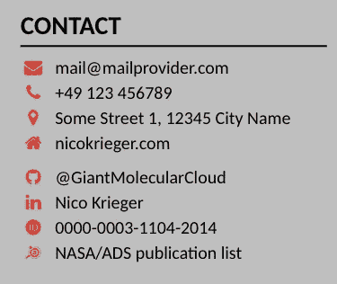
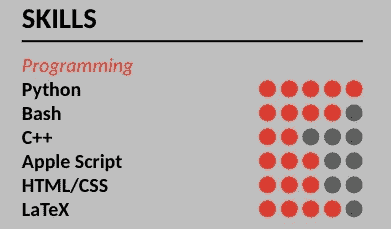
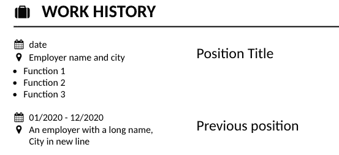
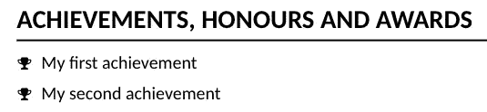
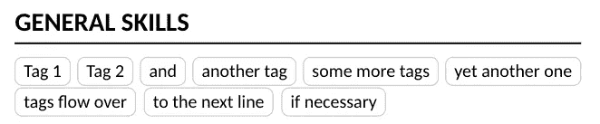
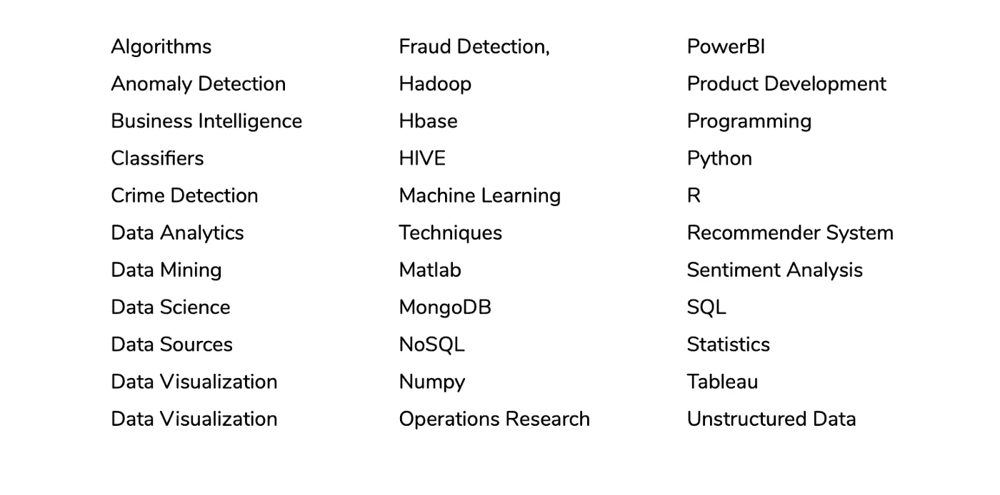

# 如何打造一份让人无法抗拒的数据科学简历(附代码)

> 原文：<https://towardsdatascience.com/how-to-create-an-irresistible-data-science-resume-with-code-1430a774c836?source=collection_archive---------13----------------------->

## 不要浪费时间使用 Word。使用模板、几行代码和技巧来增加你获得面试的机会。


塞巴斯蒂安·赫尔曼在 [Unsplash](https://unsplash.com?utm_source=medium&utm_medium=referral) 上的照片

写一份好的简历很难。你必须总结你在职业生涯中做过的所有好事，根据工作描述量身定制你的简历，甚至创建一份好看的简历，让你与众不同。

但你既不是创意作家，也不是平面设计师。那么如何在不花几个小时玩微软 Word 的情况下，创建一份令人无法抗拒的数据科学简历呢？

我们可以使用背页模板和 LaTeX，而不用像 Word 这样的文本编辑器。如果您在数据科学职业生涯中曾经使用过 Jupyter 笔记本，可能您已经使用 LaTeX 创建了数学方程。在这种情况下，我们将使用不同的 LaTeX 命令来编辑默认模板，并制作我们自己的简历。

Overleaf 和 LaTeX 将使您不必亲自完成所有的格式编排(因此您永远不必处理混乱的布局)，并帮助您专注于最重要的内容。

本文将分为两个部分。设计部分将在背页完成，它将帮助你从传统简历迅速转变为现代简历。



演职员表:[背面](https://www.overleaf.com/gallery/tagged/cv/page/1)

另一方面，内容部分将包括如何撰写数据科学简历的实际例子，因此您可以增加获得面试的机会。

```
**Table of Contents** 1\. [Section 1: The Design](#1f32)
 - [Step 1: Choose an Overleaf Template](#a2cd)
 - [Step 2: Edit The Template](#ff14)
 - [Step 3: Add/Remove a Second Page and Download the Resume](#a6c5)
2\. [Section 2: The Content](#f172)
 - [Keywords](#7398)
 - [The What, How, and The Effect](#9607)
 - [Focus on the outcomes](#8977)
 - [Include Projects](#b643)
```

# 第一部分:设计

## 第一步:选择一个背页模板

这里是上百个简历模板的图库。点击其中任何一个，然后你会看到 3 个选项:作为模板打开，查看源代码，下载 PDF。

第一个将在背面打开一个模板，这样我们可以使用它的编辑器引入我们自己的数据。第二个选项将显示模板的普通代码，而第三个选项将按原样下载模板。

要制作我们自己的简历，我们选择“作为模板打开”如果您有背页帐户，您将被重定向到编辑器，但如果您没有，您将看到登录页面。只需使用 Google(或您喜欢的选项)注册，就可以被重定向到编辑器。

登录后，您会看到类似这样的内容:



作者图片

有 3 个主要部分:

1.  左边栏:在这里你可以管理所有用来创建简历的文件。大多数模板都有 3 个缺省文件:一个. cls 文件(我在这里几乎不做任何修改，但是它必须在那里，模板才能工作)，一个. tex 文件(这里我们引入所有数据来修改模板)，和一个. jpg 文件(只有当模板包含图像时)
2.  source 部分:这个部分允许我们编辑用来创建模板的代码。紫色的命令很容易记住(你甚至可以直观地学习它们)。如你所见，我已经分别通过编辑命令`\name`和`\photo` 更改了默认名称和照片(当然，你必须首先通过点击左上角的第三个按钮来上传照片)。我将在下一步给出更多关于如何编辑模板的细节(例如，如何插入图标、分隔线、标签和更多酷的东西)
3.  预览部分:在这里你可以看到你正在创建的简历的预览。只需点击“重新编译”按钮来运行它。完成后，点击“下载 PDF”下载最终简历。

## 步骤 2:编辑模板

对于这个例子，我将使用步骤 1 中显示的模板[。您可以选择任何想要的模板，但请记住，可能会有一些小的变化(一些模板有额外的部分或在不同的位置有部分)](https://www.overleaf.com/latex/templates/my-resume/qxsxdtmknkfr)

不管你选择什么样的模板，**我们都将学习最常用的 LaTeX 命令**，以我们想要的方式编辑模板。你可以检查[这里所有可用的命令](https://www.bu.edu/math/files/2013/08/LongTeX1.pdf)。

让我们编辑一些你的数据科学简历中的必备部分。

## 接触



作者图片

您可以在此添加任何想要共享的联系信息。若要定位表示此部分的代码，请打开。tex 文件，按 CTRL+F，并写下“联系人”你会看到这样的东西；

```
\highlightbar{**\section{Contact}**

    \email{mail@mailprovider.com}
    \phone{+49 123 456789}
    \location{Some Street 1, 12345 City Name}
    ...\section{Skills}
```

在花括号内，你可以引入你自己的数据。使用反斜杠(\)编写命令。在这种情况下，通过书写他们的名字可以容易地创建联系人图标(例如，`\email`、`\github` 和`\linkedin`)。

## 技能



作者图片

在这里，您突出显示了您拥有的所有技能，并按级别对它们进行了分类。按 CTRL+F，并写“技能”来定位这一部分。您将看到以下结构。

```
**\section{Skills}**

 **\skillsection{Programming}**
 \skill{Python}{5}
 \skill{Bash}{4}
 \skill{C++}{2}
 \skill{Apple Script}{3}
 \skill{HTML/CSS}{3}
 \skill{LaTeX}{4}

 \vspace{0.5em}
 **\skillsection{Operating Systems}**
...
```

要添加一个新的子部分(比如上图中的“编程”)，使用`\skillsection` 命令，而`\skill`命令将显示技能及其等级(数字代表红点的数量)。您可以添加诸如编程技能、软件&工具、语言技能等子部分。

记住“技能”里面的每个子部分后面都有一个垂直空格(`\vspace),`，所以在做修改的时候不要忘记删除或者添加它。

## 工作经历和教育



作者图片

这些部分具有相似的结构。如果你搜索“工作经历”或“教育”，你会找到这样的内容。

```
**\section[\faGears]{Work history}**
 \job{date}
     {Employer name and city}
     {Position Title}
     {Job Function}
```

显然，您在之前的工作中做了很多事情，所以要列出所有这些事情，我们必须添加`\item`命令。现在，新代码将如下所示:

```
**\section[\faGears]{Work history}**
    \job{date}
        {Employer name and city}
        {Position Title}
        {**\begin{itemize}**
         \item Funcion 1
         \item Funcion 2
         \item Funcion 3
        **\end{itemize}**}
```

你也可以改变默认的齿轮图标`\faGears`。[在这里你可以找到 Latex](http://mirrors.ibiblio.org/CTAN/fonts/fontawesome/doc/fontawesome.pdf) 上所有可用图标及其命令的列表。假设你更喜欢用行李箱作为图标，然后进入那个页面，搜索“行李箱”这个词。您会发现`\faSuitcase`命令，所以在第一行代码中介绍它。

```
**\section[****\faSuitcase****]{Work history}**
    \job{date}
         ...
```

## 成就和一般技能



作者图片

这两个部分都使用特殊的命令，使简历看起来更好。“成就”部分如下所示:

```
**\section{Achievements, honours and awards}**
 \achievement{My first achievement}
 \achievement{My second achievement}
```

通过使用`\achievement`命令，我们用一个奖杯图标列出我们所有的成就。



作者图片

“一般技能”部分如下所示:

```
**\section{General Skills}**
 \smallskip % additional skip because tag outlines use up space
 \tag{Tag 1}
 \tag{Tag 2}
 \tag{and}
```

`\tag`命令允许我们在那些漂亮的圆角矩形内添加技能。

## 其他部分

您可以创建更多节，删除任何现有节或完全更改它们。例如，我选择的模板有一个“车轮图”，显示“你生命中的一天”

如果这看起来与你无关，就把它改成课外活动、强项或你从事的项目。您也可以删除它的代码来去掉那个部分，或者用百分号`%`注释掉它。

## 第三步:添加/删除第二页并下载简历

您可以添加任意多的页面。复制第一页的原码粘贴到下面就可以了。

如果你的模板有第二个你想删除的页面，使用`%` 注释掉整个页面或者删除它的代码。

最后，你可以点击“下载 PDF”选项来下载简历确保通过单击左上角的铅笔按钮来重命名文件。这将有助于您在以后轻松识别该模板，并在将来进行更多的更改。

# 第二部分:内容

第一部分将有助于简历引起招聘人员的注意，现在在第二部分，我将向你展示一些你可以做的事情来增加获得面试的机会。

## 关键词

你知道吗，大部分时间[简历都是由申请人跟踪系统](/what-are-data-science-recruiters-looking-for-in-a-resume-edc90b28bee6)扫描的？这个工具可以帮助招聘人员使用特定的关键词在几分钟内筛选出简历。

阅读职位描述，选择合适的关键词来很好地描述你的经历，并表明你是这份工作的潜在合适人选。

数据科学领域中使用的一些关键词是:



信用:[拉希德赛](/what-are-data-science-recruiters-looking-for-in-a-resume-edc90b28bee6)

## 什么、如何和效果

每当你描述你在以前的工作中所做的事情时，包括你做了什么，你是如何做的，以及它的效果。

> 利用 Python 实施了机器学习技术，用于对 3TB 非结构化数据进行时序异常检测，从而将总处理时间减少了 20%

顺序并不重要，但是要确保你把它们都包括在内。

## 关注结果

告诉你使用的复杂算法是很好的，但你应该专注于结果。归根结底，公司更关心的是最终结果，而不是你是如何做到的。

包括数字，使结果可以衡量。我们上面使用的例子在用数字突出结果方面做得很好。

> “利用 Python 实施机器学习技术，对 3TB 非结构化数据进行时序异常检测，**，将总处理时间减少了 20%”**

## 包括项目

如果你没有经验或者经验很少，这是非常有用的。解决你喜欢的主题的项目，并在你的简历中突出它们。[以下是你可以在简历中加入的 5 个数据科学项目清单](/5-solved-end-to-end-data-science-projects-in-python-acdc347f36d0)。

你可以在你的 Github 上添加一个链接来显示你的项目代码，甚至可以写一篇像这样的数据科学文章，用简单的英语解释你的项目是关于什么的(记住，HR 不懂编程，所以一篇文章会让其他人很容易知道你构建了什么，你是如何做的以及结果)

[](/your-first-data-science-job-might-not-be-what-you-expect-e8e75103687c) [## 你的第一份数据科学工作可能不是你所期望的

### 数据科学工作的期望与现实

towardsdatascience.com](/your-first-data-science-job-might-not-be-what-you-expect-e8e75103687c) 

恭喜你！你创造了一份不可抗拒的数据科学简历。你可以随时在评论区、电子邮件或 LinkedIn 上问我你想在简历中添加的任何特色。

[**与 3k 以上的人一起加入我的电子邮件列表，获取我在所有教程中使用的 Python for Data Science 备忘单(免费 PDF)**](https://frankandrade.ck.page/bd063ff2d3)

如果你喜欢阅读这样的故事，并想支持我成为一名作家，可以考虑报名成为一名媒体成员。每月 5 美元，你可以无限制地阅读媒体上的故事。如果你使用[我的链接](https://frank-andrade.medium.com/membership)注册，我会赚一小笔佣金，不需要你额外付费。

[](https://frank-andrade.medium.com/membership) [## 阅读弗兰克·安德拉德(以及媒体上成千上万的其他作家)的每一个故事

### 作为一个媒体会员，你的会员费的一部分会给你阅读的作家，你可以完全接触到每一个故事…

frank-andrade.medium.com](https://frank-andrade.medium.com/membership)