# 如何创建机器学习应用程序并将其部署到 Heroku

> 原文：<https://towardsdatascience.com/how-to-create-and-deploy-a-machine-learning-app-to-heroku-d6965aa4f627?source=collection_archive---------10----------------------->


由 [envato elements](https://1.envato.market/c/2346717/628379/4662) 的 [Faber14](https://elements.envato.com/user/Faber14) 使用图像创建(经许可)。

## [数据科学](https://medium.com/tag/data-science) | [机器学习](https://medium.com/tag/machine-learning)

## 从模型到部署的分步指南

机器学习模型的部署是数据生命周期中的一个重要阶段。这样的模型可以是一个最小可行产品(MVP ),它允许相关的涉众访问模型并从中进行测试和试验，这可以为进一步的模型改进提供有价值的反馈。

模型部署可能看起来是一项困难和令人生畏的任务，但事实并非如此。在本文中，您将了解如何使用 Heroku 轻松地将机器学习应用程序部署到云中。部署到 Heroku 的优势在于，我们不必担心与应用运行的底层操作系统相关的任何事情(即，不再需要安装更新、依赖或维护)。

需要注意的是，本文有一个附带的视频( [***如何将数据科学 Web App 部署到 Heroku***](https://youtu.be/zK4Ch6e1zq8) )，可以作为参考的补充或视觉辅助。

[如何将数据科学 Web App 部署到 Heroku](https://youtu.be/zK4Ch6e1zq8) @ [数据教授](https://www.youtube.com/channel/UCV8e2g4IWQqK71bbzGDEI4Q)

# 1.什么是 Heroku，我们为什么需要它？

Heroku 是一个平台即服务，将应用程序部署到云上。该平台正式支持由 Node.js、Ruby、Java、PHP、Python、Go、Scala 和 Clojure 等多种编程语言创建的应用。它还通过使用第三方构建包支持其他语言(比如 R Shiny)。

与在 Linux 或 Windows 操作系统上创建自己的虚拟专用服务器(VPS)相比，使用 Heroku 的优势在于维护服务器所需的时间和开销。想象一下处理软件升级、依赖性和兼容性问题的头痛。


Heroku 网站截图。

例如，我有一个 Ubuntu 服务器，运行着我的几个 R Shiny 应用程序，运行得非常好，但它运行在 Ubuntu 14 和一个旧版本的 R 上，这意味着它不支持新的 R 包。将所有的应用程序迁移到一个新的服务器似乎是一个压倒性的任务，直到今天我还在拖延。如果使用 Heroku，所有这些问题都不再重要。最棒的是，你可以从 Heroku 免费开始，因为他们每月提供大约 550-1000 dyno 小时的免费服务。

dyno 是独立的 Linux 容器，是 Heroku 产品的构建模块。它们的尺寸从小型且经济的 dyno(提供较少的 CPU 处理器和较小的 RAM 容量)到更大且更昂贵的 dyno(无限的 CPU 处理器和高达 14 GB 的 RAM)。

# 2.我们今天部署的是什么型号

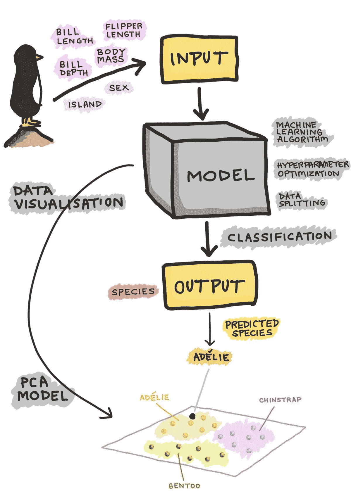

企鹅分类模型的概要。

我们今天要部署的机器学习模型是企鹅物种分类模型。

本质上，该模型将使用企鹅的先天物理特征(例如喙长、喙深、鳍长、体重)以及它们的性别和地理位置作为输入参数(即 X 变量)，以便将企鹅分类为属于三个物种(例如阿德利企鹅、巴布亚企鹅和下颚带企鹅)中的一个，即 Y 变量。

左侧图像中总结了建模工作流程的卡通插图。

# 3.构建机器学习模型

现在，我们已经看到了如何构建模型的示意性工作流，现在让我们看一下代码。

## 3.1.密码

## 3.2.逐行解释

在这个简单的例子中，我们将使用随机森林算法将企鹅分类为属于上面提到的三个物种(阿德利企鹅、巴布亚企鹅和下巴颏企鹅)中的一个。

**第 1 行** —导入`pandas`库，该库随后将用于存储企鹅数据集的值。

**第 2 行** —使用`pd.read_csv()`函数从 CSV 文件中读入企鹅数据集，并将内容存储到`penguins`变量中。

**第 4 行和第 5 行** —注释文本，描述下面的代码块将执行序号特征编码

**第 6 行** —将`penguins`变量的内容复制到新创建的`df`变量中。

**第 7 行** —指定在`df`数据帧中找到的列名`'species'`，我们将使用它作为 Y 变量。

**第 8 行** —创建一个待编码的有序特征列表，并将其分配给`encode`变量。

**第 10–13 行** —这里，序数特征将被编码。`for`循环用于迭代要编码的 2 个特征，如下:
—通过`pd.get_dummies()`函数执行一次热编码，并将新生成的热编码值作为新列连接到`df`数据帧中。
—最后，从`df`数据框中删除原来的列。

**第 15–19 行** —将用作 Y 变量的物种列现在将通过数值映射转换为数值形式，从而将类别标签(Adelie、Chinstrap 和 Gentoo)映射为数值(0、1 和 2)，如第 15 行所示。创建一个简单的自定义函数来执行这个数字映射(第 16 和 17 行)，它将应用于第 19 行。然后，映射值被分配给`df`数据帧的`'species'`列。

**第 21–23 行**—`df`数据帧现在将被分成`X`和`Y`变量，分别在第 22 和 23 行执行。

**第 25–28 行** —这段代码现在将构建第 25 行注释的随机森林模型。首先从`sklearn.ensemble`子模块导入`RandomForestClassifier`功能。该模型在第 27 行被实例化，由此`RandomForestClassifier()`函数被分配给`clf`变量。使用`X`和`Y`变量作为输入数据，通过`clf.fit()`功能最终在第 28 行训练模型。

**第 30–32 行** —最后，我们将通过用`pickle`库序列化来保存模型，其中`pickle.dump()`函数将把存储在`clf`变量中的训练模型保存到一个名为`penguins_clf.pkl`的文件中。

我们现在有了从`scikit-learn`保存的训练模型，我们现在将使用它进行模型部署。

# 4.构建 Web 应用程序

关于使用 Streamlit 库用 Python 构建 Penguins web 应用程序的完整细节和逐行解释，请参见上一篇文章(见下文)。

[](/how-to-build-a-data-science-web-app-in-python-penguin-classifier-2f101ac389f3) [## 如何用 Python(企鹅分类器)构建数据科学 Web 应用

### 第 3 部分:ML 支持的 Web 应用程序，代码 100 多行

towardsdatascience.com](/how-to-build-a-data-science-web-app-in-python-penguin-classifier-2f101ac389f3) 

## 4.1.密码

现在让我们使用 Streamlit 库来构建企鹅应用程序。下面显示的`penguins-app.py`文件中提供了构建应用程序的代码。这个应用程序将利用训练好的模型(`penguins_clf.pkl`)来预测类别标签(企鹅的物种是阿德利企鹅、下巴颏企鹅还是巴布亚企鹅)，方法是使用来自 web 应用程序前端侧边栏面板的输入参数。

## 4.2.启动应用程序

我们将在自己的电脑上本地启动该应用程序。首先，确保你已经安装了`streamlit`，如果你还没有，你可以使用下面的命令来安装:

```
pip install streamlit
```

在终端中，我们现在可以使用以下命令启动应用程序(`penguins-app.py`文件):

```
streamlit run penguins-app.py
```

稍后，我们应该会在终端中看到以下输出。

```
> streamlit run penguins-app.pyYou can now view your Streamlit app in your browser.Local URL: http://localhost:8501
Network URL: http://10.0.0.11:8501
```

然后会弹出一个浏览器，给我们一个企鹅应用程序。

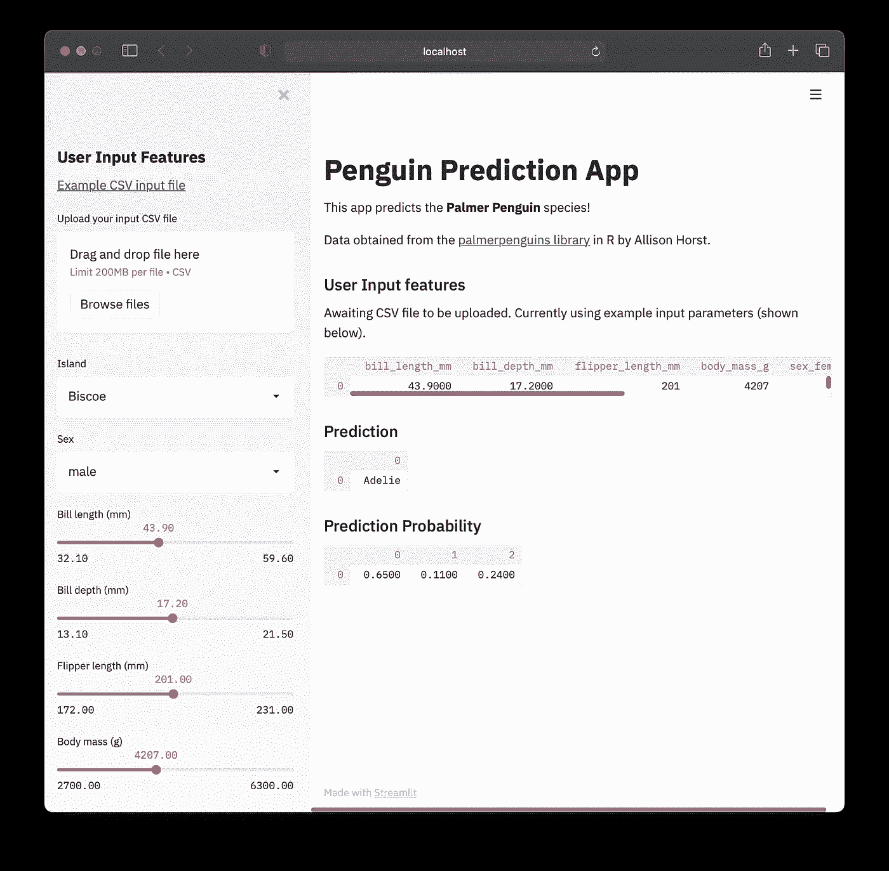

企鹅 App 本地版截图。

既然 web 应用程序可以在本地工作，我们现在将继续把它部署到云上。

# 5.企鹅应用程序的存储库

## 5.1.创建新的存储库

首先，我们将在 GitHub 上创建一个新的存储库，并将该存储库命名为`penguins_heroku`，可以在 ***存储库名称*** 的文本框中输入。然后在**上打勾*添加一个自述文件*** 并点击 ***创建资源库*** 。

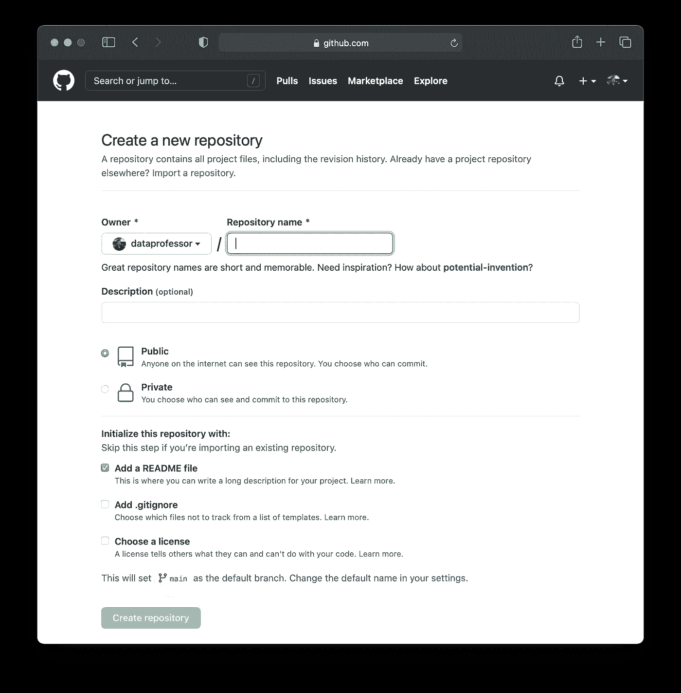

在 GitHub 上创建新存储库的截图。

其次，我们将把训练好的模型(`penguins_clf.pkl`)和 web 应用(`penguins-app.py`)上传到这个新的 GitHub 存储库中。这可以通过点击 ***添加文件>上传文件*** 来完成。然后选择并上传以上 2 个文件(`penguins_clf.pkl`和`penguins-app.py`)。

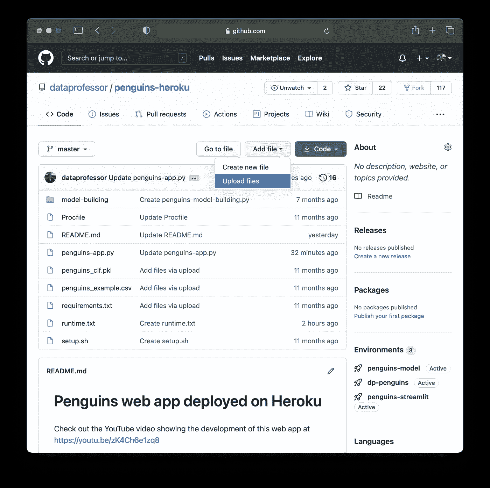

显示如何将文件上传到 GitHub 存储库的屏幕截图。

从上面的屏幕截图中，您将看到除了 2 个上传的文件之外，我们还有 5 个额外的文件(`Procfile`、`penguins_example.csv`、`requirements.txt`、`setup.sh`和`runtime.txt`)，我们也必须创建这些文件并将其放置在这个存储库中。

## Procfile

## 企鹅 _ 示例. csv

## requirements.txt

## setup.sh

## runtime.txt

## 5.2.在存储库中创建新文件

要在 GitHub 上直接创建新文件，我们可以点击 ***添加文件>创建新文件*** 。

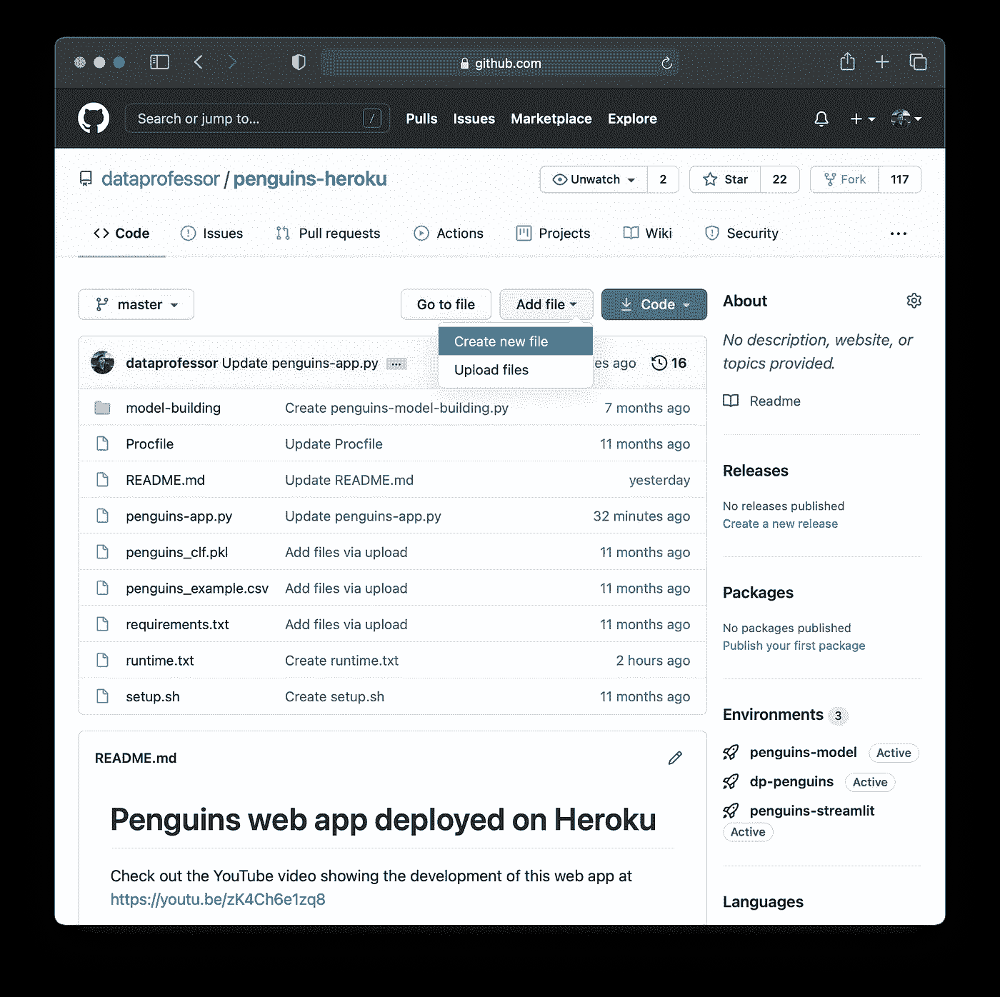

显示如何在 GitHub 存储库中创建新文件的屏幕截图。

在下面的例子中，我们将创建上述四个文件中的一个，我们将从创建`Procfile`文件开始:

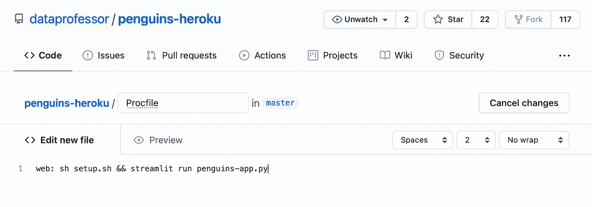

显示创建 Procfile 的屏幕截图。

然后，滚动到页面底部，点击 ***提交新文件*** 按钮。然后，您应该注意到 Procfile 被添加到了存储库中。

对由`penguins_example.csv`、`requirements.txt`、`setup.sh`和`runtime.txt`组成的其余 4 个文件重复上述步骤。

# 6.部署到 Heroku

现在让我们通过前往 Heroku 网站注册(如果您还没有注册)并登录来部署模型。

## 6.1.报名参加 Heroku

要注册一个免费的 Heroku 帐户，找到 Heroku 网站右上角的 [***【注册】***](https://signup.heroku.com/) 按钮，如下所示。


在哪里可以找到“**注册”**按钮的截图(用红色矩形表示)。

## 6.2.登录 Heroku

注册后，登录您的 Heroku 帐户。

## 6.3.创建新应用程序

要创建一个新的应用程序，点击 ***新建>创建新的应用程序*** 按钮，如下图所示。

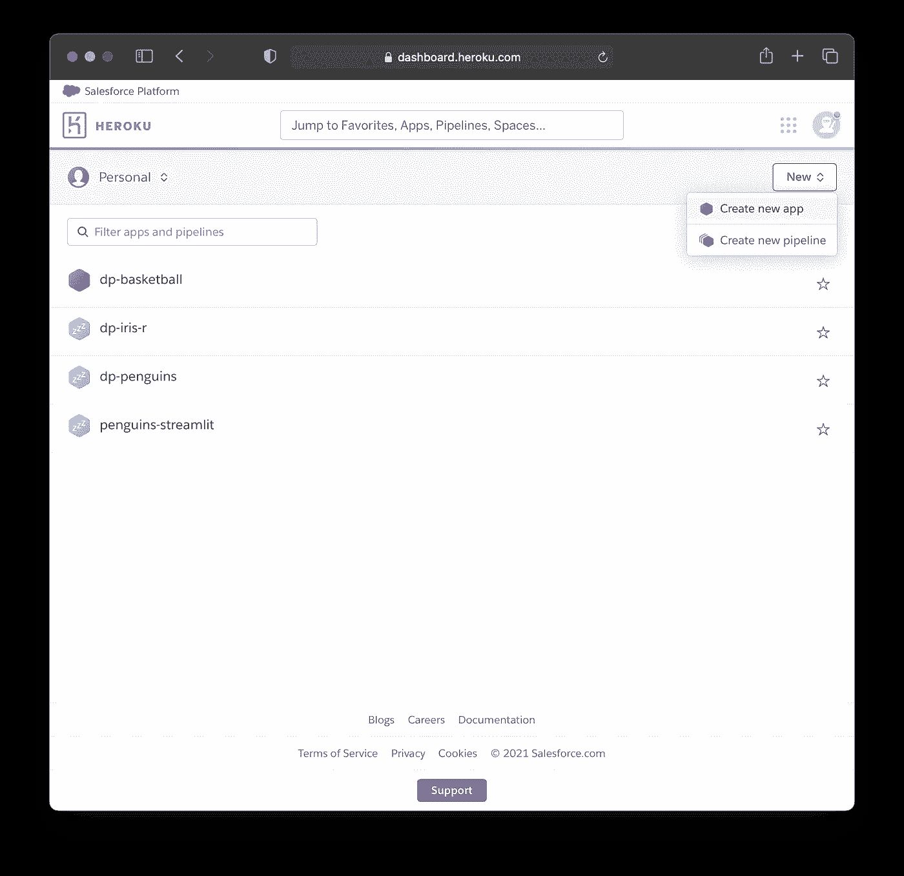

在哪里可以找到**“创建新应用”**按钮的截图(右上角)。

现在，我们将为应用程序命名，这里我们将使用仍然可用的`penguins-model`。需要注意的是，如果一个应用程序名称已经被使用，你会看到一个错误信息，如果是这样，你可以选择一个新的名称。

要继续，点击底部的 ***创建 app*** 按钮。

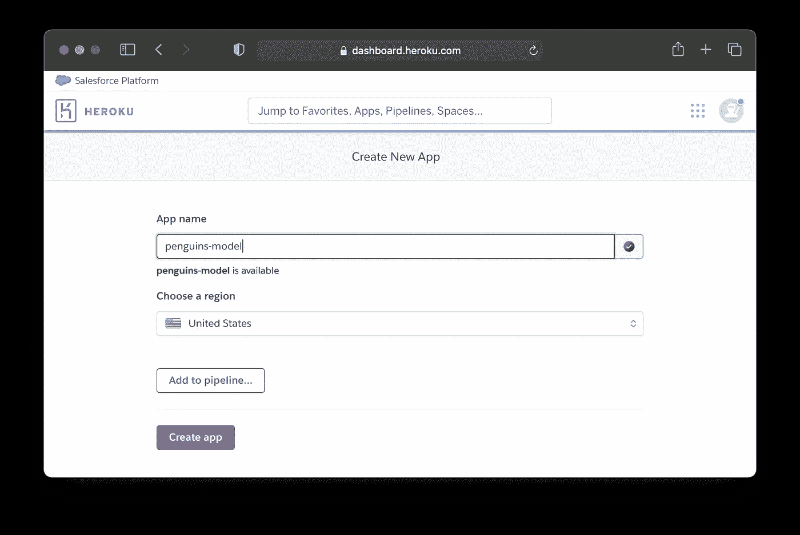

显示新应用程序命名的屏幕截图。

## 6.4.连接到 GitHub

我们现在要将我们的应用程序连接到 GitHub 存储库。为此，点击 ***GitHub(连接到 GitHub)*** ，如下图所示。

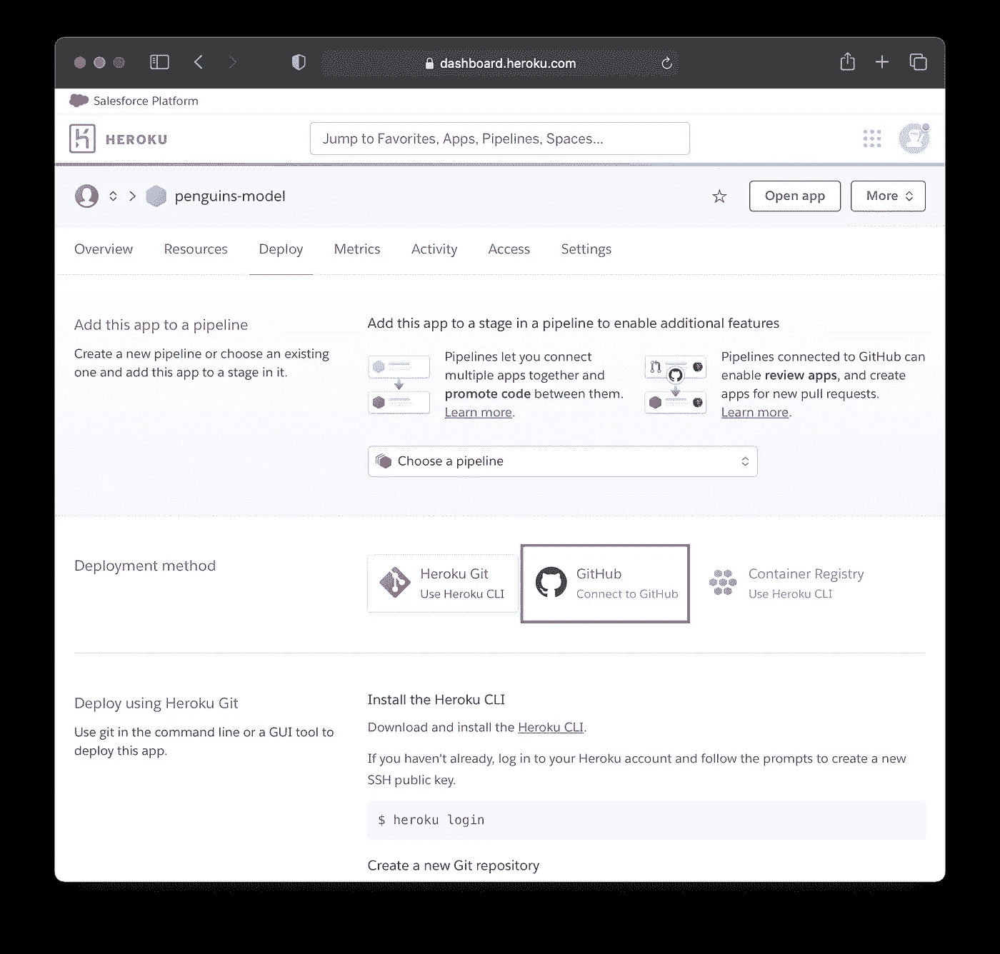

显示部署方法的屏幕截图。

如果这是你第一次部署到 Heroku，你将不得不验证你的 GitHub 帐户，并给予 Heroku 访问它的许可。每一个 Heroku 帐号都要这样做一次。

现在，在文本框中输入您刚刚创建的 GitHub 库的名称，并点击 ***连接*** 。

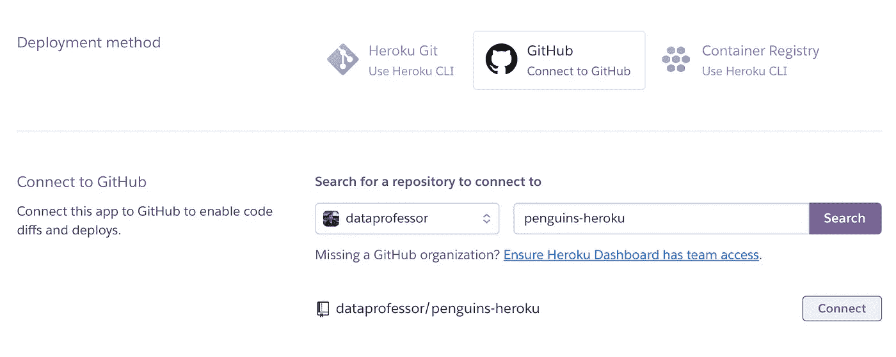

显示企鹅应用程序的 GitHub 存储库名称条目的屏幕截图。

## 6.5.部署

如果成功，您将看到`Connected to dataprofessor/penguins-heroku`消息。需要注意的是，我们可以激活`Automatic deploys`，但建议在`Manual deploy`成功后再激活。因此，我们可以稍后再回来激活它。

现在，向下滚动并点击 ***部署分支*** 按钮。


显示已连接的 GitHub 存储库以及自动部署和手动部署的屏幕截图。

构建日志将随着容器的供应和必备库的安装而更新。


显示容器和库安装供应的屏幕截图。

在容器被提供并且库被成功安装之后，您应该会看到消息`Your app was successfully deployed`。

现在，单击 ***视图*** 按钮启动部署的 web 应用程序。

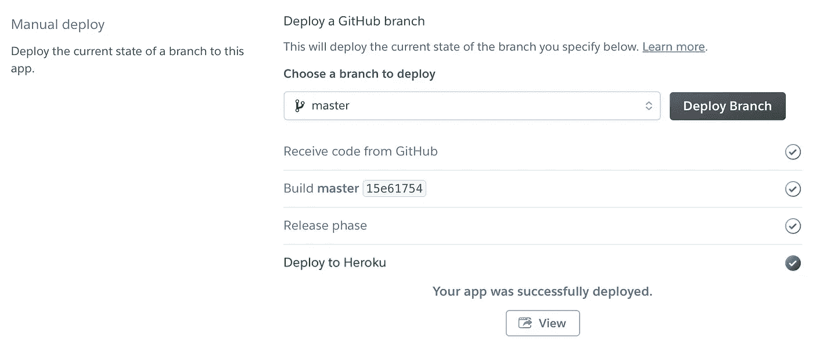

显示已部署应用程序的成功消息的屏幕截图。

# 7.部署企鹅应用程序

如果您看到 web 应用程序没有错误消息，那么恭喜您！您现在已经成功部署了企鹅应用程序。如果您想观看企鹅 App 的 [***演示，请点击以下链接。***](https://penguins-model.herokuapp.com)

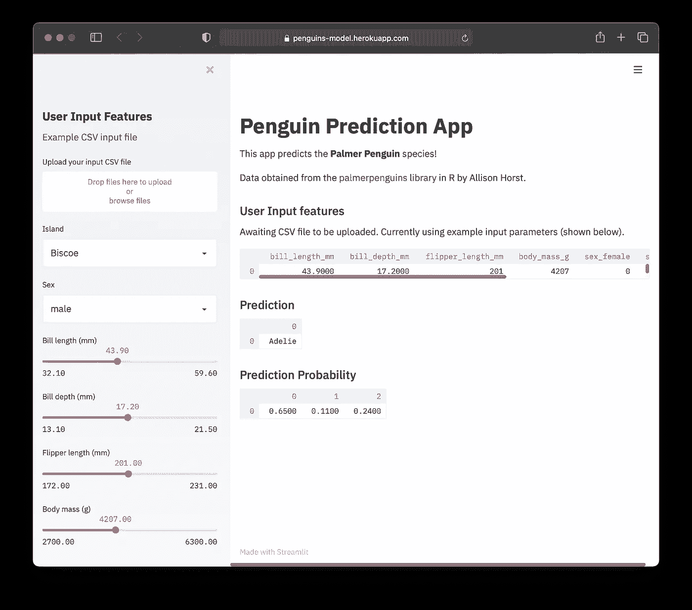

Heroku 上部署的[企鹅 App 截图。](https://penguins-model.herokuapp.com)

## 订阅我的邮件列表，获取我在数据科学方面的最佳更新(偶尔还有免费赠品)!

# 关于我

我是泰国一所研究型大学的生物信息学副教授和数据挖掘和生物医学信息学负责人。在我下班后的时间里，我是一名 YouTuber(又名[数据教授](http://bit.ly/dataprofessor/))制作关于数据科学的在线视频。在我做的所有教程视频中，我也在 GitHub 上分享 Jupyter 笔记本([数据教授 GitHub page](https://github.com/dataprofessor/) )。

[](https://www.youtube.com/dataprofessor) [## 数据教授

### 数据科学、机器学习、生物信息学、研究和教学是我的激情所在。数据教授 YouTube…

www.youtube.com](https://www.youtube.com/dataprofessor) 

# 在社交网络上与我联系

YouTube:[【http://YouTube . com/data proper/](http://youtube.com/dataprofessor/)
网站:[【http://data proper . org/](https://www.youtube.com/redirect?redir_token=w4MajL6v6Oi_kOAZNbMprRRJrvJ8MTU5MjI5NjQzN0AxNTkyMjEwMDM3&q=http%3A%2F%2Fdataprofessor.org%2F&event=video_description&v=ZZ4B0QUHuNc)【正在建设】
LinkedIn:[【https://www . LinkedIn . com/company/data proper/](https://www.linkedin.com/company/dataprofessor/)