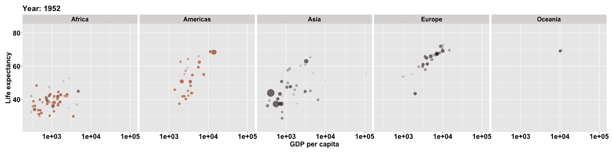
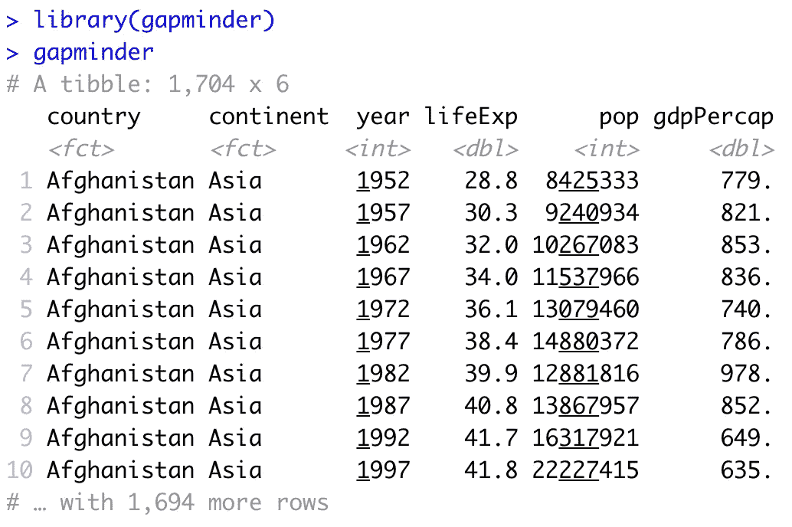
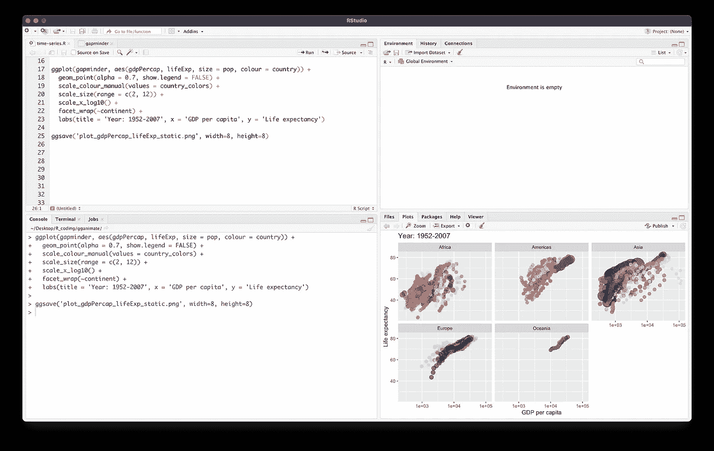
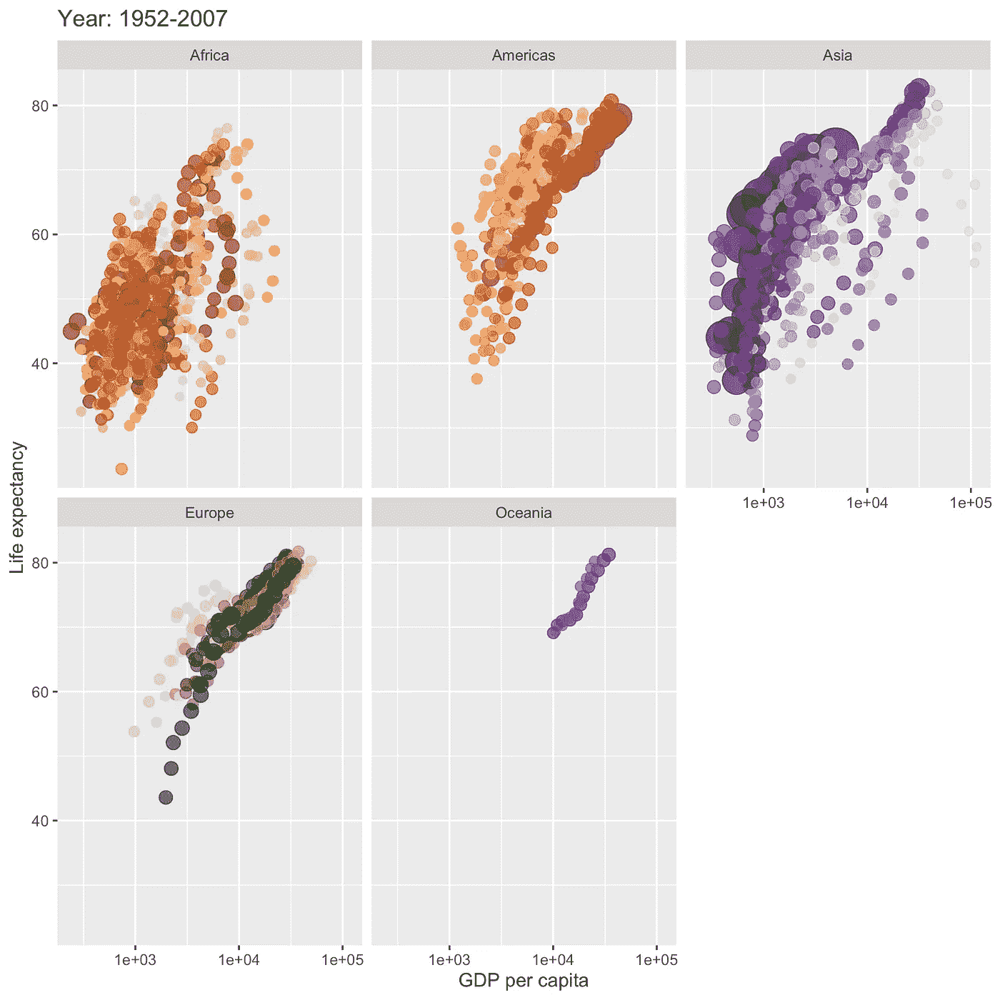
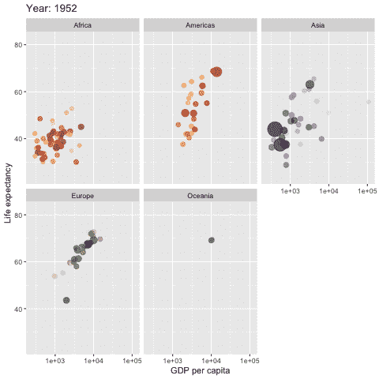
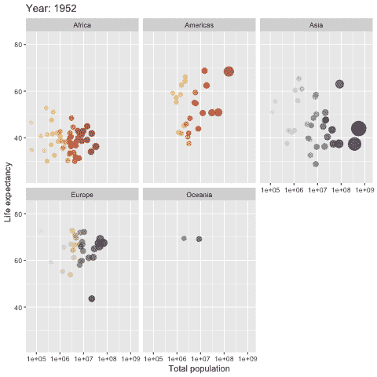
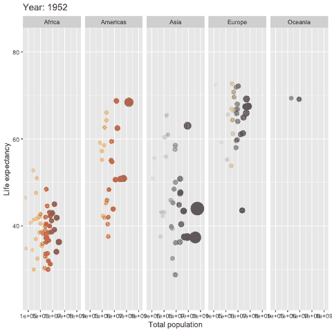
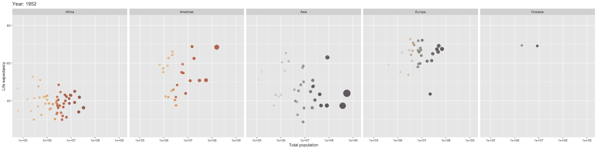
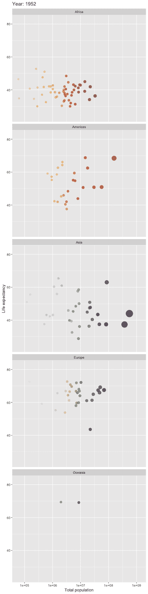

# 如何在 R 中创建动画情节

> 原文：<https://towardsdatascience.com/how-to-create-animated-plots-in-r-adf53a775961?source=collection_archive---------7----------------------->


使用来自 [envato elements](https://1.envato.market/c/2346717/628379/4662) 的 [alexdndz](https://elements.envato.com/user/alexdndz) 的图像创建(经许可)。

## 循序渐进的教程

## 使用 gganimate R 包制作时间序列数据的动画

一张图片胜过千言万语，图表和情节提供的见解也是如此。数据可视化是任何数据科学项目的重要组成部分，因为它允许以图形和图表的形式有效地讲述数据。即使是静态的情节也能传达重要的信息并提供巨大的价值，想象一下一个动画情节能做什么来突出情节的特定方面。

汉斯·罗斯林在他的 [TED 演讲](https://www.ted.com/playlists/474/the_best_hans_rosling_talks_yo)中关于 Gapminder 数据(他是该数据的创始人)的动画情节吸引了我们所有人，因为它将数据带入了生活。

在本文中，您将学习如何使用`ggplot`和`gganimate` R 包为时间序列数据集创建令人惊叹的 R 动画图。

观看附带的 YouTube 视频:[https://youtu.be/z9J78rxhcrQ](https://youtu.be/z9J78rxhcrQ)

# 1.我们今天构建的动画情节

今天，我们将构建 Gapminder 数据集的动画散点图。特别是，你会看到这个情节是由大陆分割的(分成不同的子情节)，而不是在同一个情节中(这可能会很混乱)。

动画情节将使用`ggplot2`和`gganimate` R 软件包构建。


下面展示的是我们今天构建的动画剧情(来源: [gganimate](https://gganimate.com/) )。



使用 ggplot 和 gganimate 创建的 Gapminder 数据集的动画散点图。

# 2.编码环境

现在，启动您选择的 IDE，无论是 RStudio、Kaggle 笔记本还是普通的老式 R 终端。在这个编码环境中，你将输入后面提到的代码。

我个人最喜欢的 R 语言编码应该是使用免费开源的 RStudio IDE。

# 3.安装必备的 R 包

在本教程中，我们使用 4 R 包，包括`gapminder`、`ggplot2`、`gganimate`和`gifski`。

要安装这些 R 包，请在 R 终端中输入以下内容(无论是直接输入 R 终端、RStudio 中的 R 终端还是 Kaggle 笔记本的代码单元。

```
install.packages(c('gapminder','ggplot2','gganimate','gifski'))
```

现在让我们来看看为什么我们要使用上面的 R 包。

*   `gapminder`包含我们在本教程中使用的 [Gapminder](https://www.gapminder.org/data/) 时间序列数据集的摘录。
*   `ggplot2`允许我们创建出色的数据可视化，即散点图
*   `gganimate`允许我们给剧情添加动画
*   `gifski`允许我们将动画渲染为 GIF 文件格式(GIF 是一种流行的动画图像格式)。

# 4.探索 Gapminder 数据集

在我们的数据可视化之前，让我们看一下 Gapminder 数据集。

这里，我们将从加载`gapminder`包开始，并返回`gapminder`变量的内容。



gapminder 数据集的屏幕截图。

在这里，我们可以看到数据是一个由 1704 行和 6 列组成的 *tibble* (tidyverse 对数据帧的实现)。

这 6 列包括:

*   `country` —国家名称
*   `continent` —各大洲的名称
*   `year` —数据输入的年份
*   `lifeExp` —给定年份的预期寿命
*   `pop` —给定年份的人口数量
*   `gdpPercap` —给定年份的人均国内生产总值

# 5.创建静态散点图

在本节中，我们将创建一个静态版本的散点图，它可以用作与动画版本进行比较的基线。

## 5.1.密码

创建散点图的代码如下所示:

我如何在 RStudio 中实现代码的屏幕截图:



在 RStudio IDE 中实现代码的屏幕截图。

## 5.2 逐行解释

*   **线 1**—`ggplot()`功能用于使用`ggplot2` R 包创建图形。第一个输入参数定义了存储在`gapminder`变量中的输入数据。`aes()`功能通过定义使用显示在 X 轴上的`gdpPercap`同时定义显示在 Y 轴上的`lifeExp`来实现输入变量的美学映射。每个数据点的大小现在将取决于`pop`变量(值`pop`越大，数据点也变得越大)。最后，数据点的颜色(特别是`colour`参数)将是其所属`country`的函数。
*   **第 2 行** — `geom_point()`用于定义 alpha 透明度(即数据点将是半透明的，如`alpha`参数 0.7 所定义；值越低，它们变得越半透明)。顾名思义，`show.legend=FALSE`将隐藏图例。
*   **第 3 行** — `scale_colour_manual()`函数定义存储在`country_colors`变量中的配色方案，该方案将用于根据国家给数据点着色。
*   **第 4 行** — `scale_size()`函数定义数据点的大小范围(即，回想一下在第 1 行，我们在`aes()`函数中定义`size=pop`)在 2 和 12 的范围内(*即* 2 是小数据点，而 12 代表最大数据点)。
*   **第 5 行** — `scale_x_log10()`函数通过 log10 对 X 轴上的数据进行对数转换。
*   **第 6 行** — `facet_wrap()`功能使用大陆变量将图分割成多个子图(即该过程也称为*面*)。
*   **第 7 行** — `labs()`函数定义了绘图标题、X 轴标题和 Y 轴标题。

## 5.3.将图保存到文件

从上面的截图我们可以看到，该图显示在 ***图*** 面板(左下面板)中，但没有保存到文件中。

为了将绘图保存到文件中，我们将如下使用`ggsave()`功能:

```
ggsave('plot_gdpPercap_lifeExp_static.png', width=8, height=8)
```

这产生了结果图:



# 6.创建动画散点图

有趣的部分来了，现在让我们继续使用`gganimate` R 包创建动画散点图。

## 6.1.密码

上述代码生成以下动画情节:



## 6.2.逐行解释

*   **第 1–6 行** —解释与静态图相同，因此请参考第 5.2 节的解释。
*   **第 7 行** —注释文本，暗示接下来的几行与情节的动画部分有关。
*   **第 8 行** — `labs()`函数定义了绘图标题、X 轴标题和 Y 轴标题。`{frame_time}`将随着数据点在图中移动，动态显示变化的年份。
*   **第 9 行** — `transition_time()`函数将`year`变量作为输入，它允许动画情节根据`year`变量逐帧过渡。
*   **第 10 行** — `ease_aes()`函数将`linear`作为输入参数，它将帧的过渡定义为线性方式。
*   正如我们所见，第 1-10 行被分配给了`p1`变量
*   **第 12 行** — `animate()`函数将`p1`变量中定义的图形作为输入参数，并执行动画渲染。
*   **第 13 行** — `anim_save()`功能允许将渲染的动画图保存为. GIF 文件。

# 7.自定义动画情节

那么如何定制这个动画剧情呢？

在这一节中，我们将探索哪些参数可以调整，以进一步定制您的动画情节。

## 7.1.更改输入变量

因此，除了为`gdpPercap`和`lifeExp`(在 ***X*** 和 ***Y*** 轴中)制作散点图，我们还可以考虑`gapminder`数据集中的其他列。

假设我们想要使用这两个变量:`pop`和`lifeExp`，我们可以在`ggplot()`函数中定义它。

```
ggplot(gapminder, aes(pop, lifeExp, size = pop, colour = country))
```

注意，在上面的代码中，我们使用`pop`和`lifeExp`作为第一个和第二个输入参数(与第一个图中使用的`gdpPercap`和`lifeExp`相比)。

结果图如下所示:



## 7.2.更改子图布局

默认情况下，我们可以看到动画情节被安排为 2 行× 3 列布局。

**7 . 2 . 1*。水平布局***

如果我们想把布局改成 1 行× 5 列，我们该怎么做呢？

转到第 6.1 节中包含`facet_wrap(~continent)`的代码行(提示:第 6 行)，并添加`ncol=5`作为额外的输入参数，使其成为`facet_wrap(~continent, ncol=5)`。



请注意，布局根据需要更新为 1 行 5 列。但是一个新的问题出现了，分图的宽度看起来有点太窄。

解决这个问题的方法是调整图形的宽度和高度。这可以通过向`ggsave()`函数添加 2 个额外的输入参数来实现，如下所示:

```
anim_save('plot_pop_lifeExp_wide.gif', width=1600, height=400)
```

现在应该给出如下的图:



**7 . 2 . 2*。垂直布局***

同样，现在让我们创建一个垂直布局的新地块。

我们可以通过简单地改变`facet_wrap()`函数的`ncol`输入参数的赋值来做到这一点。

之前，水平布局有:

`facet_wrap(~continent, ncol=5)`。

现在，对于垂直布局，我们有:

`facet_wrap(~continent, ncol=1)`。



## 7.3.调整字体大小

您可能会注意到 X/Y 轴和刻度标签的字体大小可能会变小，您可能希望对其进行调整。让我告诉你怎么做。

这里有一个调整上面提到的字体属性的示例代码。

你会注意到我们添加了第 7-13 行，它利用`theme()`功能来调整字体大小、字体和颜色。

特别是，`plot.title`允许我们调整图标题的字体(在我们的例子中是图左上角显示的`Year`标签。这里，我们使用的字体大小为 20，字体为粗体，颜色为黑色。类似的调整也适用于 X 和 Y 轴标题(分别为`axis.title.x`和`axis.title.y`)、X 和 Y 刻度标签(分别为`axis.text.x`和`axis.text.y`)、小平面子图标签(`strip.text.x`)和图图像周围的空白区域(`plot.margin`)。

显示了更新后的图(上图),为了便于比较，我们将显示我们之前制作的原始图(下图)(使用默认字体大小)。更大的字体大小确实有助于提供更好的可读性。


使用更大字体的动画情节。


使用默认字体大小的动画图。

# 结论

在本总结中，您已经成功地为时序数据集(Gapminder)创建了一个动画散点图，并学习了如何对该图进行调整。

接下来呢？您还可以尝试为其他时间序列数据制作动画图，例如可视化加密货币的价格信息、空气质量指数等。请在评论中告诉我，您正在为哪些数据集创建动画图。

除了时间序列数据的动画图之外，您还可以尝试使用`gganimate` R 包来增加其他数据可视化的趣味，并为其添加动画，比如盒图

## [订阅我的邮件列表，获取我在数据科学方面的最佳更新(偶尔还有免费内容)!](http://newsletter.dataprofessor.org/)

# 关于我

我是泰国一所研究型大学的生物信息学副教授和数据挖掘和生物医学信息学负责人。在我下班后的时间里，我是一名 YouTuber(又名[数据教授](http://bit.ly/dataprofessor/))制作关于数据科学的在线视频。在我做的所有教程视频中，我也在 GitHub 上分享 Jupyter 笔记本([数据教授 GitHub page](https://github.com/dataprofessor/) )。

<https://www.youtube.com/dataprofessor>  

# 在社交网络上与我联系

YouTube:[【http://YouTube . com/data proper/](http://youtube.com/dataprofessor/)
网站:[【http://data proper . org/](https://www.youtube.com/redirect?redir_token=w4MajL6v6Oi_kOAZNbMprRRJrvJ8MTU5MjI5NjQzN0AxNTkyMjEwMDM3&q=http%3A%2F%2Fdataprofessor.org%2F&event=video_description&v=ZZ4B0QUHuNc)【正在建设】
LinkedIn:[【https://www . LinkedIn . com/company/data proper/](https://www.linkedin.com/company/dataprofessor/)