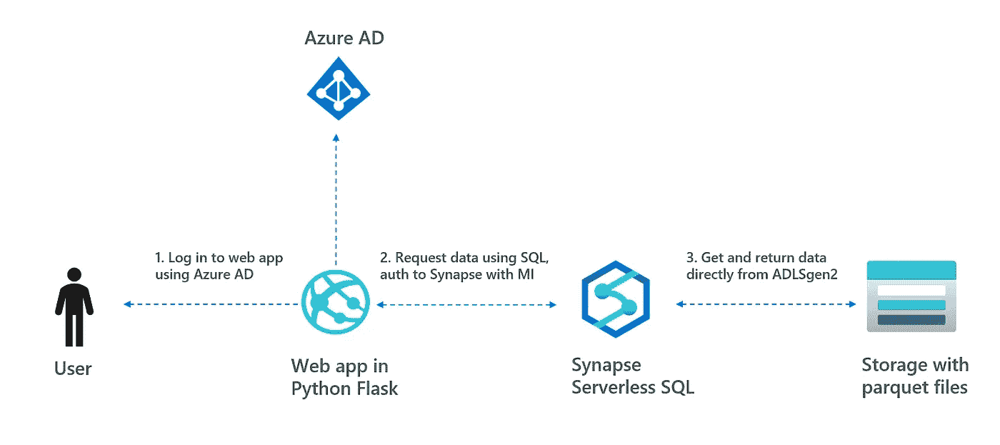
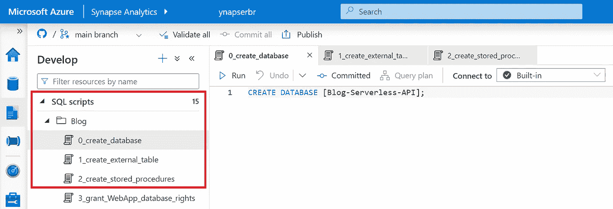
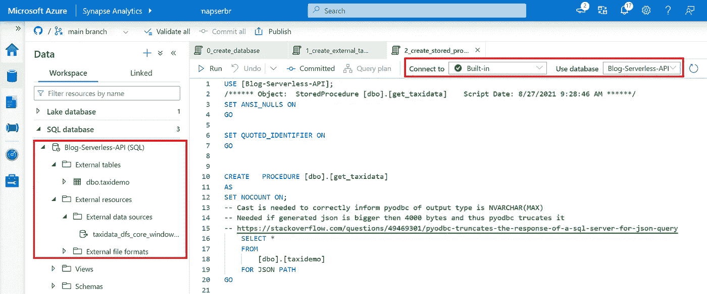
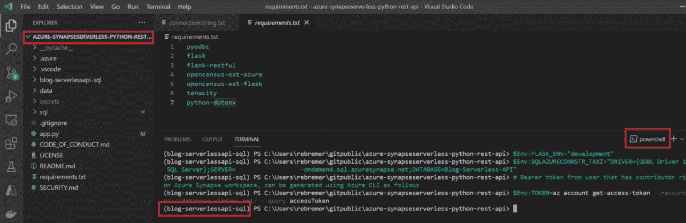
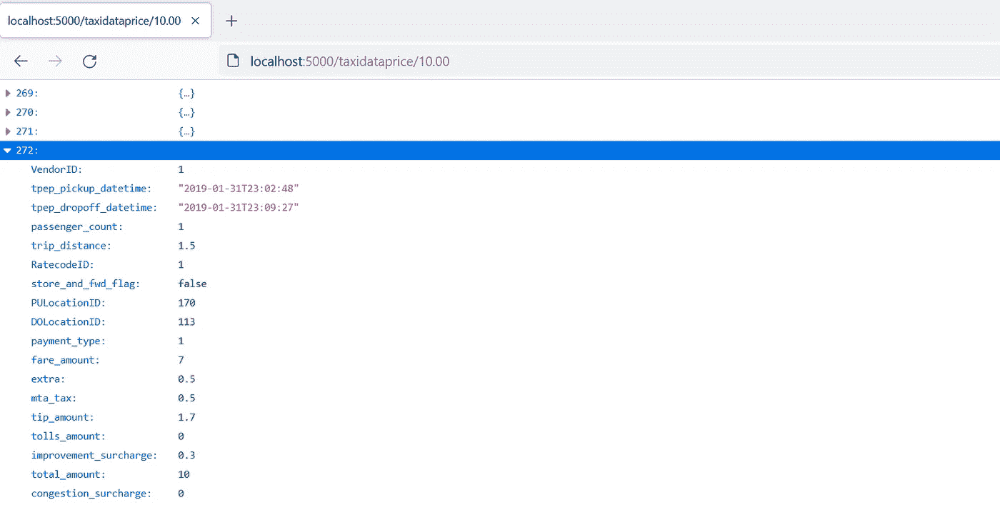
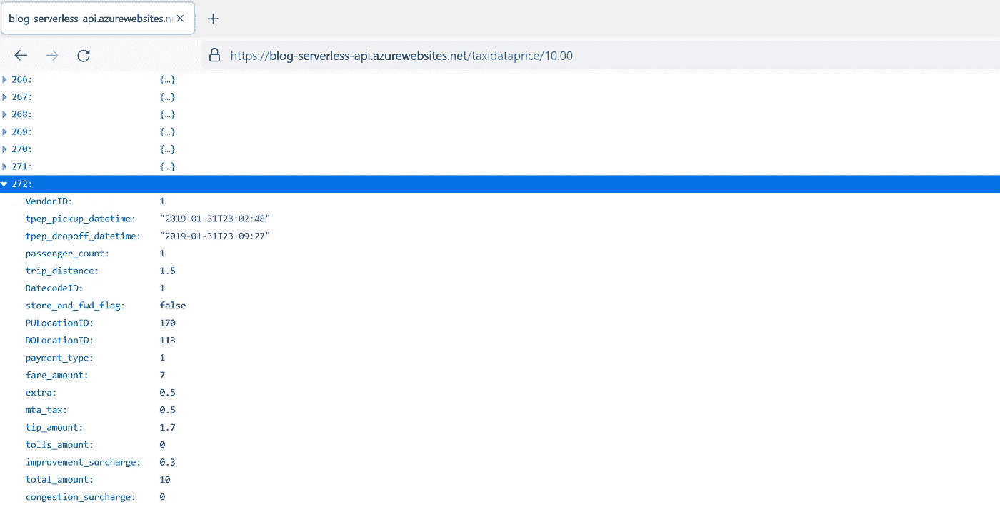

# 如何在 Synapse 无服务器 SQL 池之上创建 API

> 原文：<https://towardsdatascience.com/how-to-create-apis-on-top-of-synapse-serverless-sql-pools-f09e087400ab?source=collection_archive---------11----------------------->

## 使用 Azure Synapse、ADLSgen2、Python 和 Web 应用程序

# 1.介绍

[Synapse 无服务器 SQL pools](https://docs.microsoft.com/en-us/azure/synapse-analytics/sql/on-demand-workspace-overview) 是一种在数据湖中查询数据的服务。关键是无需将数据复制到 SQL 表中就可以访问数据。通常，无服务器池不用于服务外部 API。这是因为外部 API 需要可预测的低延迟响应时间。像 Cosmos DB 和 SQL 数据库这样的服务更适合这种情况。但是，使用无服务器池为 API 提供服务的两个原因如下:

*   防止数据重复:不必将数据从数据湖复制到专门的 SQL 存储中。复制需要同步工作、保持血统和维护/保护更多资源
*   成本:专门的 SQL 存储，Cosmos DB 需要额外的成本

在这个 blogpost 和 git repo `[azure-synapseserverless-python-rest-api](https://github.com/rebremer/azure-synapseserverless-python-rest-api)`中，在 Synapse serverless 之上创建了一个 Python REST API，另见下图:



1.高层建筑

这个项目是基于[大卫·毛里](https://www.linkedin.com/in/davidemauri/)所做的伟大工作，可以在这里[找到](https://techcommunity.microsoft.com/t5/azure-sql-blog/building-rest-api-with-python-flask-and-azure-sql/ba-p/1056637)。在这篇博文的剩余部分，将会更详细地解释 Synapse 无服务器 API 项目。在下一章中，项目将在本地部署。然后，项目将被部署在一个 web 应用程序中。

# 2.安装无服务器 SQL API 项目

在这一章中，项目开始运行，并将创建 ADFv2 单元测试项目。在这方面，需要做以下工作:

*   2.1 先决条件
*   2.2 配置 Synapse 和存储帐户
*   2.3 部署 SQL 脚本
*   2.4 在本地运行项目

## 2.1 先决条件

本教程需要以下资源:

*   [Azure Synapse 分析](https://docs.microsoft.com/en-us/azure/synapse-analytics/quickstart-create-workspace)
*   [Azure CLI](https://renanmf.com/pip-and-virtual-environments-with-venv-in-python/)
*   [Python 3.7+](https://www.python.org/downloads/)

最后，将下面的 git repo 克隆到您的本地计算机上。如果你没有安装 git，你可以从网页上下载一个 zip 文件。

```
git clone [https://github.com/rebremer/azure-synapseserverless-python-rest-api](https://github.com/rebremer/azure-synapseserverless-python-rest-api)
```

## 2.2 配置 Synapse 和存储帐户

首先，确保 Azure AD 用户拥有[访问](https://docs.microsoft.com/en-us/azure/synapse-analytics/security/synapse-workspace-synapse-rbac-roles)Synapse 的权限。默认情况下，创建 Synapse 的用户是`Synapse Adminstrator`，更细粒度的访问控制将在本博客的 3.2 中解释。

Synapse workspace 部署的一部分，也是 ADLSgen2 存储帐户的创建。这个存储附属于 Synapse，将作为这个博客中的数据湖。要使用存储帐户，1)需要将数据添加到文件系统中，2)用户需要拥有存储 blob 读取权限才能从存储帐户中读取数据。

*   转到 Synapse 的存储帐户，创建一个文件系统`taxidata`并添加 parquet 文件:`data/part-...c000.snappy.parquet`
*   然后为 Azure AD 用户授予对存储帐户的`Storage Blob Data Reader`权限，该用户也可以访问 Synapse，参见文档[此处](https://docs.microsoft.com/en-us/azure/storage/blobs/assign-azure-role-data-access?tabs=portal#assign-an-azure-role)如何为存储完成此操作。

## 2.3 部署 SQL 脚本

转到 Azure Synapse 工作区，创建一个新文件夹，并从文件夹中的 gitrepo 导入以下文件:

*   SQL/0 _ 创建 _ 数据库
*   SQL/1 _ 创建 _ 外部 _ 表
*   SQL/2 _ 创建 _ 存储 _ 过程

随后，在第 10 行的`1_create_external_table.sql`中替换您的存储帐户名称。然后运行脚本，确保使用了内置的 SQL 环境。另请参见下面的截图。



2.3.1 部署 SQL 脚本

当脚本成功运行时，您可以找到一个包含表和存储过程的新数据库，参见下面的屏幕截图。



2.3.2 成功部署

## 2.4 在本地运行项目

确保您的计算机上安装了 Python 3.7 或更高版本。为了防止其他 Python 项目依赖关系之间的冲突，创建了一个[虚拟环境](https://renanmf.com/pip-and-virtual-environments-with-venv-in-python/)。运行以下命令:

```
# 1\. Install virtual environment package
pip install virtualenv
# 2\. Create virtual environment
virtualenv blog-serverlessapi-sql --python C:\Python37\python.exe
# 3\. Activate virtual environment
.\blog-serverlessapi-sql\Scripts\activate
# 4\. Install project dependencies
pip install -r requirements.txt
```

从本地项目连接到 Synapse 无服务器池需要一个连接字符串。为此，使用存储在变量中的 Azure AD 身份创建一个临时不记名令牌。

运行以下脚本:

```
# Linux bash:export FLASK_ENV="development"
export SQLAZURECONNSTR_TAXI="DRIVER={ODBC Driver 17 for SQL Server};SERVER=<your-server-name>-ondemand.sql.azuresynapse.net;DATABASE=Blog-Serverless-API"
# Bearer token from user that has contributor rights on Azure Synapse workspace, can be generated using Azure CLI as follows
export TOKEN=$(az account get-access-token --resource=https://database.windows.net/ --query accessToken)# Windows PowerShell:$Env:FLASK_ENV="development"
$Env:SQLAZURECONNSTR_TAXI="DRIVER={ODBC Driver 17 for SQL Server};SERVER=<your-server-name>-ondemand.sql.azuresynapse.net;DATABASE=Blog-Serverless-API"
# Bearer token from user that has contributor rights on Azure Synapse workspace, can be generated using Azure CLI as follows
$Env:TOKEN=az account get-access-token --resource=https://database.windows.net/ --query accessToken
```

另请参见使用 [Visual Studio 代码](https://code.visualstudio.com/)作为运行 Powershell 命令的开发环境的屏幕截图:



2.4.1 在 VSC 设置环境变量

最后，执行`flask run`,然后启动一个本地 web 服务器，创建以下两个端点:

*   `localhost:5000/taxidataall`运行所有滑行数据
*   `localhost:5000/taxidataprice/<<price amount>>`返回指定价格金额的所有出租车数据

另请参见下面的截图。



2.4.2 localhost 在几秒钟内返回 272 条价格为 10.00 的记录

# 3.将无服务器 SQL API 项目部署到 web 应用程序

在本章中，项目将被部署到一个 web 应用程序中。在这方面，需要做以下工作:

*   3.1 将代码部署到具有托管身份的 web 应用程序
*   3.2 为托管身份分配读者权限

## 3.1 将代码部署到具有托管身份的 web 应用程序

要将代码部署到具有托管身份的 web 应用程序，需要执行以下 CLI 命令。

```
# Windows PowerShell (bash is similar removing $ inset variable)# Set variables
$app="<<your app name>>"
$rg="<<your resource group>>"
$Env:SQLAZURECONNSTR_TAXI="DRIVER={ODBC Driver 17 for SQL Server};SERVER=<your-server-name>-ondemand.sql.azuresynapse.net;DATABASE=Blog-Serverless-API"# Deploy app and set config
az webapp up --sku B1 -n $app -g $rg
az webapp config connection-string set -g $rg -n $app --settings SQLAZURECONNSTR_TAXI=$Env:SQLAZURECONNSTR_TAXI --connection-string-type=SQLAzure
az webapp identity assign -g $rg -n $app
```

## 3.2 为托管身份分配读者权限

web 应用程序的托管身份，并向 Synapse 无服务器和底层存储帐户授予权限。

首先，授予受管身份`Storage Blob Data Reader`对存储出租车数据的存储帐户的权限。功能应用程序的名称`$appName`可用作应被授予权限的用户，参见文档[此处](https://docs.microsoft.com/en-us/azure/storage/blobs/assign-azure-role-data-access?tabs=portal#assign-an-azure-role)如何为存储帐户授予权限。

最后，运行 web 应用程序受管身份还应具有从 Synapse 无服务器池读取数据并能够执行存储过程的权限。该代码存在于:`sql/3_grant_WebApp_database_rights.sql`

当所有步骤成功执行后，可以再次从浏览器中检索数据:



2.4.1 带有 MI 和基本 SKU 的 web 应用程序在几秒钟内返回 272 条价格为 10.00 的记录

最后，对 web 应用程序的访问可以通过 Azure AD 来保护。本[教程](http://Tutorial - Add authentication to a web app on Azure App Service - Azure App Service | Microsoft Docs)描述了如何在不使用定制代码的情况下为 web 应用程序进行配置。

# 4.结论

[Synapse 无服务器 SQL pool](https://docs.microsoft.com/en-us/azure/synapse-analytics/sql/on-demand-workspace-overview) 是一种在你的数据湖中查询数据的服务。关键是可以访问数据，而不需要先将数据复制到 SQL 表中。在 1)无法进行数据复制或 2)节省专用 SQL 存储成本的情况下，此选项可能很有意义。在这个 blogpost 和 git repo `[azure-synapseserverless-python-rest-api](https://github.com/rebremer/azure-synapseserverless-python-rest-api)`中，在 Synapse serverless 之上创建了一个 Python REST API，另见下图:


4.高层建筑