# 如何创建漂亮且富有洞察力的图表

> 原文：<https://towardsdatascience.com/how-to-create-beautiful-and-insightful-charts-e14a41c2cae0?source=collection_archive---------3----------------------->

## 学习如何将你的数据可视化技能提升到一个新的水平。

好吧，先说我背景的真相:我不是设计师，不是数据记者，也不是数据科学家。我是一名数据工程师，我的日常活动很少包括绘制图表或进行任何类型的分析。

但是即使没有丰富的经验，我还是连续三年赢得了由 [Kaggle](http://kaggle.com/) 发起的数据可视化比赛。我在 [2018](https://www.kaggle.com/kaggle/kaggle-survey-2018/discussion/74297) 和 [2019](https://www.kaggle.com/c/kaggle-survey-2019/discussion/121041) 获得第三名，并在 2020 从 300 多名不同的参赛者中获得[一等奖。在过去的三年里，我从这些比赛中赢得了总计 19，000 美元的奖金。](https://www.kaggle.com/c/kaggle-survey-2020/discussion/212949)

许多人每天都必须在工作中创建数据可视化，从数据和 BI 分析师到数据科学家、设计师和记者。而且图表常常无法传递它们应该传递的价值和洞察力。仅仅因为它们没有被很好地设计和建造。我识别好图表的经验法则是:

> 如果它需要解释，那么它就不是一个好的图表。

让我们来看两张展示相同数据的图表。你能说出哪个是好的吗？

图表 1: 回答 Kaggle 调查的男性和女性的百分比。来源:作者

**图表 2:** 另一个图表曝光同样的数据。来源:作者

你们大多数人都会同意图表 2 更好，不需要任何解释。**现在，为什么大多数人一直在创造和传递像图表 1 这样的可视化？**

*   第一个原因是创建有用的图表需要计划、时间和大量的工作。我花了 50 多个小时来完成我的提交，它只有 17 个图表——每个图表大约需要三个小时。
*   第二个原因是，虽然大多数人喜欢图表 2，但只有少数人能说出他们喜欢它的所有理由。

在这篇文章中，我想分享一些我在创作第二届 [020 Kaggle 机器学习&数据科学调查竞赛](https://www.kaggle.com/c/kaggle-survey-2020)中获得第一名的作品[时的灵感和决定。**我会给你一个全面的指导如何:**](https://www.kaggle.com/andresionek/one-chart-many-answers-kaggle-surveys-in-slopes)

*   对你的分析有想法。
*   考虑你的听众和你将如何展示信息。
*   突出每个图表中隐藏的故事。
*   做出有意识的设计决策，关注细节。

我不会关注如何编写代码来创建图表的任何技术方面。使用不同的工具可以获得相同的结果，而且已经有大量的教程和全面的文档介绍如何使用大多数数据可视化库。

如果想深究技术方面，那就来看看[剧情](https://plotly.com/python/)。我用它创建了我在这里展示的图表。Plotly 是一个 Python 库，提供了相当程度的交互性，我在网上发布图表时总是觉得很有趣。所有代码也可以在我的 Kaggle 笔记本上找到[。](https://www.kaggle.com/andresionek/one-chart-many-answers-kaggle-surveys-in-slopes/)

# 首先，一些背景。

## 这个卡格尔比赛是什么？

[Kaggle](https://www.kaggle.com/) 是数据科学家用来发布数据科学相关数据和代码的平台。每年年底，Kaggle 都会对其成员进行一次全行业调查，然后[发布调查结果数据集](https://www.kaggle.com/c/kaggle-survey-2020)。然后，他们举办了一场竞赛，要求社区成员创作带有数据可视化的笔记本。竞争对手必须讲述关于数据科学和机器学习社区子集的丰富故事。最佳作品有现金奖励。

## 我的获奖作品是关于什么的？

2020 年是第四次 Kaggle 调查，在我的提交材料中，我决定探索一段时间内的趋势。我创建了一个笔记本，讲述了数据科学社区多年来的发展历程，触及了性别薪酬差距、经验与薪酬以及数据科学新员工获得第一份工作的难度等主题。

> 尽管总共有 17 个不同的图，我在整个提交过程中只使用了一种图表类型:**斜率图。**

这张图表是我最喜欢的:

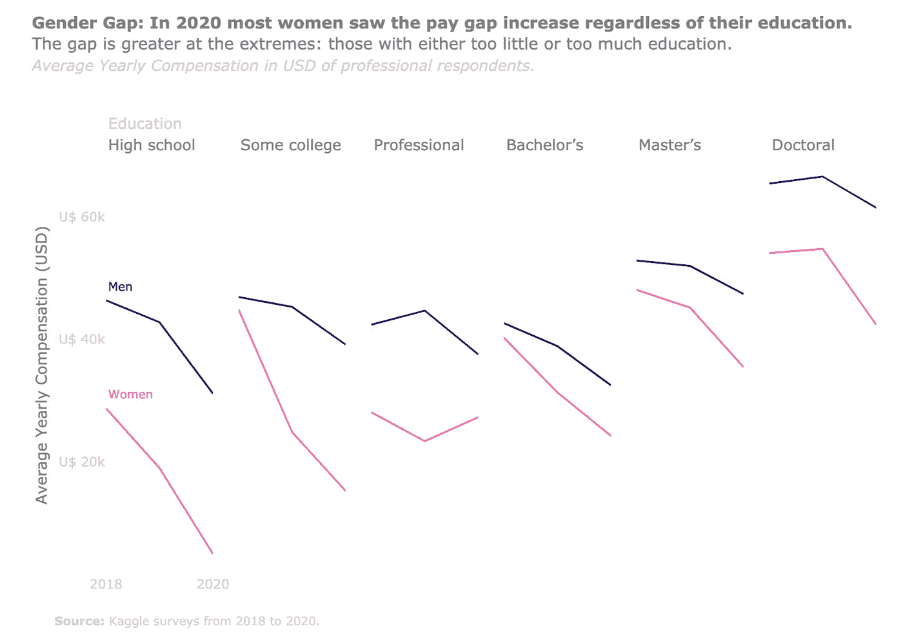

2020 年 Kaggle 竞赛获奖作品中我最喜欢的图表。它比较了多年来不同教育水平的男性和女性的平均年薪。来源:作者

这是我最喜欢的图表，因为它清楚地告诉我，有一些非常错误的事情正在发生。首先，2020 年，大多数教育水平的男女工资差距有所扩大。疫情可以部分解释 2020 年的急剧下降，例如，女性不得不离职或减少在家照顾孩子的时间。然而，这一差距在 2019 年也以惊人的趋势略有增加。

最糟糕的消息是，尽管学士和硕士学位的差距缩小了一点，但博士学位的差距又扩大了！我没想到会出现这种增长，我为所有女性感到遗憾，尽管她们尽了一切努力来获得最高学历，但仍然受到与男性不平等的待遇。

# 我是如何开始这个比赛的

我很晚才参加这个比赛，就在截止日期的前几天，主要是因为我没有主意了——*并且稍微拖延了一下*。我明白这是我们每个人都会遇到的事情。当我们被要求发挥创造力或做一些创新的事情时，我们会僵住。然而，我们可以做一些事情来找到好主意。

## 清楚明白自己需要做什么，为谁做。

这场比赛将由 Kaggle 团队进行评估，所以我认为他们希望看到他们的用户的一些很酷的东西。一些他们不知道的事情。所以在任何时候，我都把我的思想集中在他们想看到的东西上。

我的第一个想法是将来自 Medium data science 帖子的数据和调查结果结合起来。这有可能让我比较两组不同的数据，并得出一些结论。然后我意识到这是调查的第四年，可能是我们第一次看到一些趋势。如果我在 Kaggle 工作，我会很想看到这种比较。

我翻阅了[已经出版的笔记本](https://www.kaggle.com/c/kaggle-survey-2020/notebooks)，看看是否有人已经在做这种分析。一些笔记本比较了年复一年的变化，它们很好地验证了我的假设，即有值得探索的趋势。

## 获得一些创作灵感。

我用几年前读过的 Cole Nussbaumer Knaflic 的数据重新开始了我的故事讲述。我很快又检查了一遍所有的东西。它帮助我记住了一些好故事的概念。看完这本书后，我决定用折线图或斜率图来突出时间的变化。

但我仍然不知道如何在绘制这些图表时有创意或创新。然后我又打开了几本书:【Alberto Cairo 的功能艺术和【David McCandless 的信息是美丽的。他们帮我有了一些线条和斜率图的设计思路。然而，仍然缺少一些东西。那么，是什么让我的作品如此出众呢？

我回顾了过去几年的笔记本，并从重新阅读 [Teresa Kubacka](https://www.kaggle.com/tkubacka) 在她 2019 Kaggle 竞赛的[获奖笔记本上所做的工作中获得了灵感。在那里，她创建了一个热图，并用单一类型的图表引导整个故事。这个矩阵帮助她识别出一些具有不同特征的用户群。](https://www.kaggle.com/tkubacka/a-story-told-through-a-heatmap)

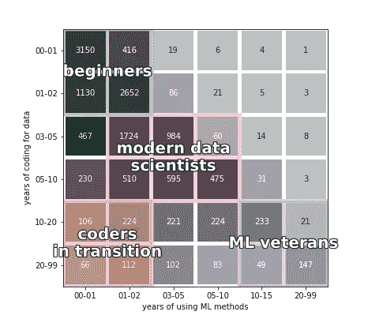

*最后的灵感来自特蕾莎·库巴卡在 2019 年比赛中创作的这张热图。
作者:* [*特蕾莎·库巴卡*](https://www.kaggle.com/tkubacka) *来源:* [*通过热图讲述的故事*](https://www.kaggle.com/tkubacka/a-story-told-through-a-heatmap)

看到这个笔记本是我的触发器:我可以为每个剖面创建一个包含多个斜率图表的矩阵。给所有图表增加一个额外的维度应该允许我随着时间的推移探索趋势，同时根据不同的社区特征将其分解。

我拿了一个画板，画了一些我的图表应该是什么样子的线。

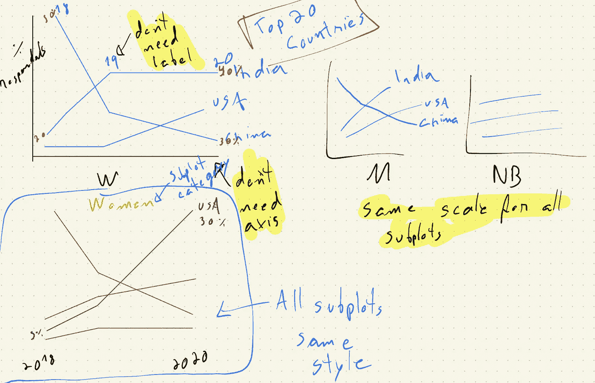

我的图表应该是什么样子的第一想法画板。来源:作者

## 坐下来开始工作。

有了这个草图之后，我终于开始工作了。我只是在弄清楚以下情况后才开始处理和清理数据:

*   我要探索的
*   我会怎么做
*   目标受众是谁。

所以最后我坐下来开始工作。但我意识到，许多人在开始工作之前就陷入了无限循环。我自己也做过很多次。计划比执行需要更少的努力。在开始实际工作之前，我们通常希望有一个完美的想法。

事实是，如果你不坐下来开始工作，你将永远不会得到更多的想法或灵感。一旦我制作了第一张图表，并发现我可以得出一些很酷的结论，新的想法开始流动，我可以改进我以前所做的。

构建良好的数据可视化是一个迭代过程。不要一直等待完美的想法，因为它永远不会到来。从某件事开始。任何事。只是一个最小可行产品(MVP)。然后迭代改进。

贝娄是我建立的第一个图表，我的 MVP。

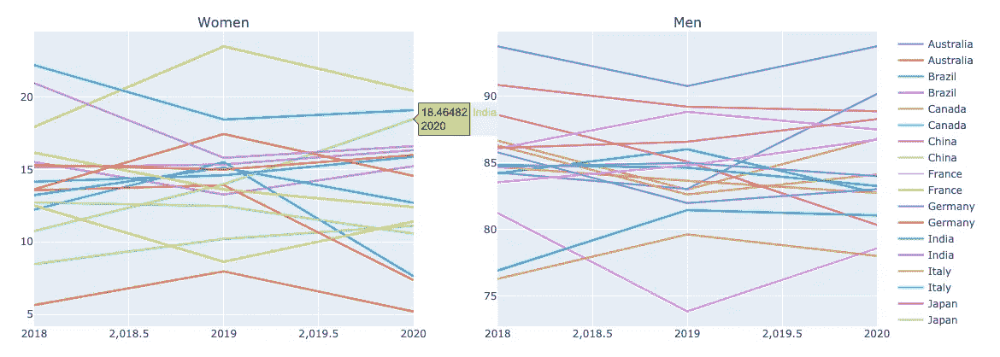

我的第一个 MVP，探索不同国家的性别参与。来源:作者。

## 减少认知负荷

我使用绘图软件的默认配置创建了这个 MVP。探索了一段时间后，我注意到一些国家的女性参与度正在提高。这就是我想传达给观众的故事。

我可以在上面的 MVP 图表下面写一段话，告诉你在印度、巴西和加拿大，女性的参与率是如何上升的，而在其他大多数国家，女性的参与率是如何下降的。令人惊讶的是，大多数人都是这么做的。他们希望观众花时间分析图表，找出结论的来源。

然而，如果我想想我的观众，他们不想花时间去理解一个图表。*如果我的受众负责评估 300 多台笔记本，这一点尤其正确。*

心理学上有个概念叫[认知负荷](https://en.wikipedia.org/wiki/Cognitive_load)；简而言之，就是你的大脑为了理解某些信息所需要的处理能力。如果负载过高，我们往往会放弃，去做其他事情，比如查看我们的 Instagram 通知。

当创建任何数据可视化时，把你自己放在你的观众的位置上。理解他们不想分析数据；他们只想看到结果。它必须容易理解。为了实现这一点，你需要减少认知负荷。

再看看我的 MVP 图表。它没有向任何人讲述印度、巴西和加拿大的故事。我下面将要描述的所有步骤都是为了减少认知负担，突出我的故事。遵循生成的图表:

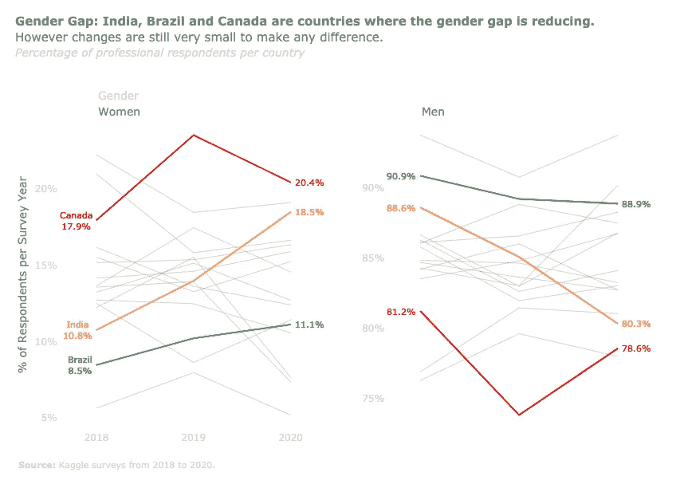

最后一张图探索了不同国家的性别参与情况。来源作者。

# 为什么第二张图表比 MVP 好？

好吧，你可能不知道为什么最终的图表更好，但我在这里帮助你找出答案。让我们再看一遍 MVP，然后看看改进它的一些步骤。

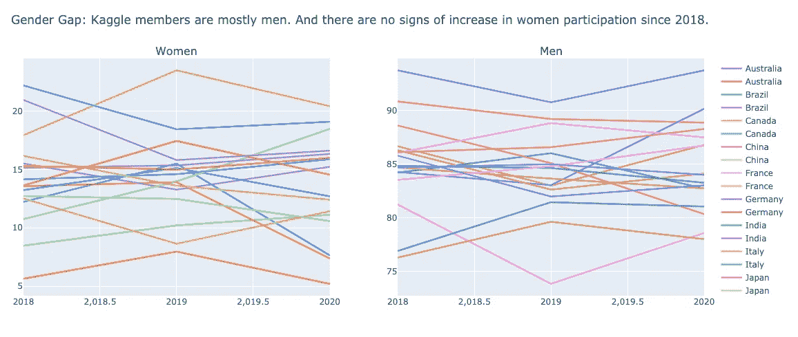

我的第一个 MVP。来源:作者。

## 清除杂物

我做的第一件事总是导致最显著的差异:删除背景颜色和指导方针。这大大减轻了图表的负担。此外，我们不需要用盒子包围数据来理解它属于一个组。空白就可以了。

> 不要使用方框或背景色，而是使用空白来分组。

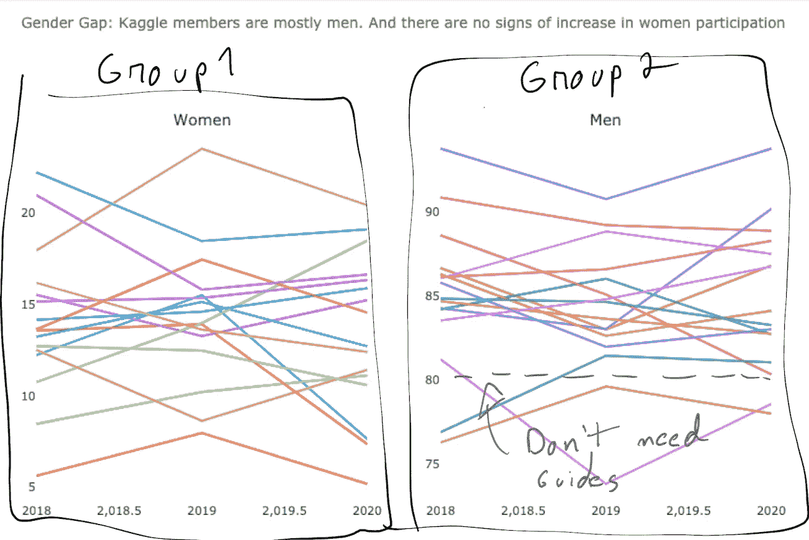

移除背景不会影响图表的理解，只要我们保留空白来分隔各组。我们不需要指南，因为我们的大脑非常善于追踪想象中的水平和垂直指南。来源:作者

接下来，我去除了所有线条的颜色，使它们变得更细。这也有助于消除大量的混乱。

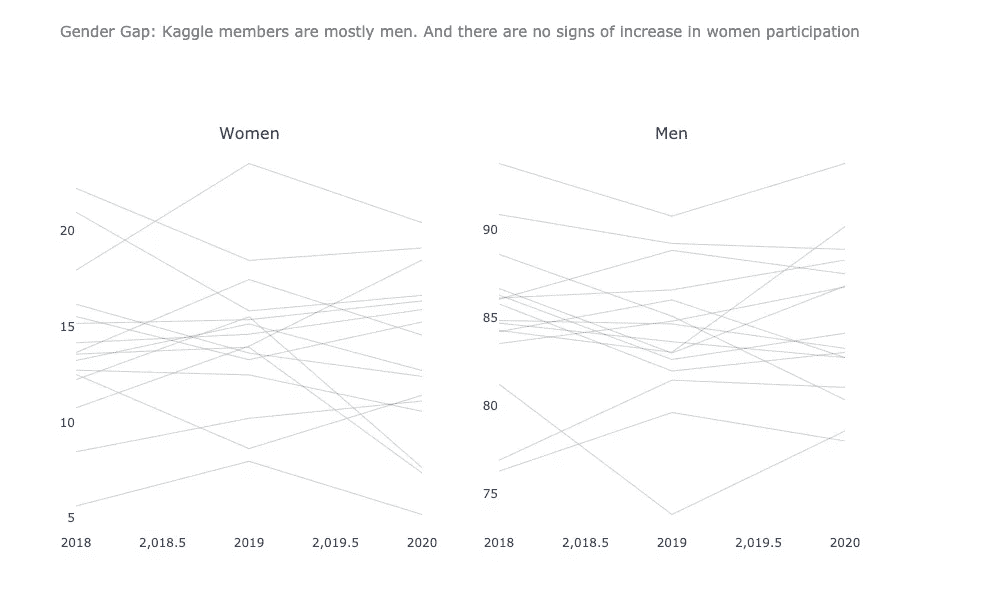

通过使线条变细和变灰来消除杂乱。来源:作者。

## 突出故事

现在我已经清除了大部分的杂物，我准备好讲述这个故事，并给我想要突出的线条添加颜色。

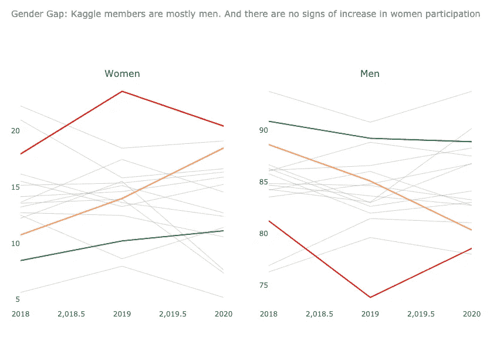

突出我想谈论的国家。来源:作者

此时，要发现哪个国家是哪个国家，观众仍然需要将鼠标悬停在每一行上。这就增加了认知负荷。在边上有一个图例将会改进它，但是因为读者将不得不在图例和行之间来回移动，我决定直接添加带有国家名称的注释。

我为改进我的故事而添加的另一件事是 2018 年和 2020 年的百分比值标签。注意，我不是故意给 2019 加标签的，只会制造更多噪音，不会增加任何价值。

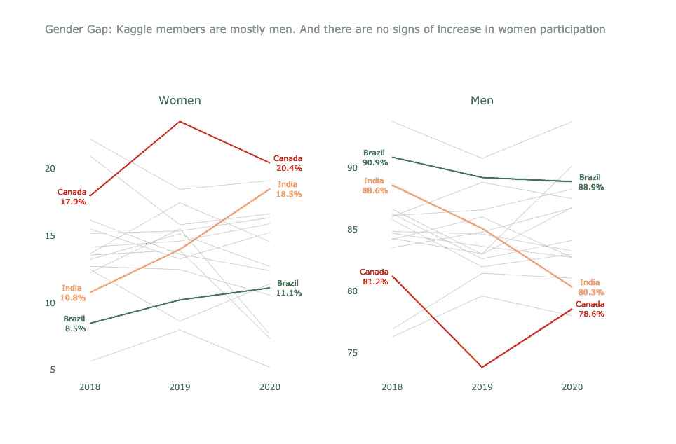

添加标签，让故事更容易理解。来源:作者

# 非常注意细节。

在这一点上，我已经减少了很多认知负荷。我突出了这个故事，观众可以在几秒钟内理解这个图表。看起来好像我已经完成了，但是还有很多需要改进的地方。让我们看看:

## 删除冗余信息。

我在标签上多次重复同样的信息。只出现一次就足以将一种线条/颜色与一个国家联系起来。x 轴也是重复的，移除它不会对解释造成任何损害。

## 将坐标轴置于背景并添加标题。

我不想把太多的注意力吸引到轴上。因此，我可以通过将颜色改为浅灰色来将它们置于背景中。我还为 y 轴添加了一个标签，并为值添加了适当的单位。

## 对齐元素。

将其他项目靠左对齐会比默认的居中对齐更好看，也更有条理。我把支线剧情的标题移到了左边，并且添加了关于支线剧情的注释。在这里是性别类别。

## 改进标题并添加来源。

最后，我改进了图表标题，添加了更多信息来帮助读者理解我的图表。添加源对于给出数据的上下文也非常重要。

## 在做了所有这些修改后，我得到了我的最终版本。

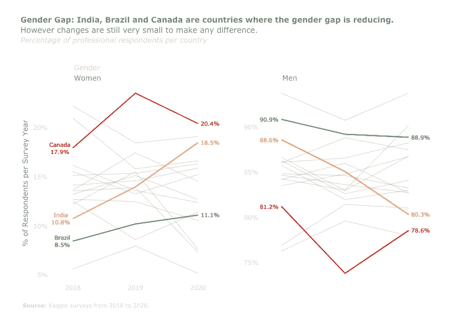

# 进一步降低认知负荷

这时，我已经准备好了我的第一张图表；然而，我仍然不得不创建一堆其他图表。当我开始的时候，我已经决定只用一种图表类型来减少认知负荷。让我解释一下:

*   我可以为每一次观想创建不同类型的图表。这样做可以显示出我的绘图技能是多样化的，并且我知道许多很酷的图表。这可能会让我的工作变得简单一点，因为我可以探索图表的优势来突出我的故事。然而，我的读者必须学会如何阅读每一种新的图表类型。这会增加认知负荷，让他们更难理解我的分析。
*   **我可以只用一种图表类型进行所有的可视化。**这样做可以让我的观众只需要学习一次如何阅读我的图表；他们可以通过笔记本在所有其他图表中重复使用这些知识。虽然这会减少认知负荷，但这会让我更难讲一个激动人心的故事。我的读者很快就会厌倦一遍又一遍地看同一个图表。

> 看看下面的内容，你不需要重新学习如何理解图表，即使它们显示的是完全不同的信息。

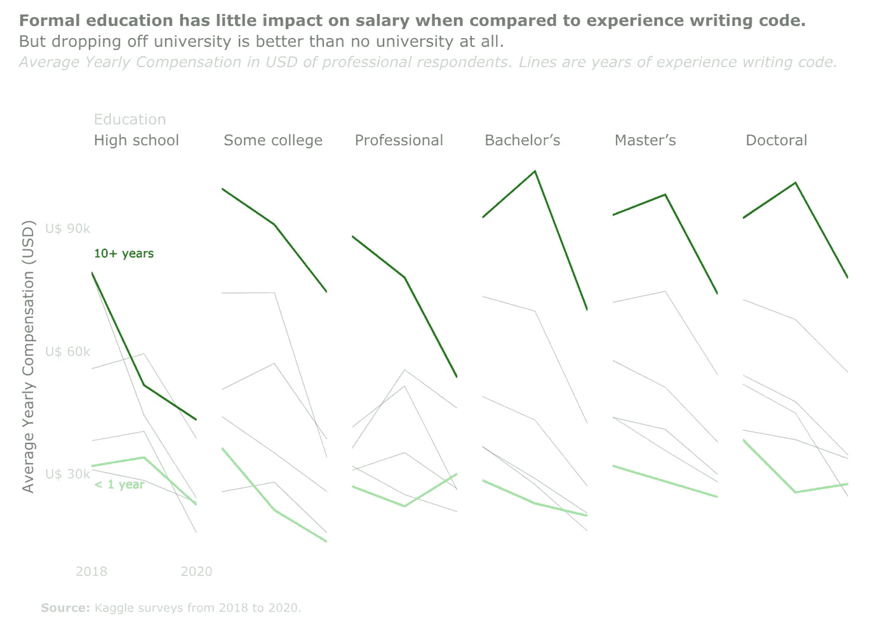

y 轴显示以美元为单位的年薪。每一行都是多年编写代码的经验，每一个次要情节都是不同的教育水平。来源:作者

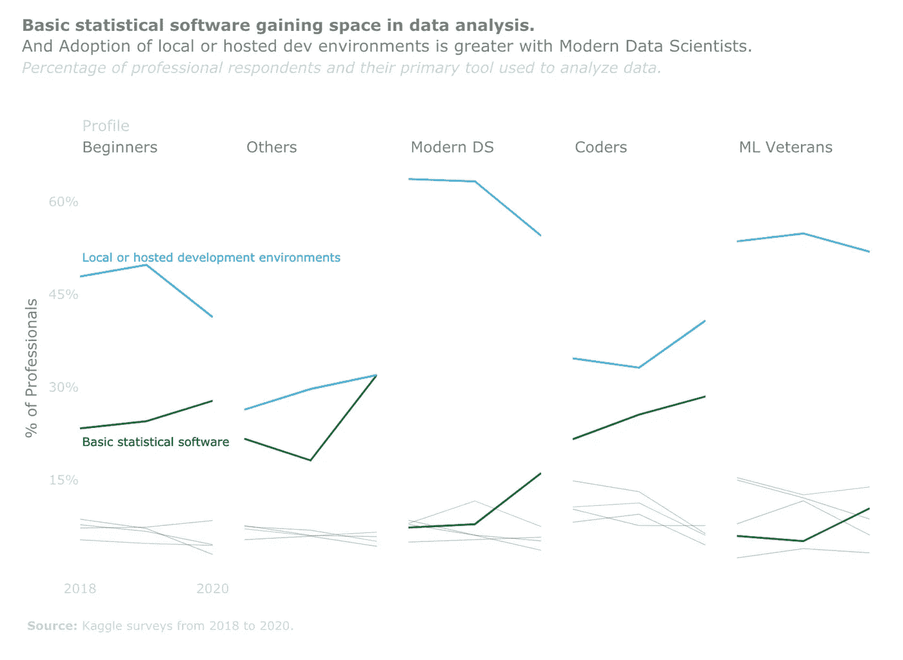

y 轴显示的是专业受访者的百分比。每一行显示用于分析数据的主要工具，每一个子图是一个专业类别。来源:作者

# 寻找合适的故事

我绘制了几个变量的组合，直到我找到在我的最终提交中使用的变量。我通常从所有灰色线条开始，然后花一些时间在那里看到任何有趣的东西。一旦我找到一个故事，我就突出它。

同样的图表可能会有不同的故事。如果是这种情况，重复相同的图表，每次突出一个不同的故事，总比一个图表讲述多个故事要好。看一看:

## 故事 1:退伍军人为拥有成熟的机器学习模型的公司工作。

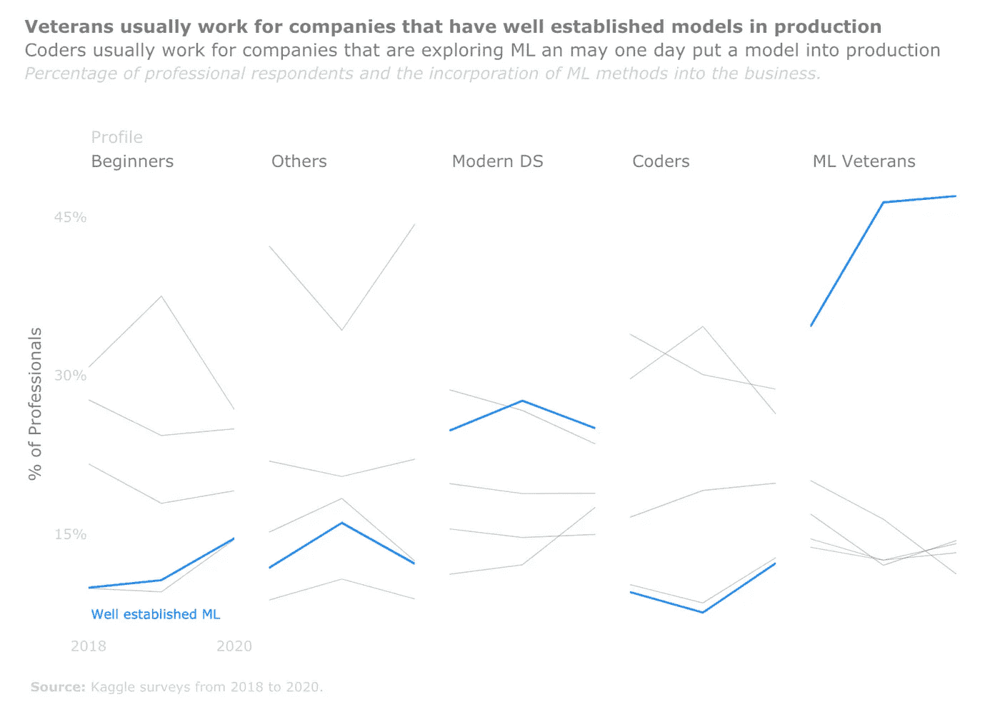

一个图表，一个故事。来源:作者

## 故事 2:新手为没有生产机器学习模型的公司工作。

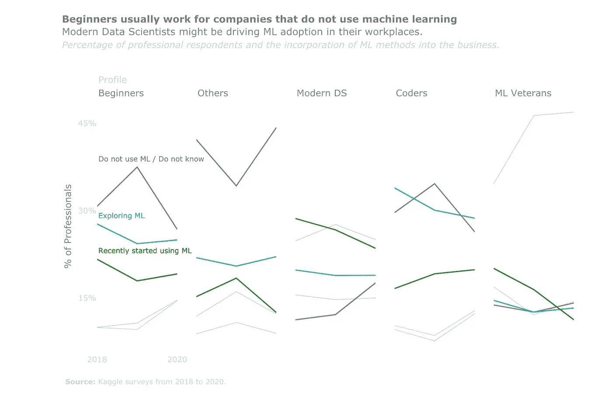

同样的图表，不同的故事。来源:作者

当使用多个图表来讲述一个故事时，考虑文本的节奏和韵律来支持可视化。使用简单的语言，直奔主题。总是把上一个图表的故事和下一个图表的故事联系起来；否则，你的分析有可能成为大量不相关事实的集合。

# 你现在可以付诸实践。

每天我们都会接触到不同类型的数据可视化。有些我们喜欢，有些我们不喜欢。而喜欢或者不喜欢某样东西，通常是一个潜意识的过程。

> 如果你喜欢在某处看到的图表，花点时间去理解**为什么**你喜欢它。作者做了什么让你喜欢的事？
> 
> 如果你看到一个你认为不好的观想，做同样的练习。为什么不好？有哪些可以改进的地方？

做这个练习将有助于建立一些自我意识。这样当你制作图表的时候，你就可以批评你的工作，判断它是好是坏。最糟糕的事情是当你没有自我意识，你认为你的观想是世界上最好的，但实际上，它们一点也不好。

创建漂亮而有洞察力的图表主要取决于你投入的时间和精力。这也是有意识的设计决策的结果——不幸的是，您的绘图软件的默认设置只允许您开始探索。总是考虑你的观众，并遵循我在这里描述的一些技巧。我确信你很快就会像专家一样创造观想。