# 如何用 Python 创建漂亮的单词云

> 原文：<https://towardsdatascience.com/how-to-create-beautiful-word-clouds-in-python-cfcf85141214?source=collection_archive---------3----------------------->

## 为下一个 NLP 项目创建令人惊叹的可视化效果的指南

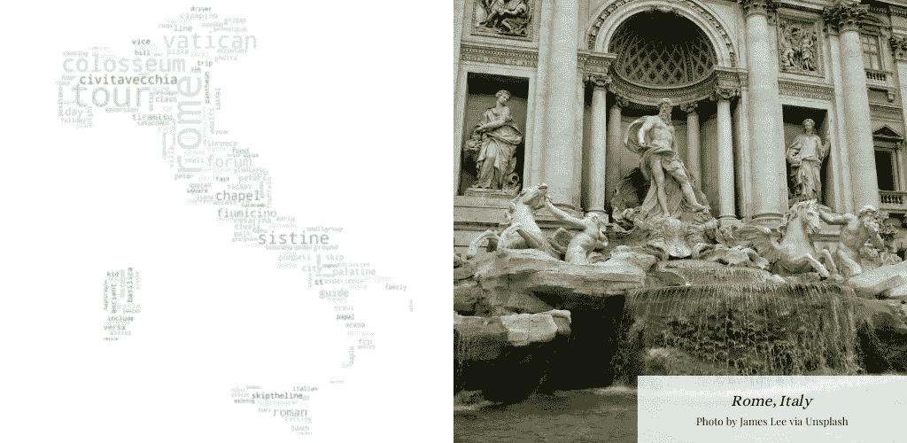

文字云作者| [特莱维喷泉图片由李中清通过 Unsplash](https://unsplash.com/photos/VtRfEjFoybM)

自然语言处理(NLP)是目前数据科学中非常受欢迎的子领域，因为它允许计算机处理和分析人类语言。Siri 和 Alexa、垃圾邮件过滤器、聊天机器人、自动完成和翻译应用都是使用 NLP 的日常技术的例子。

作为一名数据科学家，处理文本数据比处理其他类型的数据要复杂一些。为什么？因为文字不是数字！这使得探索性数据分析以及数据清理和预处理步骤在数据科学工作流中有所不同。文本数据通常需要更多的清理(删除停用词和标点、小写、词干或词汇化等)。它还需要对文本进行符号化或矢量化(从单词中获得有意义的数字)。至于探索和分析数据，可视化文本的方法就没那么多了。然而，文字确实开启了一种新的可视化技术，你可能以前见过——文字云。

在我最近的数据科学项目中，我深入研究了 NLP 的世界。在这个过程中，我学到了用 Python 创建单词云的所有知识，我想写这篇文章来与那些希望为文本数据创建一些漂亮的可视化效果的人分享我的知识。

# 创建一个基本的单词云

要创建一个基本的单词云(或 Python 中的任何单词云)，您将需要以下库:

## 方法 1:从文本生成

构建词云主要有两种方式。第一种也是最简单的方法是从文本语料库中创建单词云，比如一篇文章、一本书等。这个语料库应该是字符串的形式。

在下面的例子中，我列出了罗马市[猫途鹰](https://www.tripadvisor.com/Attraction_Products-g187791-Rome_Lazio.html)的景点。我会将它们全部组合成一个文本体(一个语料库)，然后创建一个基本的词云。

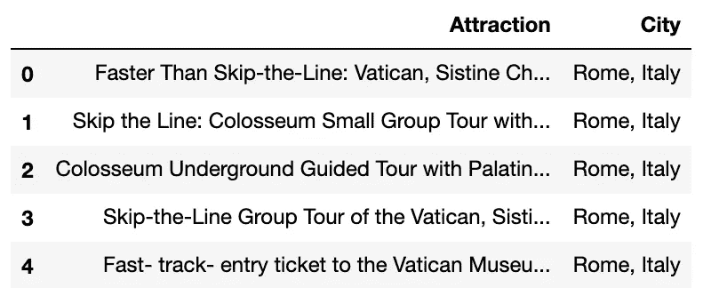

猫途鹰罗马景点示例|作者图片

在我对吸引人的文字进行分组之前，我做了一点清理，用小写字母，删除了基本的停用词(如“a”、“the”、“is”等)，并进行词汇化。我对 12 个城市做了同样的事情(具体来说，是 2021 年世界顶级目的地[中的 12 个)。罗马的分组语料库在下面的数据框架中突出显示。](https://www.tripadvisor.com/TravelersChoice-Destinations)

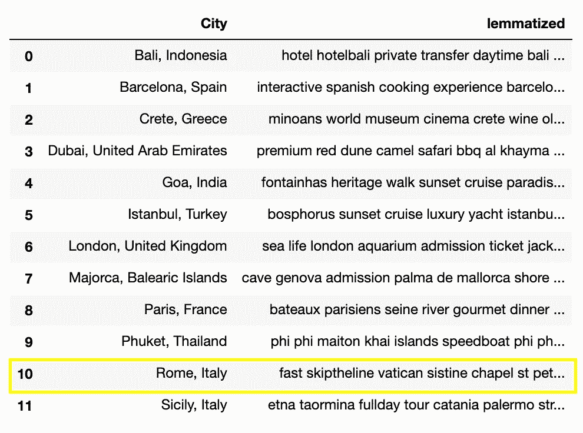

每个城市的分组、清理和旅游景点|按作者分类的图片

正如我之前提到的，我们将从罗马的文本语料库中创建单词 cloud。为此，我们将通过对该分组数据帧进行切片来分离出一个语料库:

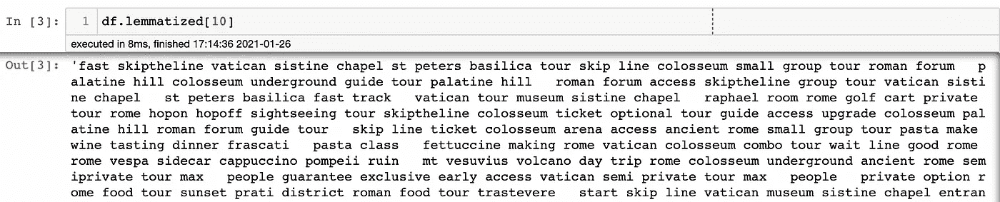

罗马文本文集|作者图片

从这里，我们可以创建基本的单词云。我们将从实例化 WordCloud 库中的 wordcloud 对象开始，并使用 generate_from_text 方法向它提供我们的文本语料库。最后，我们将使用 plt.imshow()来显示 WordCloud 对象。一定要使用 plt.axis('off ')，以确保它只显示单词 cloud，而不显示轴及其值。

生成的字云如下。我们可以看到，在默认情况下，词云使用的是双词(成对的词)，而不是单个词。如果需要，我们可以在实例化 WordCloud 对象时通过更改参数“collocations=False”来关闭它。

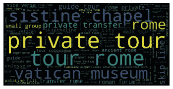

基本罗马字云(来自文字)|作者图片

## 方法 2:从频率中生成

第二种方法是从文档术语矩阵创建单词云。这是 NLP 的一个常用矩阵，语料库词汇表中的每个单词都有一个单独的列，每行都有词频。例如，下面我描述了我之前展示的 12 个城市的文档术语矩阵(dtm)的前几列。请注意，dtm 的尺寸为 12 x 8676，表示 12 个城市，以及整个语料库词汇中的 8，676 个单词。

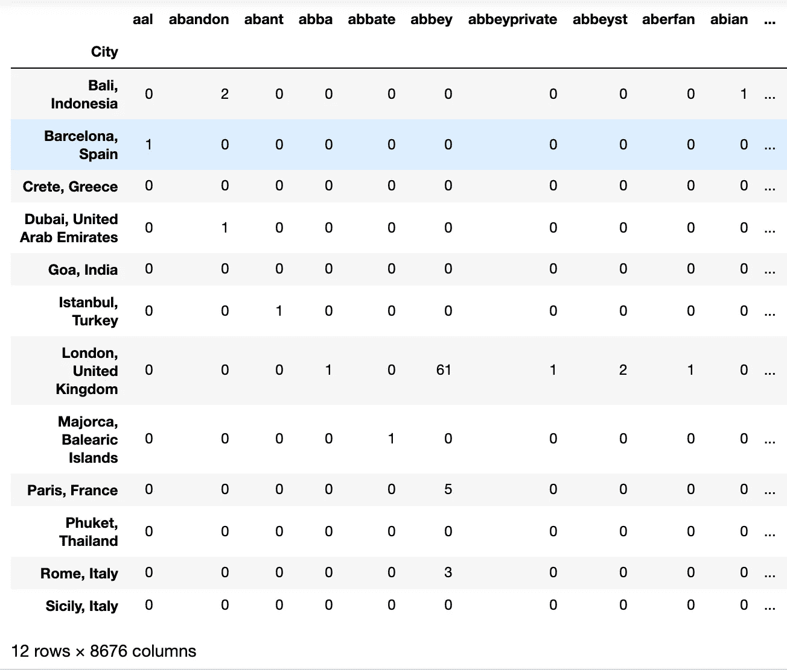

使用计数矢量化的文档术语矩阵，也称为 dtm |作者图像

如果您有一个文档术语矩阵，我们可以使用。generate _ from _ frequencies()方法。首先，我们需要分离出要用于罗马的数据。我们将需要转置这个矩阵，使其成为单词 cloud 的正确格式。我们还想获得最常用的单词，所以我们将按降序排列这些值。你可以在下面的照片中看到我们想要使用的数据示例。

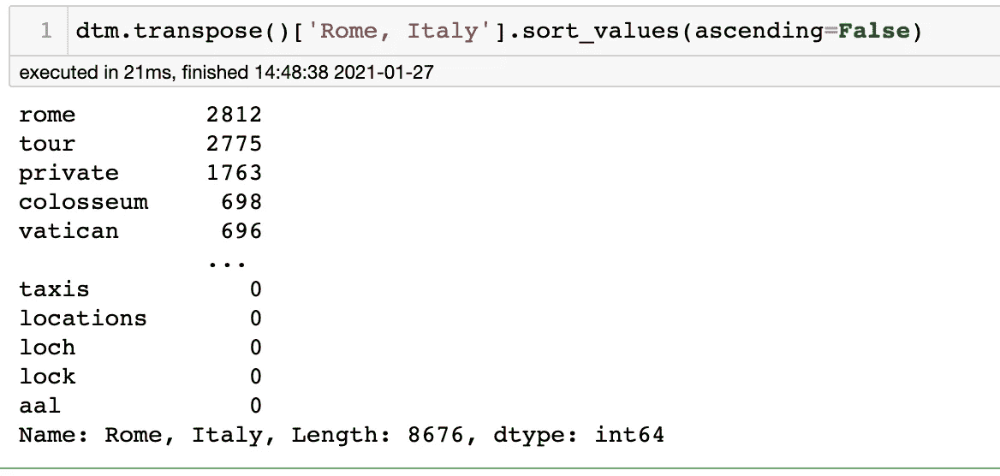

作者图片

为了实际创建单词云，我们将使用与上面几乎相同的代码，但是使用 generate _ from _ frequencies 方法。

生成的字云如下。请注意，因为我们在数据中分离了单个单词(而不是双字)，所以我们不需要告诉 WordCloud 对象关闭“搭配”参数。它自动将矢量化的单词作为单个单词，而不是两个单词。

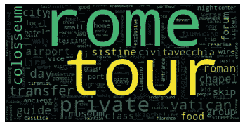

基本罗马单词云(来自频率)|作者图片

最后，既然我们已经了解了这些词云是如何形成的，我们可以操纵一些参数来创建一个更好的基本词云版本。让我们回到我们的第一个例子，使用 rome_corpus 变量(从文本生成单词云)。请注意，像“私人旅游”和“skiptheline”这样的词是出现频率最高的词。我们可以告诉我们的词云一个自定义的停用词列表来消除这些。我还将定制单词云的尺寸，并使用 figsize 参数使整个图形变大。我们改变颜色图，并添加一个标题。在下面的函数中可以看到所有这些变化。

请记住，您可以随时更改上面的函数来使用 generate _ from _ frequencies 方法！生成的单词云将如下所示:

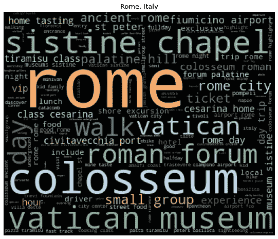

最终基本单词云|作者图片

哇！看起来好多了。虽然这仍然是非常基本的。让我们把它提高一个档次，用遮罩改变单词云的形状。

# 更改单词云形状

让你的文字云在视觉上惊艳的一个方法就是加个遮罩。遮罩是一种图像，您可以使用它来改变您的单词云的形状。当我们实例化 WordCloud 对象时，我们可以很容易地使用 mask 参数来操作 mask。

一旦你为你的蒙版选择了完美的图像并保存它(一分钟后会有更多)，我们可以使用 PIL 图书馆和 numpy 的图像功能将它转换成 WordCloud 对象的正确格式。

现在我们的掩码格式正确了，我们可以编写一个类似的函数来生成更好的单词云。以下函数与我们最终的基本单词云函数非常相似，但有一些例外:

*   使用遮罩参数会使宽度和高度参数无效，因为它将采用图像本身的大小
*   我使用的“标度”是 3，这使得对于更大的单词云图像的计算更快
*   我把“色彩图”改成了“RdYlGn ”,因为它感觉更像意大利(想想意大利国旗，还有自制的意大利面！)
*   “背景颜色”现在是“白色”,在色彩图上看起来更好
*   这次将显示搭配(二元语法),因为我们使用 generate_from_text 方法，搭配参数设置为“True”

我们最后的字云在下面…不是*belli Sima*吗？！

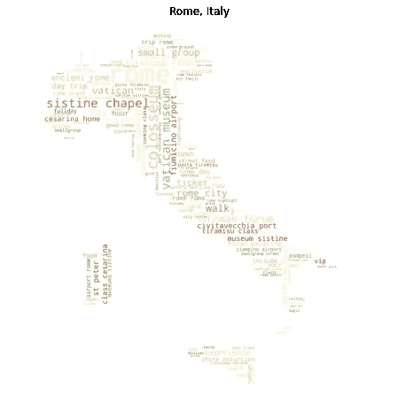

最终罗马字云|作者图片

## 选择完美的面具

使用遮罩最棘手的部分是，您选择的图像必须满足以下要求:

*   白色背景(必须是#ffffff，不能是灰白色或透明的)
*   不是白色的最终形状

这是一个不太管用的面具的例子。这里的问题是它的形状不够明确，你无法说出它是什么。

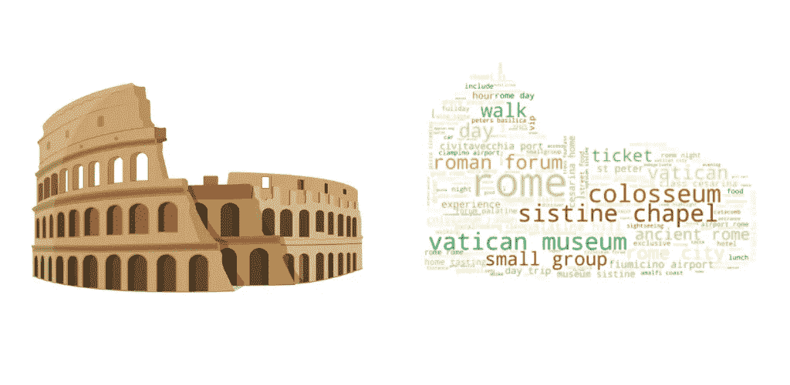

[斗兽场图片由熊猫矢量通过 Shutterstock](https://www.shutterstock.com/image-vector/colosseum-italy-icon-cartoon-style-isolated-557281153) |文字云作者

因此，你要选择一个非常容易辨认的形状，就像下面的例子。

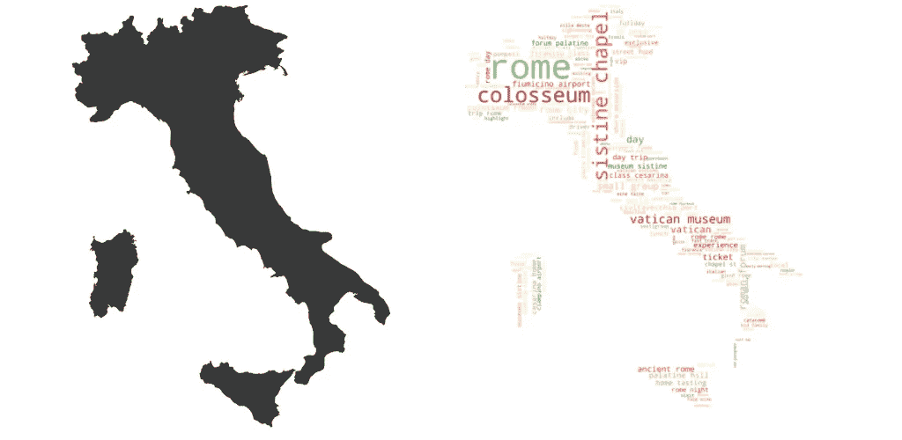

[意大利地图图片由 David Petrik 通过 Shutterstock](https://www.shutterstock.com/image-vector/simple-black-map-italy-isolated-on-519423460) |文字云作者

甚至有时你会找到最适合你面具的照片，但它的背景中有几个标志会使单词 cloud shape 失去意义。为了解决这个问题，你可以在 Photoshop 中打开照片，然后去掉标记。如果你没有 Photoshop，你可以用一种方法来破解它(从我做市场营销的时候开始)，那就是 [Canva](https://www.canva.com/) 。您可以将蒙版图像上传到 Canva，在您的标记上放置白色方块，然后下载编辑后的图像。瞧啊。你面具就可以和#ffffff 背景搭配了。

# 额外的收尾工作

让你的文字云变得美丽的最后一步是用你自己敏锐的眼睛去发现那些美学上的小细节。改变颜色，使用边框(又名轮廓)，操纵字体和绘图大小只是定制你的单词云的几种方法。以下是自定义这些参数的一些方法:

## 更改色彩映射表

更改单词的颜色就像在 WordCloud 对象实例化中更改“colormap”参数一样简单。点击查看所有 matplotlib 颜色图选项[。](https://matplotlib.org/tutorials/colors/colormaps.html)

还有一种方法可以根据蒙版图像中的颜色创建自己的色彩映射表。为此，请使用 wordcloud 库中的 ImageColorGenerator 函数，并在实例化 WordCloud 对象时使用 color_func 参数中生成的颜色。color_func 参数将覆盖 colormap 参数。

在这里，我再次使用了罗马圆形大剧场，因为意大利地图都是一种颜色。使用这种自定义的色彩映射表绝对是一个不错的选择，即使我们仍然不能真正说出它的形状！

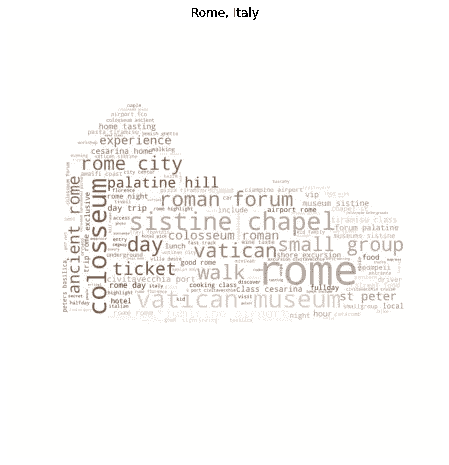

作者图片

## 使用轮廓

不像卡戴珊姐妹…但也算是吧。Contour 给你的字云遮罩一个轮廓。可以在用 contour_color 和 contour_width 参数实例化 WordCloud 对象时对其进行自定义。轮廓颜色可以用字符串表示(使用简单的颜色词或颜色代码)。

下面是我们生成单词云的相同函数的一个例子，但是有一个细的黑色轮廓(宽度为 1)。

如您所见，由于轮廓的原因，生成的单词云是一个更容易区分的形状。

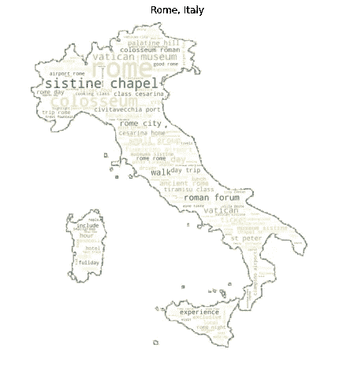

作者图片

看起来很酷！由于意大利的详细形状，这里的轮廓有点弯曲。使用更基本的遮罩形状，轮廓线会更平滑。

我们也可以尝试一个彩色的轮廓来使它看起来更好。由于字云中有暗红色的字，我找了一个好看的酒红色色码，#5d0f24，来代替黑色轮廓，宽度增加到 3。

生成的字云如下。

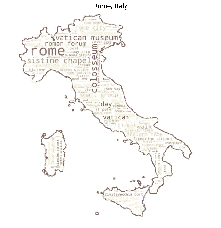

作者图片

甚至以前的竞技场面具在这里稍微修饰一下看起来更好！在这种情况下，轮廓有助于我们看到面具的实际形状。

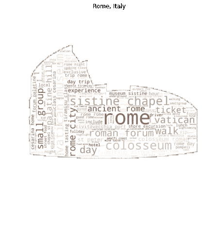

作者图片

是否放置轮廓，以及轮廓的颜色和宽度由您决定，这取决于您想要在单词云中包含的美学细节。

## 关于词云大小的一个注记

你应该经常做的一件事是用 plt.figure(figsize=(10，8))改变单词云的大小。你可以把它改变成你需要的任何大小，但是我发现改变整个情节的大小比试图调整 WordCloud 对象本身的大小效果更好。我已经在所有的词云函数中包含了这一点，当我们从基本的词云跳到用函数创建的词云时，你可以注意到词云大小的差异。

## 更多有趣的定制！

当谈到定制你的单词云时，可能性是无穷无尽的。以下是一些例子:

*   使用 font_path 参数操作单词云文本的字体
*   更改最小和最大字体大小(最小字体大小、最大字体大小参数)
*   更改单词云的背景颜色
*   减少 max_words 参数以仅显示前 20 或 50 个单词，这有时会使单词云更容易阅读

所有这些小细节都会影响你的单词云可视化。由于每个遮罩和每个文本语料库看起来都不一样，所以最终还是要靠你自己来摆弄它们，让你的单词云看起来更漂亮！

# 结论

感谢你跟随我踏上罗马之旅！我希望这个故事教会了你一两件关于单词云和创建漂亮的 NLP 可视化的事情。如果你有更多的建议，我很乐意在下面的评论中听到！

*注意:这只是我的数据科学顶点项目的一小部分，在这个项目中，我使用 NLP 对不同城市的文本进行分类。你可以在我的* [*Github*](https://github.com/tiaplagata) *账户上看到完整的项目回购。*